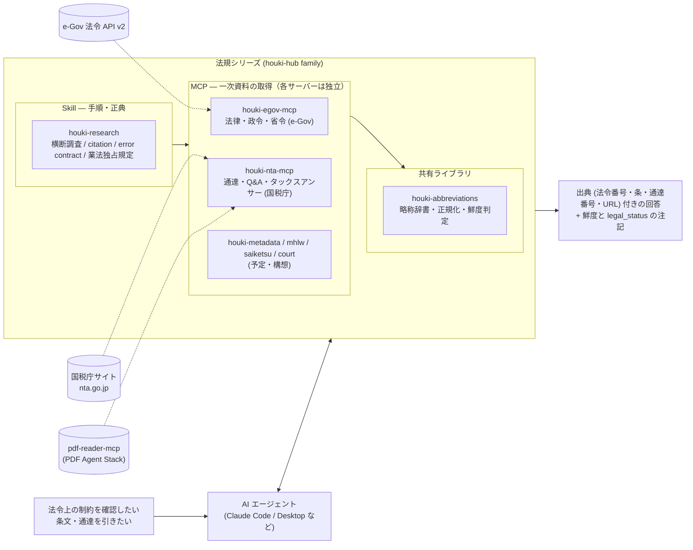

# houki-hub

日本の法令・通達・行政解釈を、LLM から **正確に引き、出典付きで示す** ための MCP サーバー・
共有ライブラリ・Skill 群（法規シリーズ）を束ねるリポジトリ。

対応範囲（2026-09-07 時点）は **法令は全分野**（e-Gov 法令 API v2）、**通達・Q&A は国税庁のみ**。
最初に税務から着手したためで、他省庁の通達は同じ型の MCP を 1 つずつ足して広げる（`stack.json` の `planned` / `concept`）。
各部品は独立したリポジトリとして開発・公開しており、ここは構成表とドキュメントサイトだけを持つ。

本筋は「**国民には法規を知る権利があり、法令には守る義務があるので、これらを知り活用すること**」。
現時点の対象はシステム開発・運用・管理を行うエンジニアで、
弁護士法 72 条・税理士法 52 条・社労士法 27 条が定める独占業務（他人の個別事案への当てはめを業として行うこと）は想定していない。

ドキュメントサイト: <https://shuji-bonji.github.io/houki-hub/>（2026-09-08 公開）

## 全体像



設計の中心にある区別は 3 つ。

| | 意味 |
| --- | --- |
| **法令**（law） | 法律・政令・省令。国民を拘束する。`houki-egov-mcp` が e-Gov から取る |
| **通達**（tsutatsu） | 行政内部の解釈指針。国民・裁判所を拘束しない（最判昭和 43 年 12 月 24 日）。`houki-nta-mcp` は応答ごとに `legal_status` を付けて区別を保つ |
| **当てはめ**（application） | 個別事案に法令を適用して結論を出すこと。他人のために業として行うと業法の対象。family はここに踏み込まず、Skill が注意喚起する |

判定はコードが下し、LLM は出典を添えて説明する側に置く。この方針は
[pdf-agent-stack](https://github.com/shuji-bonji/pdf-agent-stack) と同じで、リポジトリの構成も揃えてある。

### 判定の置き場所は 3 つではなく 4 つ

「コードに置く / 判定不能として返す / LLM に置く」の 3 択で考えると、houki-hub の形は説明できない。行き先は 4 つある。

| 行き先 | いつ選ぶか | 例 |
| --- | --- | --- |
| コード（ルール表） | 基準が事前に書ける | 引数の検証、鮮度の判定、`legal_status` の付与 |
| 判定不能として返す | 基準が書けない、または測れなかった | `generate-stack.mjs --check` が npm から応答を得られなかったとき（exit 2） |
| LLM | 選ばない | — |
| **系の外（人間の専門家）** | 基準は書けるが、系が判定してはいけない | 当てはめ |

当てはめの基準は、条文と通達に書いてある。**書けないから外しているのではない。** 外す理由は弁護士法 72 条・税理士法 52 条・社労士法 27 条であり、基準が整備されれば将来は系が判定してよくなる、という性質のものではない。

`legal_status` は「基準」の内部の階層である。法令は国民を拘束し、通達は拘束しない。この 2 つを 1 つの層に潰すと、「通達に書いてあるから可」という判定が作れてしまう。応答ごとに印を付けているのはそのためである。

## 構成

<!-- stack:begin — scripts/generate-stack.mjs が生成。手で編集しない -->

> 版は実測（2026-09-10 時点の `npm view`）。

| リポジトリ | 役割 | 配布形態 | 状態 | 版 | npm |
| --- | --- | --- | --- | --- | --- |
| [houki-egov-mcp](https://github.com/shuji-bonji/houki-egov-mcp) | source | mcp-server | 公開済み | 0.5.3 | `@shuji-bonji/houki-egov-mcp` |
| [houki-nta-mcp](https://github.com/shuji-bonji/houki-nta-mcp) | source | mcp-server | 公開済み | 0.11.0 | `@shuji-bonji/houki-nta-mcp` |
| [houki-abbreviations](https://github.com/shuji-bonji/houki-abbreviations) | dictionary | library | 公開済み | 0.5.0 | `@shuji-bonji/houki-abbreviations` |
| [houki-research-skill](https://github.com/shuji-bonji/houki-research-skill) | procedure | skill | 公開済み | 0.3.0 | — |
| houki-metadata-mcp | source | mcp-server | 予定 | — | — |
| houki-mhlw-mcp | source | mcp-server | 予定 | — | — |
| houki-saiketsu-mcp | source | mcp-server | 構想 | — | — |
| houki-court-mcp | source | mcp-server | 構想 | — | — |
| houki-specialist-plugin | orchestration | plugin | 構想 | — | — |

<!-- stack:end -->

**版は `stack.json` が正典**で、`npm view` の実測から生成する。

```sh
node scripts/generate-stack.mjs            # 生成（手元）
node scripts/generate-stack.mjs --check    # npm と照合（CI）。ずれていれば exit 1
node scripts/generate-stack.mjs --readme   # 上の表を差し替え
```

`--check` は**ローカルの clone を見ない**。CI に clone は無いので、照合は npm だけで完結する。
`npm view` が応答しなかった場合は「ずれ」ではなく**判定不能**として exit 2 を返す。

### 3 つの軸で見る

| 軸 | 値 |
| --- | --- |
| **役割**（layer） | source / dictionary / procedure / orchestration / hub |
| **配布形態**（form） | mcp-server / library / skill / plugin / app / site |
| **状態**（status） | released / planned / concept |

配布形態を決めるのは「**誰が起動するか**」。`mcp-server` は LLM が呼び、`library` は開発者のコードが import し、`skill` は LLM が読む。

`source` の MCP は「**束ねる単位**」を組織軸（e-Gov / 国税庁 / 厚労省）かコンテンツ種軸（裁決 / 判例 / メタデータ）に揃える。
名前は広く取り、初版で実装する範囲は各リポジトリの README に明示する（例: `houki-saiketsu-mcp` の初版は国税不服審判所のみ）。

## このリポジトリの構成

```
houki-hub/
├── site/                 ドキュメントサイト（VitePress、GitHub Pages に公開予定）
├── scripts/              stack.json の生成・照合
├── stack.json            構成の正典（実測値）
├── docs/
│   ├── ROADMAP.md        現状と予定（リポジトリ横断）
│   ├── DECISIONS.md      決定事項・未決事項
│   ├── reports/          定点観測レポート
│   └── notes/            議論メモ（射程・業法境界など）
└── mcp/ lib/ skill/ agent/   ← 各リポジトリの作業コピー（.gitignore 済み）
```

`mcp/` などは**独立したリポジトリ**で、このリポジトリは束ねているだけ。
`.gitignore` に入れているのは秘匿のためではなく、`git add` で誤って gitlink として
登録されるのを防ぐため。clone しても中身は入らない。手元で揃えるには次のように clone する。

```sh
git clone git@github.com:shuji-bonji/houki-egov-mcp.git      mcp/houki-egov-mcp
git clone git@github.com:shuji-bonji/houki-nta-mcp.git       mcp/houki-nta-mcp
git clone git@github.com:shuji-bonji/houki-abbreviations.git lib/houki-abbreviations
git clone git@github.com:shuji-bonji/houki-research-skill.git skill/houki-research-skill
```

pdf-agent-stack と違い、`docs/` は追跡して公開する。family 全体の現状と判断の経緯を GitHub 上で辿れるようにするため。

## 版のずれを見る検査

部品の版は別々に上がる。ずれても何も落ちない場所に検査を置く。

| 検査 | 見ているもの | ずれたとき何が起きるか | 状態 |
| --- | --- | --- | --- |
| `generate-stack.mjs --check` | stack.json / README の表 vs npm | 構成表の版が古いまま残る | 週 1 と push で回る |
| skill-contract-probe | houki-research が分岐に使うフィールド（`isError` / `code` / `legal_status` など）vs 公開版の応答 | Skill の分岐が例外を出さずに素通りする | 未移植（pdf-agent-stack から移す予定） |
| version-mentions | 文中に書いた版 vs いまある版 | まだ無い版を「ある」と書いた文が残る | 未移植 |

marketplace（`claude-plugins`）側の版は、そのリポジトリの `scripts/marketplace-version-check.mjs` が各 repo の `plugin.json` と照合する。

## ドキュメント

- サイト: <https://shuji-bonji.github.io/houki-hub/>（`site/`。手元では `cd site && npm install && npm run dev`）
- 現状と予定: [docs/ROADMAP.md](docs/ROADMAP.md)
- 決定事項: [docs/DECISIONS.md](docs/DECISIONS.md)
- 紹介記事: Zenn（family 全体の紹介）/ Qiita（houki-egov-mcp 深堀り）

## ライセンス

各リポジトリの LICENSE に従う（いずれも MIT）。本リポジトリも MIT。
