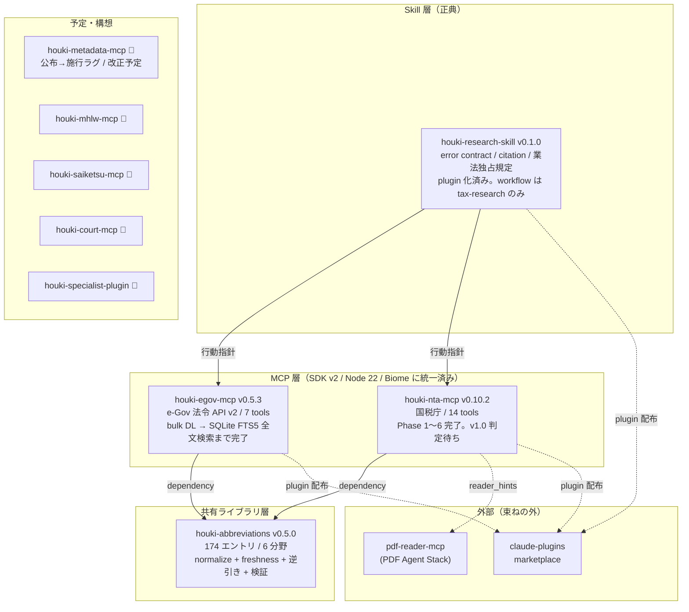

# ROADMAP — 法規シリーズの現状と予定

最終更新: 2026-09-07（JST）。版はすべて `npm view` と各リポジトリの `package.json` の実測。
詳細な定点観測は `docs/reports/` に日付ごとに置く。本ファイルは「いま何が動いていて、次に何をするか」だけを持つ。

## 現状（2026-09-07）

| リポジトリ | 版 | 状態の要点 |
|---|---|---|
| houki-egov-mcp | 0.5.3 | Phase 2-7（`search_fulltext` を FTS5 に接続）完了。編（Part）を持つ法令の取り込み漏れを v0.5.1 で修正。tools/call の引数を `inputSchema` で検証し `INVALID_ARGUMENT` を返す（v0.5.3） |
| houki-nta-mcp | 0.10.2 | SDK v2 移行（v0.10.0）でエラー応答を family contract に統一。Issue #17（算式画像プレースホルダ）/ #18（2 文字語の LIKE 補完、`--refresh` 修正）対応済み。family の参照実装 |
| houki-abbreviations | 0.5.0（MCP が取り込んでいるのは 0.4.1） | 逆引き（`lookupByLawId` / `lookupByLawNum`）+ 検証（`validateAllEntries` / `extractLawNames`）。両 MCP の依存は `^0.4.1` で、0.x の `^` は minor を跨がないため 0.5.0 は入っていない（辞書は同一・MCP が呼ぶ 3 関数は両版にあるので動作差なし）。toolchain は ESLint + Prettier のまま（MCP 2 つは Biome） |
| houki-research-skill | 0.1.0（ローカルは 0.2.0 コミット済み・未 push） | 2026-09-07 に egov 0.5.3 / nta 0.10.2 へ追随（例文の引数名修正、`search_fulltext` を手順に追加）。plugin 化 + Release 自動化済み。`docs/` に ARCHITECTURE / BUSINESS-LAW / CITATION / ERROR-HANDLING / ERROR-CODES。examples は invoice-registration と error-recovery-patterns |
| houki-hub（本 repo） | — | 2026-09-07 に pdf-agent-stack 同型へ再構成。site/ は VitePress の雛形のみ。未公開 |

## 次にやること（優先度順）

1. **houki-hub site の中身を埋める**（本 repo）
   - ガイド 4 ページ（overview / architecture / getting-started / roadmap）の文章を仕上げる
   - `generate-reference.mjs` を pdf-agent-stack から移植し、`tools/list` からツールリファレンスを生成する。houki-nta-mcp は better-sqlite3 を使うので、CI で起動できるかを先に確かめる
   - 公開の条件（DECISIONS.md の未決）を満たしたら deploy.yml の push トリガーを有効化する
2. **houki-nta-mcp v1.0.0 判定**
   - ローカル DB が古い（126 日以上）→ `--bulk-download-all` / `--bulk-download-tax-answer` を再実行して現行データで最終確認
   - Issue #3（synonym 展開）は abbreviations v0.6.0 の `expandToFormalNames` と連動。v1.0 に含めるかを決める
   - 完了後 1 か月の soft 期間を置いてから v1.0.0
3. **houki-egov-mcp Phase 2-8 / 2-13**
   - 2-8: 差分同期（`file_section=3&update_date` 方式）
   - 2-13: API enrichment で `category` を投入し、domain 絞り込みを実効化
   - 既知の未対応: `get_toc` が附則の条を編・章の外に平坦に並べる / 民法・消費税法の応答が長い
4. **houki-abbreviations v0.5.1 → v0.6.0**（計画は abbreviations の `docs/v0.5.1-v0.6.0-plan.md`）
   - v0.5.1: `verify-law-ids.mjs` の本実装と月次 workflow 化
   - v0.6.0: `expandToFormalNames`（nta #3 と連動）。**minor を上げたら egov / nta の `package.json` を `^0.6.0` に上げて publish し直す**（0.x の `^` は minor を跨がない）
   - `verify-law-ids.mjs` の月次 GitHub Actions 化（雛形のみの状態）
   - `lookupByLawNum` の漢数字↔算用数字正規化、`isValidLawId` の DF 系・M 省令系パターン
   - 任意: toolchain を Biome / TS 7 に揃える
5. **houki-research-skill v0.2.0 の公開 → v0.3.0**
   - v0.2.0 を push し、tag を打って Release。claude-plugins の version 表と marketplace.json を 0.2.0 に
   - workflow 追加: `revision-tracking.md`（MCP の完成を待たずに書ける）
   - examples 追加: 電帳法、相続税改正
   - `ARCHITECTURE.md` の配布形態セクションを plugin 化後の記述に更新
6. **新 MCP は houki-metadata-mcp を先に**
   - 主用途は J-SOX 型の「公布→施行ラグ」期。施行前フォロー期に時系列の横串クエリが多発する
   - 3 つ目の MCP なので、abbreviations Track 5（ルーティング）の再評価トリガーになる
7. **検査の移植**（本 repo）
   - `skill-contract-probe.mjs`: houki-research が分岐に使うフィールド（`isError` / `code` / `legal_status` / `freshness`）が公開版の応答に実在するかを起動して確かめる
   - `version-mentions.mjs`: 文中の版が未来の版になっていないかを見る

## 本筋外（優先度は上記の後）

`docs/notes/2026-08-25-scope-and-professional-use.md` に記録済み。相談メモ、士業ルーティング、e-shiwake 組み込み時の有償化、士業向け profile。
本筋（国民が法規を知り活用する）の妨げにならない範囲で、必要になったときに再開する。

## 直近の履歴

| 日付 | できごと |
|---|---|
| 2026-09-07 | houki-nta-mcp v0.10.0〜v0.10.2 publish（SDK v2 / Issue #17, #18）。houki-egov-mcp v0.5.2 / v0.5.3 publish。family 全 MCP が SDK v2 / Node 22 / Biome に揃う。houki-hub を pdf-agent-stack 同型に再構成 |
| 2026-07-19 | 現状把握レポート（`docs/reports/2026-07-19-status.md`） |
| 2026-07-14 | houki-nta-mcp v0.9.5（plugin manifest）、houki-abbreviations v0.5.0 |
| 2026-05-10 | houki-hub-doc 廃止 |
