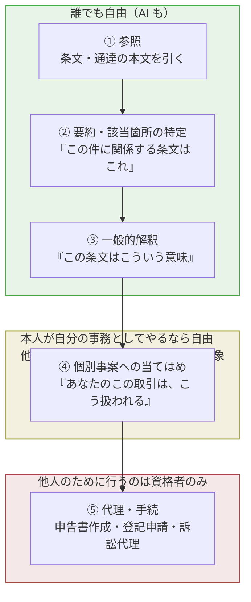
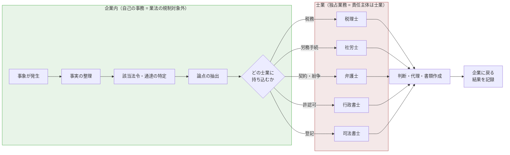
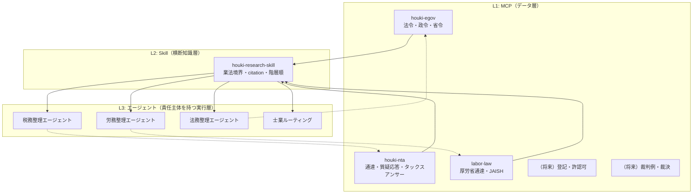
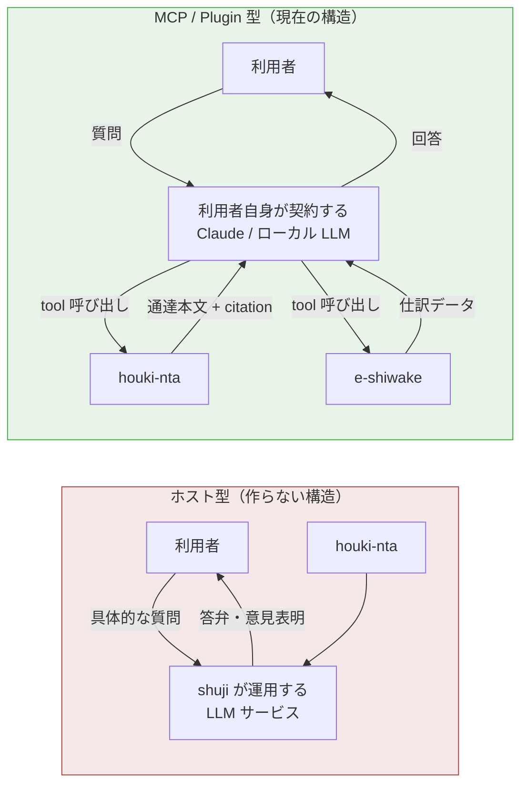
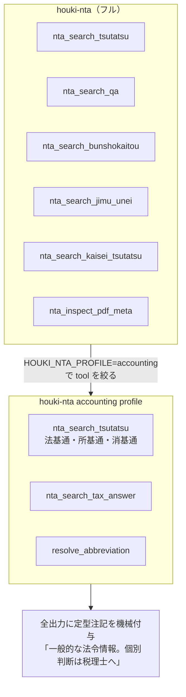
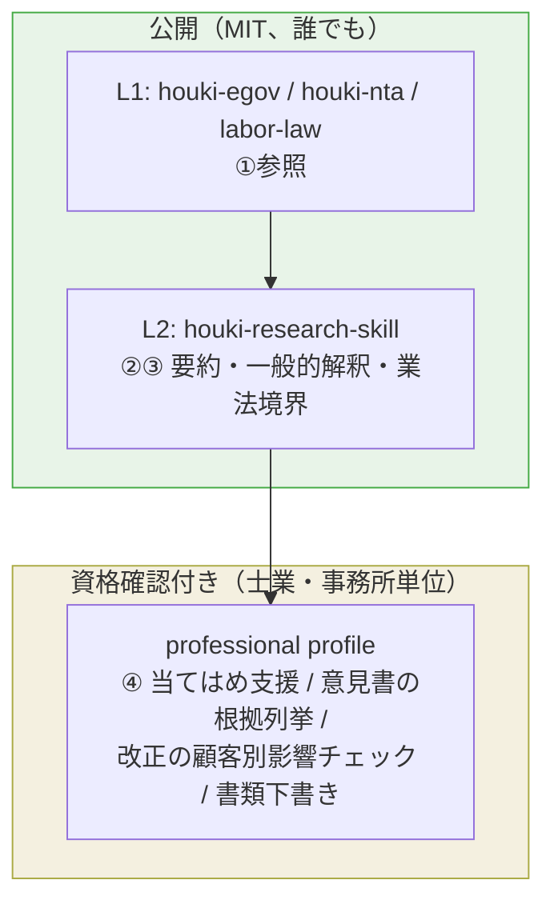

# 法規シリーズの目的・射程と、士業向け提供の整理（2026-08-25）

Claude との議論のまとめ。法規シリーズ（houki-hub family）の**本筋の定義**、士業の守備範囲と業法の境界、相談メモ・士業ルーティング構想、e-shiwake 組み込み時の有償化、士業向け professional profile と資格確認の 3 段階、をひとつの文書に整理した。

> 位置づけ: 相談メモ以降の構想は法規シリーズの**本筋ではない**。本筋の再開は 2026-08-31 週から。本文書は再開時に議論を再現しなくて済むための記録。
> 注意: 本文書の条文・判例の読みは調査の出発点であり、法的助言ではない。有償公開や利用規約の文言は、業法に詳しい弁護士に確認する。

---

## 1. 本筋の定義（shuji 明言）

法規シリーズの本筋は、**国民には法規を知る権利があり、法令には守る義務があるので、これらを知り活用すること**。

- 本筋: 法令・通達・行政解釈を正確に引けるようにする（知る）。開発・運用の中で法令上の制約を確認できるようにする（守る・活用する）
- 現時点のスタンス: **システム開発や運用・管理を行うエンジニア向け**
- 本筋外: 士業に持ち込む前の相談整理、士業ルーティング、会計アプリへの組み込みと有償化、士業向け profile（§4〜§7）。優先度は本筋の後

「本筋か本筋外か」の判定軸として、この目的を使う。

---

## 2. 「法規を知る権利」の根拠と、業法との関係

### 2.1 知る権利の根拠

日本国憲法に「法を知る権利」の明文はないが、複数の条文と判例が組み合わさって「**法は国民が知りうる状態にあって初めて効力を持つ**」構造になっている。

| 根拠 | 内容 |
|---|---|
| 憲法 7 条 1 号（公布） | 法律・政令・条約は公布されなければならない |
| 最大判昭和 32 年 12 月 28 日 | 公布は官報掲載によって行われ、一般国民が閲覧・購読しうる最初の時点で効力が生じる |
| 憲法 31 条 + 明確性の原則（徳島市公安条例事件 最大判昭和 50 年 9 月 10 日） | 刑罰法規は、通常の判断能力を有する一般人が何が禁止されているか読み取れるものでなければならない |
| 刑法 38 条 3 項 | 法の不知は許さない。裏返せば「知りうる」ことが前提 |
| 憲法 21 条（知る権利）→ 情報公開法 | 行政情報へのアクセス |

2025-04-01 施行の「官報の発行に関する法律」（令和 5 年法律第 85 号）により、**インターネット上の電子官報が正本**になった。公布の瞬間から誰でも無償で参照できることが法律で保証されている。「参照はいつでもできる」は、許されているのではなく、**法の効力要件の裏側として国が保証している**状態。AI が参照を助けることに制限はない。

### 2.2 解釈はどこまで誰でもできるか

解釈そのものは誰でも自由（学者・出版社・ブロガー・AI）。業法が線を引いているのは「一般的な解釈」と「個別事案への当てはめ」の間。

- **弁護士法 72 条**の「鑑定」は、**具体的な法律事件**について法律的見解を述べること。コンメンタール・解説書・一般論の Q&A は「事件」に関するものではないので該当しない。法務省の 2023-08 ガイドラインも、事件性のない一般的なレビューは 72 条の対象外としている
- **税理士法 52 条**の「税務相談」は、基本通達 2-6 で「**具体的な質問**に対して答弁・指示・意見表明すること」と定義。国税庁がタックスアンサーを公開していること自体が、一般的解説は誰でも提供できることの証拠
- ④は**本人が自分の事務として行う限り制限されていない**。日本は弁護士強制主義を採っていないので本人訴訟ができる（民訴 54 条は弁護士でない者の代理を制限しているだけ）。確定申告・登記申請・許認可申請も本人申請が可能

### 2.3 「憲法上の権利があるのに制限されている」の正体

制限は 2 種類に分かれる。

- **形式的な制限（業法）**: 他人に頼むとき、頼む先が資格者に限定されている。憲法 22 条との関係では消極目的規制として合憲（薬事法距離制限事件 最大判昭和 50 年 4 月 30 日の枠組み）。ただし業法には「非資格者からの国民保護」と「資格者の職域保護」の両面があり、後者は規制改革の場で繰り返し批判されている。税理士法 52 条が無償でも税務相談を禁じる点、2024-04 の税務相談停止命令制度（54 条の 2）新設は職域保護の色が濃い
- **実質的な制限（複雑さ）**: 知る権利は保証されていても、法令・政令・省令・通達・改正の階層をたどって自分の事案に当てはめるには専門知識が要る。「アクセス・トゥ・ジャスティス」の問題（2001 司法制度改革審議会意見書、2006 法テラス設立）

矛盾に見えるのは、**形式的には本人に全部開かれているのに、実質的には閉じている**から。憲法上の権利と業法は対象が違うので直接は衝突していない。

### 2.4 AI が与える変化と、法規シリーズの位置

AI が下げるのは実質的な制限のコスト。①〜③を AI が担うと、④を本人が自分でやれる範囲が広がる。これは業法に触れない。一方、④を**サービスとして他人に提供する** AI は「他人のために業として」に接近する。2023 法務省ガイドライン（線引き）と 2024 停止命令制度（規制強化）が同時に動いている時期。

| 段階 | 法規シリーズ | 誰が行うか |
|---|---|---|
| ① 参照 | houki-egov / houki-nta が本文と citation を返す | MCP |
| ② 要約・特定 | 利用者の LLM が MCP の返却から行う | 利用者の LLM |
| ③ 一般的解釈 | houki-research-skill が階層順と citation を強制 | 利用者の LLM |
| ④ 当てはめ | 利用者本人が自分の事務として行う。shuji は答弁主体にならない | 本人 |
| ⑤ 代理・手続 | 射程外。士業へ | 資格者 |

法規シリーズは「知る権利」側に位置を固定している。①〜③を担い、④を本人に返す。

---

## 3. 各士業の守備範囲（企業目線）

企業が士業に頼んでいることは「**代理・代行**（独占業務）」と「**相談・整理**（多くは非独占）」の二層。

| 士業 | 企業が頼んでいること | 独占業務（根拠） | 独占でない部分 |
|---|---|---|---|
| 顧問弁護士 | 契約審査、紛争対応、労務トラブル、コンプライアンス、株主総会 | 訴訟・紛争性ある法律事件の代理・鑑定（弁護士法 72 条） | 一般的な法令情報の提供、紛争性のない自社事務の整理 |
| 税理士 | 決算・申告、税務調査立会、節税相談、年末調整 | 税務代理・税務書類作成・**税務相談**（税理士法 2 条、52 条） | 記帳代行、経営助言（2 条 2 項の付随業務は非独占） |
| 公認会計士 | 監査（上場会社・大会社）、IPO 準備、内部統制 | 財務書類の監査証明（公認会計士法 2 条 1 項、47 条の 2） | 財務コンサル。税務は税理士登録が別途必要 |
| 社労士 | 入退社手続、就業規則、助成金、労基署対応 | 労働社会保険の書類作成・提出代行・事務代理（社労士法 2 条 1 号・2 号、27 条） | 労務相談・指導（2 条 3 号業務は非独占） |
| 行政書士 | 許認可（建設業・古物商・在留資格）、定款作成 | 官公署提出書類・権利義務/事実証明文書の作成（行政書士法 1 条の 2、19 条） | 相談のみは非独占。登記は不可 |
| 司法書士 | 会社設立・役員変更の商業登記、不動産登記 | 登記・供託の代理（司法書士法 3 条、73 条） | — |
| 弁理士 | 特許・商標の出願 | 特許庁への出願代理（弁理士法 4 条、75 条） | 先行技術調査の助言 |

注意点 3 つ:

1. **税務相談だけ規制が厳しい。** 税理士法 52 条は「業として」であれば**無償でも**税務相談を禁じる（基本通達 2-1）。令和 6 年 4 月 1 日から税務相談停止命令制度（54 条の 2）が施行
2. **弁護士法 72 条は「報酬目的」「事件性」「法律事務」の 3 要件**が揃って初めて問題になる（法務省 2023-08 ガイドライン）。紛争性がなく、利用者自身が自社の事務として使うなら問題は小さい
3. **社労士の相談業務（3 号業務）と行政書士の相談は非独占。** 労務相談や許認可の要件整理は最も自由に扱える

---

## 4. 相談メモ + 士業ルーティング構想（本筋外）

法規シリーズが入り込めるのは「相談・整理」のうち「**企業が自社の事務を自社で整理する**」部分（自己の事務 = 弁護士法 72 条「他人の」法律事務・税理士法 52 条「業として」の対象外）。

- **相談メモ**: 事実関係 / 該当条文・通達（citation 付き）/ 論点 / 選択肢 / 「これは○○士の独占業務なので依頼が必要」の結論。士業に持ち込む前の整理。士業側も工数が減るので歓迎されやすい
- **士業ルーティング**: houki-research-skill の `docs/BUSINESS-LAW.md` の独占規定表を「禁止事項」ではなく「誰に持ち込むか」の案内として使い直す。医療の受診科案内と同じ動作で、診断はしない

守る境界 2 点:

1. 個別事案に「こうしなさい」の結論を出さない。税務は特に、可否を言った時点で税務相談
2. 紛争性ある案件は最初から弁護士へ（72 条の事件性要件）

### MCP 単位の専門家エージェント化

| エージェント | 主 MCP | 従 MCP | 出力の型 |
|---|---|---|---|
| 税務整理 | houki-nta | houki-egov（法律→政令→省令の遡り） | 相談メモ（税理士向け） |
| 労務整理 | labor-law | houki-egov | 相談メモ（社労士向け） |
| 法務整理 | houki-egov | （将来）裁判例 | 相談メモ（弁護士向け） |
| 士業ルーティング | houki-research-skill の BUSINESS-LAW.md | 全 MCP | 「誰に」「何を持っていくか」のチェックリスト |

実装形は pdf plugin の `pdf-specialist`（agents/ + skills/ + MCP）と同じ。houki plugin に `agents/houki-tax-specialist.md` 等を足す形。

### 配布形式

| 形式 | 中身 | 向いている用途 |
|---|---|---|
| Claude Plugin（現状） | .mcp.json + skills/ + agents/ | Claude Code / Cowork / 互換環境（Grok Build 等）。**エージェント定義を同梱できるのはこれだけ** |
| MCP Bundle（.mcpb、旧 .dxt） | manifest.json + MCP サーバ本体を zip | Claude Desktop にワンクリック導入。MCP 単体の配布向け。skill やエージェントは入らない |
| npm パッケージ | サーバ本体 | エンジニアが自分で設定を書く前提 |

主配布は Claude Plugin。.mcpb は MCP 単位の入口として並行可。ただし .mcpb 単体では skill が付かないので、業法境界の注記は**サーバ側で機械付与**する必要がある（§5）。

### 未決事項（再開時に決める候補）

- 相談メモの出力フォーマットを `docs/CONSULTATION-MEMO.md` として CITATION.md と同じ位置に置くか
- 士業ルーティングの判定表を BUSINESS-LAW.md から分離するか
- L3 エージェントを plugin の agents/ に置くか、識別子付きエージェントまで待つか

---

## 5. houki-nta × e-shiwake の有償化と税理士法 52 条

**決定: houki-nta は生業として提示しない。** e-shiwake の有償化は MCP / Plugin 型である限り成り立つ。

### 5.1 52 条が捕捉するのは「行為」であって「売り物」ではない

| 条文・通達 | 内容 |
|---|---|
| 税理士法 2 条 1 項 3 号 | 税務相談 = 課税標準等の計算に関する事項について**相談に応ずる**こと |
| 税理士法基本通達 2-6 | 「相談に応ずる」= **具体的な質問**に対して答弁し、指示し、又は意見を表明すること |
| 同通達 2-1 | 「業とする」= 反復継続して行うこと。**有償無償を問わない** |

金銭は要件に入っていない。判定を分けるのは「**誰が**、**具体的な質問に**、答弁・指示・意見表明したか」。

| 行為 | 主体 | 52 条との関係 |
|---|---|---|
| (a) 通達・条文データを検索可能にして提供 | houki-nta（OSS） | 該当しない。税務六法やコンメンタールの出版と同じ |
| (b) 仕訳ソフトを有償で提供 | e-shiwake | 該当しない。freee・マネーフォワード・弥生と同じ位置 |
| (c) 仕訳に関連する通達を**表示** | e-shiwake | 一般的な情報提供。該当しにくい |
| (d) 個別の取引について「この処理でよい」と**回答** | 回答した者 | **税務相談**。ここだけが問題 |

### 5.2 MCP 形式であること自体が (d) の主体を利用者側に置いている

ホスト型では答弁主体が shuji のサービスになり、反復継続すれば「業として税務相談」と評価されうる（54 条の 2 の対象にもなる）。MCP / Plugin 型では LLM の契約主体は利用者で、houki-nta と e-shiwake はデータを返しているだけ。(a)(b) の位置。

**shuji が LLM を抱えて「税務に答えるサービス」をホストする構造だけは作らない。**

### 5.3 運用上の手当て

- 利用規約に「利用者自身の事務のための道具」「税務相談に応じない」「第三者への税務相談に用いることは想定外」を明示。有償公開前に弁護士に文言を確認
- 顧客層は「自社の経理担当」と「税理士」に絞る。後者は業法問題が最初から存在しない

| 使う人 | 位置づけ | 判定 |
|---|---|---|
| 経理担当が自社の仕訳・税務処理を調べる | 自己の事務 | 問題なし |
| 顧問税理士が顧客の処理を調べる | 税理士業務そのもの | 問題なし（最も安全な顧客層） |
| 記帳代行業者（非税理士）が顧客に「この処理で」と伝える | 他人の税務について意見表明 | 使う側の 52 条問題 |
| 上場企業の経理が監査法人への説明資料を作る | 自己の事務 | 問題なし |

### 5.4 狭めたパッケージ（accounting profile）

1. 別リポジトリではなく**同一サーバのプロファイル切替**。データ更新やバグ修正を二重に持たない
2. **定型注記をサーバ側で付ける**（返却 JSON の `notice` フィールド）。.mcpb 単体で skill が読み込まれていない環境でも LLM に届く
3. tool description に「通達本文を返す。処理の可否を判断しない」と書く
4. e-shiwake は `.mcp.json` で houki-nta を accounting profile 付きで参照するだけ。コード取り込みはしない（Architecture E と整合）

---

## 6. 士業向け提供（professional profile）

士業向けは**最も制約の少ない顧客層**。「一般の人に利用させない仕組み」が必要なのは法規シリーズの全部ではなく、**士業だからこそ出せる層**だけ。

### 6.1 何が変わるか

| 段階 | 一般向け | 士業向け |
|---|---|---|
| ①〜③ 参照・要約・一般的解釈 | 出す（知る権利の本筋、誰でも） | 出す |
| ④ 個別事案への当てはめ | 本人の事務に限る。サーバ側 `notice` で注記 | **出す**。士業が責任主体としてレビューする前提の下書き |
| ⑤ 代理・手続 | 射程外 | 書類作成の下書き支援まで射程に入りうる |

④を士業に出しても問題がない理由は、答弁主体が士業本人だから。LLM の出力は士業がレビューする下書きで、顧客に意見を表明するのは士業。事務所の職員（補助者）が使う場合も税理士法 41 条の 2（使用人等に対する監督義務）の下にある。

士業向け版は「制限を緩めた版」ではなく、「**責任主体が確定しているので、注記なしで④まで出せる版**」。

### 6.2 公開範囲の分け方

L1/L2/L3 戦略とそのまま重なる。L1・L2 は開放、L3 相当の professional profile だけ資格確認付き。accounting profile と同じく同一サーバのプロファイル切替（`HOUKI_PROFILE=professional`）。

### 6.3 資格確認の 3 段階

| 段階 | 方法 | 実装コスト | 確度 |
|---|---|---|---|
| (a) 契約時の登録番号確認 | 税理士登録番号・弁護士登録番号を、日税連「税理士情報検索サイト」・日弁連「弁護士検索」で照合してからライセンス発行 | 低。士業向け SaaS（達人・TKC 等）はほぼこれ | 契約時点のみ |
| (b) 署名付きライセンストークン | shuji の秘密鍵で署名した JWT（登録番号のハッシュ、事務所 ID、有効期限）を MCP の env に設定。サーバは公開鍵で検証して professional profile を有効化 | 中。**サーバ不要**なので MCP のローカル実行モデルと合う | 有効期限内 |
| (c) 士業電子証明書による本人確認 | 各連合会が発行する電子証明書（税理士用電子証明書＝日税連、弁護士電子証明書＝日弁連、司法書士・社労士・行政書士も各連合会が発行）で challenge に署名させ、資格を暗号学的に確認 | 高。ただし電子署名 SPA の経験がそのまま使える | 最も高い |

(c) は識別子付きエージェント戦略で未確定だった「証明書発行の具体的な仕組み」に直接つながる。**士業側にはすでに資格を証明する X.509 証明書が存在する**ので、shuji は発行側ではなく検証側に回るだけで済む。

(c) の注意点: 各連合会の認証局の証明書ポリシー（CP）で**利用目的が限定されている**場合がある（e-Tax 用、民事裁判の電子提出用など）。第三者サービスの認証に使えるかは CP を確認する。CRL / OCSP での失効確認には認証局への到達が必要。

現実的な順序は (a) → (b)。(c) は識別子付きエージェントの設計と一緒に検討する。

### 6.4 士業向けでも変えないこと

- **shuji が答弁主体にならない構造**は維持。MCP / Plugin 型で LLM の契約主体は事務所側に残る
- 利用規約で「**有資格者又はその監督下の補助者の業務用に限る**」と明示。トークンが一般の人に渡って④を第三者向けに使われても、責任分界は使った側にある

---

## 7. プロファイル構成の全体像

| profile | 公開範囲 | tool | 出力注記 | 対象 |
|---|---|---|---|---|
| default（フル） | MIT 公開 | 全 tool | skill 経由（BUSINESS-LAW.md） | エンジニア |
| accounting | MIT 公開 | 通達・タックスアンサー・略称解決に絞る | サーバ側 `notice` 機械付与 | e-shiwake 組み込み、経理担当 |
| professional | 資格確認付き | 全 tool + ④支援 | なし（士業がレビュー） | 士業・事務所 |

いずれも同一サーバ。データ更新は一箇所。

---

## 8. 決定事項と未決事項

### 決定（2026-08-25）

- 本筋 = 「国民が法規を知り活用する」。エンジニア向けスタンス
- houki-nta は生業として提示しない
- shuji が LLM をホストして「答えるサービス」にする構造は作らない
- 相談メモ・士業ルーティング・professional profile は本筋外。優先度は本筋の後

### 未決

- 相談メモのフォーマット正典の置き場（`docs/CONSULTATION-MEMO.md`）
- 士業ルーティング判定表の BUSINESS-LAW.md からの分離
- L3 エージェントの置き場（plugin agents/ か、識別子付きエージェント待ちか）
- profile 切替と `notice` フィールドの仕様を houki-nta の DESIGN.md に足すか
- 資格確認 (c) の各連合会 CP の確認

---

## 参考資料

- 法務省「AI 等を用いた契約書等関連業務支援サービスの提供と弁護士法第 72 条との関係について」（令和 5 年 8 月）: https://www.moj.go.jp/content/001400675.pdf
- 国税庁「税理士法違反行為」Q&A: https://www.nta.go.jp/taxes/zeirishi/zeirishiseido/qa/06.htm
- 税務相談停止命令制度（税理士法 54 条の 2、令和 6 年 4 月 1 日施行）: https://shirube.zaikyo.or.jp/article/2024/03/29/10297809.html
- 内閣府「官報の電子化について」: https://www.cao.go.jp/others/soumu/kanpo/about/kanpo_about.html
- 内閣府「官報の発行に関する法律（令和 5 年法律第 85 号）概要」: https://www.cao.go.jp/others/soumu/kanpo/pdf/kanpouhou_gaiyou.pdf
- modelcontextprotocol/mcpb（MCP Bundle）: https://github.com/modelcontextprotocol/mcpb
- Anthropic Engineering: Desktop Extensions: https://www.anthropic.com/engineering/desktop-extensions

関連する Claude プロジェクトメモリ: `houki_series_scope_and_audience.md` / `houki_consultation_memo_routing.md` / `houki_agent_identity_strategy.md`
