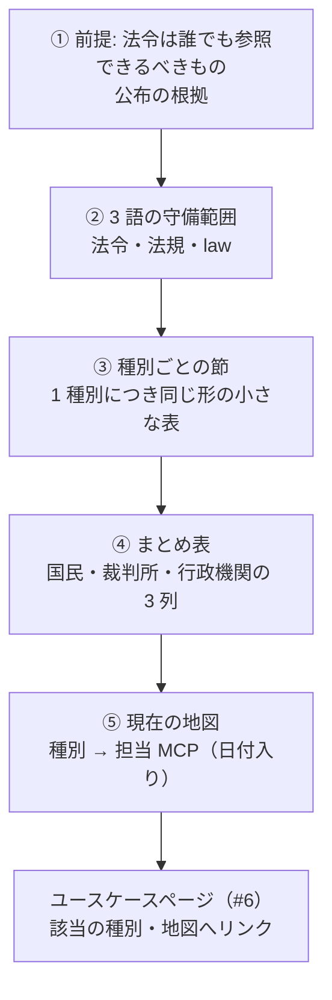
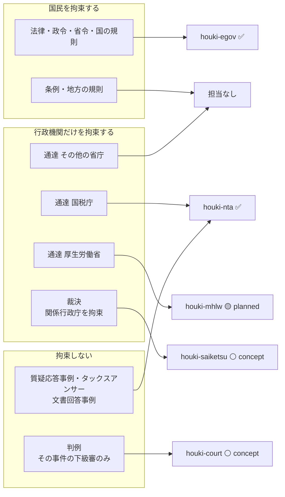

# issue 草案: 文書の種類ごとの説明・拘束力のまとめ表・現在の地図をサイトに載せる

対象リポジトリ: houki-hub（2026-09-10 作成）
提出先: https://github.com/shuji-bonji/houki-hub/issues
起票済み: https://github.com/shuji-bonji/houki-hub/issues/10 （2026-09-10）
タイトル案: サイトに「文書の種類と拘束力」ページを追加する（種別ごとの説明・まとめ表・現在の地図）

---

## 背景

法律・政令・省令・規則・条例・通達・裁決・判例がそれぞれ何で、誰を拘束するのかを、サイトで説明していません。

- 定義は `mcp/houki-egov-mcp/docs/LAW-HIERARCHY.md` と `explain_law_type` ツールにありますが、サイト（`site/docs`）には載っていません。
- Zenn 記事（https://zenn.dev/shuji_bonji/articles/ad1ec6c65ac45a）の「前提: 法令はそもそも『誰でも参照できる』べきもの」「そもそも『日本の法規』とは何か」「拘束力という観点での違い」に相当する説明が、サイトにはありません。
- `guide/architecture.md` の「法令と通達を区別する」は 2 行の表、`guide/overview.md` の「いま扱える範囲」は文章で、種別全体と担当 MCP を 1 枚で見られる図がありません。

利用者にとって、文書が「誰を拘束するか」は、どの MCP を選んで呼ぶかに直結します。ユースケースページ（#6）の「制約」の節も、この区別があると具体的に書けます。

## ページ構成（読む順）

いきなりまとめ表を見せると読み取れない利用者がいるため、③で 1 種別ずつ説明してから④⑤に進みます。

### ③ 種別ごとの節

対象は 10 節です: 法律 / 政令 / 省令 / 規則 / 条例 / 告示 / 通達 / 行政の解説資料（質疑応答事例・タックスアンサー・文書回答事例）/ 裁決 / 判例。
「規則」は定める主体で意味が変わるため、国の規則（庁・委員会）・最高裁規則・地方の規則に分けます。

どの節も同じ項目の表にします（後で正本から生成するときにもそのまま使えるようにするため）。例:

> #### 通達
>
> | 項目 | 内容 |
> |---|---|
> | 誰が出すか | 各省大臣・委員会・庁の長官 |
> | 根拠 | 国家行政組織法 14 条 2 項（「訓令又は通達を発することができる」） |
> | 誰を拘束するか | 行政機関の職員のみ。国民・裁判所は拘束しない（最高裁昭和 43 年 12 月 24 日判決） |
> | 公布されるか | されない（行政内部の命令） |
> | どこで読めるか | 各省庁のサイト（国税庁・厚生労働省など） |
> | 担当 MCP | houki-nta（国税庁）、houki-mhlw（厚生労働省、planned） |
> | 応答での印 | `legal_status` |

### ④ まとめ表

拘束力は 1 本の強弱ではなく「誰を拘束するか」の 3 列で表します。houki-nta-mcp の `legal_status`（`binds_citizens` / `binds_courts` / `binds_tax_office`）と同じ考え方です。

| 種別 | 国民 | 裁判所 | 行政機関 | 根拠 | 担当 MCP | 応答の `legal_status` |
|---|---|---|---|---|---|---|
| 法律 | ✓ | ✓ | ✓ | 憲法 41 条・76 条 3 項 | houki-egov | なし |
| 政令・省令 | ✓（委任の範囲内） | ✓ | ✓ | 憲法 73 条 6 号、国家行政組織法 12 条 1 項 | houki-egov | なし |
| 条例 | ✓（その自治体の区域内） | ✓ | ✓ | 憲法 94 条、地方自治法 14 条 | なし | — |
| 告示 | △ ものによる | △ | ✓ | 国家行政組織法 14 条 1 項 | houki-egov（一部） | なし |
| 通達 | ✗ | ✗ | ✓（職員） | 同 14 条 2 項、最高裁昭和 43 年 12 月 24 日判決 | houki-nta / houki-mhlw（planned） | あり |
| 文書回答・質疑応答事例・タックスアンサー | ✗ | ✗ | ✗ | 国税庁の解説資料・個別回答 | houki-nta | あり |
| 裁決 | 個別事案 | ✗（取消訴訟で争える） | ✓（関係行政庁） | 行政不服審査法 52 条 1 項、国税通則法 102 条 1 項 | houki-saiketsu（concept） | — |
| 判例 | ✗ | △（法的にはその事件の下級審のみ） | ✗ | 裁判所法 4 条。上告受理の理由として民事訴訟法 318 条 1 項 | houki-court（concept） | — |

「△」の意味（事実上どこまで尊重されるか）は学説に関わるため、注記を付けます。

### ⑤ 現在の地図

MCP が増えるたびに書き換える前提で、日付を入れて現状を示します。

## 調べて分かったこと（2026-09-10）

- `explain_law_type`（houki-egov-mcp 0.5.3）に `判例` を渡すと `found: false` が返ります。扱えるのは 憲法・法律・政令・省令・規則・条例・告示・訓令・通達・通知 のみで、裁決・判例は対象外です。
- houki-egov-mcp の応答には `legal_status` がありません。拘束力を機械可読で返しているのは houki-nta-mcp だけです。
- 「法令」が指す範囲は法律ごとに違います。Zenn 記事の表では「法令」に条例を含めていませんが、行政手続法 2 条 1 号の「法令」は条例と地方公共団体の執行機関の規則を含みます。②の節と用語集では「どの法律での定義か」を明記します。
- 条例・地方の規則と、国税庁・厚生労働省以外の通達は、担当する MCP が計画にもありません。⑤の地図とページ本文に「対象外」と明記します。

## 作業項目

- [ ] `site/docs/guide/` に「文書の種類と拘束力」ページを追加する（①〜⑤）
- [ ] サイドバーと `guide/overview.md`・`guide/architecture.md` からリンクする
- [ ] `site/docs/mcp/houki-nta.md` に、基本通達 4 種と解釈の対象になる法律の対応表を載せる（shuji-bonji/houki-nta-mcp#20 と対応）
- [ ] #6 のユースケースページの「呼び出し順序」の図に、各段の文書の拘束力を書き添える

## 決めること

- 用語データ（③④の中身）の正本をどこに置くか。候補は houki-abbreviations（辞書の層）と houki-egov-mcp の `src/knowledge/`。決まるまでは手書きで原稿を作り、項目が固まってから生成に移す。
- `legal_status` を family 共通の語彙にするか。する場合は houki-egov-mcp にも同じフィールドを足す。`binds_tax_office` は国税専用の名前なので、行政機関一般を表す名前をどうするか（追加か改名か）も決める。
- `explain_law_type` に裁決・判例を足すか（houki-egov-mcp 側の作業）。

## 関連

- #6 ユースケースページ設置
- shuji-bonji/houki-nta-mcp#20 通達の応答に元の法律と houki-egov への `next_actions` を付ける
