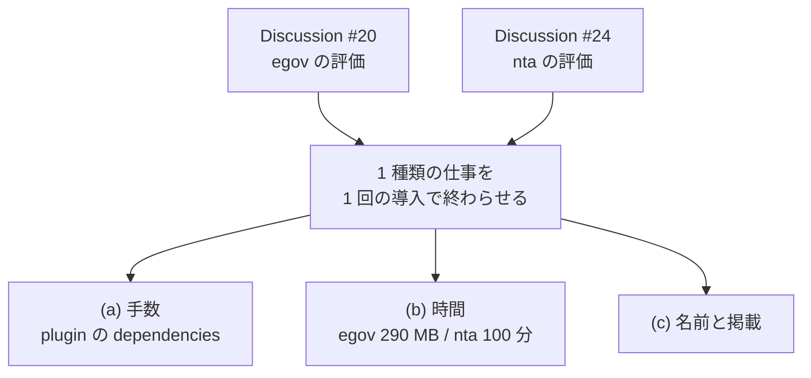

# Discussion #24（houki-nta-mcp）の割り付け（2026-09-14 JST）

[Discussion #24](https://github.com/shuji-bonji/houki-hub/discussions/24) の「劣っている点」7 項目を作業単位に割り付けます。#20（egov）の割り付けは `2026-09-14-issue-21-22-breakdown.md` にあります。

起票と本文の差し替えは `scripts/update-issues-2026-09-14b.sh` が行います。

```
DRY_RUN=1 ./scripts/update-issues-2026-09-14b.sh
./scripts/update-issues-2026-09-14b.sh
```

## 新規は 2 件だけ

7 項目のうち 4 件は、#20 の割り付けで作った Issue と同じ対象でした。

| #24 | 内容 | 行き先 | 種別 |
|---|---|---|---|
| 劣 1 | 基本通達の本数が少ない | nta | 立場が決まってから |
| 劣 2 | 裁決が無い | ROADMAP の houki-saiketsu-mcp | Issue にしない |
| 劣 3 | 法令と通達が同じ導入にならない | hub#22 | 既出 |
| 劣 4 | 初回約 100 分 | nta | **新規 Issue K** |
| 劣 5 | PDF 本文を読まない | nta | **新規 Issue L** |
| 劣 6 | 名前と発見 | hub#22 | 既出 |
| 劣 7 | 業としての利用を想定外 | `docs/DECISIONS.md` | 既出（配布 3） |

あわせて houki-hub に、#24 の進捗を束ねる親（Issue M）を 1 本起票します。

## 2 つの Discussion が同じ結論に収束しました

#20 は egov の評価、#24 は nta の評価で、対象も指摘の中身も違います。それでも、他者に届かない理由として両方が同じところを指しました。



## 前提の訂正

`marketplace.json` の `dependencies` 宣言だけでは「1 回の導入」になりません。

| 段階 | egov | nta |
|---|---|---|
| plugin を入れる | `dependencies` で 1 回に減る | 同左 |
| 使える状態にする | `--bulk-download-everything` で約 290 MB | 6 種別で約 100 分 |

nta は DB が無いときライブ取得で動き、応答は約 700ms です（DB ありは約 10ms）。試用の経路はすでにあるので、まずそれを README と `--help` の先頭に出すところから始められます。hub#22 を (a) 手数 / (b) 時間 / (c) 名前と掲載 に分割し、(b) に Issue K をぶら下げました。

## 立場の分岐は保留

Discussion #24 は「自分用の公開ツールとして保つ」か「他者の作業に入れる」かの二択を置き、同時には追わない方がよいと書いています。当面どちらも選ばず、どちらでも効く劣 4 と劣 5 だけを進めます。劣 4 は #24 自身が「自分用でも重い」と書いています。

判断は `docs/DECISIONS.md` に記録しました。

## あわせて反映したこと

houki-egov-mcp#20（施行令・施行規則の関連付け）の本文を差し替えます。当初は「hub#8 とどちらの層で参照関係を持つかを先に決める」として保留していましたが、**重なったまま MCP のツールとして実装する**方針に決まりました。

| 層 | 返すもの | 作り方 |
|---|---|---|
| egov#20 | 法令 XML と法令名の規則から決定論的に引ける参照。同じ入力に同じ出力 | egov のコード |
| hub#8 | 意味的な近さ、趣旨の関連、条をまたぐ要約 | Claude API による抽出 |

egov#20 は網羅性を主張せず、抽出できた範囲であることを応答に書きます。判断は LLM 側に残します。
