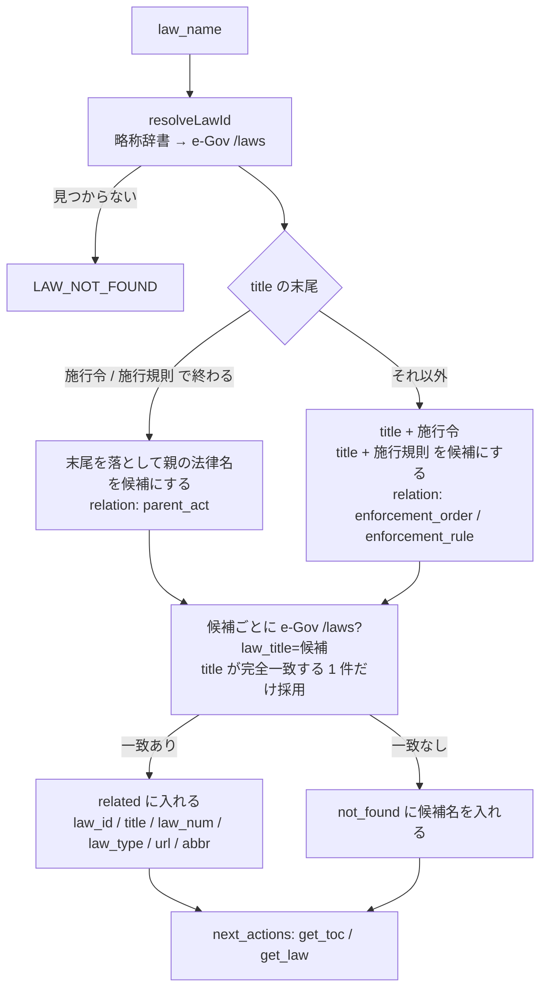
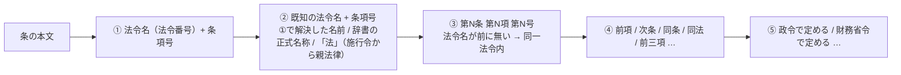

# 設計メモ: houki-egov-mcp に施行令・施行規則の関連付けと条文内の参照抽出を足す（egov#20）

対象リポジトリ: houki-egov-mcp（`houki-hub/mcp/houki-egov-mcp`、2026-09-19 JST 作成）
ブランチ: `feat/20-references`
版の案: **v0.10.0**（ツールを 2 つ足すので minor。当初は v0.9.0 の予定だったが、0.9.0 / 0.9.1 がコードの変更なしの版として使われたため）
出典: [egov#20](https://github.com/shuji-bonji/houki-egov-mcp/issues/20) / 起票文 `docs/notes/issues-2026-09-14/houki-egov-mcp-D-v2.md` / `docs/ROADMAP.md` の「次の一手 4」と「条文の参照関係をどこに持つか（2026-09-14 決定）」

---

## 1. 何を作るか（1 行）

「所得税法から施行令・施行規則へ」と「この条が引用している他の法令の条へ」を、LLM が `search_law` を組み立て直さずに 1 手で辿れるようにする 2 つのツールを houki-egov-mcp に足します。

## 2. hub#8 との境目（起票文の決定を実装の言葉に直す）

起票文の表を、コードの責任に置き換えると次のようになります。

| 層 | 本メモでの実体 | 同じ入力に同じ出力か |
|---|---|---|
| egov#20（本メモ） | 法令名の文字列規則（「施行令」「施行規則」を後ろに付ける）と、条文本文の正規表現、e-Gov API での実在確認 | はい。辞書・API の内容が変わらない限り同じ |
| hub#8（法令グラフ） | 「この政令委任は何を意図しているか」「意味の近い条はどれか」 | いいえ。Claude API に頼る |

本メモの 2 ツールの JSON 応答（`related[]` / `references[]` / `delegations[]`）は、そのまま hub#8 のグラフの辺の候補になります。hub#8 側でこの応答を使うときの形は、hub#8 で決めます。

## 3. ツール

### 3.1 `get_related_laws` — 法令名の規則で施行令・施行規則を引く

**入力**

| 引数 | 型 | 必須 | 意味 |
|---|---|---|---|
| `law_name` | string | ○ | 法令名または略称。`get_law` と同じ解決（略称辞書 → e-Gov 検索） |

`additionalProperties: false`。

**処理**



- 実在確認は e-Gov `/laws?law_title=` の応答から **`revision_info.law_title` が候補と完全一致する 1 件**を取ります。部分一致の結果（「所得税法施行令」で検索すると「…臨時特例に関する法律施行令」も返る）は捨てます
- 親の法律名は末尾の「施行令」「施行規則」を落として作ります。「所得税法施行令」→「所得税法」。「…に関する法律施行令」→「…に関する法律」
- 候補の名前は 2 つだけにします（`施行令` / `施行規則`）。「…の施行に関する省令」「…施行細則」などの形は今回は作りません（応答の `note` に書きます）
- 略称辞書は `resolveAbbreviation(候補名)` で **略称を付けるためだけ**に使います（「所得税法施行令」→ `abbr: "所令"`）。理由は次節

**出力**

```jsonc
{
  "law": { "law_id": "340AC0000000033", "title": "所得税法", "law_num": "昭和四十年法律第三十三号", "law_type": "Act" },
  "related": [
    { "relation": "enforcement_order", "law_id": "340CO0000000096", "title": "所得税法施行令",
      "law_num": "昭和四十年政令第九十六号", "law_type": "CabinetOrder", "abbr": "所令",
      "url": "https://laws.e-gov.go.jp/law/340CO0000000096" },
    { "relation": "enforcement_rule", "law_id": "340M50000040011", "title": "所得税法施行規則",
      "law_num": "昭和四十年大蔵省令第十一号", "law_type": "MinisterialOrdinance", "abbr": "所規",
      "url": "https://laws.e-gov.go.jp/law/340M50000040011" }
  ],
  "not_found": [],
  "method": "law_name_rule",
  "note": "法令名の末尾に「施行令」「施行規則」を付けた名前で e-Gov に実在するものだけを返しています。「…の施行に関する省令」など別の名前の下位法令、複数の省令、告示は対象外です。網羅性は保証しません",
  "next_actions": [
    { "action": "get_toc", "reason": "施行令の目次を見て、委任先の条を探せます", "example": { "law_name": "所得税法施行令" } },
    { "action": "get_toc", "reason": "施行規則の目次を見て、委任先の条を探せます", "example": { "law_name": "所得税法施行規則" } }
  ],
  "meta": { "retrieved_at": "…" }
}
```

- `related` が空でもエラーにしません。`not_found` に試した候補名を入れます（「試したが無かった」と「試していない」を分けるため）
- 施行令を入力した場合は `related` に `relation: "parent_act"` と、兄弟の `enforcement_rule` を返します（親を引いた後、親から規則を引き直す）

### 3.2 `get_article_references` — 条文本文からの参照抽出

**入力**

| 引数 | 型 | 必須 | 意味 |
|---|---|---|---|
| `law_name` | string | ○ | `get_law` と同じ |
| `article` | string | ○ | `get_law` と同じ（漢数字・枝番号可） |
| `paragraph` | number | | 項で絞る |
| `at` | string | | 時点指定。`get_law` と同じ |

**処理**

対象の条（または項）の `Sentence` の文字列を `extractText` でつなぎ、次の順で抽出します。先に取れた範囲（文字位置）は後の規則の対象から外します。



| # | kind | 取り方 | 解決 |
|---|---|---|---|
| ① | `external` | `（(明治\|大正\|昭和\|平成\|令和)…年…第…号）` の直前に法令名、直後に `第…条(の…)*` `第…項` `第…号(の…)*` が続く形 | **法令番号**で e-Gov `/laws?law_num=` を引き、返った `law_title` を `law_name` にする（正規表現で切った名前は候補にすぎないので使わない）。1 件も返らなければ `resolved: false` のまま返す |
| ② | `external` | ①で解決した名前、略称辞書の正式名称、施行令・施行規則の本文の「法」（`get_related_laws` の `parent_act` と同じ規則で親法律に直す）に、`第…条…` が続く形 | 名前 → `resolveLawId`。「同法第…条」は④に回す |
| ③ | `internal` | `第…条(の…)*(第…項)?(第…号(の…)*)?` で、直前が法令名でも「同」「前」「次」でもないもの | 対象の法令そのもの。`article` / `paragraph` / `item` を e-Gov 形式（`"57_2"` ではなく利用者向けの `"57の2"`）で返す |
| ④ | `relative` | `前項` `前二項` `次条` `同条第四項` `同項` `同法` `同号` | **解決しない**。`raw` と位置だけ返す。文脈は呼び出し側の LLM が持っている |
| ⑤ | `delegation` | `政令で定める` `内閣府令で定める` `財務省令で定める` `…省令で定める` `省令で定める` | 政令 → `get_related_laws` の `enforcement_order`、省令 → `enforcement_rule` を `target_law` として付ける。**委任先の条は決めない**（決められない） |

- 漢数字 → 数字は既存の `toEgovArticleNum` / `toEgovItemNum` / `kanjiToNumber`（v0.7.0）を使います
- 条項号の後ろの「（給与所得）」のような見出しの引用は取り込まず、`raw` に含めるだけにします
- ①の法令番号での照合は e-Gov への追加呼び出しになります。同じ法令番号は 1 回だけ引き、応答は `LRUCache`（既存の `searchCache` と同じ大きさ）に入れます

**出力**

```jsonc
{
  "meta": { "law_id": "340AC0000000033", "title": "所得税法", "article": "57の2", "paragraph": 2, "retrieved_at": "…", "url": "…" },
  "references": [
    { "kind": "external", "raw": "雇用保険法（昭和四十九年法律第百十六号）第十条第五項第一号",
      "law_name": "雇用保険法", "law_num": "昭和四十九年法律第百十六号", "law_id": "349AC0000000116",
      "article": "10", "paragraph": 5, "item": "1", "resolved": true },
    { "kind": "external", "raw": "職業能力開発促進法第三十条の三", "law_name": "職業能力開発促進法",
      "law_id": "…", "article": "30の3", "resolved": true },
    { "kind": "internal", "raw": "第二十八条第一項", "article": "28", "paragraph": 1 },
    { "kind": "relative", "raw": "同法第三十一条の十", "resolved": false },
    { "kind": "relative", "raw": "前項", "resolved": false }
  ],
  "delegations": [
    { "kind": "delegation", "raw": "政令で定める", "count": 6,
      "target_law": { "relation": "enforcement_order", "law_id": "340CO0000000096", "title": "所得税法施行令" } },
    { "kind": "delegation", "raw": "財務省令で定める", "count": 6,
      "target_law": { "relation": "enforcement_rule", "law_id": "340M50000040011", "title": "所得税法施行規則" } }
  ],
  "coverage": {
    "method": "regex",
    "note": "本文の文字列から正規表現で取れた参照だけを返しています。取れなかった参照があっても検出できません。「前項」「同法」などは解決していません。委任先の条は特定していません"
  },
  "next_actions": [
    { "action": "get_law", "reason": "引用先の条を読めます", "example": { "law_name": "雇用保険法", "article": "10", "paragraph": 5, "item": "1" } },
    { "action": "get_law", "reason": "同一法令内の参照先を読めます", "example": { "law_name": "所得税法", "article": "28", "paragraph": 1 } },
    { "action": "search_fulltext", "reason": "施行令の中で「法第五十七条の二」を引いている条を探せます（ローカル DB がある場合）", "example": { "keyword": "所得税法施行令 法第五十七条の二" } }
  ]
}
```

- `next_actions[].example` は **そのまま `get_law` に渡せる引数だけ**にします（`mcp` / `tool` は入れない。同じ MCP のツールなので `action` がツール名）。`additionalProperties: false` で弾かれないことをテストで確かめます（2026-09-12 の教訓）
- `item` は nta と同じく**文字列**で返します（`"8の2"` のような枝番号を `get_law` にそのまま渡せる形）
- `references` が空でもエラーにしません。`coverage.note` は常に付けます

## 4. 決めたこと（起票文と違う点も含む）

| 項目 | 決定 | 理由 |
|---|---|---|
| ツールの数 | 2 つ（`get_related_laws` / `get_article_references`）。`next_actions` は両方の成功応答に付ける | 起票文の「3 つ」のうち 3（`next_actions`）はツールではなく応答の形 |
| houki-abbreviations の逆引き（`lookupByLawId` / `lookupByLawNum`）は使わない | `resolveAbbreviation`（0.4.1 にある関数）だけを使う | 辞書の施行令・施行規則 13 件（`所令` `所規` `法令` `消令` …）はすべて `law_id: null` なので、逆引きしても law_id は取れない。law_id を出せるのは e-Gov API だけ。`lookupByLawNum` は①の API 呼び出しを省く近道にはなるが、それだけのために依存を `^0.5.1` に上げると egov / nta の両方の publish が要る（0.x の `^` は minor を跨がないため、`package.json` の範囲を上げて publish し直す必要がある）。ROADMAP 5 の `^0.6.0` への引き上げのときに差し替える |
| 実在確認は e-Gov API だけ。ローカル DB は使わない | `laws` テーブルでも同じ確認はできるが、今回は入れない | README の「7 ツールのうち 6 つは DB なしで動く」を「9 のうち 8」に保つ。DB があるときに API を省く最適化は後で足せる |
| 「同法」「前項」は解決しない | `kind: "relative"` で `raw` だけ返す | 「同法」は直前の法令名、「前項」は現在の項番号で機械的に決まりそうに見えるが、括弧書きの入れ子や「同条第四項」の「同条」が指す条は文脈で変わる。間違った解決を返すより、解決していないと書くほうが family の方針（判断は LLM に残す）に合う。v0.9.x で「同法」だけ試す余地は残す |
| 委任先の条は特定しない | `delegations[].target_law` は法令単位。条は `search_fulltext` への `next_actions` で案内 | 施行令のどの条が「政令で定める」を受けているかは、施行令側の本文（「法第五十七条の二第二項第一号に規定する政令で定める支出は…」）を検索しないと分からない。それはローカル DB がある場合の `search_fulltext` の仕事 |
| 名前の候補は `施行令` と `施行規則` の 2 つだけ | `not_found` と `note` で対象外を明示 | 「…の施行に関する省令」「…施行細則」は名前から一意に作れない。取れないものを取れたとして返さない |
| エラー | 既存の `LAW_NOT_FOUND` / `ARTICLE_NOT_FOUND` / `OUT_OF_SCOPE` / `SOURCE_*` を使う。新しいコードは足さない | 「関連が見つからない」「参照が取れない」は成功応答の空配列で表し、エラーにしない |

## 5. 完了条件との対応（起票文）

| 起票文の完了条件 | 本メモでの確認方法 |
|---|---|
| 所得税法から施行令・施行規則が引ける（実在確認を通ったものだけ） | `get_related_laws({ law_name: "所得税法" })` の `related` に `340CO0000000096` と `340M50000040011` が入り、`not_found` が空 |
| ある条の本文が引用している他法令の条が、法令名と条番号の形で返る | `get_article_references({ law_name: "所得税法", article: "57の2", paragraph: 2 })` の `references` に 雇用保険法 第10条第5項第1号（`law_id` 付き）が入る |
| 抽出できた範囲であることが応答に書かれており、網羅性を主張していない | `coverage.note` / `note` が常に付く。ユニットテストで文字列を確認 |
| `tools/list` の `inputSchema` に `additionalProperties: false` が入っている | `definitions.ts` の `as const satisfies ToolSpec` に付ける。既存の `server.test.ts` の全ツール走査で確認 |

## 6. 実装の置き場所

| ファイル | 役割 |
|---|---|
| `src/services/law-relations.ts` | 法令名の規則、候補の生成、e-Gov での実在確認、`parent_act` の逆引き |
| `src/services/reference-extractor.ts` | 純粋な文字列処理。本文 → `references[]` / `delegations[]`（API を呼ばない。テストしやすくするため） |
| `src/services/law-service.ts` | 2 ツールの本実装（`getRelatedLaws` / `getArticleReferences`）。既存の `resolveLawId` / `fetchLawData` / `egovHttpErrorToLawError` を使う。法令番号 → 法令の照合とそのキャッシュもここ |
| `src/tools/definitions.ts` / `handlers.ts` / `types/index.ts` | ツール定義 2 つ、`toolHandlers` に 2 行、`ArgsOf` の型 2 つ |
| `src/services/reference-extractor.test.ts` | 所得税法 57 条の 2 第 2 項の実文（上の JSON の元）を fixture にした抽出テスト |
| `src/services/law-relations.test.ts` | 候補生成と親名の逆引き |
| `src/tools/handlers.test.ts` | 空引数・未知の引数のエラー経路、`next_actions[].example` が inputSchema を通ること |
| `README.md` / `docs/USE-CASES.md` / `server.json` / `CHANGELOG` | ツール数 7 → 9、「まず試す」の表に 2 行、版 0.9.0 |

houki-hub 側の追随（`site/docs/reference/mcp/houki-egov.md` の再生成、`docs/ROADMAP.md` の「次の一手 4」の取り消し線）は publish 後に別途行います。houki-research-skill は、`feasibility-check.md` の「委任先」のステップで `get_related_laws` を呼ぶ形に変えられますが、それも publish 後です。

## 7. やらないこと（応答にも書く）

- 委任の趣旨の解釈、意味的に近い条の推薦（hub#8）
- 参照の網羅性の保証
- 「同法」「前項」「同条」の解決
- 委任先の条の特定
- 「施行令」「施行規則」以外の名前の下位法令、告示、通達（通達は houki-nta の `base_laws` が逆方向を持っている）
