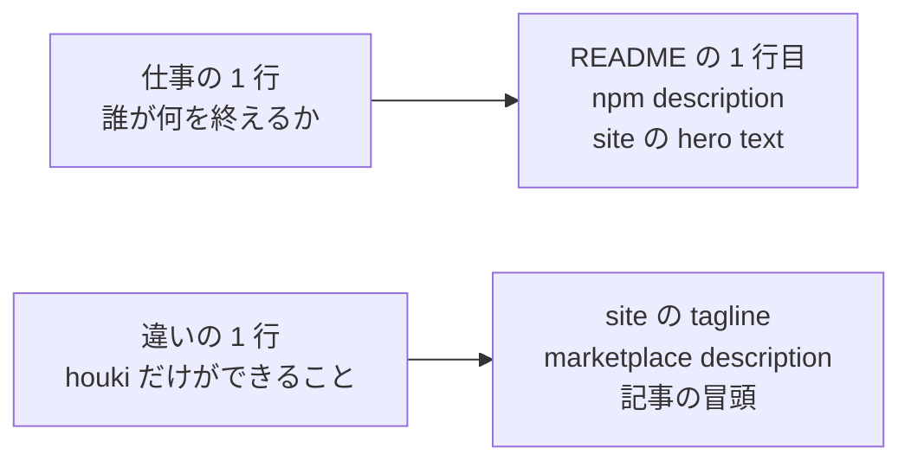

# 仕事の名前と掲載先（hub#22 の (c)、2026-09-19 JST）

hub#22（発見性）の 3 段のうち、(a) 導入の手数と (b) 導入の時間は済んだ。残る (c) は「仕事の名前を 1 つ決め、README の 1 行目・npm の `description`・`marketplace.json` を揃え、掲載先に出す」。名前を決めるのはユーザーの判断なので、本ファイルは候補と、決まったあとの文言案と、掲載先の手順を置く。

## 1. 名前に課す条件

| 条件 | 理由 |
|---|---|
| 「税務の裏取り」「税理士向け」と読める言い方はしない | README / DISCLAIMER が業としての利用を想定外とし、税理士法 52 条を明記している（hub#22 配布 3）。`tax-law-mcp` と同じ土俵に、看板を 1 つ外して立つことになる |
| 誰が何を終えるかが 1 行で分かる | ユーザーの整理: 認知には 1 種類の仕事に絞ることが要る |
| houki だけができることが、実装の名前で言える | `legal_status` / `index_status` / `orphaned_at` / `next_actions` / `freshness` / `source` |
| 本筋（国民が法規を知り活用する、当面はエンジニア向け）に沿う | `docs/notes/2026-08-25-scope-and-professional-use.md` §1 |
| 検索語（法令 / 通達 / e-Gov / 国税庁 / MCP / Japanese law）を含められる | npm と GitHub の検索は本文の語で当たる |

## 2. 2 層に分ける

1 行で「仕事」と「違い」の両方を言おうとすると長くなる。**仕事（誰が何を終えるか）**と**違い（houki だけができること）**を別の 1 行にし、置く場所で使い分ける。



## 3. 「仕事」の候補

| 案 | 1 行 | 向く読者 | 長所 | 短所 |
|---|---|---|---|---|
| **J1** | **実装する前に、その仕様が法令のどこに触れるかを条文で確かめる** | システムを作る・運用するエンジニア | 本筋と一致。プロジェクトの目標（実現可能性調査での法規制約調査）そのもの。`tax-law-mcp` と読者が重ならない | 通達（nta）の強みが 1 行に出ない |
| J2 | 法令と通達を、出典と拘束力を添えて LLM に渡す | MCP を組む開発者 | family 全体を正確に言い表す。egov と nta の両方に当てはまる | 「仕事」ではなく「機能」の言い方。誰が終えるのかが無い |
| J3 | 自分の申告・届出のために、条文と国税庁の解釈を自分で引く | 納税者本人（個人事業主など） | 業法に触れない（本人が自分のことを調べるのは独占業務の外）。e-shiwake の導線と繋がる | 対象が税に閉じる。「自分で」の範囲を毎回説明することになる |

**推奨は J1。** 理由は 3 つ。(1) 2026-08-25 に決めた本筋とスタンスと同じ文で、新しい説明を足さずに済む。(2) `tax-law-mcp` の読者（税理士・税務担当）と重ならず、比較されない。(3) 「実装する前に」は開発者が毎回通る場面なので、使う時機が名前に入っている。

nta の強みは「違い」の行で出す。

## 4. 「違い」の候補

| 案 | 1 行 | 根拠になる実装 |
|---|---|---|
| **D1** | **「法律で決まっている」と「通達でそうなっている」を混ぜずに返す** | nta の全応答に `legal_status`。基本通達と質疑応答事例から `next_actions` で houki-egov の `get_law` へ戻る（nta v0.11.0 / v0.12.0） |
| D2 | その通達が今も国税庁の索引にあるかまで確かめて返す | `index_status: "removed_from_index"` / `orphaned_at`（nta v0.17.0）。`tax-law-mcp` の最終更新は 2026-03 で、この判定は無い |
| D3 | 条文も通達も、URL と取得日時と鮮度を付けて返す | egov / nta の `freshness`、`source`、`fetchedAt` |

**推奨は D1。** 最判昭和 43 年 12 月 24 日を根拠にした family の設計判断（法令と通達を別サーバーにする）を、利用者の言葉に直したもの。D2 は強いが nta の 1 機能に閉じる。D3 は e-Gov 系 MCP の共通価値に近い。

## 5. 決まったあとの文言（J1 + D1 の場合）

置く場所ごとに、文字数と読者が違う。

### houki-hub（site の hero / README 冒頭）

```yaml
hero:
  name: houki-hub
  text: 実装する前に、その仕様が法令のどこに触れるかを条文で確かめる
  tagline: 法律・政令・省令は e-Gov 法令 API から全分野を、通達・Q&A は国税庁分を。「法律で決まっている」と「通達でそうなっている」を混ぜずに、出典と鮮度を添えて返す MCP サーバー群と、それらを横断する Skill
```

README 冒頭:

> 実装する前に、その仕様が法令のどこに触れるかを条文で確かめるための MCP サーバー・共有ライブラリ・Skill 群（法規シリーズ）。法律・政令・省令は e-Gov 法令 API から全分野を、通達・Q&A は国税庁分を扱い、「法律で決まっている」と「通達でそうなっている」を混ぜずに、出典と鮮度を添えて返します。

### houki-egov-mcp

README 1 行目:

> 実装する前に、その仕様が法令のどこに触れるかを条文で確かめるための MCP サーバー。日本の法令（憲法・法律・政令・省令・規則）を e-Gov 法令 API v2 から、条・項・号の単位で、法令番号と URL を添えて返します。

npm `description`（英語を先に。npm の検索は英語の語で当たることが多い）:

```
MCP server for checking Japanese statutes before you build: laws, cabinet orders and ministerial ordinances from the e-Gov Law API v2, returned per article/paragraph/item with law number and URL. 日本の法令（法律・政令・省令）を e-Gov 法令 API v2 から条・項・号の単位で引く MCP サーバー。houki-hub family.
```

`marketplace.json` の `description` は README 1 行目 + いまの機能の記述（全文検索・`--bulk-download-everything`）を残す。

### houki-nta-mcp

README 1 行目:

> 実装する前に、国税庁の取扱いが条文とどう違うかを確かめるための MCP サーバー。基本通達・改正通達・事務運営指針・文書回答事例・タックスアンサー・質疑応答事例を国税庁サイトから取り込み、「法律で決まっている」と「通達でそうなっている」を混ぜずに、根拠条文への案内と鮮度を添えて返します。

npm `description`:

```
MCP server for Japanese National Tax Agency (NTA) notices and Q&A: basic circulars (tsutatsu), amendments, Q&A cases and Tax Answer, with legal_status (not binding on taxpayers) and links back to the statute. 国税庁の通達・質疑応答事例・タックスアンサーを、拘束力の区別と根拠条文への案内付きで返す MCP サーバー。houki-hub family.
```

### houki-research Skill

README 1 行目は現状の「横断的に使うときの行動指針」のままでよい。`marketplace.json` の `description` の先頭に、J1 の 1 行を足す。

## 6. 掲載先

いまの掲載は claude-plugins marketplace（自分の）だけ。family の MCP はどれも、公式 MCP Registry に無い（`mcps/` 配下の全 MCP で `package.json` に `mcpName` が無く、`server.json` も無い。`glama.json` があるのは xcomet-mcp-server だけ）。

| 掲載先 | 誰が見るか | 出し方 | 費用 |
|---|---|---|---|
| **公式 MCP Registry**（registry.modelcontextprotocol.io） | Claude Desktop / Claude Code / 各クライアントの一覧 | `package.json` に `"mcpName": "io.github.shuji-bonji/houki-egov-mcp"` を足して npm publish → `mcp-publisher init` で `server.json` → `mcp-publisher login github` → `mcp-publisher publish`。egov と nta で 1 回ずつ | 小。ただし **npm の publish が要る**（`mcpName` は npm 側の所有確認に使われる） |
| awesome-mcp-servers（GitHub） | MCP を探す開発者 | PR で 1 行ずつ。分類は Legal / Government あたり | 小 |
| Glama | 同上 | `glama.json` を置く（xcomet-mcp-server と同じ形）。npm から拾われる | 小 |
| PulseMCP / mcp.so / Smithery | 同上 | 自動収集か送信フォーム | 小 |
| Zenn / Qiita | 日本の開発者 | J1 の名前で 1 本。既存の family 紹介記事（2026-05-11）とは読者の入口が違う | 中 |

順序は、**名前を決める → README / npm / marketplace を揃える → egov と nta を publish（`mcpName` 入り）→ 公式 Registry → その他**。Registry は publish 済みの npm を参照するので、文言を揃える前に出すと古い説明が載る。

egov は README の PR（`docs/22b-readme-try-first`）が版を上げずに待っている。名前の変更と `mcpName` を同じ版（v0.6.1 か v0.7.0）に乗せると、publish が 1 回で済む。

## 7. 測り方

npm の週次ダウンロードは使わない（MCP は起動のたびに `npx -y` で落ちる）。

- claude-plugins からの install 数（GitHub の traffic は clone 数で近似）
- houki-hub site への流入（GitHub Pages の traffic）
- 公式 Registry の検索で `houki` が出ること（`curl "https://registry.modelcontextprotocol.io/v0.1/servers?search=houki"`）
- Star / Issue / Discussion に他者が現れるか（Discussion #20 / #24 の時点では 0）
