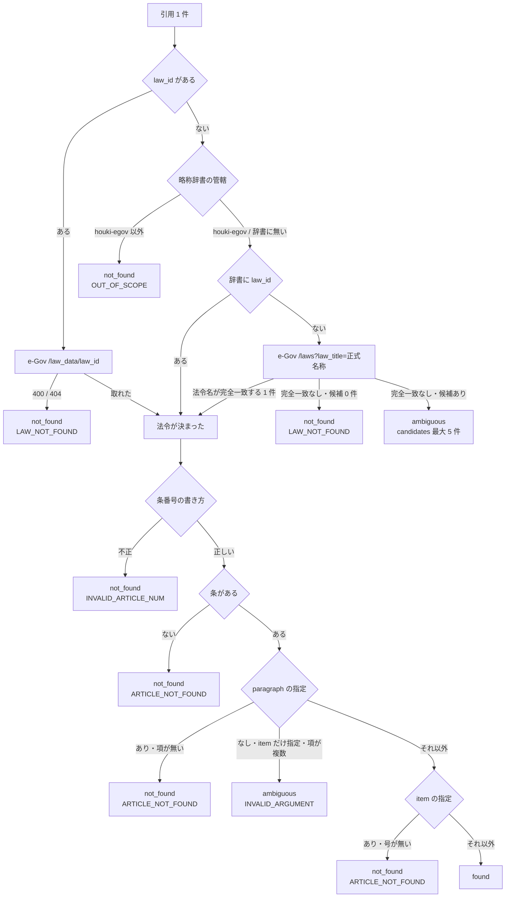

# 設計メモ: houki-egov-mcp に引用の実在確認ツールを足す（egov#18）

対象リポジトリ: houki-egov-mcp（`houki-hub/mcp/houki-egov-mcp`、2026-09-20 JST 作成）
ブランチ: `feat/18-verify-citations`
版の案: **v0.11.0**（ツールを 1 つ足すので minor）
出典: [egov#18](https://github.com/shuji-bonji/houki-egov-mcp/issues/18) / houki-hub#20 の機能 3 / houki-hub#21

---

## 1. 何を作るか（1 行）

LLM が組み立てた引用のリストを 1 回の呼び出しでまとめて実在確認し、件ごとに `found` / `not_found` / `ambiguous` を返すツール `verify_citations` を houki-egov-mcp に足します。

## 2. なぜ get_law の繰り返しでは足りないか

引用を 1 件ずつ `get_law` で取れば、同じことは確かめられます。足りないのは次の 3 点です。

| 足りないもの | `get_law` の繰り返しで起きること | `verify_citations` での扱い |
|---|---|---|
| 全体の判定 | 何件中何件が実在したかを、LLM が自分で数え直す必要がある | `summary.all_found` が 1 つの値で答える |
| 1 件の失敗の扱い | 存在しない条は `isError` の応答になるので、LLM が「調査が失敗した」と読んで途中で止まることがある | ツール全体は `isError` にせず、その件だけ `not_found` にする |
| 条文本文の量 | 実在確認だけが目的でも条文全文が返り、引用の数だけトークンを使う | 正式名称・法令番号・条見出し・`law_id`・URL だけを返す |

## 3. 確かめることと、確かめないこと

| | 内容 |
|---|---|
| 確かめる | その条（指定があれば項・号）が、e-Gov の現行法令（`at` 指定時はその時点の法令）にあるか |
| 確かめない | 引用した条文が、その回答の主張を支えているか。引用の文脈が適切か。条文の解釈 |

応答の `note` にこの区別を常に書きます。「実在した」を「引用として正しい」と読み替えられないようにするためです。

## 4. 入力

```jsonc
{
  "citations": [
    { "law_name": "所法", "article": "9", "paragraph": 1, "item": 1, "label": "所法9①一" },
    { "law_id": "410AC0000000025", "article": "7" }
  ],
  "at": "2026-04-01"
}
```

| 引数 | 型 | 必須 | 意味 |
|---|---|---|---|
| `citations` | array（1〜50 件） | ○ | 確かめたい引用 |
| `citations[].law_name` | string | △ | 法令名または略称。`law_id` と両方省略はできない |
| `citations[].law_id` | string | △ | e-Gov の law_id。`law_name` より優先する |
| `citations[].article` | string | ○ | 条番号。`"30"` / `"30の2"` / `"第三十条の二"` |
| `citations[].paragraph` | number | | 項番号。省略すると条までを確かめる |
| `citations[].item` | number \| string | | 号番号 |
| `citations[].label` | string | | 引用元の表示文字列。判定には使わず、そのまま返す |
| `at` | string | | 時点指定（YYYY-MM-DD）。全件に同じ時点を適用する |

`additionalProperties: false` は、外側のオブジェクトと `citations[]` の各件の両方に付けます。

`law_name` と `law_id` のどちらかが必須であることは、JSON Schema の `anyOf` では書かずに handler で確かめ、欠けている件があればツール全体を `INVALID_ARGUMENT` にします。`anyOf` を入れると `json-schema-to-ts` の `FromSchema` が union を作り、v0.6.0 で避けた TS2589（型の展開が深すぎる）に近づくためです。引数の形の間違いは e-Gov に聞く前に分かるので、件ごとの判定にする理由もありません。

## 5. 1 件の判定の流れ



### 5.1 `ambiguous` を 2 か所で使う

| 場面 | `code` | 返すもの |
|---|---|---|
| 法令名が e-Gov の法令名と完全一致せず、部分一致の候補がある | 付けない | `candidates[]`（最大 5 件、`law_id` / 正式名称 / 法令番号 / 法令種別 / URL） |
| 項が複数ある条で、項を書かずに号だけを指定した | `INVALID_ARGUMENT` | 「項が N 個あるため、号だけではどの項の号か決まりません」と、項を足した引数の例 |

候補が 1 件しかなくても、法令名が完全一致していなければ `ambiguous` にします。`get_law` の `resolveLawId` は完全一致が無ければ検索結果の先頭を採りますが、実在確認では「たぶんこれだろう」を `found` と書けないためです。

### 5.2 `code` を付けない件がある理由

`code` は houki-hub family 共通のエラー語彙（[ERROR-CODES.md](https://github.com/shuji-bonji/houki-research-skill/blob/main/docs/ERROR-CODES.md)）で言えるときだけ付けます。「法令名の候補が複数あった」に当たる語彙は family にありません。ここで `AMBIGUOUS_LAW_NAME` のような新しい code を足すと、ツール全体のエラーには一度も現れない値が語彙に入り、他の MCP も追随することになります。`status: "ambiguous"` と `candidates[]` で足りるので、語彙は増やしません。

## 6. 通信できなかったときは件ごとの判定を返さない

e-Gov がタイムアウト・接続不能・5xx を返したときは、それまでに判定できた件も含めて捨て、ツール全体を `SOURCE_TIMEOUT` / `SOURCE_UNAVAILABLE` / `SOURCE_API_ERROR` にします（`retryable: true`）。

`not_found` は「e-Gov に聞いたら無かった」という意味です。「e-Gov に聞けなかった」を同じ言葉で返すと、LLM が引用を消してしまいます。`400` と `404` だけは「e-Gov がその law_id を知らない」と読めるので、件ごとの `LAW_NOT_FOUND` にします。

## 7. 呼び出し回数

- 1 回に渡せるのは 50 件まで（`inputSchema` の `maxItems`、`constants.ts` の `LIMITS.citationsMax`）
- 件の処理は `createLimit(HTTP_CONFIG.concurrency)`（既定 4）で並べます。e-Gov クライアント側にも同じ上限があるので、実際の同時リクエストは 4 本です
- 同じ法令名・同じ `law_id` が複数の件に出てきても、e-Gov への問い合わせは 1 回です。呼び出しの中だけで持つ Map に解決中の Promise を入れて共有します。法令本文は既存の `lawDataCache`（LRU）にも載るので、呼び出しをまたいでも再取得は起きません

## 8. 実測（2026-09-20 JST）

12 件（実在 6 件・不存在 4 件・曖昧 2 件）を混ぜたリストで確認しました。

| 入力 | 結果 |
|---|---|
| 所法 第9条第1項第1号 | `found` / `resolved_by: "abbreviation"` / 条見出し「（非課税所得）」 |
| 電子帳簿保存法 第7条 | `found` / `resolved_by: "exact_title"` / `410AC0000000025` / 条見出し「（電子取引の取引情報に係る電磁的記録の保存）」 |
| `law_id: "340AC0000000033"` 第五十七条の二 | `found` / `resolved_by: "law_id"` |
| 所得税法 第9999条 | `not_found` / `ARTICLE_NOT_FOUND` |
| 所得税法 第57条の2第99項 | `not_found` / `ARTICLE_NOT_FOUND` / 条は実在するので `article` は残る（「項は 5 個」） |
| 所得税法 第57条の2第1号（項なし） | `ambiguous` / `INVALID_ARGUMENT` |
| 所得税法施行 第1条 | `ambiguous` / 候補 2 件（所得税法施行令・所得税法施行規則） |
| 架空法 第1条 | `not_found` / `LAW_NOT_FOUND` |
| 消基通 1-7-2 | `not_found` / `OUT_OF_SCOPE` / `next_actions` が `houki-nta` を指す |

`summary` は `{ total: 12, found: 6, not_found: 4, ambiguous: 2, all_found: false }` でした。

## 9. houki-research-skill 側の変更

`docs/CITATION.md` に「引用を書き出す前に `verify_citations` で確かめる」手順を足します。`found` 以外の件をどう扱うか（`not_found` は引用から外す、`ambiguous` は `candidates` から選び直す、`OUT_OF_SCOPE` は houki-nta に回す）までを書き、citation の各行と `results[]` の件が 1 対 1 で対応するように `label` を使います。

## 10. やらないこと

- 条文本文の返却（引用の実在確認に本文は要りません。本文が要るなら `get_law` を呼びます）
- 通達・タックスアンサー・質疑応答事例の実在確認（houki-nta-mcp の担当。ここでは `OUT_OF_SCOPE` に倒します）
- 判例・裁決の実在確認（担当する MCP がまだありません）
- 引用の内容が主張を支えるかどうかの判定（§3）
