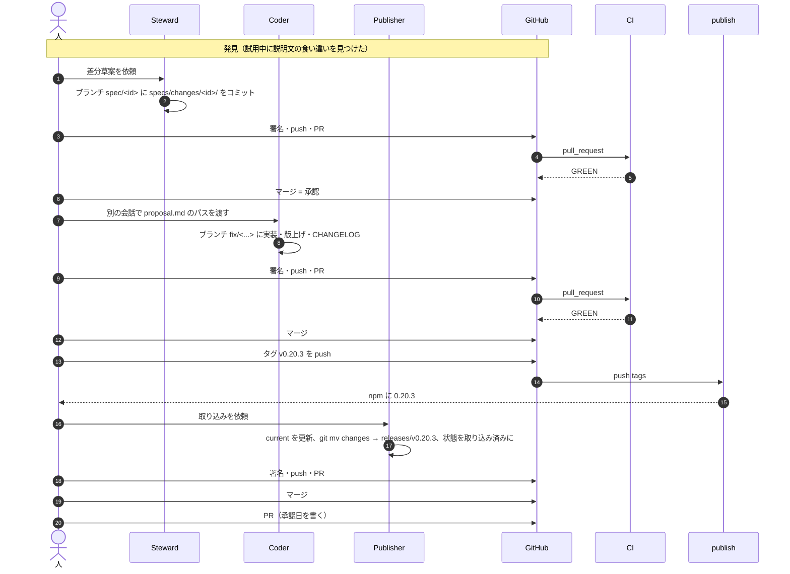
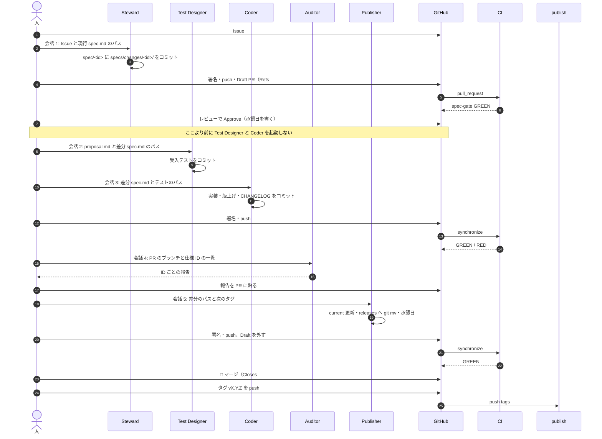

# specs/ の運用フロー: git と GitHub の作業に落とした形

- 日付: 2026-09-24（JST）
- 対象: houki-nta-mcp の `specs/`（今後 family・pdf 系・e-shiwake にも使う）
- 元の手順: shuji-bonji/spec-ids Discussion #1「仕様を担保するエージェントの導入と実践」
- 状態: 草案。どちらの型で運用するかは人が決める

Discussion #1 は「誰が何を書いてよいか」と「どの順で進めるか」を決めています。しかし、Issue・ブランチ・PR・レビュー・マージ・タグのどの操作がどの段階に当たるかは書いていません。この文書は、2026-09-24 に `nta_get_tsutatsu` の差分 1 件を実際に回した記録から、その対応を書き出します。

## 1. 登場するもの

| 名前 | 種類 | この運用でしていること |
|---|---|---|
| 人（shuji） | 人 | Issue を立てる、承認する、署名して push する、マージする、タグを打つ |
| Spec Steward | エージェント | `specs/changes/<id>/` の草案、初版の `specs/current/<tool>/spec.md` |
| Test Designer | エージェント | 仕様 ID 付きの受入テスト |
| Coder | エージェント | 実装、版上げ、CHANGELOG |
| Spec Auditor | エージェント | 仕様 ID ごとの食い違いの報告 |
| Spec Publisher | エージェント | `specs/current/` への取り込み、`specs/releases/<tag>/` への移動、proposal.md の「状態」 |
| GitHub | サービス | Issue、PR、レビュー、マージ |
| CI（`ci.yml`） | サービス | lint・format・テスト（Node 22 / 24）、spec-gate（`npx spec-ids check`） |
| publish（`publish.yml`） | サービス | タグの push で npm に publish |

エージェントはどれも GitHub に届きません（Cowork の VM から `git fetch` / `gh` が使えない）。push・PR・コメントの投稿は人が行います。

## 2. 2026-09-24 に実際に回した流れ（3 PR 型）

差分 `20260924-tsutatsu-clause-forms` 1 件に、PR が 3 つ（#53 / #55 / #56）と、承認日を書くための PR が 1 つ（`spec/approval-dates`）かかりました。

### 手間になっている点

| # | 手間 | 原因 |
|---|---|---|
| 1 | 1 つの差分に PR が 3〜4 つ要る | 承認・実装・取り込みを、それぞれマージで区切っている |
| 2 | 承認日を書くためだけに PR が要る | 承認（マージ）の後でないと日付が決まらないと考えていた |
| 3 | 会話を 3 つ開き、そのたびにパスを渡す | Steward / Coder / Publisher を同じ会話で起動しない規則 |
| 4 | push のたびに署名し直す | エージェントのコミットは未署名。人が `rebase --exec` で署名してから push する |
| 5 | PR 本文・Auditor の報告を人が貼る | エージェントが GitHub に届かない |

## 3. 提案: 1 つの差分を 1 つの PR で回す（1 PR 型）

承認を「マージ」ではなく「PR のレビューで Approve すること」にします。承認の後、同じブランチに Test Designer・Coder・Publisher のコミットを積み、最後に 1 回だけマージします。

役割の分離（同じ会話で起動しない、Coder は `specs/current/` を書かない）は変えません。変えるのは、区切りを PR からコミットに移すことだけです。

### 3.1 イベントの一覧

| 段階 | イベント | 誰 | 成果物 | 次へ進む条件 |
|---|---|---|---|---|
| 0 きっかけ | Issue を立てる（ラベル `spec-change`） | 人 | Issue #N（変わる振る舞いを 3 行以内） | 無し |
| 1 草案 | ブランチ `spec/<yyyymmdd>-<slug>` を切る。`specs/changes/<id>/` をコミット | Steward | コミット `spec: <id> の差分草案` | 無し |
| 2 提出 | 署名・push、Draft PR を開く（本文に `Refs #N`） | 人 | Draft PR | CI の spec-gate が GREEN |
| 3 承認 | PR レビューで Approve。レビューのコメントに承認日（JST）を書く | 人 | Approve のレビュー | Approve がある |
| 4 テスト | 仕様 ID 付きの受入テストをコミット | Test Designer | コミット `test: <id> の受入テスト` | 無し（RED でよい） |
| 5 実装 | 実装・版上げ・CHANGELOG をコミット | Coder | コミット `fix:` / `feat:` | ローカルでテストが通る |
| 6 検査 | 署名・push。CI を待つ。Auditor の報告を PR に貼る | 人・Auditor | CI の結果、Auditor の報告 | CI が GREEN、報告が全 ID GREEN |
| 7 取り込み | `specs/current/` を更新、`git mv` で `specs/releases/<次のタグ>/<id>/` へ、状態を「取り込み済み」、承認日を書く | Publisher | コミット `spec: <id> を current に取り込み` | spec-gate が GREEN |
| 8 マージ | 署名・push、Draft を外して `git merge --ff-only` | 人 | main | 無し |
| 9 公開 | タグ `vX.Y.Z` を push | 人 | npm、GitHub Release | publish が成功 |
| 10 追随 | houki-hub のツールリファレンスを再生成 | 人（または別の会話） | hub の site/ | 無し |

受入テストを足さない差分（今回の説明文の修正など）は、段階 4 を飛ばします。実装の変更が無い差分（仕様の文面だけ）は段階 4〜6 を飛ばし、タグも打ちません。その場合、`specs/releases/` への移動は次のタグのときに行います。

### 3.2 シーケンス

### 3.3 3 PR 型との比べ

| 項目 | 3 PR 型（今回） | 1 PR 型（提案） |
|---|---|---|
| PR の数 | 3〜4 | 1 |
| 承認の記録 | 差分草案 PR のマージ | PR レビューの Approve |
| 承認日を書く時期 | マージの後（別 PR） | Publisher のコミット（マージ前） |
| main に未実装の差分が載る期間 | 草案マージから実装マージまで | 無し |
| 承認後に差分が書き換えられる危険 | 無し（main に固定） | ある。承認後のコミットで `specs/changes/<id>/` を触っていないかを人が見る必要がある |
| 会話の数 | 3（Steward / Coder / Publisher） | 3〜5（Test Designer と Auditor を分けるなら 5） |
| 署名 | PR ごと | push ごと（ブランチ全体を署名し直して `--force-with-lease`） |

1 PR 型の弱点は「承認後の書き換え」です。対策は 2 段階で考えます。

- 当面: 人がマージ前に `git diff <Approve 時のコミット>..HEAD -- specs/changes/` が空であることを見る
- 後で: spec-gate に「PR に Approve が付いた後のコミットで `specs/changes/` が変わっていたら RED」を足す（GitHub API が要るので `spec-ids` ではなく workflow 側の仕事）

## 4. 初版の spec.md（#50 の各ツール）の流れ

振る舞いを変えないので、今のまま 1 PR で済みます。

| 段階 | イベント | 誰 |
|---|---|---|
| 1 | ブランチ `spec/<tool>`、`spec.md` とテスト名の ID を 2 コミット | Steward |
| 2 | 署名・push・PR（本文に未決の件数と人が判断する項目） | 人 |
| 3 | CI の spec-gate が GREEN | CI |
| 4 | 未決を読んで切り分け、承認日を書くコミットを足す | 人 |
| 5 | ff マージ、#50 にチェック | 人 |

## 5. 手間を減らす候補

| # | 候補 | 減る手間 | 決めること |
|---|---|---|---|
| 1 | 1 PR 型にする | PR 3〜4 → 1、承認日の PR が不要 | 承認後の書き換えを人の目で見るか、CI で止めるか |
| 2 | Test Designer と Coder を 1 つの会話にまとめる（Steward・Auditor・Publisher は分けたまま） | 会話 1 つ | 実装を見て期待値を足す危険を許すか。テストを先にコミットさせ、Auditor が順序を見る |
| 3 | Auditor を CI に寄せる（spec-gate の結果と、差分の ID のテストが GREEN かを PR に出す） | 会話 1 つ、貼る手間 | 機械で判定できない「意図が古い」は人が見る |
| 4 | Publisher の作業をスクリプトにする（`git mv`・状態・承認日の書き換え） | 会話 1 つ | `spec-ids` の CLI に入れるか（Discussion #1 では「init に入れないもの」に承認フローを挙げている） |
| 5 | エージェントから GitHub に届くようにする（`gh` の認証を VM に置く、または GitHub MCP） | 貼る手間、PR を開く手間 | 署名は人に残すか |

## 6. 決めること

1. 1 PR 型にするか（3 PR 型のままにするか）
2. 承認の記録を何にするか（PR レビューの Approve / ラベル / Issue へのコメント）
3. 5 の候補のうち、どれから入れるか

決まったら、houki-nta-mcp の `AGENTS.md`「仕様の正本」と #50 の手順（`docs/notes/2026-09-24-instructions-nta-issue50-specs.md`）を直します。family 共通にするなら spec-ids の Discussion #1 に「git / GitHub での運用」の節として足します。
