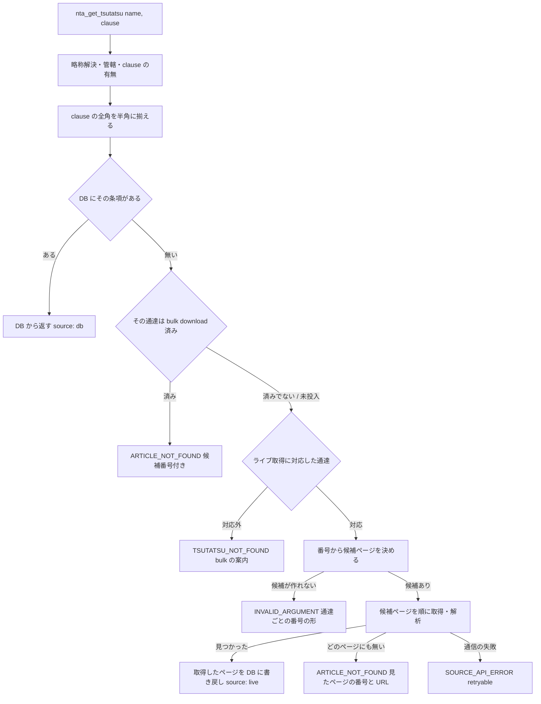

# 設計: nta_get_tsutatsu の国税庁サイトからの取得を基本通達 4 種で成立させる（houki-nta-mcp#54 案 B）

- 日付: 2026-09-25（JST）
- 対象: houki-nta-mcp v0.20.3 の `nta_get_tsutatsu`（仕様 `specs/current/nta_get_tsutatsu/spec.md`）
- 状態: 設計は決定（6 章）。仕様 PR（`specs/changes/20260925-tsutatsu-live-toc/`）に書き直す
- 関連: houki-nta-mcp#54（起票元は `docs/notes/2026-09-24-issue-draft-nta-tsutatsu-live-scope.md`）

この設計の目的は、DB に通達が入っていない利用者でも、基本通達 4 種の条項を 1 回の呼び出しで取れるようにすることです。あわせて、調べる途中で見つかった「一度取得すると、同じ通達の他の条項が取れなくなる」不具合（2 章）を直します。

## 1. いま起きていること

`nta_get_tsutatsu` の国税庁サイトからの取得は、次の 2 つを前提にしています。この前提が成り立つのは消費税法基本通達だけです（#54 の再現表）。

1. `clause` は「章-節-条」の 3 つに分かれる
2. 節のページの URL は `{章}/{節}.htm`

| 通達 | 番号の形（DB で確認済み） | ページの URL の形 | いまの結果 |
|---|---|---|---|
| 消費税法基本通達 | 章-節-条 | `05/01.htm` | 取れる |
| 法人税基本通達 | 章-節(の枝)-条 | `01/01_03_02.htm`、`02/02_01_01_2.htm`、`12_2/12_2_01.htm`、`20a/20_09.htm` など | `SOURCE_API_ERROR`（retryable）または `INVALID_ARGUMENT` |
| 所得税基本通達 | 条-項、`条~条共-項` | `04/08.htm`（ディレクトリ番号は TOC の章番号と一致しない） | `INVALID_ARGUMENT` |
| 相続税法基本通達 | 条-項、`条・条共-項` | `01/00.htm`〜（1 条に複数ページ） | `INVALID_ARGUMENT` |

番号から URL を組み立てられるのは消費税法基本通達だけです。他の 3 通達は、目次ページ（`01.htm`）を読んで、番号がどのページにあるかを決める必要があります。目次の解析器（`parseTsutatsuTocShotoku` / `Hojin` / `Sozoku`）と、節のページの解析器（`parseTsutatsuSection`）は bulk download 用にすでにあります。

## 2. 先に直す不具合: 一度取得すると、同じ通達の他の条項が取れなくなる

2026-09-25 に、空の DB で次を確かめました（v0.20.3、実際の国税庁サイト）。

| 順 | 呼び出し | 結果 |
|---|---|---|
| 1 | 消基通 `5-1-9` | 国税庁サイトから取得（`source: "live"`）。5-1 節の 11 条項が DB に書き戻される |
| 2 | 消基通 `1-4-1` | `ARTICLE_NOT_FOUND`。`available_clauses` は 5-1 節の 11 件だけ。国税庁サイトには取りに行かない |

原因は、DB の経路（SPEC-NTA-GET-TSUTATSU-005）が「その通達の条項が DB に 1 件でもあれば、DB に全部ある」とみなしていることです。書き戻し（1 節分）と bulk download（全節）を区別していません。仕様 005 の文面どおりの動きなので、不具合として直すには仕様の変更が要ります。

この不具合は案 A・案 B のどちらを選んでも残るので、#54 の範囲に含めます。

## 3. 案 A を先に入れるか

入れないことを勧めます。理由は次の 3 つです。

| 理由 | 内容 |
|---|---|
| 仕様を 2 回変えることになる | 案 A は 006 を「消費税法基本通達だけ」に狭め、案 B はそれを 4 通達に戻す。仕様 PR と実装 PR が 2 組要り、2 組目は 1 組目の取り消しを含む |
| 2 章の不具合は案 A では直らない | 案 A の後も、消費税法基本通達で 1 回取得すると他の節が取れない |
| 案 A で救える利用者が少ない | 影響を受けるのは「bulk download をしていない」かつ「法人税・所得税・相続税法の基本通達を引く」利用者。README と plugin の手順では bulk download を先に案内している |

案 B の実装に時間がかかる見込みになった場合は、4 章の段階 1（2 章の修正と、エラーの出し分け）だけを先に出すことができます。段階 1 だけでも、法人税基本通達で再試行を促す `SOURCE_API_ERROR` を出す問題は直ります。

## 4. 案 B の設計

### 4.1 流れ

### 4.2 候補ページの決め方（通達ごと）

番号を読み、目次の項目から「その番号が載っていそうなページ」を選びます。候補が複数なら順に取得し、最初に見つかったところで止めます。

| 通達 | 番号の読み方 | 目次からの選び方 | 目次の読み込み |
|---|---|---|---|
| 消費税法基本通達 | `章-節-条` | 目次を使わず `{章}/{節}.htm`（今と同じ）。そのページに無ければ目次で探し直す | 見つからないときだけ |
| 法人税基本通達 | `章-節(の枝)-条`。章は `12の2` のように枝を持つことがある | URL のディレクトリが章（`12の2` → `12_2`）、ファイル名の 2 つ目が節の項目。項目の題が「第N節の M」なら節の枝、「第N款」なら同じ節の款ページとして全部候補にする | 要る |
| 所得税基本通達 | `条(の枝)-項`、`条~条共-項` | 題の「法第N条…関係」「法第N条から第M条まで…共通関係」から条の範囲を読む。「〔…〕」の項目は、直前のリンクの無い見出し（`
法第2条《定義》関係
`）の条に属させる | 要る |
| 相続税法基本通達 | `条(の枝)-項`、`条(の枝)・条(の枝)共-項` | 題の「第N条《…》関係」「第N条の3《…》及び第N条の4《…》共通関係」から条を読む。1 条に複数ページあれば全部候補にする | 要る |

目次の解析器に 2 つ足すものがあります。

- 所得税基本通達: 各項目に、直前のリンクの無い見出しの題（`groupTitle`）を持たせる。今は捨てている
- 法人税基本通達: 款の項目に、属する節の番号を持たせる。URL からも導けるが、題と URL の両方で確かめる

### 4.3 目次の再利用

目次を呼び出しのたびに取得すると、1 回の呼び出しで国税庁サイトへのアクセスが 1 回増えます。目次は DB に保存し、次の呼び出しから使い回します。使い回す期間は設けず、条項が見つからなかったときにだけ取り直します。

- 保存先: 新しい表 `tsutatsu_toc`（目次の URL、通達名、解析結果の JSON、取得日時、`Last-Modified`、`ETag`）。目次の URL を鍵にするので、世代の移行（`sozoku` → `sozoku2`）でルート URL を変えると、古い目次は使われなくなる
- 取り直す時点: 次のどれかが起きたとき、1 回の呼び出しにつき 1 回だけ、条件付き取得（`If-Modified-Since` / `If-None-Match`）で目次を取り直し、候補を作り直す
  - 候補が作れない
  - 候補のページのどれにも条項が無い
  - 候補のページがどれも 404
- 条件付き取得が 304（目次は変わっていない）なら、取り直さずに `ARTICLE_NOT_FOUND` を返す

期限を設けなくてよい理由は次のとおりです。

| 観察（2026-09-25 に確認） | 設計への影響 |
|---|---|
| 目次は候補ページを決めるためだけに使い、条項の本文は毎回その場で取得したページから返す | 目次が古くても、古い本文を返すことはない。起きるのは「見つからない」だけで、そのときに取り直す |
| 4 通達の目次（`01.htm`）はどれも `Last-Modified` と `ETag` を返し、`If-Modified-Since` に 304 を返す | 取り直しは、変わっていなければ本文を受け取らずに済む |
| 目次は頻繁に更新される（`Last-Modified`: 消基通 2026-06-17、所基通 2025-12-25、法基通 2026-07-29、相基通 2026-08-03） | 7 日の期限では、更新の直後に足された節を最大 7 日取りこぼす |
| 大改正では新しいディレクトリに移り、旧ルートは 302 で `/error/404.htm` へ転送される（`kihon/sisan/sozoku/01.htm` → 302） | 世代の移行はルート URL の変更（コード側）で起きる。目次の版が同じ URL の下で分かれることは、これまで観察していない |

同じ URL の下で節が組み替えられ、古い目次が指すページに別の節が入る場合も、そのページに目的の条項が無ければ取り直しに進み、あればその条項を返すので、結果は正しくなります。

### 4.4 候補ページの取得

| 項目 | 設計 |
|---|---|
| 1 回の呼び出しで取るページ数の上限 | 10（6 章）。上限に達したら `ARTICLE_NOT_FOUND` に `searched_urls` と「bulk download すれば全ページを持てる」案内を付ける |
| 取得の間隔 | ページとページの間に 0.3 秒待つ（6 章）。bulk download の 1.1 秒は全節を連続で取るとき用 |
| 書き戻し | 取得して解析できたページは、見つからなかったページも含めて全部 DB に書き戻す（次の呼び出しで取り直さない） |
| 解析の失敗 | 今と同じ `INTERNAL_ERROR`（構造変更を疑う `hint`） |

### 4.5 「bulk download 済み」の記録

2 章の不具合を直すため、通達ごとに「全節を持っているか」を DB に記録します。

- `tsutatsu` 表に `bulk_completed_at` を足す（スキーマ v10）。bulk download が全章を取り終えたときに書く。章を絞った実行（`onlyChapter`）と書き戻しでは書かない
- 既存の DB の移行: bulk download が書いた節には `last_modified` か `etag` が入り、書き戻しの節には入らない。どちらかが入った節を持つ通達は `bulk_completed_at` を埋める（6 章）
- DB の経路で `ARTICLE_NOT_FOUND` を返すのは、`bulk_completed_at` がある通達だけにする。無ければ国税庁サイトへ進む

### 4.6 番号の全角

国税庁サイトから取る経路でも、DB の経路と同じく `clause` の全角の数字・ハイフンを半角に揃えてから番号を読みます。仕様 `nta_get_tsutatsu` の未決 1 は、これで解消します。

## 5. 仕様への影響（差分の見出し）

仕様 PR では、見出し単位で次の差分を書く見込みです。ID は `npx spec-ids next nta_get_tsutatsu` で取ります（今の最大は 013）。

| 種類 | 見出し | 内容 |
|---|---|---|
| MODIFIED | SPEC-NTA-GET-TSUTATSU-004 | 変えない本文に「国税庁サイトから取った条項も、書き戻した後はここで返す」を足すか、そのまま |
| MODIFIED | SPEC-NTA-GET-TSUTATSU-005 | `ARTICLE_NOT_FOUND` を返すのは bulk download 済みの通達だけ。そうでなければ国税庁サイトへ進む |
| MODIFIED | SPEC-NTA-GET-TSUTATSU-006 | 基本通達 4 種は、目次から候補ページを決めて取得する |
| MODIFIED | SPEC-NTA-GET-TSUTATSU-008 | 形の検査を通達ごとの番号の形に合わせる。`INVALID_ARGUMENT` の `hint` に、その通達の番号の形と例を入れる |
| MODIFIED | SPEC-NTA-GET-TSUTATSU-009 | `SOURCE_API_ERROR` は目次・ページの取得の失敗だけ。組み立てた URL が存在しないことでは出さない |
| MODIFIED | SPEC-NTA-GET-TSUTATSU-010 | 候補ページのどれにも無いとき、`available_clauses`（見たページの番号）と `searched_urls` を返す |
| ADDED | 新 ID | 目次を DB に保存して使い回す |
| ADDED | 新 ID | 1 回の呼び出しで取るページ数の上限 |
| 入力の表 | `clause` の行 | 「DB から返すときは全角でもよい」を「どちらの経路でも全角でもよい」に |
| 未決 | 1 と 5 | 1 は解消。5（`available_clauses` の件数の違い）は、この差分で揃えるか決める |

## 6. 決めたこと（2026-09-25）

| # | 項目 | 決定 |
|---|---|---|
| 1 | 案 A を先に入れるか | 入れない |
| 2 | 目次を使い回す期間 | 期限なし。条項が見つからないときにだけ、条件付き取得で取り直す（4.3）。4.3 の観察が崩れる事例が見つかったら 7 日に戻す |
| 3 | 1 回の呼び出しで取るページ数の上限 | 10（法人税基本通達の第 2 章第 3 節の款が 10） |
| 4 | ページとページの間の待ち | 0.3 秒 |
| 5 | 既存の DB の `bulk_completed_at` | `last_modified` / `etag` のある節を持つ通達を「済み」とみなして移行で埋める |
| 6 | 段階を分けるか | 仕様 PR は 1 本（#59）。実装 PR も 1 本にまとめる（2026-09-26 に変更）。当初は段階 1（4.5・4.6・009）と段階 2（4.2〜4.4）の 2 本だったが、008 の「形の正しい番号を拒否しない」は候補ページを決める処理（006）が無いと返す内容が仕様に無く、段階 1 だけの途中の振る舞いを Coder が決めることになるため |

## 7. 受入テストの見込み

Test Designer が使えるフィクスチャーは `tests/fixtures/` に揃っています。

| 通達 | 目次 | 節のページ |
|---|---|---|
| 法人税基本通達 | `hojin_01.htm` | `hojin_01_01_01.htm`、`hojin_02_02_01_01.htm`、`hojin_02_02_01_01_2.htm` など |
| 所得税基本通達 | `shotoku_01.htm` | `shotoku_01_01.htm`、`shotoku_04_01.htm`、`shotoku_04_05.htm` など |
| 相続税法基本通達 | `sisan_sozoku2_01.htm` | `sozoku2_01_00.htm`〜`01_02.htm` など |

- 所得税基本通達 `34-1`（`04/08.htm`）のフィクスチャーは無いので、`04/05.htm` にある番号を使うか、フィクスチャーを足す
- 2 章の不具合の再現（1 回取得した後に別の節を引く）は、フィクスチャー 2 枚と一時 DB で書ける
