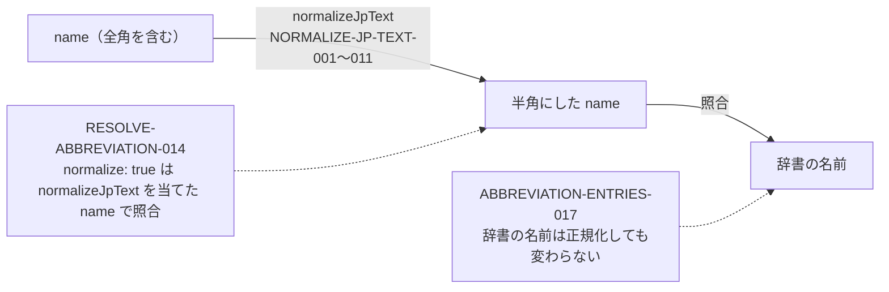

# houki-abbreviations: resolve_abbreviation の未決 3 を仕様にするときの指示（別チャット用）

- 日付: 2026-09-27（JST）
- 対象: houki-abbreviations `specs/current/resolve_abbreviation/spec.md` の未決 3「全角数字・全角ハイフン・全角チルダの吸収」。PR #10 の初版起こしで振り分けた項目（Issue にしなかったもの）のうち、v0.6.1 で最後に残った 1 件
- 前提: main `6046fa1`（v0.6.1 と、マージの片付け `fix/20260927-v061-leftovers`）。運用は spec-ids `docs/operations.md`（仕様 PR → 実装 PR の 2 本）

## なぜ仕様にするか

`resolveAbbreviation(name, { normalize: true })` は、houki-egov-mcp（`src/services/law-search.ts` の 3 か所。`search_law` のキーワードなど）が、利用者の入力の全角・半角の違いを吸収するために呼んでいます。API リファレンス（houki-hub の `site/docs/reference/lib/houki-abbreviations.md`、元は JSDoc）にも「入力を `normalizeJpText` で正規化したうえで、同様に正規化されたインデックスから照合する」と書いてあり、外部から頼られている約束です。約束にしない案（「できないこと」に書く）は採りません。

## 確かめ方の決め方

同梱の辞書 174 件の名前（略称・正式名称・別名の 482 個）には、数字・ハイフン・チルダを含むものがありません。そのため「全角の数字で渡すと引ける」を、辞書の名前を使って直接は確かめられません。そこで、約束を次の 2 つに分けます。

1. **照合の規則は `normalizeJpText` と同じ**: `normalize: true` の照合は、`name` に `normalizeJpText` を当てた文字列で行う。何を半角にするか（数字・英字・ハイフン・チルダ・空白）は `normalizeJpText` の仕様（SPEC-ABBR-NORMALIZE-JP-TEXT-001〜011）に任せる。数字などの規則そのものは、`normalizeJpText` の既存テストで確かめ済み
2. **辞書の名前は正規化しても変わらない**: 辞書のどの名前も、`normalizeJpText` を当てても同じ文字列のまま。これが成り立つ間は、1 の規則だけで「全角で渡しても半角で渡しても同じエントリ」が決まる。辞書に全角の名前を足すと、このテストが落ちて気付ける

2026-09-27 に v0.6.1 で確かめた結果:

- 482 個の名前のうち、`normalizeJpText` で変わるものは 0 個
- 482 個の名前それぞれを全角にした入力（ASCII の文字を U+FF01〜U+FF5E に置き換えたもの）は、どれも元の名前と同じエントリを返す（食い違い 0）
- `ＰＬ法`・`消法１`・`１８３－２`・`ＩＴ書面一括法`・`　消法　`・`ＡＭＬ` で、`resolveAbbreviation(x, { normalize: true })` と `resolveAbbreviation(normalizeJpText(x))` は同じ結果

実装の変更は要りません（テストを足すだけ）。



## 1. 仕様 PR（役: Spec Steward、会話 1）

- ブランチ: `spec/20260927-resolve-normalize-rule`（main から切る）
- 読むもの: `specs/current/resolve_abbreviation/spec.md`（未決 3 と、SPEC-ABBR-RESOLVE-ABBREVIATION-007〜009・011・012）、`specs/current/normalize_jp_text/spec.md`、`specs/current/abbreviation_entries/spec.md`、`AGENTS.md`
- 書くもの:
  - `specs/changes/20260927-resolve-normalize-rule/proposal.md`（「- 実装の変更: 不要」、承認日は空欄）
  - `specs/changes/20260927-resolve-normalize-rule/specs/resolve_abbreviation/spec.md`（ADDED）
  - `specs/changes/20260927-resolve-normalize-rule/specs/abbreviation_entries/spec.md`（ADDED）
- ID: `npx spec-ids next resolve_abbreviation`（→ 014）、`npx spec-ids next abbreviation_entries`（→ 017）
- コミットは 1 つ

振る舞いの草案（Steward は例を node で確かめてから書く）:

| ID | 題 | 本文の要点 |
|---|---|---|
| SPEC-ABBR-RESOLVE-ABBREVIATION-014 | `normalize: true` の照合は、`name` に `normalizeJpText` を当てた文字列で行う | 何を半角にするかは SPEC-ABBR-NORMALIZE-JP-TEXT-001〜011 のとおり。例: `resolveAbbreviation(x, { normalize: true })` は `resolveAbbreviation(normalizeJpText(x))` と同じエントリ（または同じく `null`）を返す。`x` に全角の数字・英字・ハイフン・チルダ・空白を含む例を並べる |
| SPEC-ABBR-ABBREVIATION-ENTRIES-017 | 辞書の名前は `normalizeJpText` を当てても変わらない | どのエントリの `abbr`・`formal`・`aliases` の要素も、`normalizeJpText` を当てた結果が元と同じ（全角の英数字・ハイフン・チルダ・全角スペース・前後の空白を含まない）。辞書に名前を足すときの約束 |

proposal.md の「人が判断すること」に書くこと:

- **全角スペースの扱い:** 014 は、全角スペースを「取り除く」ではなく「半角スペースにする」規則をそのまま約束にする。README・JSDoc の `消　法` の例（実際は `null`）は #17 で扱い、#17 で途中の空白を取り除くと決めたら 014 を MODIFIED にする
- **#21 との関係:** 関数ごとの正規化の差を揃えるかは #21 で決める。014 は今の規則を書き起こすだけで、#21 の結論を先取りしない
- **017 の効き方:** 017 は、エントリを足す人への約束になる。CONTRIBUTING.md に 1 行足すかは、実装 PR か #17 で扱う

## 2. 実装 PR（仕様 PR のマージ後）

### 2.1 受入テスト（役: Test Designer、会話 2）

- ブランチ: `test/20260927-resolve-normalize-rule`（**仕様 PR をマージした後の main から切る**。仕様 PR のブランチの上に積んだ場合は、operations.md 3.1 の `git rebase --onto` で載せ直してからマージする）
- 読むもの: 承認済みの差分 `specs/changes/20260927-resolve-normalize-rule/specs/*/spec.md`、`AGENTS.md`。実装（`src/index.ts` の中身）は見ない
- 書くもの（`src/index.test.ts` の末尾）:
  - 014: 全角の数字・英字・ハイフン・チルダ・空白を含む入力の一覧について、`resolveAbbreviation(x, { normalize: true })` と `resolveAbbreviation(normalizeJpText(x))` が同じであること。辞書にある名前を全角にした入力（`ＰＬ法`・`ＡＭＬ`・`ＩＴ書面一括法` など）と、辞書に無い入力（`消法１`・`１８３－２`）の両方を含める
  - 017: `abbreviationEntries` のすべての `abbr`・`formal`・`aliases` について `normalizeJpText(n) === n`
  - 014 の補助: 辞書のすべての名前を全角にした入力で、`resolveAbbreviation(fw(n), { normalize: true })` が `resolveAbbreviation(n)` と同じエントリ（`toBe`）を返すこと。`fw` は ASCII の `!`〜`~` を U+FF01〜U+FF5E に置き換える関数をテストの中に書く
- コミットは「test: …」の 1 つ。落ちたら期待値を直さず報告する
- 文字列の連結に `+` を使わない

### 2.2 取り込み（役: Spec Publisher、会話 3。Coder は不要）

- 同じブランチの最終コミット
- ADDED を `specs/current/resolve_abbreviation/spec.md` と `specs/current/abbreviation_entries/spec.md` の「できること」の末尾に足す
- 未決 3 を `3. **全角数字・全角ハイフン・全角チルダの吸収。** → SPEC-ABBR-RESOLVE-ABBREVIATION-014、SPEC-ABBR-ABBREVIATION-ENTRIES-017` の 1 行にする（番号は変えない）
- 2 本の `spec.md` の承認日の行に「差分 `20260927-resolve-normalize-rule` は <仕様 PR の承認日>（PR #<仕様 PR の番号>）」を足す。**置き換えはこの 2 行だけにする**（リポジトリ全体の一括置換はしない）
- `git mv specs/changes/20260927-resolve-normalize-rule specs/releases/<タグ>/`、proposal.md の「状態」を取り込み済みにする
- タグ: テストと spec だけなので、版を上げない選択もある。上げるなら v0.6.2（CHANGELOG の Tests 節）。上げない場合、releases のフォルダー名は次に出すタグにする（決めるのは人）

## 3. 確かめること（各 PR で）

- `npx spec-ids check`（仕様 PR の後は changes に 2 ID、取り込みの後は current 213 IDs / changes 0）
- `npx vitest --run`、`npm run lint`、`npm run format:check`
- `BASE_REF=origin/main HEAD_REF=<ブランチ> node .github/scripts/check-pr-scope.mjs`（仕様 PR は承認日を書くまで RED）
- マージは手元の ff マージ。マージ後に `git ls-files specs/changes` が `.gitkeep` だけであること

## 4. 別チャットに貼る指示文

### Steward

```
houki-abbreviations の resolve_abbreviation の未決 3 を仕様にする、仕様 PR の差分草案を書いてください。役は Spec Steward です。実装とテストは書きません。
ブランチ: spec/20260927-resolve-normalize-rule（main から切る）
読むもの: houki-hub docs/notes/2026-09-27-instructions-abbr-resolve-normalize.md（1 章）、specs/current/resolve_abbreviation/spec.md、specs/current/normalize_jp_text/spec.md、specs/current/abbreviation_entries/spec.md、AGENTS.md
書くもの: specs/changes/20260927-resolve-normalize-rule/proposal.md（実装の変更: 不要、承認日は空欄）と specs/resolve_abbreviation/spec.md・specs/abbreviation_entries/spec.md（ADDED）
ID は npx spec-ids next で取る。例は node で確かめてから書く。コミットは 1 つ。
```

### Test Designer

```
houki-abbreviations の実装 PR の受入テストを書いてください。役は Test Designer です。実装は見ません。
ブランチ: test/20260927-resolve-normalize-rule（仕様 PR をマージした後の main から切る）
承認済みの差分: specs/changes/20260927-resolve-normalize-rule/specs/*/spec.md
指示: houki-hub docs/notes/2026-09-27-instructions-abbr-resolve-normalize.md の 2.1
規則: AGENTS.md。it の名前の先頭に仕様 ID。期待値は差分の本文から決める。落ちたら期待値を直さず報告する。
コミットは「test: …」の 1 つ。
```

### Publisher

```
houki-abbreviations の実装 PR の最終コミットとして、承認済み差分を specs/current/ に取り込んでください。役は Spec Publisher です。実装とテストは触りません。
ブランチ: test/20260927-resolve-normalize-rule
差分: specs/changes/20260927-resolve-normalize-rule/
指示: houki-hub docs/notes/2026-09-27-instructions-abbr-resolve-normalize.md の 2.2（承認日の置き換えは 2 行だけ）
spec-ids check と pr-scope が通ることを確かめる。コミットは「spec: 20260927-resolve-normalize-rule を specs/current/ に取り込み、releases/<tag>/ へ移す」の 1 つ。
```
