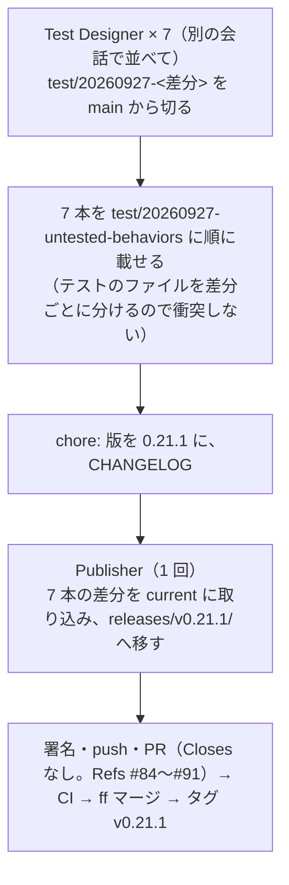

# houki-nta-mcp: 未決 A の受入テスト（Test Designer への依頼）と、その後の取り込み

houki-nta-mcp の未決 A（テストが無いだけの 65 件）の仕様 PR 7 本（#84〜#91）が main に入ったので、実装 PR を進めるための手順と指示文をまとめます。差分は振る舞いを変えないので、Coder は起動しません。テストは今の実装のまま GREEN になるはずで、RED になったら仕様と実装の食い違いとして扱います。

## 対象の差分（main の `specs/changes/`）

| 差分                                 | 仕様 PR               | 足す ID |
| ------------------------------------ | --------------------- | ------- |
| `20260927-index-status-marks`        | #91（#83 の出し直し） | 4       |
| `20260927-argument-and-parse-errors` | #84                   | 3       |
| `20260927-search-hit-responses`      | #85                   | 2       |
| `20260927-search-keyword-rules`      | #86                   | 1       |
| `20260927-search-zero-hits`          | #90                   | 6       |
| `20260927-get-responses`             | #89                   | 16      |
| `20260927-fetch-paths`               | #88                   | 2       |

各 proposal.md の「既存の仕様 ID で受ける項目」にも、ID を足さずにテストだけ足す項目があります。

## 進め方



- 実装 PR は 1 本にします。7 本の差分は `search_rules`・`common_errors`・`nta_get_qa` などの同じ spec.md の「未決」と承認日の行を書き換えるので、取り込みを 7 回に分けると互いに衝突します
- Test Designer は差分ごとに別の会話にし、並べて走らせてかまいません。テストは差分ごとに新しいファイルに書きます（例: `src/tools/spec-20260927-index-status-marks.test.ts`）。例外は `20260927-search-zero-hits` の、既存のテスト名 1 件の修正（`src/tools/doc-search-zero-hit.test.ts`）だけです
- Publisher の取り込みでは、`specs/changes/` に残っている `20260926-processing-flow` と `20260926-undecided-to-issues`（どちらも「次の実装 PR の最終コミットで releases へ移す」と書いてある）も `specs/releases/v0.21.1/` へ移します。手元に中身の無い `specs/changes/20260925-tsutatsu-live-toc/` が残っていれば消します（git は追跡していません）

## Test Designer への指示文（差分ごとに `<id>` を置き換えて使う）

```
houki-nta-mcp の実装 PR の受入テストを書いてください。役は Test Designer です。実装は見ません。
ブランチ: test/<id>（main から切る）
承認済みの差分: specs/changes/<id>/（proposal.md と specs/<dir>/spec.md のすべて）
規則: AGENTS.md。テスト名（describe か it）の先頭に仕様 ID を書く。外部サイト（国税庁・PDF の取得）は fetchImpl の差し替えで代える。DB は一時ディレクトリの DB に initSchema してから文書を入れる。
書くテスト:
  - ADDED の各見出しの受入テスト（ID をテスト名に入れる）
  - proposal.md の「既存の仕様 ID で受ける項目」の表の各行（受ける ID をテスト名に入れ、どのツールの応答として確かめるかを名前に書く）
テストは新しいファイル src/tools/spec-<id>.test.ts に書く（既存のテストは変えない。proposal.md に「テスト名を直す」とある項目だけは既存のテストの名前を直す）。
proposal.md の「約束にしなかったこと」「対象外」に書いたことはテストで確かめない。
テストは今の実装で GREEN になるはず。RED になったら期待値を変えず、そのテストを含めてコミットし、どの ID が RED かを報告する。
終わったら npm test と npx spec-ids check を回す（spec-ids check は、ID がまだ specs/changes/ にしか無いので「仕様に無い ID」にはならない）。
コミットは「test: <id> の受入テストを足す」の 1 つ。
```

差分ごとの補足（指示文の末尾に足す）:

| 差分                                 | 補足                                                                                                                                                                                                                                                               |
| ------------------------------------ | ------------------------------------------------------------------------------------------------------------------------------------------------------------------------------------------------------------------------------------------------------------------ |
| `20260927-argument-and-parse-errors` | 引数の検査は tools/call の受け口（`toolHandlers`）を通して確かめる。違反は 1 回の呼び出しに 1 つだけ入れる（2 つ以上は houki-nta-mcp #79 で未決）。008 は国税庁サイトへの取得が起きないことを確かめる。009 は各ツールに解析できない HTML を返す `fetchImpl` を渡す |
| `20260927-search-keyword-rules`      | テストに使う語は日本語にする（英字の 2 文字の語は #81 で未決）。016 の「管轄がほかの MCP の項目」は、今の辞書に該当する項目が無いので、略称辞書の解決を差し替えて（`vi.mock`）確かめる                                                                             |
| `20260927-search-zero-hits`          | 017 の `warning` は、数年前の `fetched_at` の文書を入れて確かめ、呼んだ日に左右されないようにする                                                                                                                                                                  |
| `20260927-fetch-paths`               | nta_get_tsutatsu の 005・008・014 は `src/tools/get-tsutatsu-live-toc.test.ts` の準備の仕方を参考にしてよい（期待値は差分と current の本文から決める）                                                                                                             |

## 7 本を載せた後（Claude か人）

1. `test/20260927-untested-behaviors` を main から切り、7 本のコミットを順に cherry-pick する
2. `chore: v0.21.1`（package.json・server.json・CHANGELOG。「テストと仕様 ID の追加のみ。実行されるコードの変更は無い」）
3. Publisher に次を渡す（1 回）

```
houki-nta-mcp の実装 PR の最終コミットとして、承認済み差分を specs/current/ に取り込んでください。役は Spec Publisher です。実装とテストは触りません。
ブランチ: test/20260927-untested-behaviors
差分: specs/changes/20260927-*/ の 7 本（各 proposal.md の「取り込みのとき（Publisher）」に従う）
あわせて: specs/changes/20260926-processing-flow と 20260926-undecided-to-issues も releases へ移す（取り込みは済んでいる）
やること: 見出し単位で current に取り込む、「取り込みのときに消す「未決」」の項目を消す（番号は変えない）、承認日の行に「差分 <id> は 2026-09-27（PR #N）」を足す、git mv で specs/releases/v0.21.1/ へ移す、proposal.md の「状態」を取り込み済みにする、spec-ids check と pr-scope が通ることを確かめる。
コミットは「spec: 20260927 の 7 差分を specs/current/ に取り込み、releases/v0.21.1/ へ移す」の 1 つ。
```

## `vi.mock` で書くときの注意

辞書に項目が増えても壊れないテストにするため、次の 3 点を注意します。

1. **差し替えるのは 1 語だけにする。** `vi.importActual` で本物のモジュールを読み込み、`resolveAbbreviation` はテスト用の 1 語（辞書に無い語）のときだけ houki-court の項目を返すようにします。それ以外の語は本物に任せます
2. **「正式名と同じ語は広げない」は本物の辞書で確かめる。** こちらは `酒税法` で確かめられるので、差し替えは要りません
3. **辞書に項目が入ったら差し替えを外す。** そのときは本物の項目で確かめるテストに書き換えます。016 の本文は変えずに済みます
