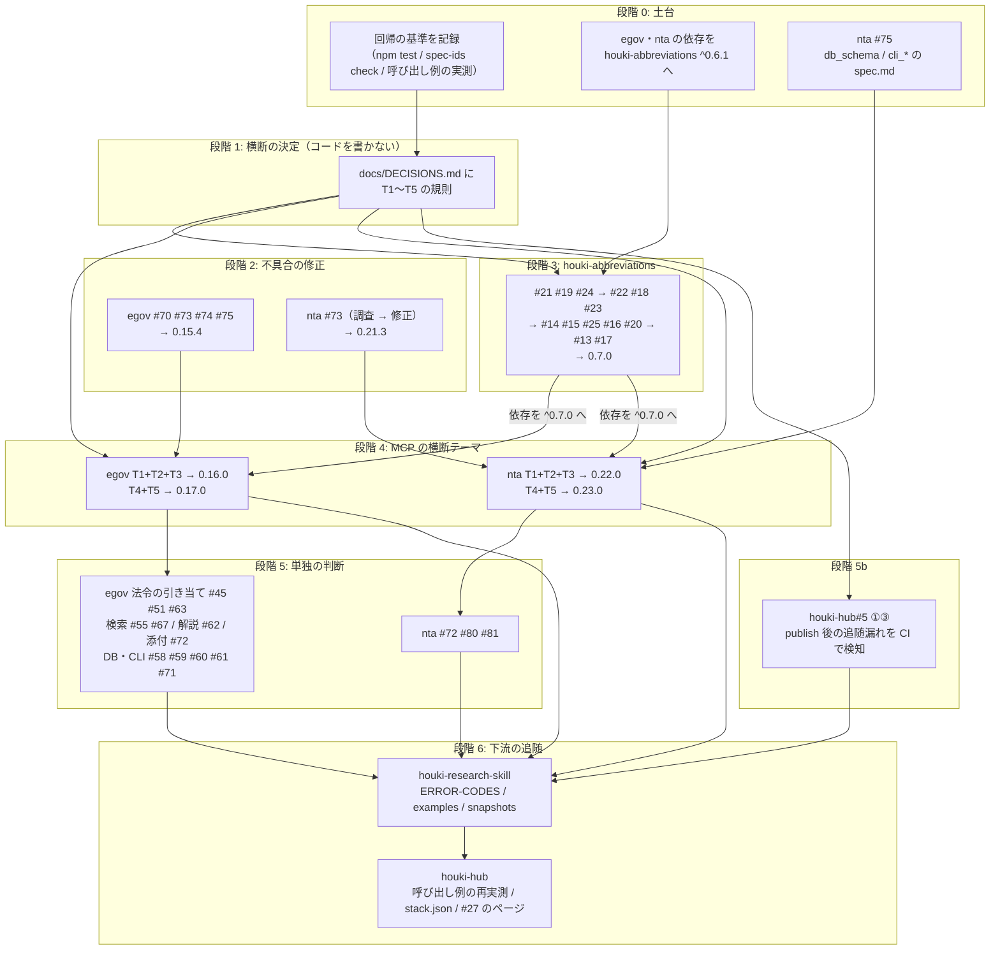
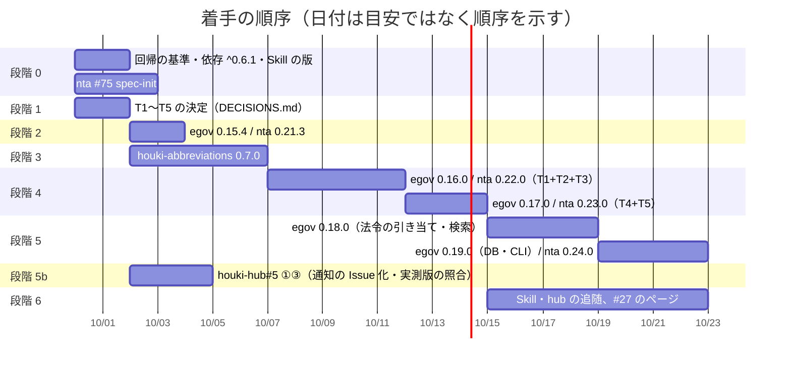

# 仕様起こしで見つかった Issue 群の対応計画（2026-09-29 JST）

houki-hub#26（仕様を担保するエージェントの導入）で 3 リポジトリに `specs/` を置いた結果、判断が要る「未決」が Issue になりました。houki-egov-mcp 29 件、houki-nta-mcp 15 件、houki-abbreviations 13 件の計 57 件です。この計画書は、その 57 件を、依存関係の順に、劣化を起こさずに、少ない PR と publish の回数で片付けるための手順を決めるものです。houki-hub#27（人が読む仕様書ページ）は、この 57 件で振る舞いが固まった後に生成するので、この計画の最後に置きます。

対象の Issue 一覧: [houki-egov-mcp](https://github.com/shuji-bonji/houki-egov-mcp/issues) / [houki-nta-mcp](https://github.com/shuji-bonji/houki-nta-mcp/issues) / [houki-abbreviations](https://github.com/shuji-bonji/houki-abbreviations/issues)

## 1. 2026-09-29 JST 時点の状態

| リポジトリ | main の版 | `specs/current/` | open Issue | 備考 |
| --- | --- | --- | --- | --- |
| houki-abbreviations | 0.6.1 | 23 単位（公開関数 21 + `abbreviation_entries` + `public_constants`） | 13（#13〜#25） | `fix/20260927-v061-leftovers` は main に入った（`6046fa1`） |
| houki-egov-mcp | 0.15.3 | 20 単位（ツール 14 + `common_errors` / `db_schema` / `cli_entry` / `cli_bulk_download` / `cli_sync` / `cli_status`） | 29（#45〜#49、#51〜#67、#69〜#75） | houki-abbreviations の依存は `^0.4.1` のまま |
| houki-nta-mcp | 0.21.2 | 16 単位（ツール 14 + `common_errors` / `search_rules`） | 15（#64〜#73、#75、#79〜#82） | `db_schema` / `cli_*` の spec.md が無い（#75）。houki-abbreviations の依存は `^0.4.1` のまま |
| houki-research-skill | 0.15.0 | 置かない（#27 のコメントで決定） | 0 | `scripts/mcp-refs.config.json` は egov 0.15.2 / nta 0.21.1 を指している |
| houki-hub | — | — | 9（#3・#5〜#8・#10・#22・#26・#27） | `scripts/reference-examples/` の呼び出し例は 2026-09-21 の回帰確認で実測済み |

前提として押さえておくこと:

- 3 リポジトリとも、仕様 PR（`spec/<yyyymmdd>-<slug>`、`specs/changes/` だけ）と実装 PR（テスト・`src/`・版・最終コミットで `specs/current/` へ取り込み）の 2 本運用です。CI の `spec-gate`（`npx spec-ids check`）と `pr-scope` が止めます。
- houki-egov-mcp と houki-nta-mcp は、houki-abbreviations から `resolveAbbreviation` / `normalizeJpText` / `normalizeSearchQuery` / `listBySourceMcpHint` と、`judgeStaleness` / `STALENESS_THRESHOLDS`（`src/services/freshness.ts`）を使っています。0.x の `^` は minor を跨がないので、houki-abbreviations の minor を上げても、MCP 側の `package.json` を上げて publish しない限り MCP には入りません。
- houki-nta-mcp の `src/tools/handlers.ts` の `explainDocIdNotFound()` の JSDoc に「`code` は v0.14.0 から変えない（改正通達・事務運営指針は TSUTATSU_NOT_FOUND、文書回答事例は DOC_NOT_FOUND）」と書いてあります。これは v0.14.1（patch）で「DB に 1 件も無い」と「その docId が無い」を 2 つの応答に分けたときに、patch では code を変えずに `error` の文言・`available_doc_ids`・`next_actions` だけを変えた、という記録です。family 全体の方針ではありません。code を変える Issue（#64・#65）は、minor で出し CHANGELOG に旧 → 新を書けば、この記録と矛盾しません。

## 2. Issue の 4 つの種類

57 件を、決め方と直し方で 4 種類に分けます。この分け方が、後の段階分けの根拠です。

| 種類 | 意味 | 進め方 |
| --- | --- | --- |
| A. 不具合 | 仕様（`specs/current/`）を変えず、実装をその仕様に合わせる | 実装 PR 1 本（テスト → 修正）。仕様に一行足すものは「実装の変更: 要」の仕様 PR を 1 本にまとめる |
| B. 横断の判断 | 複数のツール、または複数のリポジトリで同じ規則に揃える判断 | 先に規則を 1 か所（houki-hub `docs/DECISIONS.md`）で決め、リポジトリごとに仕様 PR 1 本 → 実装 PR 1 本 |
| C. 単独の判断 | 1 つのツール・関数の中で決めればよい判断 | 仕様 PR → 実装 PR。近いものは 1 本の仕様 PR にまとめる |
| D. 仕様の設置 | spec.md を置く（振る舞いは変えない） | `spec-init/<dir>` ブランチ |

### 2.1 横断の判断のテーマ（種類 B）

| テーマ | 決めること | 関係する Issue |
| --- | --- | --- |
| T1 引数の検査 | inputSchema に `type: "integer"` / `minimum` / `maximum` / `pattern` / `minLength` を書いて `common_errors` の検査で一律に `INVALID_ARGUMENT` にするか、各ツールで丸めるか。`detail.issues` を違反ごとに分けるか、`tool` を付けるか、`message` を日本語に揃えるか | egov #47・#48・#53・#54・#57、nta #66（形の検査）・#67・#68・#69・#79、abbr #22 |
| T2 「見つからない」と「取得元の失敗」の code | 検索の失敗（通信・5xx・429）を `SOURCE_*`（`retryable` 付き）に限り、`LAW_NOT_FOUND` / `DOC_NOT_FOUND` は「検索が成功して 0 件」に限るか。404 を番号の誤りとするか。文書系 3 ツールの code を揃えるか。`FILE_TOO_LARGE` を家族の語彙に足すか | egov #45（一部）・#46・#49・#69、nta #64・#65。houki-research-skill の `docs/ERROR-CODES.md` |
| T3 全角・半角・ダッシュ類の正規化 | 名前や番号を受け取る入口で、どの関数がどこまで揃えるかを houki-abbreviations の関数に一本化する | abbr #21・#19・#24、egov #52、nta #66（全角の部分） |
| T4 応答の形 | 値が無いときに `null` を入れるかフィールドを付けないか、`meta` に何を必ず付けるか、`issuedAt` を全種別で付けるか | egov #64・#65・#66、nta #71・#82 |
| T5 文書と実装の食い違い | 行ごとに「文書を直す」か「動きを直す」かを振り分ける | egov #56、nta #70、abbr #17 |

### 2.2 全 Issue の割り付け

段階の番号は 4 章の段階です。「害」は、そのままにしたときに利用者（LLM を含む）が受ける影響の大きさで、「誤った法令・条文を根拠にする」を 高、「探していないのに 0 件と読める」「黙って丸める」を 中、表示・文言を 低 としました。

#### houki-abbreviations（13 件）

| Issue | 内容（要約） | 種類 | テーマ | 段階 | 害 |
| --- | --- | --- | --- | --- | --- |
| #21 | 関数ごとに全角・ダッシュ類・大文字の扱いが違う | B | T3 | 3 | 中 |
| #19 | `extractLawNames` が 2 つの法令名にまたがる一致を返し、全角を吸収しない | B | T3 | 3 | 中 |
| #24 | 漢数字・大きな数・BMP 外の文字で値が変わる | B | T3 | 3 | 低 |
| #22 | `limit` に `NaN` を渡したときの扱いと上限が違う | B | T1 | 3 | 低 |
| #18 | 壊れた取得時刻や `NaN` が `fresh` / `outdated` になる | C | — | 3 | 中（egov・nta の `freshness` に影響） |
| #23 | `isValidLawId` が元号の桁と府省コードの範囲を確かめない | C | — | 3 | 低 |
| #14 | 名前がエントリをまたいで重複したときの扱いと `validateAllEntries` の見逃し | C | — | 3 | 低（今の辞書に重なりは 0 件） |
| #15 | `aliases` に自分の `abbr` / `formal` と同じ値があり、`extractLawNames` が 2 件返す | C | — | 3 | 中 |
| #25 | 告示の `category` が `CATEGORIES` に無い | C | — | 3 | 低 |
| #16 | 辞書の件数と、件数 0 の種別を約束にするか | C | — | 3 | 低 |
| #20 | `findSimilar` / `suggestCorrection` が短い query で意味の違う略称を返す | C | — | 3 | 中 |
| #13 | エントリと公開定数を実行時に書き換えられる（凍結するか） | C | — | 3（最後） | 中 |
| #17 | README・JSDoc・CONTRIBUTING が v0.6.0 の結果と合わない | B | T5 | 3（最後） | 低 |

#### houki-egov-mcp（29 件）

| Issue | 内容（要約） | 種類 | テーマ | 段階 | 害 |
| --- | --- | --- | --- | --- | --- |
| #70 | `verify_citations` で同じ未知の `law_id` が並ぶと 2 件目の `keyword` が `law_name` にならない | A | — | 2 | 中 |
| #73 | `explain_law_type` が `toString` / `constructor` で `found: true` | A | — | 2 | 低 |
| #74 | `--status` の区切り文字が言語設定で変わる | A | — | 2 | 低 |
| #75 | 取得の進捗が終了時に 100% にならない（SPEC-EGOV-CLI-BULK-DOWNLOAD-006 と食い違い） | A | — | 2 | 低 |
| #69 | 接続できないとき `SOURCE_UNAVAILABLE` でなく `SOURCE_API_ERROR` | B | T2 | 4 | 中 |
| #46 | 法令名検索が障害で失敗しても `LAW_NOT_FOUND` | B | T2 | 4 | 高 |
| #49 | 50 MB 超を `INVALID_ARGUMENT` で断り、全部取得してから判定 | B | T2 | 4 | 低 |
| #47 | `at` の形を確かめない | B | T1 | 4 | 中 |
| #48 | `paragraph` に 0・負・小数で `ARTICLE_NOT_FOUND` | B | T1 | 4 | 中 |
| #53 | 必須の文字列に空文字を渡したときの code が違う | B | T1 | 4 | 中 |
| #54 | `limit` / `latest` / `depth` の上限・整数の約束が無い | B | T1 | 4 | 中 |
| #57 | `INVALID_ARGUMENT` の `detail` が読みにくく、返さない code が語彙に残る | B | T1 | 4 | 中 |
| #52 | 略称の全角・半角を吸収せず、通達の略称への応答が違う | B | T3 | 4 | 中 |
| #64 | 目次の `meta.at`、補った項番号、続きの例の `max_chars` が付かない | B | T4 | 4 | 低 |
| #65 | `get_law_revisions` の状態の値が説明と違い、`latest` の順が決まっていない | B | T4 | 4 | 中 |
| #66 | 同名の添付を黙って選び、`law_revision_id` の欄に法令 ID | B | T4 | 4 | 中 |
| #56 | README・CLI の使い方・tool description が v0.15.1 と合わない | B | T5 | 4 | 低 |
| #45 | 完全一致しないとき 1 件目の法令を知らせずに使う | C | （T2 と接する） | 5 | 高 |
| #51 | 本則と附則を区別せず、附則の条を本則の条として返す | C | — | 5 | 高 |
| #63 | 名前の形から関係法令・委任先を推定し、実在しない法令を指す | C | — | 5 | 高 |
| #87 | law_id が決まった後の e-Gov の 400・404 の code がツールで違う（`get_law` 系は `SOURCE_API_ERROR`、`verify_citations` は `LAW_NOT_FOUND`）。2026-10-01 に T2 から起票 | C | （T2 と接する） | 5 | 中 |
| #55 | `search_law` の `domain` が絞り込まず、`total_count` が総数でない | C | — | 5 | 中 |
| #67 | `search_fulltext` の通称の展開が本文にも効く | C | — | 5 | 中 |
| #62 | `explain_law_type` が「通知」と一部の種別コードで解説を返さない | C | — | 5 | 低 |
| #72 | 附則の別表・様式にある図の `location` が附則全体になる | C | — | 5 | 低 |
| #58 | 日次差分の `last_sync_date` の決め方 | C | DB・CLI | 5 | 中 |
| #59 | 段落だけの本則を取り込まず、公布日に `0001-01-01` | C | DB・CLI | 5 | 中 |
| #60 | 新しい版の DB を古い版で開くと消え、サーバーと `--status` が DB を作る | C | DB・CLI | 5 | 高（約 290 MB の取り込みが消える） |
| #71 | `laws.law_revision_id` に NULL が入り、版を読めない DB は例外 | C | DB・CLI | 5 | 中 |
| #61 | CLI が打ち間違いを知らせず、`--status` の件数と日数が合わない | C | DB・CLI | 5 | 低 |

#### houki-nta-mcp（15 件）

| Issue | 内容（要約） | 種類 | テーマ | 段階 | 害 |
| --- | --- | --- | --- | --- | --- |
| #75 | `db_schema` / `cli_*` の spec.md の初版設置 | D | — | 0 | — |
| #73 | DB に入れる値と保存するファイル名（不具合の疑い 3 件） | A（調査後） | — | 2 | 中 |
| #64 | 取得系と `resolve_abbreviation` の「見つからない」の code | B | T2 | 4 | 中 |
| #65 | 存在しない番号で `SOURCE_API_ERROR`（再試行を案内） | B | T2 | 4 | 中 |
| #66 | 識別子の形と全角の扱い | B | T1 + T3 | 4 | 中 |
| #67 | `taxonomy` の値を検査しない | B | T1 | 4 | 低 |
| #68 | `limit` の範囲外を黙って丸める | B | T1 | 4 | 中 |
| #69 | 空のキーワードを「該当なし」として返す | B | T1 | 4 | 中 |
| #79 | 違反が 2 つ以上あると `detail.issues` が 1 件にまとまる | B | T1 | 4 | 中 |
| #71 | 同じ種類の応答でフィールドの有無や名前が違う | B | T4 | 4 | 中 |
| #82 | `issuedAt` が付くかどうかが種別で違う | B | T4 | 4 | 低 |
| #70 | `hint` / `next_actions` / 説明文が実際の動きと合わない | B | T5 | 4 | 中 |
| #72 | `nta_search_qa` の `domain` 引数 | C | — | 5 | 低 |
| #80 | 3 文字未満の略称で略称そのものを含む文書が返らない | C | search_rules | 5 | 中 |
| #81 | 英字 2 文字の語と 3 文字以上の語を混ぜると 0 件 | C | search_rules | 5 | 中 |
| #120 | 国税庁サイトとの通信の失敗を `SOURCE_API_ERROR` 1 つで返す（egov は 4 つの code に分ける）。2026-10-01 に T2 から起票 | C | （T2 と接する） | 5 | 低 |

## 3. 依存関係

依存の理由は次の 3 つです。

1. houki-abbreviations が最上流です。T3（正規化）は houki-abbreviations の関数に一本化するので、egov #52・nta #66 の実装は houki-abbreviations 0.7.0 を publish し、MCP 側の依存を `^0.7.0` に上げてからでないと書けません。abbr #18 は両 MCP の `freshness` の判定に直接効きます。
2. T1・T2 は egov と nta で同じ規則にしないと、houki-research-skill の `docs/ERROR-CODES.md` と `docs/ERROR-HANDLING.md` が 2 通りの説明を持つことになります。だから段階 1 で先に決め、段階 4 で両 MCP を並行して実装します。
3. houki-research-skill の CI（`scripts/check-mcp-refs.mjs`）は、文書の呼び出し例のツール名・引数名を各 MCP の `tools/list` と、code を各 MCP の `specs/current/common_errors/spec.md` と突き合わせます。MCP の inputSchema や code を変えると Skill の CI が落ちるので、MCP の publish の後に Skill を追随させます（`mcp-drift.yml` が毎週月曜 09:13 JST に最新版で検査します）。

## 4. 着手の順序

### 段階 0: 土台（コードの振る舞いを変えない）

| 作業 | リポジトリ | 出力 | 理由 |
| --- | --- | --- | --- |
| 回帰の基準を記録する | 3 リポジトリ + hub | 各 main で `npm test`・`npx spec-ids check`・`biome` が GREEN であることと、日付・コミット番号をこのメモの末尾に書く | 段階 2 以降で「前から落ちていた」と「今回落とした」を分けるため |
| 呼び出し例の実測版を確かめる | houki-hub | `scripts/reference-examples/{houki-egov,houki-nta}/ja/*.md` の「実測: vX」を egov 0.15.3 / nta 0.21.2 と比べ、古い例を挙げる | 段階 4 以降の「契約の確認」（2026-09-21 の方法）の比較元になる |
| houki-abbreviations の依存を `^0.6.1` に上げる | egov・nta | 実装 PR 各 1 本（`chore/abbr-0.6.1`）。テスト・実装の差は無い（import する 6 つの関数は 0.4.1 と 0.6.1 で同じ） | 段階 3 の 0.7.0 で上げる前に、`^0.4.1` → `^0.6.1` で lockfile と CI が通ることを確かめておく。ここで問題が出れば 0.7.0 より先に分かる |
| Skill の `mcp-refs.config.json` を egov 0.15.3 / nta 0.21.2 に上げる | houki-research-skill | 実装 PR 1 本。`node scripts/update-mcp-snapshots.mjs` で `mcp-snapshots/` を作り直す | 0.15.3 / 0.21.2 は文書だけの版なので差分は無いはず。無いことを確かめて、段階 6 の比較元にする |
| nta #75: `db_schema` / `cli_bulk_download` / `cli_refresh` / `cli_health_check` / `cli_entry` の初版 spec.md | houki-nta-mcp | `spec-init/<dir>` ブランチ（egov の 5 単位と同じ分け方。nta の CLI は `--bulk-download*` / `--refresh` `--refresh-stale` / `--health-check` `--check-baseline-drift` / `--quickstart` `--db-path`） | nta #73（DB に入れる値）と #70（CLI のフラグの案内）の取り込み先が要る。#75 のコメント（2026-09-26）にある「置く基準」に従う |

段階 0 の 5 つは互いに独立なので、別々の会話で同時に進められます。

### 段階 1: 横断の決定（コードを書かない）

T1〜T5 の規則を、houki-hub の `docs/DECISIONS.md` に「決定済み」として書き、各 Issue にその節へのリンクをコメントします。ここで決めるのは規則だけで、仕様 PR は段階 3・4 でリポジトリごとに書きます。

次の表の「勧める案」を、2026-09-29 JST に shuji が採用しました。段階 1 の作業は、この表を houki-hub `docs/DECISIONS.md` に写し、各 Issue にその節へのリンクをコメントすることです。

| テーマ | 勧める案 | 理由 |
| --- | --- | --- |
| T1 引数の検査 | 数値は inputSchema に `type: "integer"` と `minimum` / `maximum` を書き、日付は `pattern`、必須の文字列は `minLength: 1` を書く。`common_errors` の検査で `INVALID_ARGUMENT` にし、丸めない。空白だけの文字列は各ツールで `INVALID_ARGUMENT`。`detail.issues` は違反 1 件ごとに `{ path, message }` を分け、`path` に引数名を入れ、`tool` を付け、`message` は日本語 | 「黙って丸める」（egov #54、nta #68）と「探していないのに 0 件」（nta #69）を同時に無くせる。inputSchema に書けば tools/list を読む LLM にも伝わる。`search_fulltext` の 1〜30 への丸めも同じ規則に揃える |
| T2 code | `SOURCE_*` は「取得元との通信が失敗した」ときだけ、`*_NOT_FOUND` は「検索が成功して 0 件」のときだけにする。404 は番号の誤り（`DOC_NOT_FOUND`、`retryable: false`）。接続の失敗は `err.cause.code` を見て `SOURCE_UNAVAILABLE`。nta の文書系 3 ツールは `DOC_NOT_FOUND` に揃える（改正通達・事務運営指針を `TSUTATSU_NOT_FOUND` から変える）。`FILE_TOO_LARGE` は pdf-reader-mcp に既にあるので、egov #49 でも同じ code を使う | LLM が「書き間違い」と「一時的な障害」を code で見分けられる（egov #46 の害が最も大きい）。nta の「code を変えない」方針とは食い違うので、変える場合は次の「互換の扱い」に従う |
| T2 の互換の扱い | code を置き換えるときは、(1) CHANGELOG に「互換性」の節で旧 code → 新 code を書く、(2) 同じ日に houki-research-skill の `docs/ERROR-CODES.md` を直す、(3) minor を上げる。旧 code を並行して返す期間は設けない（`retryable` と `next_actions` で案内する）。nta の `explainDocIdNotFound()` の JSDoc の「v0.14.0 から変えない」は patch での判断なので、minor で変えるときは JSDoc の文も書き換える | 2 つの code を返す実装は仕様が 2 通りになり、spec.md にも 2 つ書くことになる。利用側は Skill と hub の呼び出し例だけなので、同日に直せば足りる |
| T3 正規化 | 名前を受け取る公開関数（`getAllNames` / `extractLawNames` / `lookupByLawId`）にも `normalize` の指定を足し、`normalizeJpText` でダッシュ類を `-` に揃える。MCP 側は入口で `normalize: true` を使う。`extractLawNames` の `position` / `length` は元の文字列の位置で返す | 揃える場所を houki-abbreviations の 1 か所にすれば、egov と nta で同じ入力が同じ結果になる（nta の「Normalize-everywhere」と同じ考え方） |
| T4 応答の形 | 値が無いフィールドは `null` を入れる（フィールドを消さない）。`meta` には `at`（時点）と `retrieved_at` を常に付ける。検索の `results[]` には全種別で `issuedAt` を付け、タックスアンサーは「法令時点」であることを別のフィールド名（例: `basisDate`、`nta_get_qa` と同じ）にする | LLM は「フィールドが無い」と「値が無い」を区別しにくい。`null` に揃えると型が一定になる |
| T5 文書の食い違い | 動きを変える必要が無い行は文書を直す（仕様 PR 不要、実装 PR 1 本）。動きを変える行だけ仕様 PR に入れる。egov #56 の `INTERNAL_ERROR` は `retryable: false` に直す（`hint` の「報告してください」と合わせる） | Issue の完了条件がそう書いている |

### 段階 2: 不具合の修正（判断が要らないもの）

| リポジトリ | Issue | 進め方 | 版 |
| --- | --- | --- | --- |
| houki-egov-mcp | #70・#73・#74・#75 | 仕様 PR 1 本（`spec/<日付>-bugfix-batch`、#73 の `found: false`、#74 の区切りの固定、#75 の 100% を書く。#70 は SPEC-EGOV-VERIFY-CITATIONS-027 を変えないので仕様 PR に入れない）→ 実装 PR 1 本（Test Designer → Coder → 取り込み） | 0.15.4（patch） |
| houki-nta-mcp | #73 | 3 件（`taxAnswer.no` が空、`kind` が無い、保存ファイル名の衝突）を実データで確かめ、不具合なら仕様 PR 1 本 + 実装 PR 1 本。既存 DB の行を直す手順は `--refresh` で済むかを確かめる | 0.21.3（patch） |

段階 2 は段階 1 の決定を待ちません。段階 0 の回帰の基準ができたら着手できます。

### 段階 3: houki-abbreviations 0.7.0

順番は「他の Issue の前提になるもの」から並べています。

| 順 | Issue | 仕様 PR | 備考 |
| --- | --- | --- | --- |
| 1 | #21・#19・#24 | `spec/<日付>-normalize`（T3） | `normalizeJpText` / `normalizeLawNum` / `extractLawNames` / `getAllNames` / `lookupByLawId` の「入力」の節を揃える |
| 2 | #22・#18・#23 | `spec/<日付>-input-guards` | `NaN` / 上限、壊れた取得時刻、`isValidLawId` の範囲。#18 は egov・nta の `freshness` の判定が変わるので、結果の表を仕様に書く |
| 3 | #14・#15・#25・#16・#20 | `spec/<日付>-dictionary-rules` | 辞書の約束（重複の禁止、`aliases` の書き方、`kokuji` の追加）と `validateAllEntries` の検査、`getAbbreviationStats` の 0 件のキー、短い query の扱い |
| 4 | #13 | `spec/<日付>-freeze` | `Object.freeze` は利用側が書き換えていれば `TypeError` になる。着手前に egov・nta の `src/` で `abbreviationEntries` / `STALENESS_THRESHOLDS` / 返り値への代入が無いことを grep で確かめる（2026-09-29 に見た範囲では `freshness.ts` は読むだけ）。0.x なので minor で出すが、CHANGELOG に「互換性」の節を書く |
| 5 | #17 | 仕様 PR 不要の行は実装 PR に直接、`normalize: true` で空白を除くなど動きを変える行は 1 の仕様 PR に含める | 最後にまとめて文書を直す |

実装 PR は 1〜3 をまとめて 1 本（`test/<日付>-0.7.0`）でよいと考えます。テストが新しいファイルに分かれていれば、Test Designer は差分ごとに別会話で書けます。publish は 1 回（v0.7.0）です。publish の後、egov・nta の依存を `^0.7.0` に上げる PR を段階 4 の最初の実装 PR に含めます。

### 段階 4: MCP の横断テーマ（egov と nta を並行）

| 版 | テーマ | egov の Issue | nta の Issue |
| --- | --- | --- | --- |
| egov 0.16.0 / nta 0.22.0 | T1 + T2 + T3 + 依存 `^0.7.0` | #47・#48・#53・#54・#57 / #46・#49・#69 / #52 | #66・#67・#68・#69・#79 / #64・#65 / #66 の全角 |
| egov 0.17.0 / nta 0.23.0 | T4 + T5 | #64・#65・#66 / #56 | #71・#82 / #70 |

仕様 PR はテーマごとに 1 本（`spec/<日付>-t1-argument-guards` など）にします。理由は 2 つで、(1) 1 つの Issue が複数のツールの spec.md にまたがるので Issue 単位より少なくなる、(2) `spec-ids next` の番号がテーマ内で閉じるので、並行するブランチ（egov と nta は別リポジトリなので衝突しない）で採番が重ならない、です。

T1 と T2 を同じ版に入れる理由: どちらも `common_errors` の spec.md を変えるので、分けると同じディレクトリの仕様 PR が続き、`specs/current/common_errors/spec.md` の取り込みが 2 回になります。

### 段階 5: 単独の判断

egov は Issue の数が多いので、変える場所でまとめます。

| まとまり | Issue | 版 | 進め方と注意 |
| --- | --- | --- | --- |
| 法令の引き当て | #45・#51・#63・#87 | egov 0.18.0 | 害が最も大きい 3 件。#45 は T2 の「検索が成功して 0 件」の規則を前提にする（完全一致が無いときは候補の一覧を `LAW_NOT_FOUND` の `hint` に入れて条文を返さない案）。#51 は `get_law` / `verify_citations` の探す範囲を本則に限り、附則は `suppl_index` で指定する案。#63 は確かでないときは `target_law` を付けない案 |
| 検索と解説と添付 | #55・#67・#62・#72 | egov 0.18.0 か 0.19.0 | #67 は nta #21（0 件のときだけ通称を展開）と同じ規則にする。#55 の `domain` は外す案（`search_fulltext` と揃える） |
| DB と CLI | #58・#59・#60・#61・#71 | egov 0.19.0 | スキーマの版を上げるのは #59（公布日を `NULL` にできるようにする）・#60（`sync_state.schema_version` 列を外す）・#71（`laws.law_revision_id` に `NOT NULL`）の 3 件で、必ず同じ版に入れてスキーマの版上げを 1 回にする。#58（`last_sync_date` の値の決め方）と #61（表示）はスキーマを変えない。約 290 MB の再取り込みが要ることを CHANGELOG と README に書く |

0.18.0 と 0.19.0 の順について。0.18.0 の 7 件はどれも DB のスキーマを変えません（#45・#51・#63 は e-Gov API の応答の扱い、#55・#67 は検索のクエリの組み立て、#62 は解説の表、#72 は XML の読み取り）。0.19.0 で DB を変えても 0.18.0 の実装をやり直すことにはならず、逆に 0.19.0 を先にしても 0.18.0 で DB をもう一度変えることはありません。57 件の中で DB のスキーマに触るのは上の 3 件だけなので、3 件を 1 つの版にまとめれば、どちらの順でも利用者の再取り込みは 1 回です。0.18.0 を先にする理由は、#45・#51・#63 が「違う法令・条文を根拠にする」害で最も大きく、再取り込みを待たずに出せるからです。
| nta の検索規則と code | #80・#81・#72・#120 | nta 0.24.0 | `search_rules` の spec.md にまとまる。#81 は不具合として直す案（大文字小文字を区別しない）。#80 は SPEC-NTA-SEARCH-RULES-009 の本文どおり（元の語を部分一致で足す）に直す案 |
| nta の DB と CLI（#75 の未決から起票） | #106・#107・#109・#110・#111・#112 | nta 0.24.0 | #106（知らないフラグ・不正な日数・未対応の通達名で黙って起動するか例外。`--version` の文）は egov #61 と同じ規則、#107（版が合わない DB の作り直し、全データ消去の入口）は egov #60 と同じ規則。#112（`document.doc_type` / `taxonomy` の `CHECK` 制約）は #107 とまとめてスキーマの版上げを 1 回にする。#108（使い方の文の食い違い）は T5 として #70 と同じ仕様 PR（nta 0.23.0） |

### 段階 5b: houki-hub#5（変更把握の仕組み）

段階 6 の前に入れます（2026-09-29 JST に shuji が決定）。段階 4〜5 で MCP の publish が 8 回あり、そのたびに Skill と hub の追随が要るので、追随漏れを人の記憶ではなく CI で検知できるようにしてから段階 6 に進みます。#5 の本文の①〜③のうち、この計画に効くのは次の 2 つです。

| 作業 | 内容 | この計画での使い方 |
| --- | --- | --- |
| ① 通知を Issue にする | houki-hub の `stack-check.yml` を毎日にし、npm の版と `stack.json` のずれを見つけたら houki-hub 自身に Issue を立てる（同じ Issue を更新する） | MCP を publish した翌日には「hub の版表が古い」Issue が立つ。段階 6 の着手の合図になる |
| ③ 呼び出し例の実測版を機械が見る | `scripts/reference-examples/` の各例の先頭の「実測: vX」を `stack.json` の公開版と突き合わせ、古い版で測ったままの例を一覧にする | 5.2 の「契約の確認」で流し直す例を、手で探さずに一覧から取れる |

②（CI でリファレンスを再生成して PR を出す）は `npx -y` での起動が通るかの確認から始まるので、この計画の外で進めます。①と③は段階 4 の最初の publish（egov 0.16.0 / nta 0.22.0）までに入れておくのが望ましく、段階 3（houki-abbreviations）と並行できます。

### 段階 6: 下流の追随と #27

| 作業 | リポジトリ | 内容 |
| --- | --- | --- |
| エラーの一覧と例文 | houki-research-skill | `docs/ERROR-CODES.md` を各 MCP の `common_errors` に合わせる（T2 の code の変更）。`examples/` と `workflows/` の呼び出し例を T1 の規則（`limit` の上限など）に合わせる。`mcp-refs.config.json` の版を上げて `mcp-snapshots/` を作り直し、`node scripts/check-mcp-refs.mjs` を通す。版は egov 0.16.0 / nta 0.22.0 の後に 1 回、段階 5 の後に 1 回 |
| 呼び出し例の再実測 | houki-hub | `scripts/reference-examples/` のうち、段階 2〜5 で振る舞いが変わったツールの例を、新しい版で実測し直す（2026-09-21 の「契約の確認」と同じ方法。例の見出しは変えず、実測の版と JSON を差し替える）。`node scripts/generate-reference.mjs` と `generate-stack.mjs --readme` は shuji の Mac で回す |
| #27 のページ | houki-hub | `specs/current/<dir>/spec.md` から生成する。段階 4 で `common_errors` と `search_rules` が落ち着いた後に着手し、段階 5 の版ごとに再生成する。Skill のページは SKILL.md と workflows/ から生成する（#27 のコメント 2026-09-27 の方針）。同じ時期に、`docs/notes/2026-09-29-scope-by-audience.md`（Discussion #36 の整理）の 2 節・4 節を利用者向けに整理して site に載せ、仕様 ID と層の対応をリンクで結ぶ |
| #26 の close | houki-hub | nta #75（spec.md の不足）が main に入り、houki-abbreviations の運用（spec-gate / pr-scope）が 0.7.0 で 1 周した時点で、#26 の「specs/ を構築」は完了とみなせる |

## 5. 劣化を起こさないための決まり

各 PR に共通で適用します。既に運用しているもの（2 本運用、`spec-gate`、`pr-scope`、CI の Node 22 / 24）は前提として、この 57 件に固有の危険に対する決まりだけ書きます。

### 5.1 変更の種類ごとの検査

| 変更の種類 | 起きうる劣化 | マージ前に確かめること |
| --- | --- | --- |
| inputSchema を厳しくする（T1: `integer` / `minimum` / `maximum` / `pattern` / `minLength`） | 今まで通っていた呼び出しが `INVALID_ARGUMENT` になる | houki-hub `scripts/reference-examples/` と houki-research-skill の `examples/` `workflows/` `SKILL.md` の呼び出し例を grep し、新しい inputSchema で通ることを確かめる。`limit: 100` のような例があれば、先に例を直す |
| code を置き換える（T2） | Skill の `ERROR-HANDLING.md` の分岐と、hub の呼び出し例の `code` が古くなる | minor で出す。置き換える code を CHANGELOG の「互換性」の節に旧 → 新で書く。Skill の `docs/ERROR-CODES.md` の PR を同じ日に用意する。`specs/current/common_errors/spec.md` の code の表を先に直す（Skill の CI がこの表と突き合わせる） |
| houki-abbreviations の minor を上げる | MCP には自動で入らない（`^0.4.1` の罠）。入れたときに `freshness` の判定（#18）や正規化（#21）の結果が変わる | MCP 側で依存を上げる PR の中で、`freshness.test.ts` と `resolve_abbreviation` の受入テストを実行する。0.7.0 の CHANGELOG に「MCP から見て変わる結果」を書く |
| `Object.freeze`（abbr #13） | 利用側が返り値に代入していれば `TypeError` | 着手前に egov・nta の `src/` を grep（段階 3 の表に記載） |
| DB のスキーマの版を上げる（egov #59・#60・#71） | 利用者の約 290 MB の取り込みが消える。古い版のサーバーで新しい DB を開くと消える（#60） | 版上げは egov 0.19.0 の 1 回にまとめる（3 件を分けない）。#60 の「新しい版の DB は触らない」を同じ版に入れる。README と CHANGELOG に再取り込みの案内を書く |
| 応答のフィールドを足す・`null` に揃える（T4） | JSON を読む側が `undefined` 前提で書いていれば結果が変わる | 利用側は Skill と hub の例だけなので、`null` を前提にした文に直す。フィールドを消す変更は入れない（足すか `null` にするだけ） |

### 5.2 release ごとの「契約の確認」

MCP の版を publish する前に、2026-09-21 の回帰確認と同じ方法で、変えたツールの呼び出し例（houki-hub `scripts/reference-examples/`）を新しい版で流し、「一致 / 差分あり / 劣化」を表にします。劣化が 0 件であることを publish の条件にします。表は houki-hub `docs/notes/<日付>-regression-check-<repo>-<version>.md` に残します。

対象を「変えたツール」に絞る理由は、段階 4 で 1 版あたり 10 ツール前後が変わるので、全 47 例を毎回流すと時間がかかりすぎるためです。段階 4 と 5 の最後（egov 0.19.0 / nta 0.24.0）だけは全例を流します。

### 5.3 並行作業の衝突を避ける

- 仕様 ID は機能（ディレクトリ）ごとの通し番号なので、同じディレクトリの spec.md を 2 つのブランチで同時に足すと番号が重なります。段階 4 では、テーマごとに触るディレクトリを決めて重ねません（T1 と T2 が両方 `common_errors` を触るので、この 2 つは同じ版・同じ仕様 PR にします）。
- 仕様 PR のマージ順を先に決め、後のブランチは前のマージ後に `main` に載せ直してから `spec-ids next` を取り直します。
- Steward / Test Designer / Coder は別会話で起動し、次の係には成果物のパスだけを渡します（AGENTS.md の運用のまま）。

### 5.4 「決めない」も選択肢にする

Issue の中には、今の動きを意図として仕様に書けば閉じられるものがあります（例: abbr #16 の件数、nta #67 の `available_taxonomies` で正しい値を返す形、egov #62 の「通知」を独立の種別とする）。動きを変えない決定は仕様 PR（「実装の変更: 不要」）だけで済み、劣化の危険が無いので、段階 1 で先に振り分けます。

### 5.5 版と Issue の対応を 1 か所に残す

各 release の CHANGELOG に、その版で閉じる Issue 番号を列挙します。`Closes #N` は取り込みの実装 PR の本文に書き、仕様 PR には書きません（仕様 PR のマージで Issue が閉じると、実装がまだ無いのに閉じたことになるため）。

## 6. 進め方の単位と並列化

同時に進められるもの:

- 段階 0 の 5 つの作業と、段階 1 の決定
- 段階 2（egov / nta の不具合）と段階 3（houki-abbreviations）と段階 5b（houki-hub#5 の①③）
- 段階 4 の egov と nta（別リポジトリなので採番は衝突しない。ただし T1・T2 の規則は段階 1 の決定を共有する）
- 段階 6 の Skill の追随は、egov 0.16.0 / nta 0.22.0 の publish 直後から

直列にしか進められないもの:

- 段階 1 の決定 → 段階 3・4 の仕様 PR
- houki-abbreviations 0.7.0 の publish → egov・nta の T3 の実装
- MCP の publish → Skill の `mcp-refs.config.json` の版上げ → houki-hub の呼び出し例の再実測

## 7. 版の予定

| リポジトリ | 版 | 段階 | 含める Issue |
| --- | --- | --- | --- |
| houki-egov-mcp | 0.15.4 | 2 | #70・#73・#74・#75 |
| houki-nta-mcp | 0.21.3 | 2 | #73（不具合と判明した分） |
| houki-abbreviations | 0.7.0 | 3 | #13〜#25（13 件すべて） |
| houki-egov-mcp | 0.16.0 | 4 | #46・#47・#48・#49・#52・#53・#54・#57・#69 + 依存 `^0.7.0` |
| houki-nta-mcp | 0.22.0 | 4 | #64・#65・#66・#67・#68・#69・#79 + 依存 `^0.7.0` |
| houki-egov-mcp | 0.17.0 | 4 | #56・#64・#65・#66 |
| houki-nta-mcp | 0.23.0 | 4 | #70・#71・#82・#108 |
| houki-research-skill | 0.16.0 | 6 | ERROR-CODES / examples / snapshots を 0.16.0 / 0.22.0 に |
| houki-egov-mcp | 0.18.0 | 5 | #45・#51・#63・#87・#55・#67・#62・#72・#88・#97・#98（#88・#97・#98 は 2026-10-03 に追加） |
| houki-egov-mcp | 0.19.0 | 5 | #58・#59・#60・#61・#71（#59・#60・#71 でスキーマの版上げ 1 回） |
| houki-nta-mcp | 0.24.0 | 5 | #72・#80・#81・#120・#106・#107・#109・#110・#111・#112・#123・#128・#131（#107・#112 でスキーマの版上げ 1 回。#123・#128・#131 は 2026-10-03 に追加） |
| houki-research-skill | 0.17.0 | 6 | 段階 5 の追随 |

publish の回数は MCP 8 回、houki-abbreviations 1 回、Skill 2 回の計 11 回です。Issue ごとに publish すると 57 回近くになるので、これで 5 分の 1 に減ります。

## 8. 決定の記録

2026-09-29 JST に shuji が決めたこと:

| 項目 | 決定 |
| --- | --- |
| 段階 1 の T1〜T5 の規則 | 4 章の「勧める案」のとおりにする。段階 1 の作業は `docs/DECISIONS.md` への転記と Issue へのコメント |
| nta #64・#65 の code の置き換え | 置き換える。`explainDocIdNotFound()` の JSDoc の「v0.14.0 から変えない」は v0.14.1（patch）での判断で、minor では変えてよい（1 章の前提） |
| egov 0.18.0 と 0.19.0 の順 | 0.18.0（法令の引き当て・検索）→ 0.19.0（DB・CLI）。DB のスキーマに触る #59・#60・#71 は 0.19.0 の 1 回にまとめるので、どちらの順でもやり直しは無い（段階 5 の説明） |
| houki-hub#5 | 段階 6 の前に入れる（段階 5b） |
| houki-abbreviations #13（凍結） | 凍結する（案 A、2026-09-30）。`abbreviationEntries` は各エントリと `aliases` まで、公開定数も `Object.freeze`。代入は `TypeError` にして黙って通さない。0.7.0 の CHANGELOG に「互換性」の節を書く。egov・nta は読むだけなので動作は変わらない |
| houki-abbreviations #16（`getAbbreviationStats`） | `DOMAINS` / `CATEGORIES` / `SOURCE_MCP_HINTS` の全値をキーにし、辞書に無い値は `0` を返す（案 A、2026-09-30）。`byCategory.hanrei` は `undefined` ではなく `0`。型は `Record<Domain, number>` / `Record<Category, number>` / `Record<SourceMcpHint, number>`。実数（総数 174 など）は仕様に固定しない |
| houki-abbreviations #20（`findSimilar` / `suggestCorrection`） | (1) 編集距離を名前の長さで割った比にしきい値を設ける（値は仕様 PR で実データを見て決める。0.34 前後）。最短文字数は設けず、距離 0 の完全一致は短くても返す。(2) `suggestCorrection` は距離 0（query と同じ名前）を候補から外す。(3) README と JSDoc に「`findSimilar` は編集距離で近い名前を返す。一覧が欲しいときは `searchByName`」と書く（2026-09-30）。混同しやすい文字の表（例↔令、規↔則）による訂正は、実際の打ち間違いが集まってから別の Issue で検討する（将来の改善要望） |
| 段階 4 の仕様 PR の分け方 | 案 A（2026-10-01）: リポジトリごとにテーマ別の仕様 PR 3 本を積み上げる（main → T1 `spec/20261001-t1-argument-guards` → T2 `spec/20261001-t2-error-codes` → T3 `spec/20261001-t3-normalize`）。3 テーマが同じ spec.md（`common_errors`・`get_law`・nta の取得 4 ツールなど）を触るので採番の都合で直列。マージもこの順。実装 PR は 1 本（`feat/20261001-0.16.0` / `feat/20261001-0.22.0`）で、1 コミット目に houki-abbreviations `^0.7.0` への依存の変更を置き、その後にテーマごとの `test:` → `fix:`/`feat:` → `chore: v0.16.0` / `v0.22.0` → 取り込みの順に積む。仕様 PR はテーマごとに egov → nta の順で続けて書く（`INVALID_ARGUMENT` の `detail` の形と code の説明文を同じ文にするため） |
| 段階 3 の申し送り 2 件の置き場 | `computeDaysSince` / `judgeStaleness` の例外（`RangeError` / `TypeError`）の code は T2 の仕様 PR で決める。DB の検索用列の再正規化（`normalizeJpText` のダッシュ類）は T3 の仕様 PR で扱い、Steward が実データで影響を確かめてから、egov は `schema_version` を上げない方法（`schema_meta` のキーで起動時に UPDATE）か 0.19.0 の再取り込みまで見送り、nta は v11 の migration か 0.24.0 まで見送り、のどれかを proposal.md に書く（2026-10-01） |
| houki-abbreviations #23（`isValidLawId`） | 公式仕様（laws.e-gov.go.jp の「法令種別と法令ID」）に合わせて狭める（案 A、2026-09-30）: 元号 `[1-5]`、`DH`（太政官布達）を足す、府省令は `M[1-6]`、`R` の機関番号は 10 進 8 桁（`00000001`〜`00000019`）、憲法は `321CONSTITUTION` だけ。実在する全件（2026-09-20 時点 9,569 件）が通ることを `scripts/verify-law-ids.mjs` で CI で確かめ続ける |

まだ決めていないこと:

- T1 で `search_fulltext` の `limit` の 1〜30 への丸め（既存の約束）も `INVALID_ARGUMENT` に変えるか。T1 の規則どおりなら変えるが、既存の仕様 ID の MODIFIED になる
- houki-hub#5 の②（CI でのリファレンス再生成）をいつ入れるか

## 9. 記録

このメモは houki-hub `docs/notes/2026-09-29-plan-spec-issues.md` に置きます。段階が進むごとに 7 章の表に「済（日付・PR 番号）」を書き足し、回帰の基準（段階 0）はこの下に追記します。

### 回帰の基準（2026-09-29 JST に記入）

GitHub Actions の main の最新の実行結果です（VM から vitest を実行できないため、CI の結果を基準にします）。

| リポジトリ | コミット | CI（lint・テスト Node 22 / 24・build） | spec-gate（`spec-ids check`） | 実行日時 |
| --- | --- | --- | --- | --- |
| houki-abbreviations 0.6.1 | `6046fa1` | success | success（別 workflow `spec-gate`） | 2026-09-27 04:48 JST |
| houki-egov-mcp 0.15.3 | `6664058` | success（spec-gate・pr-scope を含む） | success | 2026-09-29 00:18 JST |
| houki-nta-mcp 0.21.2 | `ddfc4fc` | success（spec-gate・pr-scope を含む） | success。Canary（国税庁サイト実接続）も success（`7eff4f6`、2026-09-28 15:03 JST） | 2026-09-29 00:26 JST |
| houki-research-skill 0.15.0 | `aad6385` | success（`check-mcp-refs`） | MCP drift（npm latest との突き合わせ）success | 2026-09-28 14:16 JST |

### 呼び出し例の実測版（2026-09-29 JST に確認）

- houki-egov: 24 例。実測版は v0.5.3〜v0.15.0 だが、2026-09-21 の回帰確認で 0.15.1 に対して全例を流し「劣化なし」。0.15.2（受入テストの追加のみ）・0.15.3（説明・README のみ）は実行されるコードを変えていないので、2026-09-21 の表が現行の比較元になる
- houki-nta: 23 例。2026-09-21 の回帰確認は 0.19.0 に対して。その後の 0.20.0〜0.21.1 で振る舞いが変わったツールの例は、段階 4 の「契約の確認」の前に取り直す候補: `nta_get_kaisei_tsutatsu`（0.20.0 で別紙の `kind` が `comparison` に、0.20.2 で案内文を除去。例は v0.10.4 / v0.14.1）、`nta_get_bunshokaitou`（0.20.1 で末尾の案内文を除去。例は v0.10.4 ×2）、`nta_get_jimu_unei`（0.20.2。例は v0.10.4）、検索 6 ツールの例（0.21.1 で `snippet` の切り出し方が変わった。例は v0.10.2〜v0.14.0 の 10 例）。`nta_get_tsutatsu`（v0.21.0）・`nta_inspect_pdf_meta`（v0.20.0）・`nta_get_qa` / `nta_get_tax_answer`（v0.17.0、変更なし）は取り直し不要

### 段階 0・1 の進捗（2026-09-29 JST）

| 作業 | 状態 |
| --- | --- |
| 0-a 回帰の基準 | 済（上の表） |
| 0-b 呼び出し例の実測版 | 済（上の一覧。取り直しは段階 4 の直前） |
| 0-c houki-abbreviations の依存 `^0.6.1` | ブランチ作成済み（未署名・未 push）: houki-nta-mcp `chore/abbr-0.6.1`（`7c3a13c`）、houki-egov-mcp `chore/abbr-0.6.1`（`94d8294`）。package.json・package-lock.json（`node_modules/@shuji-bonji/houki-abbreviations` の項だけ 0.6.1 に差し替え。VM の npm 10.9.8 で作り直すと `libc` の項が消えるため手で差し替えた）・CHANGELOG の Unreleased。CI のテストで 0.6.1 との動作差が無いことを確かめる |
| 0-d Skill の `mcp-refs.config.json` | ブランチ作成済み（未署名・未 push）: houki-research-skill `chore/mcp-refs-egov-0.15.3-nta-0.21.2`（`8a78787`、0.15.1）。`mcp-snapshots/` の差分は `version` と `errorCodesSource` の URL だけ。`check-mcp-refs` は問題なし |
| 0-e nta #75 の初版 spec.md | ブランチ作成済み（未署名・未 push・承認日空欄）: houki-nta-mcp `spec-init/issue-75-cli-db`（`617487f` spec 5 単位 / `608549c` テスト名に ID）。`db_schema` 18・`cli_entry` 5・`cli_bulk_download` 10・`cli_refresh` 6・`cli_health_check` 6 の計 45 ID、テスト名 65 か所（7 ファイル）、未決 31。`spec-ids check` exit 0（current 21 単位・189 ID）、pr-scope の指摘は承認日の空欄だけ。vitest は VM で動かないので、マージ前に Mac で `npx vitest --run` を実行する。実装のフラグは表の当たりと違い、`--refresh-stale=<日数>` の実行は `--apply`、`--strict`・`--tsutatsu=<正式名>`・税目フラグ 3 つも該当の単位に入れた |
| 1 横断の決定 | 転記済み（hub main、コミット待ち）: `docs/DECISIONS.md` の「決定済み」に 2026-09-29 の 9 行、`docs/notes/issues-2026-09-29-decisions/`（種類 B の 28 Issue へのコメント本文と README）、`scripts/comment-issues-2026-09-29-decisions.sh`（gh CLI。shuji が Mac で実行） |

### 段階 2 の進捗（2026-09-30 JST）

段階 0 の 4 ブランチと段階 1 のコメント投稿はマージ・実行済み（shuji、2026-09-30）。段階 2 は仕様 PR 用と実装 PR 用の 2 ブランチを各リポジトリに用意した段階です（未署名・未 push。承認日は空欄）。

| リポジトリ | ブランチ | コミット | 内容 |
| --- | --- | --- | --- |
| houki-egov-mcp | `spec/20260930-bugfix-batch` | `145579b` | proposal.md（実装の変更: 要）、ADDED SPEC-EGOV-EXPLAIN-LAW-TYPE-018（`Object.prototype` の名前は `found: false`）、SPEC-EGOV-CLI-STATUS-008（件数の区切りは言語設定によらず `,`）。#70・#75 は仕様を変えないので差分に含めない |
| houki-egov-mcp | `fix/20260930-bugfix-batch`（上に積む） | `407bd3a` test / `c12e3ea` fix / `9968d17` chore v0.15.4 | #70 `verifyOneCitation()` で `LAW_NOT_FOUND` の件ごとに `next_actions` を決め直す。#73 `findLawHierarchy()` を `Object.hasOwn`。#74 `toLocaleString('en-US')`。#75 `streamToFile()` の最後の通知を `ratio: 1.0` に固定。テストは `src/spec-tests/bugfix-20260930/`・`zip-fetcher.test.ts`・`untested-20260928/verify_citations.test.ts`。CHANGELOG の 0.15.4 に houki-abbreviations `^0.6.1` の Changed も移した |
| houki-nta-mcp | `spec/20260930-nta-73-db-values` | `4c4bb80` | 3 件とも不具合と判定。MODIFIED TAX-ANSWER-008・KAISEI-005・006・INSPECT-010、ADDED TAX-ANSWER-011・KAISEI-008・INSPECT-018 |
| houki-nta-mcp | `fix/20260930-nta-73-db-values`（上に積む） | `7fe4fc8` test / `cb05427` fix / `24f57ea` chore v0.21.3 | (a) `getTaxAnswer` / `readTaxAnswerFromDb` で `no` を引数の値にする。(b) `handleNtaGetKaiseiTsutatsu` で `fillMissingKinds` を通す。(c) `pdfFileNamesForUrls()` で最後のパス要素が重なるときは直前の要素を `_` でつないだ名前にする（`0026003-067_pdf_01.pdf`）。スキーマの版上げ・`--refresh` は不要 |

マージの手順: 仕様 PR を先にマージ（承認日と PR 番号を proposal.md に書く）→ 実装ブランチを main に載せ直し → Mac で `npm run check`（biome）・`npx tsc --noEmit`・`npx vitest --run`・`npx spec-ids check` → 取り込みコミット（current に ADDED / MODIFIED を反映、未決を消す、`git mv` で `specs/releases/v0.15.4/` と `v0.21.3/` へ）→ 実装 PR マージ → タグ → publish。取り込みコミットは仕様 PR の番号が決まってから Claude が作ります（サブエージェントの報告に「取り込みで変える箇所」の一覧あり）。

2026-09-30 の進み: egov は仕様 PR #81 と実装ブランチがマージされ、v0.15.4 を npm・MCP Registry・plugin に公開済み（main `69f6e9a`）。CI の `format:check` が `cli_status.test.ts` で落ちたため shuji が整形し直してからマージした（VM では biome が動かないので、以後は Mac で `npm run check` を先に回す）。取り込み（current に 018・008 を足し、承認日に PR #81、`specs/releases/v0.15.4/` へ `git mv`）はタグの後になったので、ブランチ `chore/20260930-publish-bugfix-batch`（`c7750c7`、未署名・未 push）に置いた。版は上げない。nta は案 A（空の行は消さない）を採用し、`fix/20260930-nta-73-db-values` に CHANGELOG の 1 行を足した（`569cfdf`）。

2026-09-30（続き）: nta も仕様 PR #104 と実装ブランチがマージされ、v0.21.3 を npm・MCP Registry に公開済み（main `b4b81e2`）。egov の取り込み（`8ba4603`）は main に入った。nta の取り込みはブランチ `chore/20260930-publish-nta-73`（`62d8e21`、未署名・未 push、版は上げない）に置いた: ADDED 5 件・MODIFIED 7 件を current に反映、未決 3 件を消し、承認日に PR #104、`specs/releases/v0.21.3/` へ `git mv`。`spec-ids check`（current 194 ID・changes 0）と pr-scope は OK。これがマージされれば段階 2 は完了。テストは VM に `$HOME/tmp/nta`（`npm ci --ignore-scripts` → `better-sqlite3` を `npm run install` → src・tests を複製）を作れば vitest・biome・tsc が回せることを確かめた（nta 0.21.3 の受入テストの EM SPACE の不具合をこれで直した）。

判断が要る点（マージ前に shuji が決める）:

- egov #75: 終わった時点の通知でも `totalEstimated` は推定値のままなので、表示は `2.2 KB / ~290 MB (100.0%)` になる → このままでよい（`~` が推定値の印なので実際のバイト数に置き換えない。2026-09-30 決定）
- egov CHANGELOG: main の Unreleased にあった houki-abbreviations `^0.6.1` の行を 0.15.4 の Changed に移した → 移してよい（2026-09-30 決定）
- egov の版: 先例 `f1e66b7` に揃えて `.claude-plugin/plugin.json` と `server.json` も 0.15.4 にした（nta は `server.json` だけ。plugin.json は別コミットの慣習）
- nta #73 の proposal.md「人が判断すること」: 文書 ID が空のタックスアンサーの行は消さない（案 A、2026-09-30 決定。CHANGELOG に消し方を記載）/ `nta_get_jimu_unei`・`nta_get_bunshokaitou` にも (b) と同じ `kind` の補いを入れる（2026-09-30 決定）。仕様ブランチに `d90915a`（jimu-unei 007 MODIFIED・008 ADDED、bunshokaitou 005・006 MODIFIED・008 ADDED）、実装ブランチを載せ直して `c0b98f0` test / `a143e67` fix / `1d0d446` CHANGELOG を追加。ADDED は計 5 件、MODIFIED は計 7 件
- egov の `node_modules` に `@shuji-bonji/spec-ids` が無い（devDependencies にはある）。Mac で `npm install` が要る

### 段階 3・5b の進捗（2026-09-30 JST。以前は 2026-10-01 と誤記していた。差分の slug `20261001-*` はそのまま）

段階 3: houki-abbreviations に仕様 PR 用ブランチ 4 本を積んだ（main → 1 → 2 → 3 → 4 の順。未署名・未 push、承認日空欄。同じディレクトリを複数の差分が触るので、マージもこの順）。コードは変えていない。

| 順 | ブランチ | コミット | Issue | ADDED / MODIFIED / REMOVED |
| --- | --- | --- | --- | --- |
| 1 | `spec/20261001-normalize` | `6913de1` | #21・#19・#24 | 16 / 6 / 0 |
| 2 | `spec/20261001-input-guards` | `6c3cd46` | #22・#18・#23 | 19 / 8 / 0 |
| 3 | `spec/20261001-dictionary-rules` | `0f1cb89` | #14・#15・#25・#16・#20 | 12 / 19 / 1（VALIDATE-ALL-ENTRIES-008 の警告 `alias_collides_with_abbr` を `duplicate_name` のエラーに含める） |
| 4 | `spec/20261001-freeze` | `940d80c` | #13 | 2 / 1 / 0 |

各ブランチで `spec-ids check` exit 0（current 211 ID・changes 累計 83 ID）、pr-scope の指摘は承認日の空欄だけ。実データで決めた値: `findSimilar` の比のしきい値 1/3（`民法` → `民`・`民訴`・`民執`・`民保`、`法` → `[]`、`労基側` → `労基法`・`労基則` が境界）、`kanjiToNumber` は 16 文字以上で `null`、`isValidLawId` の新しい正規表現は 2026-10-01 の e-Gov 全 9,570 件で true（`DH` 0 件、`R` の機関番号は `00000001`〜`00000012`、`M` の 2 桁目は 1〜6 のみ）。proposal.md の「人が判断すること」で承認前に見る主な点: (a) `limit` は 1 未満・小数・500 超も例外にし v0.6.1 で足した 4 ID を MODIFIED（T1「丸めない」に全面的に揃えた。`NaN` / `Infinity` / 500 超だけ例外にする案も併記）、(b) `computeDaysSince` は解釈できない値・時差なし・ISO 以外・存在しない日付で `RangeError`（egov・nta の `freshness.ts` は例外を捕まえる必要がある）、(c) `normalizeJpText` のダッシュ 7 種を `-` に揃えると、egov の ingester と nta の DB の検索用列の投入済みの値と食い違うので、段階 4 で再正規化かスキーマの版上げが要る、(d) `normalizeLawNum` の漢数字は「年・号の直前、第の直後、ダッシュの隣」だけ変換、(e) `kokuji` は `rule` の次に足し、管轄は `houki-nta` / `houki-mhlw`（e-Gov 法令 API は告示を持たないので `houki-egov` の説明から告示を外す）、(f) 名前の重なりと自分の `abbr` / `formal` と同じ別名はエラー（辞書 33 件の `aliases` の修正は実装 PR）。#17 は実装 PR で文書を直す。決定との食い違い: `scripts/verify-law-ids.mjs` は今は辞書の 9 件しか突き合わせていないので、全件の形の検査は実装 PR で足す。

段階 5b: houki-hub ブランチ `feat/5-change-detection`（`8b34aec` ③ `scripts/check-example-versions.mjs` + テスト / `c967ac3` ① `stack-check.yml` を毎日 07:17 JST にし `.github/scripts/stack-drift-issue.mjs` で Issue「stack.json の版が npm と違う」（ラベル `stack-drift`）を立てる・更新する・閉じる / `5c7237a` 文書 `docs/notes/2026-10-01-hub5-change-detection.md` と README）。`node --test '.github/scripts/*.test.mjs' 'scripts/*.test.mjs'` 15 件 pass。③の実行結果: 47 例すべてが現行（egov 0.15.4 / nta 0.21.3）より古い版で測ったまま（2026-09-21 の回帰確認では 0.15.1 / 0.19.0 に対して劣化なし。段階 4 の直前に nta の変わったツールの例を取り直す）。①は `.github/` の変更なので main 直接ではなく PR で（shuji が判断）。main に入れた最初の実行で、stack.json（nta 0.21.2）と npm（0.21.3）のずれで Issue が 1 件立つ。`stack.json` の `houki-abbreviations` は `local.tag` が `v0.6.0` のまま `version` 0.6.1（タグ漏れは `consistency` では検知されない）。

### 段階 3 の実装（2026-09-30 JST）

仕様 PR 4 本は #30〜#33 として 2026-09-30 JST に main（`3ac6b08`）へマージされた。その上に houki-abbreviations のブランチ `test/20261001-0.7.0` を積んだ（未署名・未 push）。積み順は受入テスト 4 コミット（`fd57c9d` normalize / `e6d0080` input-guards / `88af7e7` dictionary-rules / `c929c86` freeze。既存 6 ファイルの末尾に `describe('<関数> — 20261001-<slug>')` を追記、`it` 265 → 350、実装前は 81 RED）→ 実装 4 コミット（`c665a4b` normalize / `406933a` input-guards / `b24ff05` dictionary-rules（辞書 33 件の `aliases` 修正を含む。29 件は `aliases` 自体が無くなる）/ `cbf05b9` freeze）→ `d3f8902`（`scripts/verify-law-ids.mjs` を e-Gov `GET /api/2/laws` 全件取得型にし、月次の `verify-law-ids.yml` を足す。input-guards の proposal の #23 の答えに書かれていた範囲。VM から e-Gov に届いたので実行済み: 辞書 9 件 NG 0、全 9,570 件 `isValidLawId` OK）→ `cf7e53d`（ci.yml の build で `npm run validate`）→ `6fa44d9`（README・CONTRIBUTING・JSDoc、#17）→ `213bb97`（`chore: v0.7.0`、CHANGELOG に「互換性」の節）→ `0fa4070`（取り込み。current 18 本に反映、`specs/releases/v0.7.0/<slug>/` へ git mv、REMOVED-008 のテスト削除）。`tsc` / `eslint` / `prettier` / `spec-ids check`（current 259 ID・changes 0）/ pr-scope（impl、77 ファイル）/ `npm run validate`（0 errors 0 warnings）はすべて通る。

`vitest` は 349 件中 347 GREEN、RED 2 件は仕様の例の誤りで、テストは変えていない（判断待ち）:

1. SPEC-ABBR-NORMALIZE-LAW-NUM-013 の例 `'昭和二十四年人事院規則一─一'` → `'昭和24年人事院規則1─1'`。015（漢数字は年・号・第・ダッシュの隣だけ変換。罫線 `─` と長音 `ー` はダッシュではない）に従うと `一─一` のまま。013 の趣旨は「罫線を `-` にしない」なので、例を `'昭和24年人事院規則一─一'`（長音も同様）に直す案を勧める
2. SPEC-ABBR-LOOKUP-BY-LAW-ID-005 の 2 つ目の例 `'３６３ＡＣ００００００１０８'` が 14 文字（0 が 1 つ足りない）。15 文字に直す誤植修正

実装で決めた点: VALIDATE-ALL-ENTRIES-015 は「`abbr` が生の文字列で重なるなら `duplicate_abbr`（その重なりに `duplicate_name` は出さない）。`formal` / `aliases` が別エントリの名前と重なるなら名前ごとに `duplicate_name`」。`computeDaysSince` の秒の小数は 1〜3 桁、うるう秒は不可。`extractLawNames` の `normalize` は位置を保つため空白を取り除かない半角化。CHANGELOG の日付は承認日 2026-10-01 にしたので publish 日に直す。

段階 4 への申し送り（CHANGELOG「互換性」から）: `computeDaysSince`（`RangeError` / `TypeError`）と `judgeStaleness`（`RangeError`）を egov・nta の `freshness.ts` で捕まえる。`normalizeJpText` がダッシュ類 `‐ ‑ – — ― −` を `-` にするので、egov の ingester と nta の DB の検索用列の再正規化（nta 0.14.2 → 0.15.0 の全角英字と同じ手順）が要る。`AbbreviationStats` の 3 つの Record が全値キー、`Category` に `kokuji`（`CATEGORIES` の添字がずれる）、定数は `Readonly`。`alias_collides_with_abbr` の警告は廃止（`errors` の `duplicate_name`）。

段階 3 の完了（2026-09-30 JST）: 実装 PR #34（`test/20261001-0.7.0`、`fix(spec)` の `dbf591c` を含む 14 コミット）を main にマージし、タグ `v0.7.0` から npm に 0.7.0 を公開（2026-09-30 08:04 JST）。`verify-law-ids`（`d3f8902`）は残す。対応した Issue #13〜#25 の close コメント草案は `docs/notes/issues-2026-09-30-abbr-0.7.0-close/`、投稿と close は `scripts/close-issues-2026-09-30-abbr-0.7.0.sh`。abbr 側に残る直し: CHANGELOG の `## [0.7.0] - 2026-10-01`、proposal.md 4 本と current 18 本の承認日行、`verify-law-ids.mjs` の説明の「2026-10-01」は実際には 2026-09-30 JST（次の `docs:` PR か 0.7.1 で直す）。#17 で 0.7.0 が直していない 2 点（`docs/v0.4.0-roadmap.md` の `findSimilar` の例、`src/search.test.ts` SPEC-ABBR-FIND-SIMILAR-002 のコメント）も同じ PR で。段階 4 への候補 Issue: `verify-law-ids` が落ちたとき `invalid_law_id` の ID をどの部分が既知の集合の外かまで出す、失敗時に Issue を立てる step（`stack-drift` と同じ形）。

### 段階 4 の進捗（2026-10-01 JST）

T1 の仕様 PR 用ブランチを egov と nta に 1 本ずつ積んだ（未署名・未 push、承認日空欄）。どちらも `spec-ids check` は exit 0、pr-scope の指摘は承認日の空欄だけ。

| リポジトリ | ブランチ | コミット | 内容 |
| --- | --- | --- | --- |
| houki-egov-mcp | `spec/20261001-t1-argument-guards`（main `8ba4603` の上） | `0046d0f` | #47・#48・#53・#54・#57。15 単位（`common_errors` + ツール 14 本）。ADDED 36 / MODIFIED 9 / REMOVED 3（`GET-TOC-022`、`SEARCH-FULLTEXT-025`・`026`）。`common_errors` に 020〜026（`tool`、`detail.issues` の分け方、日本語の `message` の表、数値の範囲の表、`at` の `pattern` と暦に無い日付、`minLength: 1`、空白だけの扱い） |
| houki-nta-mcp | `spec/20261001-t1-argument-guards`（main `099b6ce` の上） | `522395b` | #66（形）・#67・#68・#69・#79。16 単位（`common_errors`・`search_rules` + ツール 14 本）。ADDED 29 / MODIFIED 6 / REMOVED 0。`common_errors` に 010〜015（egov の 021〜023・025・026 と同じ文 + 識別子の形はツールの処理で確かめる 015）。#67 は「今の動きを意図とする」で `SEARCH-RULES-018`（実装の変更: 不要） |

計画書 5.1 の事前確認（inputSchema を厳しくする前の grep）は済み: houki-hub の呼び出し例 47 本と houki-research-skill の `examples/` `workflows/` `SKILL.md` の値は `limit` 2〜8・`latest` 2〜5・`depth` 1〜2・`paragraph` 1〜5・`at` は `YYYY-MM-DD` だけで、T1 の inputSchema で落ちる例は無い。

proposal.md の「人が判断すること」で承認前に見る主な点:

- egov: (1) `search_fulltext` の `limit` の 1〜30 への丸めをやめる側で書いた（8 章の未決。025・026 を REMOVED、033 を ADDED）。(2) `tool` の置き場は nta と同じ本文の直下（段階 1 のコメントは `detail.tool` と書いたが、揃える先の nta に合わせた）。(3) `get_attachment` の空白だけの `src` は省略と同じ（zip）。(4) `latest` / `depth` は上限なし。(5) `message` の文言を約束にするか（022 の表）。
- nta: (1) `docId` 3 種の形は「入力」の表の例から書いたので、投入済み DB の `document.doc_id` を全件通して確かめる。(2) 語が 1 つも残らない `keyword`（1 文字・記号だけ）は egov と揃えて今のまま 0 件（新しい ID なし）。(3) `nta_get_tax_answer` の `no` を 4 桁に限る（012）。(4) `message` の表は egov の 022 と同じ。片方だけ変えない。
- 両方: 識別子・日付の形の検査のうち、nta は T3 の正規化を先に通すため inputSchema の `pattern` を使わず各ツールの処理に置いた。egov の `at` は正規化の対象でないので `pattern` に置いた。

T1 は 2026-10-01 にマージした（egov PR #84、nta PR #117）。その上に T2 の仕様 PR 用ブランチを 1 本ずつ積んだ（未署名・未 push、承認日空欄）。どちらも `spec-ids check` は exit 0、pr-scope の指摘は承認日の空欄だけ。

| リポジトリ | ブランチ | コミット | 内容 |
| --- | --- | --- | --- |
| houki-egov-mcp | `spec/20261001-t2-error-codes`（main `58013cb` の上） | `2c37e97` | #46・#49・#69 と freshness の例外。12 単位。ADDED 19 / MODIFIED 0 / REMOVED 0。`common_errors` 027（`SOURCE_*` は通信の失敗だけ、`*_NOT_FOUND` は成功して 0 件だけ。code の対応表）・028（`cause.code` で `SOURCE_UNAVAILABLE`）・029（法令名検索の失敗は 10 ツールで `SOURCE_*`）・030（`FILE_TOO_LARGE`）・031（同期の記録の日付を解釈できないときは `INTERNAL_ERROR` `retryable: false`）。10 ツールに 1 ID ずつ、`get_attachment` / `get_law_file` に 50 MB の ID、`verify_citations` 043（関係の無い例外は `INTERNAL_ERROR`）、`search_fulltext` 035、`cli_status` 009 |
| houki-nta-mcp | `spec/20261001-t2-error-codes`（main `f6d0156` の上） | `25bdcd9` | #64・#65 と freshness の例外。5 単位。ADDED 6 / MODIFIED 4 / REMOVED 0。`common_errors` 016（規則と対応表）・017（`fetched_at` を解釈できないときは `INTERNAL_ERROR` `retryable: false`）。`nta_get_jimu_unei` 001・002 と `nta_get_kaisei_tsutatsu` 001・002 を `DOC_NOT_FOUND` に MODIFIED。`nta_get_qa` 014・015 と `nta_get_tax_answer` 013・014（404・410・404 ページへの転送は `DOC_NOT_FOUND` `retryable: false`、通信の失敗は `SOURCE_API_ERROR`） |

T2 の proposal.md の「人が判断すること」で承認前に見る主な点:

- egov: (1) `ECONNRESET` / `ETIMEDOUT` も `SOURCE_UNAVAILABLE` に含めた（決定は 3 つ）。(2) `verify_citations` は判定できた件を返さない（変えない）。(3) 50 MB の上限は固定のまま。(4) 同期の記録の日付を解釈できないときは検索を `INTERNAL_ERROR` で止める（`freshness: null` は「記録が無い」の意味で使っているため）。(5) 法令本文の取得で e-Gov が 404 を返したときの code が `get_law`（`SOURCE_API_ERROR`）と `verify_citations`（`LAW_NOT_FOUND`）で違うが、#46・#49・#69 の外なので変えていない。
- nta: (1) 410 と soft-404 を 404 と同じにした。(2) 通信の失敗は `SOURCE_API_ERROR` 1 つのまま（egov のように 4 つに分けない）。(3) `next_actions` の `example` の `keyword` は `"<探したい語>"` の置き換えの印。(4) `resolve_abbreviation` の「辞書に無い」は `resolved: null` のまま（egov と同じ）。
- 見つかった不具合（T2 の外）: houki-egov-mcp `specs/current/cli_status/spec.md` の 007 と 008 の間に、差分ファイルの定型文（`### SPEC-…` は、current の「できること」の末尾に足す`・`## ADDED`）が残っている（`8ba4603` の取り込みで混入）。次の取り込みか、文書だけの小さな PR で消す。

T2 の proposal.md の「人が判断すること」から Issue に移す 2 件の草案を置き、2026-10-01 に投稿した（houki-egov-mcp #87、houki-nta-mcp #120。どちらも段階 5 に割り付けた: egov #87 は 0.18.0 の「法令の引き当て」、nta #120 は 0.24.0。T2 の proposal.md はマージ済みなので番号は書き足さず、この計画書と草案の「提出先」に残す）: `docs/notes/2026-10-01-issue-draft-nta-source-error-codes.md`（nta の通信の失敗を egov と同じ 4 つの code に分けるか）、`docs/notes/2026-10-01-issue-draft-egov-law-text-404-code.md`（law_id が決まった後の e-Gov の 400・404 を `SOURCE_API_ERROR` と `LAW_NOT_FOUND` のどちらに揃えるか）。どちらも段階 4 の外（段階 5 の候補）。specs/current の定型文の混入は houki-egov-mcp `docs/20261001-cli-status-stray-lines`（`bc60fa3`、cli_status と explain_law_type の 2 ファイル）で消す。

T2 は 2026-10-01 にマージした（egov PR #85、nta PR #118）。specs/current の定型文の混入も egov `1e7b33f` で消した。その上に T3 の仕様 PR 用ブランチを 1 本ずつ積んだ（未署名・未 push、承認日空欄）。どちらも `spec-ids check` は exit 0、pr-scope の指摘は承認日の空欄だけ。

| リポジトリ | ブランチ | コミット | 内容 |
| --- | --- | --- | --- |
| houki-egov-mcp | `spec/20261001-t3-normalize`（main `1e7b33f` の上） | `78935c4` | #52 と DB の検索用列。14 単位。ADDED 17 / MODIFIED 0 / REMOVED 0。`resolve_abbreviation` 011（全角・ダッシュ類・全角空白を吸収）・012・013（`in_scope` と `hint`。nta と同じ形）、`search_law` 014・015（管轄外の略称は `OUT_OF_SCOPE`）、`law_name` を引く 10 ツールに 1 ID ずつ、`search_fulltext` 036 と `db_schema` 024（DB の検索用列は 0.16.0 では入れ直さず 0.19.0 の取り込みで揃える。版は 2 のまま） |
| houki-nta-mcp | `spec/20261001-t3-normalize`（main `6e835f2` の上） | `5ad1783` | #66 の全角と DB の検索用列。10 単位。ADDED 11 / MODIFIED 2 / REMOVED 0。`search_rules` 019（略称辞書を引く 3 か所は `normalize: true`、識別子 4 種は `normalizeJpText` を通してから T1 の形の検査）と各ツールの ID、`search_rules` 007 を MODIFIED（ダッシュ類を足す）、`db_schema` 019・020（版 10 → 11 で入れ直す。版 4 → 5 と同じ手順）、001 を MODIFIED（版 11）。T1 の `nta_get_tax_answer` 001 の「T3 で決める」の 1 文は、同じ ID を 2 つの差分で MODIFIED にすると `spec-ids check` が採番の衝突と見るので、取り込みの指示として書いた |

DB の検索用列（ダッシュ類）の扱いは、egov と nta で分けた: egov は版を上げると空の DB になり（SPEC-EGOV-DB-SCHEMA-016）290 MB の再取り込みが 2 回になるので 0.19.0 まで見送り、nta は版 4 → 5 の「取りに行かずに入れ直す」移行が既にあり行数も少ないので 0.22.0 で版 11 にする。どちらも実データでダッシュ類を含む行の件数は確かめていない（VM から `~/.cache/houki-*-mcp/` に届かない）。承認の前に `SELECT COUNT(*) FROM articles WHERE body GLOB '*[‐‑–—―−]*'`（egov）と `clause` / `document` の同じ問い合わせ（nta）を実行して、egov で多ければ 0.16.0 で入れ直す側に、nta で 0 件なら見送る側に変える。

T3 の proposal.md の「人が判断すること」で承認前に見る主な点:

- egov: (1) `search_law` の管轄外の略称を `OUT_OF_SCOPE` にした（0 件の成功に `note` を付ける案もある）。(2) `resolve_abbreviation` に `in_scope` / `hint` を足した（nta と同じ形。フィールドを足すだけ）。(3) 上の DB の件数の確認。
- nta: (1) 識別子の全角を受け付けて揃える側で書いた（`INVALID_ARGUMENT` で半角を案内する案もある）。(2) 上の DB の件数の確認。(3) `search_rules` 019 に略称と識別子の揃え方をまとめた。

T3 は 2026-10-01 にマージした（egov PR #86 `70e3227`、nta PR #119 `8d4653c`）。実装は別の会話で行うので、指示を `docs/notes/2026-10-01-stage4-impl-instructions.md` に置いた（A: egov 0.16.0、B: nta 0.22.0、C: publish の日の houki-research-skill）。

2026-10-02: nta の実装の前の確認で、T1 の docId の形（数字の桁数で書いた 3 つの ID）に合わない値が DB に見つかった（文書回答事例だけで 87 件）。shuji の決定（使える文字と `/` の区切りだけを見る）に従い、houki-nta-mcp に仕様 PR 用ブランチ `spec/20261002-t1-docid-forms`（`bf0e623`、main `8d4653c` の上）を作った。同じ ID の見出しを 2 つの差分に置くと `spec-ids check` が止めるので、T1 の差分の 3 つの ID の本文を直接書き換え、新しい差分には proposal.md（理由・前後の形・DB の確認・承認日）だけを置いた。nta の実装 PR（`feat/20261001-0.22.0`）の T1 は、この仕様 PR のマージ後に進める。同日、DB の全件（4 種別）で新しい形と `nta_get_qa` の `topic/category/id` に合わない値が 0 件であることを確かめ、PR #121（`322b67f`）でマージした。実装 PR のブランチはその上に積み直され、T1 の実装（`e286f1f`）は訂正後の 3 つの形を使っている。

次: T3 の 2 本がマージされたら、段階 4 の実装 PR（`feat/20261001-0.16.0` / `feat/20261001-0.22.0`。1 コミット目に houki-abbreviations `^0.7.0` への依存の変更、その後 T1 → T2 → T3 の順に `test:` → `fix:`/`feat:`、`chore:` で版、`specs/current/` への取り込み）。実装 PR の前に、上の DB の件数の確認と、nta の `document.doc_id` を T1 の `docId` の形に全件通す確認をする。

2026-10-02: 段階 4 の前半（T1・T2・T3）を出した。houki-egov-mcp 0.16.0（`specs/releases/v0.16.0/` に T1・T2・T3 と `20261002-t1-followups`）、houki-nta-mcp 0.22.0（`specs/releases/v0.22.0/` に T1・T2・T3・`20261002-t1-docid-forms`・`20260930-cli-db-undecided-to-issues`）、houki-research-skill 0.16.0（`d26f909`。`mcp-refs.config.json` を egov 0.16.0・nta 0.22.0 に上げ、`mcp-snapshots/` を作り直し、ERROR-CODES.md・ERROR-HANDLING.md・SKILL.md・例を追随）を publish し、プラグインも更新した。egov には T1 の書き残しを直す仕様 PR `20261002-t1-followups` を足した（022 の和の型の `message`、GET-LAW-RANGE-023 の例、REMOVED を指す未決）。egov の main は `7b22169` がマージコミットになっている（AGENTS.md の ff-only と違う形。中身は問題なし）。

残り: 段階 4 の後半（egov 0.17.0 / nta 0.23.0。T4 応答の形 + T5 文書と実装の食い違い。egov #56・#64・#65・#66、nta #70・#71・#82・#108）の仕様 PR。houki-hub の `stack.json` と README の表は egov 0.15.4 / nta 0.21.3 / skill 0.15.1 のままなので、Mac で `node scripts/generate-stack.mjs --readme` を回す。段階 6 の houki-hub の呼び出し例（`get_law_file.md` の 50 MB の `INVALID_ARGUMENT`、`nta_get_kaisei_tsutatsu.md` の `TSUTATSU_NOT_FOUND`、`resolve_abbreviation.md` の `in_scope` など）とリファレンスの再生成は、計画どおり段階 5 の後にまとめるか、0.16.0 / 0.22.0 の分だけ先に出すかを決める。

2026-10-03: 段階 4 の後半（T4・T5）の仕様 PR 用ブランチを egov と nta に 2 本ずつ積んだ（未署名・未 push、承認日空欄）。どれも `spec-ids check` は exit 0、pr-scope の指摘は承認日の空欄だけ。T5 は T4 の上に積み、T4 と T5 で同じ仕様 ID は使っていない。

| リポジトリ | ブランチ | コミット | 内容 |
| --- | --- | --- | --- |
| houki-egov-mcp | `spec/20261003-t4-response-shape`（main `7b22169` の上） | `c496400` | #64・#65・#66。10 単位。ADDED 4 / MODIFIED 17 / REMOVED 0。`meta` を持つ 10 ツールで `meta.at` を常に置く（渡さないときは `null`）、`get_law` の `paragraph_num` / `item_num` を常に置き補った項は `1`（040）、`get_law_range` の続きの例に `max_chars` と `at`、`get_law_revisions` は施行日の新しい順にツールで並べる（016）・状態の値は e-Gov のまま（017）・8 つのキーを `null` で埋める、`get_attachment` のファイル名だけの `src` が 2 件以上に当たれば `INVALID_ARGUMENT`（029）、`get_law_file` は法令履歴 ID が分からなければ `null`・`filename*` を優先 |
| houki-egov-mcp | `spec/20261003-t5-docs-mismatch`（T4 の上） | `ec5a573` | #56（と #65 の description の行）。ADDED 1 / MODIFIED 3。`INTERNAL_ERROR` は `retryable: false`・`next_actions` 無し（007・018）、`UNKNOWN_TOOL` は日本語の `error`・`retryable: false`（002）、`see_also` は GitHub の URL（EXPLAIN-LAW-TYPE-020）。実装 PR で直す文書 6 行 |
| houki-nta-mcp | `spec/20261003-t4-response-shape`（main `3b2a0f9` の上） | `a81c8e6` | #71・#82。10 単位。ADDED 1 / MODIFIED 21 / REMOVED 0。`meta` は足さない（`at` の引数が無く、取得時点は `freshness` と `fetchedAt` で返している）。検索 5 ツールの `results[]` に `issuedAt`・`basisDate`（タックスアンサーの法令時点）を全種別で置く、索引の印を `null` で常に置く、`nta_search_tsutatsu` の 0 件に `count: 0`・`freshness`・`legal_status`、`available_clauses` は両経路とも最大 50 件、DB だけを引く 3 ツールの markdown に「取得元」の行、`hits` / `results` の名前は今のまま（SEARCH-RULES-020）、COMMON-ERRORS-017 の対象から取得 6 ツールを外す |
| houki-nta-mcp | `spec/20261003-t5-docs-mismatch`（T4 の上） | `7365db0` | #70・#108（と T2 から持ち越した `INTERNAL_ERROR`）。ADDED 1 / MODIFIED 5。`resolve_abbreviation` に `delegate_to_mcp`、`nta_search_tax_answer` に `nta_get_tax_answer` の案内（006）、空の DB の案内を `--bulk-download-all`、`INTERNAL_ERROR` / `UNKNOWN_TOOL` を egov と同じ形に。実装 PR で直す文書 8 行 |

proposal.md の「人が判断すること」で承認前に見る主な点:

- egov T4: (1) `meta` を持たない 4 ツールには足さない。(2) Issue の外の「付かない」フィールド（エラーの本文、`saved`、打ち切っていないときの `next_from_article` など）は今回 `null` にしない。(3) 状態の値に日本語のフィールドを足さない。(4) 029 の code は `INVALID_ARGUMENT`。(5) 施行日が `null` の改正は先頭。
- egov T5: (1) `UNKNOWN_TOOL` の文は `存在しないツールです: <name>`。(2) `INTERNAL_ERROR` の `next_actions` は無し（Issue を開く案内は足さない）。
- nta T4: (1) `meta` を足さない。(2) 索引の印は `null` で常に置き、値の種類は増やさない。(3) 「取得元」の行を改正通達・文書回答事例にも足した。(4) 0 件の `base_laws_by_tsutatsu` / `next_actions` は付けないまま。(5) `taxAnswer.basisDate` を取得側にも足した。(6) `available_clauses` を 50 件で切る。
- nta T5: (1) Issue の外の `INTERNAL_ERROR` / `UNKNOWN_TOOL` を egov に揃えた（外すなら 3 つの ID を外す）。(2) `8xxx` 帯に記事があるかは確かめていない。(3) #70 の改正通達の `hint` の行は、SPEC-NTA-SEARCH-KAISEI-TSUTATSU-002 がすでに今の文を約束しているので片付いている扱い。

0.16.0 / 0.22.0 で既に片付いていた行（Issue にコメントして消す候補）: egov #56 の README「まず試す」の本文（「14 ツールのうち 13」に直っている。174 行目の「6 ツール」は残るので直す文書に入れた）と README のエラーの表（`UNKNOWN_TOOL` / `INTERNAL_ERROR` とも `false` で正しい。実装の側を合わせる）、nta #70 の改正通達の `hint` の行、egov #65 の `latest` の 0 以下・小数（0.16.0 の T1 で `INVALID_ARGUMENT`）。

次: 4 本の署名・push・PR 作成（T4 → T5 の順にマージ）。マージ後に実装の会話へ渡す指示（egov 0.17.0 / nta 0.23.0）を置く。T5 の「実装 PR で直す文書」は、各 T5 の proposal.md の表がそのまま実装の会話の入力になる。0.17.0 / 0.23.0 の publish の日に、houki-research-skill の `docs/ERROR-CODES.md`・`docs/ERROR-HANDLING.md`（`INTERNAL_ERROR` の再試行）と `SKILL.md` の索引の印の文（「付いていたら」→「値が `removed_from_index` なら」）を直す。

T4・T5 は 2026-10-03 にマージした（egov PR #91・#92、main `3105adb`。nta PR #125・#126、main `15edd5d`）。実装は別の会話で行うので、指示を `docs/notes/2026-10-03-stage4b-impl-instructions.md` に置いた（E: egov 0.17.0、F: nta 0.23.0、G: publish の日の houki-research-skill 0.17.0）。

2026-10-03: 段階 4 の後半を出した。houki-egov-mcp 0.17.0（PR #93、`specs/releases/v0.17.0/` に T4・T5）、houki-nta-mcp 0.23.0（PR #127、`specs/releases/v0.23.0/` に T4・T5）を publish し（MCP Registry にも登録）、プラグインも更新した。houki-research-skill 0.17.0（指示 G。`mcp-refs.config.json` を egov 0.17.0・nta 0.23.0 に上げ、ERROR-CODES.md・ERROR-HANDLING.md・SKILL.md・CITATION.md・ARCHITECTURE.md・workflows を追随）と 0.17.1（houki-research-skill #24・PR #25。`tax-research.md` の `source_mcp_hint` の値を `houki-egov` / `houki-nta` に直した。0.17.0 の作業中に見つけた、それより前からの誤り）を出した。

nta 0.23.0 の実装で、作者の DB に 8xxx 帯のタックスアンサーが 16 件あることが分かり、T5 の文書 1（未対応の番号帯のエラー文）は保留した。国税庁の索引を確かめると、番号の先頭の桁で決める税目フォルダが索引と合わない記事が 8xxx を含めて 129 件あった。8xxx 帯に対応する方針（shuji の決定）で houki-nta-mcp #128 を起票した（草案は `docs/notes/2026-10-03-issue-draft-nta-tax-answer-8xxx.md`）。Skill 0.17.0 は、#128 が直るまで「8xxx の docId は `nta_get_tax_answer` で取れないので `sourceUrl` を案内する」と書いている。

houki-nta-mcp #120（通信の失敗の code を egov と同じ 4 つに分けるか）には、2026-10-02 に 0.22.0 の 4xx の扱いの追記（403・400 などで `fetchNtaPage` は取り直さないのに `retryable: true` を返す）、2026-10-03 に Skill 側で直す箇所の追記（`examples/error-recovery-patterns.md` のシナリオ 4 の `SOURCE_TIMEOUT`、ERROR-HANDLING.md の retry の回数の書き方の不揃い）がある。#120 と #128 は、どちらも `nta_get_qa` / `nta_get_tax_answer` / `nta_get_tsutatsu` の国税庁サイトから取る経路の話なので、段階 5 の nta 0.24.0 で一緒に扱う候補。

承認日の行の食い違い（2026-10-03 に確認）: egov の T4・T5 の proposal.md と `specs/current/` の承認日は「2026-10-01」だが、PR #91・#92 のマージは 2026-10-03 03:25・03:55 JST。nta の T4 は「2026-10-02（PR #124）」と書かれているが、#124 は T4 を戻す Revert の PR（マージされていない）で、T4 のマージは PR #125（2026-10-03 03:35 JST）。T5 は「2026-10-02（PR #126）」で、マージは 2026-10-03 04:04 JST。日付は UTC の日付で書いた可能性がある。直すなら、`specs/current/` の承認日の行と `specs/releases/v0.17.0/`・`v0.23.0/` の proposal.md を直す小さな PR（実装の変更なし）が要る。

段階 4 の後片付け（2026-10-03）: (1) egov #47 は、v0.16.0 で `at` の形の検査を入れたので閉じ、残りの 3 つ（その時点に法令が無い `at`、`verify_citations` で `at` を法令名の検索に使うか、`verify_citations` の未決 2）を #87 に移す。(2) nta #70 は閉じていたが、#71・#82・#108 は 0.23.0 の実装 PR の後も open だった（`Closes` が効かなかった）。(3) 承認日の行の食い違いは直す。egov・nta とも `docs/20261003-approval-dates` ブランチに 1 コミット（egov `4f45c95`: T4・T5 の承認日を 2026-10-03 にし、`verify_citations` の未決 2 の指す先を #87 に。nta `96061ab`: T4 を「2026-10-03（PR #125）」、T5 を 2026-10-03 にし、CHANGELOG 0.23.0 の #124 を #125 に）。どちらも `spec-ids check` と pr-scope が通る（実装 PR の種類。`specs/changes/` を触らないので範囲内）。(1)(2) のコメントと close は `scripts/close-issues-2026-10-03-stage4.sh`（本文は `docs/notes/issues-2026-10-03-stage4-close/`）で行う。v0.16.0 の差分の承認日（egov PR #84〜#86・#89、nta PR #117〜#119・#121）は、マージの日（JST）と照らして直していない（#89 だけ「2026-10-01」で、マージは 2026-10-02 21:40 JST。承認した日と読めば誤りではない）。

段階 4 の契約の確認（5.2、2026-10-03）: publish 済みの egov 0.17.0 / nta 0.23.0 に reference-examples の 47 件を流した。劣化 0 件（一致 5、差分あり 41、未確認 1）で、5.2 の条件を満たす。差分の多くは T4 の `null` の追加（egov 16 件の `meta.at`、nta の索引の印と `issuedAt` / `basisDate`）と `staleness` の `stale`（DB の取り込みから 13〜25 日）。段階 6 で直す例の文が 3 件（egov `get_law_file` の 50 MB の文が `INVALID_ARGUMENT` のまま、nta `nta_get_kaisei_tsutatsu` の例の `code` が `TSUTATSU_NOT_FOUND` のまま、egov `resolve_abbreviation` の例の `aliases`）。Issue の種が 1 件（`nta_search_jimu_unei` の `legal_status.note` が `nta_get_jimu_unei` の json と違う文のまま）。記録は `docs/notes/2026-10-03-regression-check-egov-0.17.0-nta-0.23.0.md`。

段階 5 の仕様 PR の指示（2026-10-03）: `docs/notes/2026-10-03-stage5-spec-instructions.md` に 4 つの会話の指示を置いた。H（egov 0.18.0。#45・#51・#63・#87 と #55・#67・#88・#62・#72 の 2 本）、I（egov 0.19.0。DB と CLI の 5 件、H の後）、J（nta 0.24.0。#123 の文の直し・#80・#81・#72・#120・#128・#131 の 3 本）、K（nta 0.24.0。DB と CLI の 6 件、I の承認後。nta #106・#107 は egov #61・#60 と同じ規則にするため）。7 章の表に、計画書の後に立った egov #88 と nta #123・#128・#131 を足した。nta #116（基本通達の範囲を広げるか）は段階 5 の外。

段階 5 の仕様 PR はすべてマージ済み（egov #95・#96・#99・#100・#103。#99 で #97・#98、#103 で #101・#102 を足した。nta #132〜#135）。実装の指示は `docs/notes/2026-10-04-stage5-impl-instructions.md`（2026-10-04）: L（egov 0.18.0。#45・#51・#63・#87・#55・#67・#88・#62・#72・#97・#98）、M（egov 0.19.0。#58〜#61・#71・#101・#102、DB の版 3 で約 290 MB の取り込み直し。L のマージ後）、N（nta 0.24.0。#123・#80・#81・#72・#120・#128・#131・#106・#107・#109〜#112、DB の版 12 へ行を保って移行）、O（houki-research-skill 0.18.0。egov 0.18.0 と nta 0.24.0 の publish の日）。L と N は並行できる。

### nta #75 の初版で見つかった、判断が要る未決（Issue 候補）

初版起こしの未決 31 のうち、テストが無いだけのものを除いた 12 件です（spec.md の項目数では 13。1 件目が cli_entry 2 と cli_refresh 4 の 2 項目にまたがる）。2026-09-30 に 7 件にまとめて #106〜#112 として起票した（下書きと対応表は `docs/notes/issues-2026-09-30-nta-cli-db/`、起票結果は `created.tsv`）。まとめ方: 1・2・7 → #106、3・8 → #107、4・9・11 → #108、5 → #109、6 → #110、10 → #111、12 → #112。cli_health_check 3（bulk download 後の警告のしきい値）は受入テストを書くときに決めればよいので Issue にせず残した。未決を「→ #N」に縮める仕様 PR #114 は main にマージ済み（`099b6ce`。実装の変更: 不要のため current を直接書き換え。`specs/changes/20260930-cli-db-undecided-to-issues/` は次の実装 PR の取り込みで releases へ移す）。

1. 知らないフラグ（`--bulk-downlod` のような打ち間違い、`--db-path /path` の空白区切り、`--refresh-stale=abc`）を黙って読み飛ばし、MCP サーバーとして待ち続ける。`--db-path=<path>` だけを渡しても MCP サーバーはそのパスを使わない（egov は `exit 2`、SPEC-EGOV-CLI-ENTRY-004）→ egov #61 と同じ種類
2. `--version` の出力が nta（版の数字だけ）と egov（`<パッケージ名> v<版>`）で違う
3. 版 3 より前・10 より大きい版の DB は全テーブルを消して作り直す（新しい版で作った DB を古い版のサーバーで開くと消える）→ egov #60 と同じ問題。段階 5 の egov 0.19.0 と同じ規則にする
4. `--refresh` の使い方の説明「既存 DB を消去して再 DL」が実際（対象の通達の節・条項だけを消す、文書系は置き換え）と違う → nta #70 と同じ種類
5. `--refresh-stale --apply` は差分更新で、`--refresh` を組み合わせても全部取り直しにならない
6. 税目を絞った投入（`--bunsho-taxonomy` など）では、索引から消えた文書の印（`orphaned_at`）を付け直さない
7. `--tsutatsu` に基本通達 4 種以外を渡すと想定外の例外（`fatal error`、exit 1）で終わる
8. `clearAllData` がテストにだけあり、`src/db/index.ts` の説明にある `HOUKI_NTA_REFRESH=1` を読む実装が無い → egov #60 の「全データを消す機能」と同じ
9. 使い方に `HOUKI_NTA_BASELINE_DIR`・`HOUKI_NTA_FILES_DIR` が載っていない → nta #70 と同じ種類
10. `--check-baseline-drift` の 9 件のうち、menu.htm の下にない 4 種別は常に `ok` で `<ok>/9 OK` に数える
11. `--refresh-stale` の「N 日以上古い」と「N 日より古い」の境界が使い方の文言と違う
12. `document.doc_type` / `taxonomy` に列の制約が無い

あわせて、cli_bulk_download の `hint` 群は `HOUKI_NTA_DB_PATH` / `XDG_CACHE_HOME` を案内するが、CLI の `--db-path` で投入した DB は MCP サーバーから見えない（MCP サーバーは環境変数だけで DB を決める）。nta #70 に足す事実。

### 段階 1 の転記で見つかった、計画書との食い違い

- T1 の「理由」欄に「`search_fulltext` の 1〜30 への丸めも同じ規則に揃える」と書いたが、8 章では未決にしている。DECISIONS.md とコメントは未決の側に揃えた（仕様 PR で決める）
- abbr #22 の本文は「1 未満は 1 件」を今の動きのまま受入テストにする前提で、T1 の「丸めない」と食い違う。仕様 PR で決める
- nta #66: inputSchema の `pattern`（T1）は入口の正規化（T3）より前に走る。全角を受け付けるなら、形の検査を各ツールの処理に置くか、`pattern` を全角も通す形にする。SPEC-NTA-GET-TAX-ANSWER-001 は全角を `INVALID_ARGUMENT` と既に約束しているので、T3 に揃えると MODIFIED になる
- T4 の「`meta` に `at` と `retrieved_at` を常に付ける」は egov の形で、nta の応答には `meta` が無い。nta に `meta` を足すかは仕様 PR で決める。egov も `get_toc` の `meta` と SPEC-EGOV-GET-ARTICLE-REFERENCES-034 が「`at` を省いたときは付かない」と約束しているので、`null` に揃えると MODIFIED になる
- nta #71 の `hits` / `results` の名前を揃える案は 5.1「フィールドを消す変更は入れない」と衝突するので、0.23.0 では付け替えない
- egov #48: `item` は文字列も受け付ける（SPEC-EGOV-GET-LAW-002）ので inputSchema では止められず、`paragraph` は `INVALID_ARGUMENT`、`item` は `INVALID_ARTICLE_NUM` のままになる
- 「決めない」候補（5.4）として README に 7 件を挙げた: abbr #16・#13・#20・#23、nta #67・#72、egov #62（「通知」の行だけ）。abbr #13 を「凍結しない」にするなら、段階 3 の表の `spec/<日付>-freeze` の行を消す
