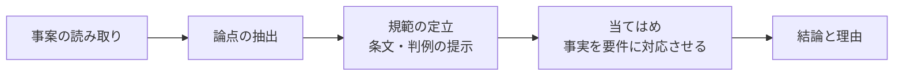
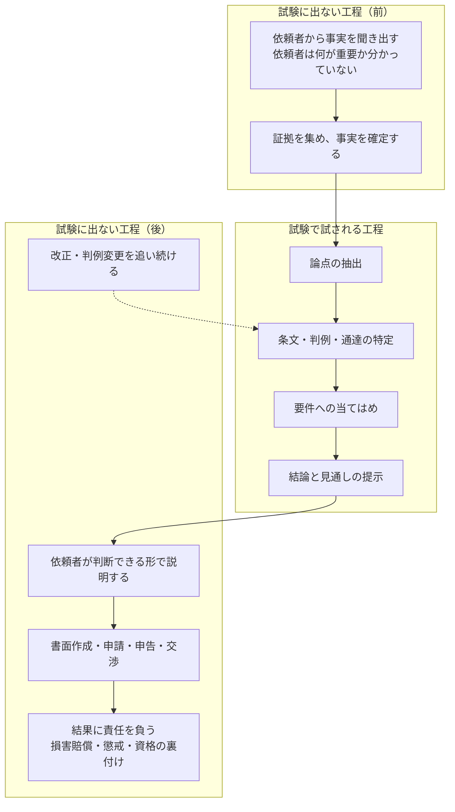
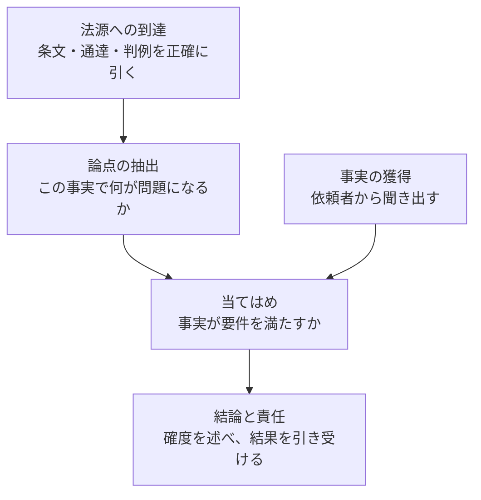
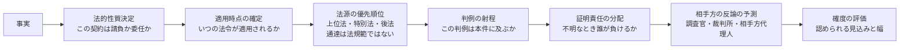
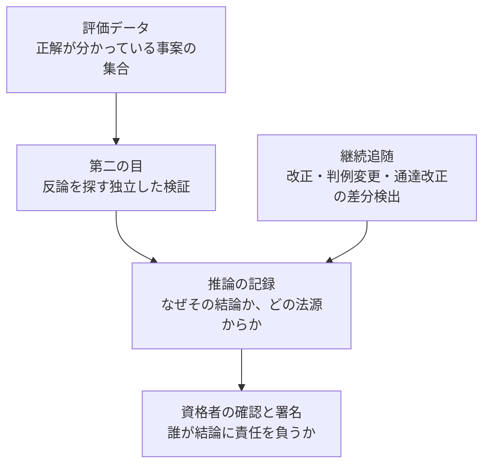
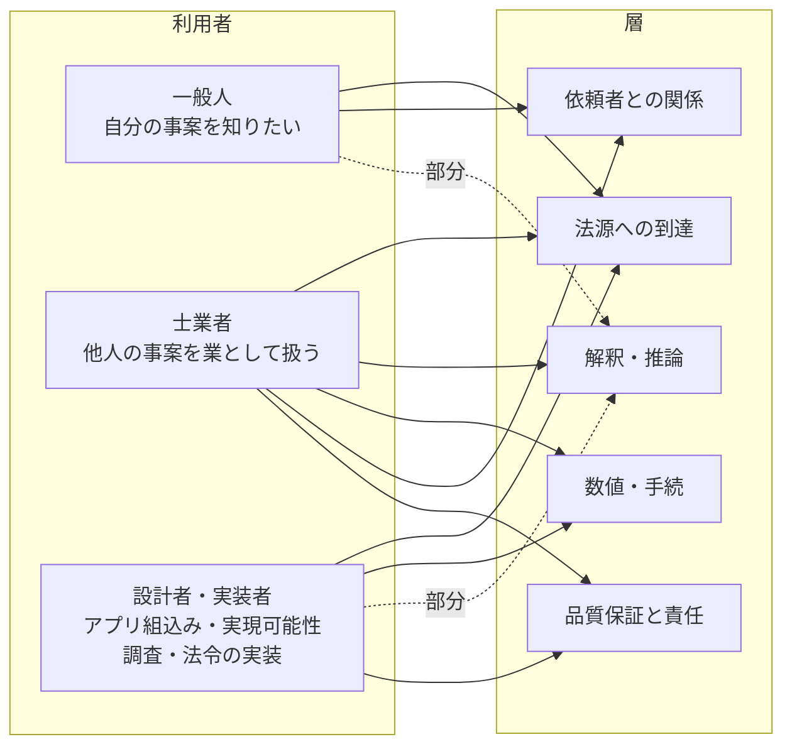
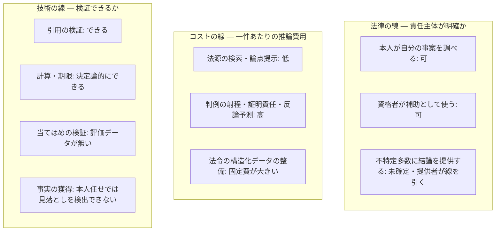

# できることとできないこと — 法律の専門家の工程から引き直す（Discussion #36、2026-09-29 JST）

出典: https://github.com/shuji-bonji/houki-hub/discussions/36

`docs/notes/2026-08-25-scope-and-professional-use.md` は「知る権利」と業法の線から射程を決めた。本ファイルは別の方向から同じ線を引く。**法律の専門家が学び、試験で試され、実務で行うことを工程に分け、そのうち法規シリーズがどこを担うか**を書く。結果は 08-25 の線と一致するが、「なぜ結論を返さないのか」を利用者に説明する材料が増える。

戦略（この整理の上で何をするか）はここには書かない。厚労省の MCP・判決事例・RAG が済んだ時点で、可能性があれば別に練る（ユーザー判断、2026-09-29）。今は公開上の「できること・できないこと」の整理まで。

## 1. 専門家の工程

### 学ぶこと

| 領域 | 内容 | 例 |
|---|---|---|
| 法源の知識 | 条文・政令・省令・通達・判例・裁決の所在と階層 | 民法 709 条、所得税基本通達、最高裁判例 |
| 解釈の方法 | 文理・論理・目的・体系解釈、類推と反対解釈 | 「正当な理由」をどう読むか |
| 要件事実論 | 法律効果を得るために、どの事実を誰が主張・立証するか | 貸金返還請求の「交付」「返還の合意」「弁済期」 |
| 事実認定 | 証拠から事実を認定する方法、供述の信用性 | 契約書と証言が食い違うとき |
| 手続法 | 訴訟・審査請求・登記申請・申告の手順と期限 | 民事訴訟法、国税通則法、不動産登記法 |
| 職業倫理と責任 | 守秘義務、利益相反、依頼者への説明義務 | 弁護士職務基本規程、税理士法 |

MCP が直接扱えるのは 1 行目だけ。2 行目以降は知識ではなく技能で、資料を渡しても身に付かない。

### 試験で試されること

| 資格 | 知識を試す部分 | 技能を試す部分 |
|---|---|---|
| 司法試験 | 短答式 | 論文式（事案 → 論点 → 規範 → 当てはめ → 結論）。修習後の二回試験で起案 |
| 税理士試験 | 税法の理論問題 | 計算問題（取引から課税所得・税額を算出） |
| 司法書士試験 | 択一式 | 記述式（事案から登記申請書を作成） |
| 社会保険労務士試験 | 択一式・選択式 | 適用要件の当てはめ。毎年の改正追随が前提 |
| 行政書士試験 | 法令等・一般知識 | 記述式（民法・行政法の事例） |

C（規範の定立）は条文と判例を正確に引けるかで、RAG が最も近づける段階。配点が大きいのは B と D。「知っているか」に相当する短答式は RAG で人と同程度に到達できるが、論文式・記述式に相当する部分が資格の守っている中身。

### 実務で行うこと

- 事実の獲得（F1・F2）: 依頼者は何を言えば法律上意味があるか知らない。専門家が質問を組み立てて引き出す。この工程が無ければ当てはめの入力が揃わない
- 当てはめと見通し（M3・M4）: 「この事実なら 709 条の過失が認められる可能性が高い」という確度の評価。条文を出すことと確度を述べることは別の行為
- 責任（B3）: 結論を述べた者が誤りの結果を引き受ける。弁護士法 72 条・税理士法 52 条・社労士法 27 条は、この引受け手を資格で限定する仕組み

## 2. 層に分けたときの法規シリーズの位置

| 層 | 担い手 | 法規シリーズの現状 |
|---|---|---|
| 法源への到達 | MCP（houki-egov / houki-nta） | 対象。`verify_citations`・`next_actions` でここを固めている |
| 論点の抽出 | LLM + Skill | houki-research の「法律本文 → 政令・省令 → 通達 → 改正履歴」の順路が見落としを減らす補助 |
| 当てはめ | LLM（限定的） | 一般論としての当てはめは可能。確度の評価は資格者の判断に代わらない |
| 事実の獲得 | 人 | 対象外。「私の場合はどうなるか」に条文と論点までを返し結論を返さない方針は、この層に踏み込まないため |
| 結論と責任 | 資格者 | 対象外。独占業務を想定外とする前提と一致 |

含意: 法源への到達は必要条件であって十分条件ではない。「条文と論点までを返し、結論は返さない」は能力の限界を隠すためではなく、人が担う二層（事実の獲得・結論と責任）を明示的に残すため。

## 3. 士業を支援するエージェントに足りないもの

上の五層は工程順の整理で、工程の間で使う技能と工程の外の基盤が抜けている。五つの群に分ける。

### 3.1 法源層にまだ無いもの

| 法源 | 実務での役割 | 現状 |
|---|---|---|
| 判例・裁決 | 条文の読み方を確定する。国税不服審判所の裁決、労働審判・裁判例 | 未対応 |
| 立法資料 | 国会会議録・法案の趣旨説明・パブコメ回答。目的解釈の根拠 | 未対応 |
| 行政実例・先例 | 登記先例、労働局の疑義照会回答、税務署の運用 | 一部（nta の文書回答事例・質疑応答事例） |
| 時点版の法令 | 事実発生時点で有効だった条文、施行日、経過措置、附則 | `get_law_revisions` で改正履歴は引けるが「この日にどの版が適用されるか」を答える仕組みは無い |
| 学説・コンメンタール | 争いのある論点で、どの説が多数説か | 著作物のため MCP には載せられない。LLM の学習知識に依存 |

### 3.2 解釈・推論の技能

- 法的性質決定: 「業務委託」と呼ばれていても実態が雇用なら労働法が適用される。誤ると以後の条文選択が全て変わる
- 適用時点の確定: 税務は年分ごと、労務は施行日ごとに条文が変わる。経過措置の読み取りを含む
- 法源の優先順位と抵触処理: 通達と条文が食い違うとき、通達は納税者を拘束しない前提で答える
- 判例の射程: 判例の事案と本件の事実関係の違いを比べる
- 証明責任の分配: 事実が不明のまま終わることが多く、誰が不利益を負うかで結論が決まる
- 相手方の視点: 自分の主張の弱点を先に見つける
- 法の欠缺への対処: 前例の無い問題で、類推や立法趣旨から推論する

### 3.3 数値と手続

| 技能 | 内容 | 実装の性質 |
|---|---|---|
| 計算 | 税額、損害額、遅延損害金、年金額 | 決定論的な計算器として MCP 化できる |
| 期限管理 | 時効、不服申立期間、申告期限、登記期限。期限を過ぎれば実体の正しさは意味を失う | 起算日の規則を持つ MCP 化できる |
| 管轄と様式 | どの機関に、どの様式で、何を添付して出すか | 様式データベースと書面生成 |
| 書面作成 | 訴状、契約書、申請書、意見書 | LLM + テンプレート |

「知っているか」ではなく「間違えないか」が問われる部分で、LLM より決定論的な実装が向く。

### 3.4 依頼者との関係

- 聞き取りの設計: 論点候補から逆算して、何を聞くべきかを組み立てる
- 目的の把握と選択肢の提示: 勝てるが費用に見合わない、申告方法を変えれば税額は減るが調査の可能性が上がる、といった比較
- 前提の確認と誤解の訂正
- 分野横断の振り分け: 一つの事実関係が税務・会社法・労働法に同時に触れる。08-25 の「相談メモ」「士業ルーティング」がここ
- 守秘義務と利益相反: 依頼者情報を外部 LLM に送ってよいか。運用の制約で、設計段階で決めないと後から直せない

### 3.5 品質保証と責任の基盤（最大の抜け）

- 推論の記録: 事実・論点・法源・当てはめ・結論を分けて出す。引用の検証（`verify_citations`）はあるが当てはめの検証は無い
- 第二の目: 3.2 の相手方の視点を品質保証として組み込む
- 評価データ: これが無いと他のどの技能が改善したか測れない。司法試験・税理士試験・司法書士試験の過去問と模範答案は正解付きの事案として使える。実務水準の評価には資格者の採点が要る
- 資格者の確認と署名: 08-25 の professional profile と資格確認 3 段階（凍結中）がここ
- 継続追随: houki-metadata の想定用途

### 3.6 一覧と担い手

| 群 | 項目 | 主な担い手 |
|---|---|---|
| 法源 | 判例・裁決、立法資料、行政実例、時点版法令 | MCP |
| 解釈 | 法的性質決定、適用時点、優先順位、判例の射程、証明責任、反論予測、確度、法の欠缺 | LLM + Skill（判断規則を Skill に書く） |
| 数値・手続 | 計算、期限、管轄・様式、書面 | 決定論的 MCP + テンプレート |
| 依頼者 | 聞き取り設計、目的把握、前提確認、分野横断、守秘・利益相反 | LLM + 運用設計 |
| 基盤 | 推論の記録、第二の目、評価データ、資格者の署名、継続追随 | 仕組み全体の設計 |

優先順位: 最初は**評価データ**（他の全てを測る手段が無いと改善の判断ができず、試験問題という正解付きの題材が既にある）。次に**適用時点の確定**と**判例・裁決**（法源層の延長として MCP で実装でき、当てはめの入力を正しくする効果が直接出る）。

## 4. 利用者別の線 — 法律・コスト・技術

### 一般人

| 観点 | できること | できないこと・境界 |
|---|---|---|
| 法律 | 自分の事案について条文・通達・判例を調べ、論点を整理する。本人が自分の事件を扱うことは独占業務の対象外 | 提供者側が「結論を出す」機能を不特定多数に提供すると、法律相談業や税務相談に当たるかが問われる。解釈が確定していないので提供者が線を引くしかない |
| コスト | 無料〜低額でなければ意味がない。法源の検索と論点の提示は推論コストが小さいので成立する | 判例の射程や証明責任まで含む深い推論は一件あたりの費用が高く、無料提供に向かない |
| 技術 | 聞き取り設計を自分向けに使い、専門家に伝えるべきことを整理して持ち込み資料を作る | 事実の獲得を本人が一人で行うため、重要な事実の見落としを検出できない。確度の評価は信頼性を担保できない |

→ 「知る・整理する・専門家に持ち込む形にする」まで。結論と確度は出さない。houki-research の現方針と一致。

### 士業者

| 観点 | できること | できないこと・境界 |
|---|---|---|
| 法律 | 全ての層を補助として使う。結論と責任は資格者が引き受けるので独占規定の問題は生じない | 依頼者情報を外部 LLM に送ることの守秘義務上の扱い。利益相反の確認。出力をそのまま依頼者に渡すと説明義務の履行にならない |
| コスト | 高精度のために高コストの推論を許容できる。事務所内の過去事案を私的 RAG にする投資も回収できる | 事務所ごとに個別に構築する部分（私的 RAG、書面テンプレート）は共通化できない |
| 技術 | 論点の見落とし防止、時点版、判例・裁決、計算、期限、書面の下書き、推論の記録、第二の目 | 当てはめの正しさを機械で検証する手段が無い。評価データが無いと補助の品質が上がったか測れない |

→ 「全工程の補助と検証」。出力の形式は「資格者が確認して署名する」前提で設計する。

### 設計者・実装者

アプリに相談機能を組み込む開発者、実現可能性調査で法的制約を調べる開発者、法令を業務システムや計算規則として実装する側（行政・自治体・給与計算や会計ソフトの開発者）の三つ。

| 観点 | できること | できないこと・境界 |
|---|---|---|
| 法律 | 仕様が法令のどこに触れるかを調べる（法的性質決定の一部）。計算・期限・様式を決定論的に実装する。改正差分を追い続ける | 個別事案の結論を製品の機能として出す。組み込んだ相談機能が結論を出すなら、提供者が法律相談業に当たるかの問題を引き受ける |
| コスト | バッチ、キャッシュ、決定論的部品で運用できる。推論コストより法令の構造化データの整備コストが支配的 | 法令の構造化（時点版、経過措置、附則）を自前で維持することは高コストで、共有基盤が無いと各社が二重に実装する |
| 技術 | 法令の構造化データ、施行日ごとの切り替え、計算器、期限の起算規則、テスト可能な実装 | 条文の曖昧な部分（「正当な理由」「相当の期間」）は決定論的に実装できず、人の判断か LLM の推論に残る。規則と判断の線引きが要る |

→ 「法令の構造化データと決定論的部品」。LLM は仕様と法令の対応付けと、規則化できない部分の補助に限る。

### 三つの線が引く場所

- 一般人向けは A1 と B1 が一致する範囲。C4 が結論を出さない理由
- 士業者向けは A2 が緩く B2 も許容されるので範囲は最も広い。C3 が品質を測る手段の不在として残る
- 設計者向けは C2 が最も強く効く範囲で、B3 が共有基盤の必要性を示す。A3 は組み込んだ機能が結論を出すかで決まる

### 法規シリーズが提供するもの

| 利用者 | 提供するもの | 提供しないもの |
|---|---|---|
| 一般人 | 法源への到達、論点の提示、専門家への持ち込み資料の整理 | 結論、確度 |
| 士業者 | 上に加えて、時点版・判例・裁決・計算・期限・推論の記録・第二の目（今後） | 結論の責任、私的 RAG |
| 設計者・実装者 | 法令の構造化データ、改正差分、決定論的部品、仕様と法令の対応付け | 個別事案の結論を出す機能 |

三者に共通して提供するのは「法源への到達」と「品質保証の基盤（引用検証・追随）」。これが共有基盤として法規シリーズが担う核。利用者ごとに違うのは、その上にどの層を積むか、責任を誰が引き受けるか。

## 5. 08-25 の整理との対応

| 08-25（知る権利の 5 段階） | 本ファイルの層 |
|---|---|
| ① 参照 ② 要約 ③ 一般的解釈 | 法源への到達、論点の抽出 |
| ④ 個別事案への当てはめ（本人は自由、他人のために業として行うと業法対象） | 当てはめ、事実の獲得 |
| ⑤ 代理・手続（資格者のみ） | 結論と責任、数値・手続 |

線の位置は同じ。本ファイルは「なぜそこに線があるか」を専門家の工程から説明し、線の外側に何が積めるか（3 節）を具体化した。

## 6. 公開への切り出し（時期を決めた、2026-09-29）

順序はユーザー判断で次のとおり。

1. 先に、仕様起こしで挙がった Issue（`docs/notes/2026-09-29-plan-spec-issues.md`、egov 29・nta 15・abbreviations 13）の対応
2. その後、仕様の説明ページ（houki-hub#27）を作るタイミングで、本ファイルを利用者向けに整理して site に載せる。実装（`specs/current/` の仕様 ID）と本ファイルの層の対応をリンクで結ぶ想定

載せるのは 2 節・4 節の表と図。`overview.md` の「いま扱える範囲と、まだ扱えない範囲」と `disclaimer.md` からリンクする。3 節（足りないもの）はロードマップの材料で、ページには載せない。
