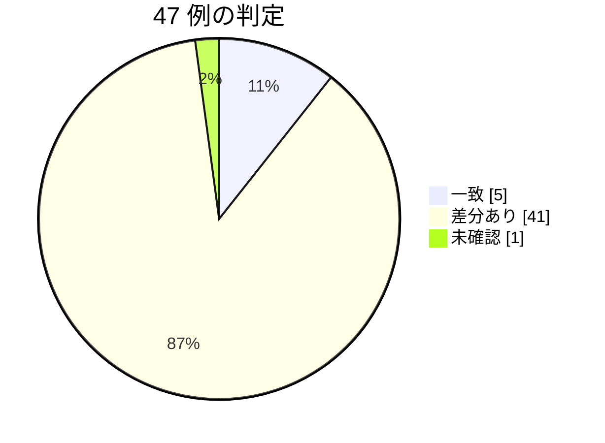

# 契約の確認 — egov 0.17.0 / nta 0.23.0（2026-10-03 JST）

段階 4 の後半（T4 応答の形・T5 文書と実装の食い違い）を入れた houki-egov-mcp 0.17.0 と houki-nta-mcp 0.23.0 が publish された。計画書（`2026-09-29-plan-spec-issues.md`）の 5.2「契約の確認」に従い、reference-examples の呼び出し例 47 件を同じ引数で流し、例の主張が今も成り立つかを確かめた記録。段階 6 で例を書き直す前の基準にもなる。

結論: **劣化は 0 件。** 一致 5 件、差分あり 41 件、未確認 1 件。差分のほとんどは T4 で決めた `null` のフィールドの追加と、DB の取り込みからの経過日数による `staleness` の変化。例の本文の文が古くなったものが 3 件ある（末尾の「見つかったこと」）。

## やり方

- 対象: `scripts/reference-examples/{houki-egov,houki-nta}/ja/*.md` の呼び出し例。egov 24 件、nta 23 件
- 実行: Claude Desktop の plugin（houki-egov-mcp 0.17.0 / houki-nta-mcp 0.23.0）を、例と同じ引数で 1 回ずつ呼んだ。2026-10-03 08:40 頃（JST、+09:00）
- 比べ方: 本文の一字一句ではなく、例が述べている「形」と「主張」（件数、ID、順、code、next_actions の action など）を比べた
- ローカル DB: egov は 2026-09-19 同期。nta は 2026-09-07〜09-24 取り込み（文書の種別ごとに違う）

判定の意味（2026-09-21 の回と同じ）: 「一致」は例の主張がすべて成り立った。「差分あり」は形か値が変わったが主張は成り立つ（フィールドの追加、DB の取り込み日による値の変化、文言だけの差、仕様で決めた変更）。「劣化」は例の主張が成り立たなくなったもの。「未確認」は条件を再現できず流していないもの。

## 1. houki-egov-mcp 0.17.0

| ツール | 例の見出し | 例の実測版 | 判定 | 差分の中身 |
| --- | --- | --- | --- | --- |
| explain_law_type | 「通達は守らなくてよいのか」 | v0.5.3 | 差分あり | `see_also` が `docs/LAW-HIERARCHY.md` から GitHub の URL（`https://github.com/shuji-bonji/houki-egov-mcp/blob/main/docs/LAW-HIERARCHY.md`）になった（T5、SPEC-EGOV-EXPLAIN-LAW-TYPE-020）。`info` の全フィールド・`related_tools` は同一 |
| get_article_references | 「所得税法 57 条の 2 第 2 項が引いている法令」 | v0.10.0 | 差分あり | `meta.at: null` が増えた（T4、SPEC-EGOV-GET-ARTICLE-REFERENCES-034）。references 10 件・delegations 2 件（count 7/7、施行規則・施行令）・next_actions 7 件と各値は同一 |
| get_attachment | 「日章旗の寸法図をディスクに置く」 | v0.15.0 | 差分あり | `meta.at: null` が増えた（T4、SPEC-EGOV-GET-ATTACHMENT-014）。kind "file"、saved.bytes 12614、response_content_type "image/jpeg"、location 別記第一（第一条関係）、updated は同一。saved.path のホームは実行環境の値 |
| get_attachment | 一覧に無い `src` を渡したとき（`ATTACHMENT_NOT_FOUND`） | v0.15.0 | 一致 | error / code / hint（添付 2 件）/ next_actions[0]（list_attachments）が同一 |
| get_law | 「消費税法 57 条の 2 第 1 項の本文を JSON で」 | v0.5.3 | 差分あり | `data.item_num: null` と `meta.at: null` が増えた（T4、SPEC-EGOV-GET-LAW-024・020）。data.article_num "57_2"・paragraph_num 1・node の構造と本文は同一 |
| get_law | 「消費税法 30 条 2 項を Markdown で」（号と、号の下のイ・ロ） | v0.5.4 | 差分あり | `meta.at: null` が増えた（T4）。markdown（号は「一」「二」、イ・ロは `- イ …` の箇条書き、末尾の出典・URL・取得日時の行、`時点:` の行は無し）は同一 |
| get_law | 「所得税法 89 条 1 項を Markdown で」（項の直下の表） | v0.5.4 | 差分あり | `meta.at: null` が増えた（T4）。見出し行が空の Markdown 表 7 行と本文、meta.law_num「昭和四十年法律第三十三号」は同一 |
| get_law | 枝番号の号（消費税法 2 条 1 項 8 号の 2） | v0.6.0 | 差分あり | `meta.at: null` が増えた（T4）。見出し「第2条第1項第8号の2」と本文「八の二 特定資産の譲渡等　…」は同一 |
| get_law | 存在しない条を指定したとき（`ARTICLE_NOT_FOUND`） | v0.5.3 | 一致 | error / code / hint / next_actions[0]（get_toc、example {law_name: 消費税法}）が同一 |
| get_law_file | 「民法の全文を Word で」（URL だけ） | v0.15.0 | 差分あり | `meta.at: null` が増えた（T4、SPEC-EGOV-GET-LAW-FILE-001）。content_type・url・note は同一で、saved は無い |
| get_law_file | 「2020 年 4 月 1 日時点の国旗国歌法を HTML で保存」 | v0.15.0 | 差分あり（例の文が古い） | 応答は例と同一（url に `?asof=2020-04-01`、saved.bytes 38537、file_name と law_revision_id `411AC0000000127_19990813_000000000000000`、meta.at "2020-04-01"）。例の後の文「1 ファイル 50 MB を超えるときは保存せず `INVALID_ARGUMENT` を返します」は 0.16.0（T2）から `FILE_TOO_LARGE` で、文が古い |
| get_law_range | 「民法の契約の章をまとめて読みたい」 | v0.14.0 | 差分あり | `meta.at: null` が増えた（T4）。range.body_chars は例 29911 → 現行 29919（2026-09-21 の回と同じ。e-Gov の本文の更新）。article_count 198、returned_count 186、truncated true、first 第521条、last 第684条、next_from_article "685"、next_actions[0].example は同一（`max_chars` を渡していないので example に入らない。SPEC-EGOV-GET-LAW-RANGE-008 のとおり） |
| get_law_range | 「遺留分の章だけ読みたい」（`path` で指定） | v0.14.0 | 差分あり | `meta.at: null` が増えた（T4）。article_count 8、body_chars 2284、第1044条に caption 無し、truncated false、note は同一 |
| get_law_range | 「章だけ指定したら候補が返ってきた」 | v0.14.0 | 一致 | INVALID_ARGUMENT、hint に 5 パス、next_actions 5 件（見出し付き）が同一 |
| get_law_range | 「附則の 7 本目を読む」 | v0.14.0 | 差分あり | `meta.at: null` が増えた（T4）。article_count 0、body_chars 21、articles []、note は同一 |
| get_law_revisions | 「消費税法の直近の改正と施行日」 | v0.5.3 | 差分あり | `meta.at: null` が増えた（T4、SPEC-EGOV-GET-LAW-REVISIONS-002）。total 65、2 件の law_revision_id・日付・status "UnEnforced" は同一（ツールの並べ替え（016）の後も同じ 2 件） |
| get_related_laws | 「所得税法の施行令と施行規則」 | v0.10.0 | 差分あり | `meta.at: null` が増えた（T4。at を受け取らないツールでも常に null。SPEC-EGOV-GET-RELATED-LAWS-010）。related 2 件（abbr 所令 / 所規）、not_found []、method "law_name_rule"、next_actions 2 件は同一 |
| get_toc | 「民法の大区分だけ見たい」 | v0.14.0 | 差分あり | `meta.at: null` が増えた（T4、SPEC-EGOV-GET-TOC-015）。toc 5 件（path Part1〜Part5）、suppl.count 67 / article_count 201、node_count 5、truncated true、附則(1) paragraph_only true、附則(3) extract true は同一 |
| list_attachments | 「国旗国歌法の日章旗の寸法図はどこにあるか」 | v0.15.0 | 差分あり | `meta.at: null` が増えた（T4、SPEC-EGOV-LIST-ATTACHMENTS-015）。count 2、location 別記第一 / 別記第二、zip_url、next_actions 1 件は同一 |
| list_attachments | 「戸籍法施行規則の様式（届書の書式）を一覧で」 | v0.15.0 | 差分あり | `meta.at: null` が増えた（T4）。`2FH00000076885.pdf`（附録第十一号様式）の updated は例 "…10:10:24+09:00" → 現行 "…10:10:26+09:00"（2026-09-21 の回と同じ）。count 42・jpg 7・pdf 35・law_revision_id・next_actions 2 件は同一 |
| resolve_abbreviation | 「消基通 は何の略で、どのサーバーが担当か」 | v0.5.3 | 差分あり | `in_scope: false` と `hint` が付いた（0.16.0 の T3）。`resolved.aliases` が無い（houki-abbreviations 0.7.0 で `formal` と同じ値を外した）。`law_id` null・`source_mcp_hint` "houki-nta" は同じ |
| search_fulltext | 「民法で不法行為に関係する条は」 | v0.5.3 | 差分あり | freshness は last_sync_date "2026-09-19"・days_since_sync 13 で staleness が "stale"（例は "fresh"）。score が少し変わった（0.705 / 0.690 / 0.682）。source "bulk"、count 3、ヒット順 724 / 724の2 / 719 は同一 |
| search_law | 「個情法の正式名と法令番号を知りたい」 | v0.5.3 | 一致 | query.resolved「個人情報の保護に関する法律」、total_count 3、1・2 件目が同一 |
| verify_citations | 「書こうとしている引用 5 件をまとめて確かめる」 | v0.14.0 | 差分あり | summary（3/1/1）と各件の status・code・reason は同じ。meta.at: null が付いた。民法の件に resolved_by: abbreviation、ambiguous の件に law と resolved_by が付いている（例は抜粋で省いた可能性あり） |

劣化: なし。`meta` を持つツールの例 16 件で `meta.at: null` が増えた（T4。`at` を渡さないときも常に置く）。それ以外の差分は、`explain_law_type` の `see_also`（T5）、`resolve_abbreviation` の `in_scope` / `hint`（0.16.0 の T3）と `aliases` の削除（houki-abbreviations 0.7.0）、`search_fulltext` の同期日と score、`get_law_range` の `body_chars`、`list_attachments` の `updated`（後の 3 つはデータ側の変化で、2026-09-21 の回と同じ値）。

## 2. houki-nta-mcp 0.23.0

| ツール | 例の見出し | 例の実測版 | 判定 | 差分の中身 |
| --- | --- | --- | --- | --- |
| nta_get_bunshokaitou | 「産科医療特別給付事業の給付金は非課税か」（本庁系） | v0.10.4 | 差分あり | document の各値・fetchedAt・legal_status は同じ。fullText は「以上」で終わり、2026-09-21 の回に見つけたページ内リンクの文言（「←上記照会の内容に対する回答はこちら」）は無くなった。document.orphanedAt と、上の段の index_status / orphaned_at / notice が null で付いた（T4） |
| nta_get_bunshokaitou | 国税局系（`tokyo/shohi/251017`） | v0.10.4 | 差分あり | 本庁系の例と同じく、索引の印の null が付いた。本文・issuer・関係する法令条項等の行は同じ |
| nta_get_jimu_unei | 「酒税の書面添付制度の事務運営指針」（検索結果の 2 件目） | v0.10.4 | 差分あり | attachedPdfs[] に kind（attachment）が付いた。索引の印の null が付いた。legal_status.note が「通達・事務運営指針は行政内部文書であり、…」に変わった（T5 の予定の変更）。fetchedAt が 2026-09-12 に変わった（DB の再取得） |
| nta_get_kaisei_tsutatsu | 「令和 7 年 4 月 1 日の消基通改正の本文と添付 PDF」 | v0.10.4 | 差分あり | attachedPdfs[] に kind（3 件とも comparison）が付いた。索引の印の null が付いた。そのほかは同じ |
| nta_get_kaisei_tsutatsu | 「docId を打ち間違えたとき」 | v0.14.1 | 差分あり | code が TSUTATSU_NOT_FOUND から DOC_NOT_FOUND に変わった（SPEC-NTA-GET-KAISEI-TSUTATSU-001・002 による予定の変更。例の本文が古い）。error の文・available_doc_ids（30 件）・next_actions・tool は同じ形。hint に再投入の案内の文が増えた。DB は 118 件のまま |
| nta_get_qa | 「消費税の質疑応答事例 02/19 の照会と回答、関係法令通達」 | v0.17.0 | 差分あり | qa の各値・fetchedAt・related_laws・related_tsutatsu・next_actions は同じ。索引の印の null（index_status / orphaned_at / notice）が付いた（T4） |
| nta_get_qa | 枝番号の号を挙げている事例（法人税 33/02） | v0.14.0 | 差分あり | related_laws 3 件（item "12の8" を含む）と next_actions 3 件は同じ。索引の印の null が付いた |
| nta_get_tax_answer | 「No.6101 消費税の基本的なしくみ」 | v0.17.0 | 差分あり | sections の見出し 7 つ・effectiveDate・fetchedAt は同じ。taxAnswer.basisDate（2025-04-01）と索引の印の null が付いた（T4） |
| nta_get_tsutatsu | 「消基通 1-7-2（登録番号の構成）の本文」 | v0.21.0 | 一致 | clause・paragraphs 3 件・fetchedAt・base_laws・next_actions とも同じ |
| nta_inspect_pdf_meta | 「改正通達 0025004-026 の PDF は、どれをどう読めばよいか」 | v0.20.0 | 差分あり | attachedPdfs 3 件の kind・read_strategy・layout_note、next_actions 2 件は同じ。索引の印の null（index_status / orphaned_at / notice）が付いた（T4。SPEC で inspect にも付けると決めたもの） |
| nta_inspect_pdf_meta | 「新旧対照表だけを保存して、表として取る」 | v0.20.0 | 差分あり | saved 3 件の bytes と cached: true は同じ（path は例では ~ に置き換えて載せている）。索引の印の null が付いた |
| nta_search_bunshokaitou | 「産科医療の給付金に関する文書回答事例」 | v0.10.4 | 差分あり | 2 件の docId・順・issuedAt は同じ。results[] に basisDate / index_status / orphaned_at の null が付いた（T4）。snippet の切り出し位置と score が少し変わった（0.519→0.518、0.492→0.489）。freshness は fetchedAt が同じまま staleness が stale（24 日） |
| nta_search_bunshokaitou | 別紙の本文にしかない語で引く | v0.10.4 | 差分あり | 1 件・docId・score（0.537→0.536）は同じ。results[] に null 3 つが付いた。staleness が stale |
| nta_search_bunshokaitou | 税目の別表記をまとめて検索する（`taxonomy: "sozoku"`） | v0.14.0 | 差分あり | 3 件の docId・taxonomy（souzoku/souzoku/sozoku）・順と search_notes の文は同じ。results[] に null 3 つが付いた。staleness が stale |
| nta_search_jimu_unei | 「書面添付制度の事務運営指針」 | v0.10.4 | 差分あり | 2 件の docId・順は同じ。results[] に null 3 つが付いた。staleness が stale（20 日。DB は 09-12 に再取得）。legal_status.note は「通達は行政内部文書。…」のまま（0.23.0 で変えたのは nta_get_jimu_unei の json だけ） |
| nta_search_kaisei_tsutatsu | 「インボイス関係の改正通達を新旧対照表付きで」 | v0.10.4 | 差分あり | 2 件の docId（0025004-026 / 191001）・順・score・scoreReasons（略称展開）は同じ。results[] に null 3 つが付いた。search_notes（略称展開の説明）が増えた（例には無い）。staleness が stale |
| nta_search_qa | 「テレワークに関係する質疑応答事例」 | v0.10.4 | 差分あり | 1 件（hojin/04/16）は同じ。results[] に issuedAt / basisDate / index_status / orphaned_at の null が付いた（T4）。score 0.334→0.341、freshness の取得日が DB の再投入で変わり stale |
| nta_search_qa | 税目（topic）で絞る | v0.13.0 | 差分あり | 1 件（shohi/21/10）・score は同じ。results[] に null 4 つが付いた。staleness が stale |
| nta_search_qa | キーワードに合う文書が無いとき | v0.13.0 | 差分あり | results []・hint の文（1,841 件）は同じ。freshness が stale |
| nta_search_tax_answer | 「医療費控除のタックスアンサー」 | v0.10.4 | 差分あり | 2 件（1131 / 1127）・順は同じ。results[] に issuedAt: null と basisDate: "2025-04-01"、索引の印の null が付いた。next_actions（nta_get_tax_answer、no 1131）が増えた（T5、SPEC-NTA-SEARCH-TAX-ANSWER-006）。staleness が stale |
| nta_search_tsutatsu | 「軽減税率に関係する通達の節は」 | v0.11.1 | 差分あり | count 2・hits 2 件（5-9-10 / 5-9-5）・score・base_laws_by_tsutatsu・next_actions は同じ。snippet が長くなった。staleness が stale（25 日） |
| nta_search_tsutatsu | DB が古いとき（`staleness: "outdated"`） | v0.10.2 | 未確認 | 126 日たった DB を用意できないため流していない。warning の文の形は 44 と同じ経路 |
| resolve_abbreviation | 「電帳法 は houki-nta-mcp で引けるか」 | v0.10.4 | 差分あり | resolved・in_scope: false・hint は同じ。next_actions（delegate_to_mcp、mcp houki-egov）が増えた（T5） |

劣化: なし。取得ツールでは索引の印（`index_status` / `orphaned_at` / `notice`）が `null` で付き、検索ツールの `results[]` では `issuedAt` / `basisDate` と索引の印が `null`（タックスアンサーの `basisDate` は日付）で付いた（どれも T4）。T5 で足した `next_actions`（`nta_search_tax_answer` → `nta_get_tax_answer`、`resolve_abbreviation` → `delegate_to_mcp`）と、`nta_get_jimu_unei` の json の `legal_status.note` の文も予定どおり返った。`staleness` は、DB の取り込みから 20〜25 日たったため、すべて `fresh` から `stale` に変わった。

## 見つかったこと

1. **例の本文の文が古くなったもの（段階 6 で直す）**
   - egov `get_law_file`「2020 年 4 月 1 日時点の国旗国歌法を HTML で保存」: 例の後の文「1 ファイル 50 MB を超えるときは保存せず `INVALID_ARGUMENT` を返します」。0.16.0 から `code` は `FILE_TOO_LARGE`
   - nta `nta_get_kaisei_tsutatsu`「docId を打ち間違えたとき」: 例の JSON の `code: "TSUTATSU_NOT_FOUND"`。0.22.0 から `DOC_NOT_FOUND`（SPEC-NTA-GET-KAISEI-TSUTATSU-001・002）。例の後の文「`nta_get_jimu_unei` と `nta_get_bunshokaitou` も同じ形で返します」は、3 つとも `DOC_NOT_FOUND` になったので今のほうが正しい
   - egov `resolve_abbreviation`「消基通 は何の略で…」: 例の JSON の `resolved.aliases` は今は返らない（houki-abbreviations 0.7.0 で `formal` と同じ値を外した）。`in_scope: false` と `hint` も例に無い
2. **T4・T5 で増えたフィールドが例に無い（段階 6 でまとめて書き足す）**: egov 16 件の `meta.at: null`、`get_law` の `data.item_num: null`。nta の取得 9 件の索引の印、検索 8 件の `issuedAt` / `basisDate` と索引の印、`nta_search_tax_answer` と `resolve_abbreviation` の `next_actions`、`attachedPdfs[].kind`。例を書き直すときは 0.17.0 / 0.23.0 で取り直した応答に差し替えるのが早い
3. **`legal_status.note` の文が取得と検索で違う（nta、小さな食い違い）**: 0.23.0 で `nta_get_jimu_unei` の json は「通達・事務運営指針は行政内部文書であり、…」になったが、`nta_search_jimu_unei` の `legal_status.note` は「通達は行政内部文書。…」のまま。T5 の proposal.md の対象は `nta_get_jimu_unei` だけだったので仕様どおりで、劣化ではない。揃えるかどうかは段階 5 以降の Issue の種
4. **2026-09-21 の回の Issue の種が片付いていた**: `nta_get_bunshokaitou`（`shotoku/250416`）の `fullText` の末尾に混ざっていたページ内リンクの文言「←上記照会の内容に対する回答はこちら」は、今回は無く「以上」で終わった
5. **DB の鮮度**: egov の全文検索は同期から 13 日、nta は 20〜25 日で、すべて `stale`。例は `fresh` のときの値なので、段階 6 で例を取り直す前に `--bulk-download-everything`（nta）と同期（egov）をやり直すと、`staleness` の差分が消える
6. 未確認 1 件（nta `nta_search_tsutatsu` の「DB が古いとき」）は、126 日たった DB を用意できないため前回と同じく流していない

## 5.2 の条件との関係

計画書 5.2 は「劣化 0 件」を publish の条件にしている。今回は publish の後に流したが、劣化は 0 件なので、egov 0.17.0 / nta 0.23.0 はこの条件を満たしている。段階 5（#87 ほか）の publish の前にも同じ 47 件を流す。

実行環境: Claude Desktop の plugin（houki-egov-mcp 0.17.0 / houki-nta-mcp 0.23.0）。呼び出しは 1 件ずつ手で行い、判定の作業表は残していない（この文書の表がすべて）。
