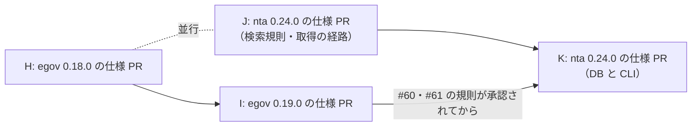

# 段階 5 の仕様 PR の指示（egov 0.18.0・0.19.0 / nta 0.24.0）

2026-10-03（JST）に作った、段階 5 の仕様 PR を別の会話で書くための指示です。段階 4 は egov 0.17.0 / nta 0.23.0 の publish と契約の確認（劣化 0 件、`2026-10-03-regression-check-egov-0.17.0-nta-0.23.0.md`）で終わりました。段階 5 も段階 4 と同じく、仕様 PR（Spec Steward）を先に書いて承認・マージし、その後で実装 PR の指示を別に作ります。この文書は仕様 PR の分だけです。

起点の main（2026-10-03 に origin と一致を確認）: egov `b5a138a`、nta `9ae81aa`。

2026-10-03 追記: H・I の仕様 PR はマージ済み（egov PR #95・#96・#100、途中で足した #99（#97・#98）・#103（#101・#102）。egov main `3bef281`）。J・K の指示に、egov で決まった規則（#55 の domain を外す、#87 の code、#60・#61・#102）を読む手順と、それに合わせた勧める案を足した。

## 4 つの会話と順序

| 指示 | リポジトリ | 版 | Issue | 仕様 PR のブランチ（案） |
| --- | --- | --- | --- | --- |
| H | houki-egov-mcp | 0.18.0 | #45・#51・#63・#87（法令の引き当て）、#55・#67・#88・#62・#72（検索・解説・添付） | `spec/<日付>-law-resolution` → `spec/<日付>-search-explain-attachment` |
| I | houki-egov-mcp | 0.19.0 | #58・#59・#60・#61・#71（DB と CLI） | `spec/<日付>-db-cli` |
| J | houki-nta-mcp | 0.24.0 | #123（文書だけ）、#80・#81・#72（検索規則）、#120・#128（国税庁サイトの経路）、#131（`legal_status.note`） | `spec/<日付>-specs-current-catchup` → `spec/<日付>-search-rules` → `spec/<日付>-source-paths` |
| K | houki-nta-mcp | 0.24.0 | #106・#107・#109・#110・#111・#112（DB と CLI） | `spec/<日付>-db-cli` |



- H と J は別リポジトリなので並行してよい
- I は H と同じ作業ツリー（egov のチェックアウト）を使うので、H のコミットが終わってから始める。I が触る spec.md（`db_schema`・`cli_*`）は H と重ならない見込みなので、I のブランチは main から切る。重なったら H の上に積む
- K は I の仕様 PR が承認されてから始める。計画書の段階 5 の表で、nta #106 は egov #61 と、nta #107 は egov #60 と同じ規則にすると決めているため
- 段階 5 に入れないもの: nta #116（基本通達の範囲を広げるか）は、まず範囲を検討する Issue なので段階 5 の外に置く

計画書 7 章の版の予定から変わった点: egov 0.18.0 に #88 を、nta 0.24.0 に #123・#128・#131 を足しました。#88・#123・#128・#131 は計画書を作った後（2026-09-30〜10-03）に立った Issue です。

---

## 指示 H: houki-egov-mcp 0.18.0 の仕様 PR

```text
houki-egov-mcp の段階 5（0.18.0）の仕様 PR を書いてください。この会話の役は Spec Steward です（AGENTS.md の「役割」）。実装・テストは書きません。

## 場所

- リポジトリ: /Users/bonji/workspace/shuji-bonji/houki-hub/mcp/houki-egov-mcp（Cowork の device_bash では $HOME/mnt/houki-hub/mcp/houki-egov-mcp）
- 起点: main の b5a138a。作業の前に git fetch https://github.com/shuji-bonji/houki-egov-mcp.git main で origin と同じか確かめる
- ブランチ（2 本を積む）:
  1. spec/<作業日の yyyymmdd>-law-resolution — #45・#51・#63・#87（法令・条の引き当て）
  2. spec/<作業日の yyyymmdd>-search-explain-attachment — #55・#67・#88・#62・#72（1 の上に積む）
  2 本が同じ spec.md（search_law・common_errors など）を触らないなら 2 本目を main から切ってよい。触るなら積む。どちらにしたかを報告する

## 最初に読むもの（この順）

1. AGENTS.md と CONTRIBUTING.md（仕様 PR の範囲、仕様 ID、承認日の決まり）
2. houki-hub の docs/DECISIONS.md（T1〜T5 の規則。とくに T2 の「SOURCE_* は通信の失敗、*_NOT_FOUND は検索が成功して 0 件」）
3. houki-hub の docs/notes/2026-09-29-plan-spec-issues.md の「段階 5」の表（勧める案）と 8 章
4. 各 Issue の本文とコメント（gh が無ければ curl https://api.github.com/repos/shuji-bonji/houki-egov-mcp/issues/<N> と /comments。認証なしは 1 時間 60 回まで）
5. 関係する specs/current/<dir>/spec.md と、手本として specs/releases/v0.17.0/ の proposal.md

## Issue ごとの出発点（勧める案。proposal.md の「人が判断すること」に書いて承認を受ける）

- #45 完全一致しない法令名: 1 件目の法令を黙って使わない。完全一致が無いときは条文を返さず、候補の一覧を LAW_NOT_FOUND の hint（と next_actions）に入れる案。T2 の「検索が成功して 0 件」の規則に合わせる。略称辞書で正式名に直せたものは完全一致として扱う
- #51 本則と附則: get_law / verify_citations の条番号は本則だけを探し、附則の条は suppl_index（get_law_range・get_toc で使っている指定）で指す案。今まで附則の条を返していた呼び出しが ARTICLE_NOT_FOUND になる場面を proposal.md に例で書く
- #63 名前の形からの推定: 確かでないときは target_law を付けない（null）案。推定で実在しない法令を指していた実例を Issue から写す
- #87 law_id が決まった後の e-Gov の 400・404: get_law 系（SOURCE_API_ERROR）と verify_citations（LAW_NOT_FOUND）のどちらに揃えるか。#47 から移した 3 つ（その時点に法令が無い at、verify_citations で at を法令名の検索に使うか、verify_citations の未決 2）もここで扱う（#87 のコメント 2026-10-03 を参照）
- #55 search_law の domain: domain を外す案（search_fulltext と揃える）。total_count を総数にするか、名前を変えずに意味を書くか。0 件のときの next_actions
- #67 search_fulltext の通称の展開: nta #21（0 件のときだけ通称を展開する）と同じ規則にする案。2 文字の語の例が常に民法を添える件も
- #88 search_fulltext の管轄外の略称: Issue の「決めること」1〜3。勧める案は A（keyword 全体が管轄外の略称なら、DB の有無によらず search_law の SPEC-EGOV-SEARCH-LAW-015 と同じ OUT_OF_SCOPE を外側で返す）。一部に含まれるだけのときは今のまま
- #62 explain_law_type の「通知」と種別コード: 「通知」を独立の種別として書くなど、計画書 5.4 の「動きを変えない決定」で閉じられるかを先に判断する
- #72 附則の別表・様式の図の location: 附則の中の別表・様式の見出しを location に入れる案

## 守ること

- specs/changes/<yyyymmdd-slug>/ の下だけを書く（proposal.md と specs/<dir>/spec.md）。specs/current/ は触らない
- 新しい仕様 ID は npx spec-ids next <dir> で取る。2 本のブランチで同じ dir に足すときは、1 本目の番号の続きを取る（積んだ場合）
- proposal.md の「- 承認日:」は空欄で残す（承認日は私がマージの前に書く。pr-scope は空欄で止まるが、それは想定どおり）
- proposal.md には、Issue ごとの「今の動き」「変えた後の動き」「変わる仕様 ID（ADDED / MODIFIED / REMOVED）」「人が判断すること」「取り込みのとき（Publisher）」を書く。決めきれない点は案を並べ、勧める案を 1 つ書く
- 動きを変えない行（文書だけを直す行）は仕様 ID を作らず、proposal.md の「実装 PR で直す文書」の表に置く（T5 の決め方）
- 応答のフィールドを消す・名前を付け替える変更は作らない（T4）。code を置き換えるなら、CHANGELOG の「互換性」の節に書く旨を proposal.md に書く（T2 の互換の扱い）
- 仕様の文は実際の値・フィールド名・code で書く（比喩を使わない）。実データで確かめた値は、確かめた日と呼び出しを添える。確かめていない値は「確かめていない」と書く
- コミットを作るところまで。署名・push・PR の作成・マージは私が行う
- Cowork の VM（device_bash）で作業する場合: git を使う前に houki-hub フォルダーの削除許可を取る（接続し直すと許可が消える）。VM の git には user.name が無いので GIT_AUTHOR_NAME="shuji narumi" GIT_AUTHOR_EMAIL="71716610+shuji-bonji@users.noreply.github.com"（COMMITTER も同じ）を渡す。git fetch の後に .git/objects/maintenance.lock が残ったら消す。npm install・npm rebuild はしない（node_modules は Mac と共有）。npx spec-ids は既存の node_modules で動く

## 終わったら報告すること

- ブランチ名・コミットのハッシュと件名・積み方（main から切ったか、積んだか）
- 差分ごとの ADDED / MODIFIED / REMOVED の数と、触った dir の一覧
- npx spec-ids check の結果と、BASE_REF=main HEAD_REF=<ブランチ> node .github/scripts/check-pr-scope.mjs の結果（承認日の空欄以外の指摘が無いこと）
- 「人が判断すること」の一覧（Issue ごと、勧める案つき）
- 実データで確かめた値と、確かめていない点
- PR 本文の草案（Refs #N。Closes は実装 PR で書くので仕様 PR には書かない。末尾に 🤖 Generated with [Claude Code](https://claude.com/claude-code)）
- 実装 PR で入れる 0.18.0 の CHANGELOG の「互換性」の候補
```

---

## 指示 I: houki-egov-mcp 0.19.0 の仕様 PR

H のコミットが終わってから、新しい会話に貼ります。

```text
houki-egov-mcp の段階 5（0.19.0、DB と CLI）の仕様 PR を書いてください。この会話の役は Spec Steward です。実装・テストは書きません。

## 場所

- リポジトリ: /Users/bonji/workspace/shuji-bonji/houki-hub/mcp/houki-egov-mcp（device_bash では $HOME/mnt/houki-hub/mcp/houki-egov-mcp）
- 起点: main（H の仕様 PR がマージ済みならその後の main）。git fetch で origin と同じか確かめる。作業ツリーに H のブランチが残っていれば、git status が空であることを確かめてから main に切り替える
- ブランチ: spec/<作業日の yyyymmdd>-db-cli
- 対象 Issue: #58・#59・#60・#61・#71

## 最初に読むもの

1. AGENTS.md・CONTRIBUTING.md
2. houki-hub の docs/DECISIONS.md と docs/notes/2026-09-29-plan-spec-issues.md の「段階 5」の表・5.1 の「DB のスキーマの版を上げる」の行
3. 各 Issue の本文とコメント
4. specs/current/db_schema・cli_entry・cli_bulk_download・cli_sync・cli_status の spec.md

## 決まっていること（計画書）

- スキーマの版を上げるのは #59（公布日を NULL にできるようにする）・#60（sync_state.schema_version 列を外す）・#71（laws.law_revision_id に NOT NULL）の 3 件で、0.19.0 の 1 回にまとめる。分けない
- #60 の「新しい版の DB は触らない（消さない）」を同じ版に入れる。MCP サーバーと --status が DB を作らないようにするかも #60 で決める
- #58（last_sync_date の決め方）と #61（表示と引数の検査）はスキーマを変えない
- 約 290 MB の再取り込みが要ることを、実装 PR で CHANGELOG と README に書く（proposal.md に「実装 PR で直す文書」として置く）
- この版の規則は houki-nta-mcp の #106（egov #61 と同じ）・#107（egov #60 と同じ）にそのまま写す。nta 側の会話（指示 K）がこの proposal.md を読むので、規則は egov 固有の名前に頼らず、「知らないフラグ」「版が新しい DB」「版が古い DB」のように場面ごとの表で書く

## 守ること・報告すること

指示 H の「守ること」「終わったら報告すること」と同じ（specs/changes だけを書く、承認日は空欄、仕様 ID は spec-ids next、VM の git の手順、コミットまで）。報告には、nta #106・#107 に写すときに名前を置き換える箇所の一覧を足す。
```

---

## 指示 J: houki-nta-mcp 0.24.0 の仕様 PR（検索規則・取得の経路）

```text
houki-nta-mcp の段階 5（0.24.0）のうち、検索規則と国税庁サイトから取る経路の仕様 PR を書いてください。この会話の役は Spec Steward です。実装・テストは書きません。DB と CLI の Issue（#106・#107・#109〜#112）は別の会話（指示 K）で扱うので、この会話では触りません。

## 場所

- リポジトリ: /Users/bonji/workspace/shuji-bonji/houki-hub/mcp/houki-nta-mcp（device_bash では $HOME/mnt/houki-hub/mcp/houki-nta-mcp）
- 起点: main の 9ae81aa。git fetch https://github.com/shuji-bonji/houki-nta-mcp.git main で origin と同じか確かめる
- ブランチ（この順に積む）:
  1. spec/<作業日の yyyymmdd>-specs-current-catchup — #123（specs/current の文の直しだけ。proposal.md に「- 実装の変更: 不要」と書き、specs/current/ を直接直す。仕様 ID を足さない・変えない）
  2. spec/<作業日の yyyymmdd>-search-rules — #80・#81・#72
  3. spec/<作業日の yyyymmdd>-source-paths — #120・#128・#131
  1 を先に置くのは、2・3 の MODIFIED が 1 で直した specs/current の文を写すため。マージも 1 → 2 → 3 の順

## 最初に読むもの

1. AGENTS.md・CONTRIBUTING.md と .github/scripts/check-pr-scope.mjs（spec/ ブランチは specs/changes だけ。proposal.md が「- 実装の変更: 不要」なら specs/current も直せる）
2. houki-hub の docs/DECISIONS.md と docs/notes/2026-09-29-plan-spec-issues.md の「段階 5」の表
3. 各 Issue の本文とコメント（#120 には 2026-10-02・10-03 の追記がある）
4. houki-egov-mcp の 0.18.0 の仕様 PR（承認・マージ済み。実装前なので specs/current ではなく specs/changes/ にある。https://github.com/shuji-bonji/houki-egov-mcp/tree/main/specs/changes）
   - 20261003-law-resolution/（PR #95）: #87 で決めた code の規則。e-Gov の応答本文の code で「無い」と分かったときは *_NOT_FOUND、時点の誤りは INVALID_ARGUMENT、そのほかの 4xx は SOURCE_API_ERROR のまま。#120 はこの規則に揃える
   - 20261003-search-explain-attachment/（PR #96）: #55 で search_law / search_fulltext の引数 domain を外した（渡すと INVALID_ARGUMENT）。#67 で通称の展開を「元の語で 0 件のときだけ」にした（nta #21 と同じ）。#88 で keyword 全体が管轄外の略称なら外側で OUT_OF_SCOPE にした
   - 20261003-law-type-and-reference-actions/（PR #99）: 0.18.0 に追加した #97・#98（nta には同じ箇所が無い見込み。読むだけ）
5. houki-hub の docs/notes/2026-10-03-issue-draft-nta-tax-answer-8xxx.md（#128 の実測値: 国税庁の索引 755 件のうち 129 件が先頭の桁のフォルダと違う）と 2026-10-03-issue-draft-nta-jimu-unei-legal-status-note.md（#131）
6. 関係する specs/current/<dir>/spec.md と specs/releases/v0.23.0/ の proposal.md

## Issue ごとの出発点（勧める案。「人が判断すること」に書いて承認を受ける）

- #123: Issue の 3 か所（common_errors の未決 4、12 ツールの「処理の流れ」の図、nta_get_bunshokaitou の入力の表）。図は「空白だけの値と識別子の形を確かめる」を 1 つの判定として描く案。各 spec.md の承認日の行の扱いは AGENTS.md に従う
- #81 英字 2 文字の語と 3 文字以上の語の混在で 0 件: 不具合として直す案（大文字小文字を区別しない）
- #80 3 文字未満の略称: SPEC-NTA-SEARCH-RULES-009 の本文どおり、元の語を部分一致で足す案。search_notes の文も合わせる
- #72 nta_search_qa の domain: egov 0.18.0 の #55 に揃えて、引数 domain を外す案（渡すと INVALID_ARGUMENT）。0.22.0 で "tax" は絞り込まない形にしたので、外しても検索結果は変わらない。今まで通っていた呼び出しが INVALID_ARGUMENT になる点と、houki-research-skill の examples・workflows に domain を渡す例があるかを proposal.md に書く。残す案（今の動きを仕様に書く）も並べるが、egov と分かれる理由を添える
- #120 通信の失敗の code: egov と同じ 4 つ（SOURCE_TIMEOUT / SOURCE_RATE_LIMITED / SOURCE_UNAVAILABLE / SOURCE_API_ERROR）に分けるか。分けるときは egov #87（PR #95）の規則（取得元の応答で「無い」と分かれば *_NOT_FOUND、そのほかの 4xx は SOURCE_API_ERROR）と同じ書き方にする。0.22.0 の 4xx の扱い（403・400 で取り直さないのに retryable: true）の追記を含める。code を置き換えるなら T2 の互換の扱い（CHANGELOG の「互換性」、Skill の ERROR-CODES.md を同じ日に直す、minor）
- #128 タックスアンサーの 8xxx 帯と税目フォルダ: 8xxx に対応することは決定済み。URL の決め方は Issue の案 A（DB の source_url → 無ければ国税庁の索引 /taxanswer/code/ を取って探し、索引を DB に保存して使い回す）を勧める。決めること 2〜4（先頭の桁による INVALID_ARGUMENT を残すか、taxonomy の値、既存の DB の行）も proposal.md に書く。索引を DB に保存するためにスキーマを変えるなら、指示 K の DB の版上げ（#107・#112）と 1 回にまとめる必要があるので、その旨を「人が判断すること」に書き、K の会話に渡す
- #131 事務運営指針の legal_status.note: nta_search_jimu_unei（ヒットあり・0 件）と nta_inspect_pdf_meta の docType: "jimu-unei" を nta_get_jimu_unei と同じ JIMU_UNEI_LEGAL_STATUS にする案。markdown の注も揃えるか（Issue の決めること 2）

egov #88 に当たる場面（nta の検索ツールの keyword 全体が houki-egov の管轄の略称。例: nta_search_tsutatsu の description は keyword の例に "電帳法" を挙げている）は、この会話では仕様にしない。今の動きを確かめ、egov と違えば Issue の候補として報告する。

#120 と #128 は、どちらも nta_get_qa / nta_get_tax_answer / nta_get_tsutatsu の国税庁サイトから取る経路を変えるので、同じ仕様 PR（3）にまとめる。#131 は 3 に同居させるが、触る dir が別なので独立した節にする。

## 守ること・報告すること

指示 H の「守ること」「終わったら報告すること」と同じ（specs/changes だけを書く。ただし 1 は「実装の変更: 不要」の仕様 PR として specs/current を直す。承認日は空欄、仕様 ID は spec-ids next、VM の git の手順、コミットまで）。報告には次を足す。
- #128 でスキーマを変えるかどうかと、変えるなら K に渡す内容
- egov #88 に当たる場面の今の動きと、Issue にするかの判断材料
- 0.24.0 で Skill（houki-research-skill）の ERROR-CODES.md・ERROR-HANDLING.md・examples/error-recovery-patterns.md を直す箇所の一覧（#120 の追記を含む）
```

---

## 指示 K: houki-nta-mcp 0.24.0 の仕様 PR（DB と CLI）

I の仕様 PR が承認され、J のコミットが終わってから、新しい会話に貼ります。

```text
houki-nta-mcp の段階 5（0.24.0）のうち、DB と CLI の仕様 PR を書いてください。この会話の役は Spec Steward です。実装・テストは書きません。

## 場所

- リポジトリ: /Users/bonji/workspace/shuji-bonji/houki-hub/mcp/houki-nta-mcp（device_bash では $HOME/mnt/houki-hub/mcp/houki-nta-mcp）
- 起点: J の 3 本目（spec/<日付>-source-paths）の上に積む。J がマージ済みなら main から切る
- ブランチ: spec/<作業日の yyyymmdd>-db-cli
- 対象 Issue: #106・#107・#109・#110・#111・#112

## 最初に読むもの

1. AGENTS.md・CONTRIBUTING.md
2. houki-egov-mcp の 0.19.0 の仕様 PR（承認・マージ済み。実装前なので specs/changes/ にある）。ここで決めた規則を nta に写す
   - specs/changes/20261003-db-cli/proposal.md（PR #100）の「場面ごとの規則（houki-nta-mcp #106・#107 に写す表）」の表 1・表 2 と、#60・#61 の「変えた後の動き」
   - specs/changes/20261003-db-cli-followup/proposal.md（PR #103）の #102（数値の環境変数は 1 以上の整数に限る。CLI は不正な値で exit 2、MCP サーバーは既定値で起動して警告）
3. houki-hub の docs/notes/2026-09-29-plan-spec-issues.md の「段階 5」の表と「nta #75 の初版で見つかった、判断が要る未決」の節
4. J の仕様 PR 3 の proposal.md（#128 で国税庁の索引を DB に保存するか。保存するならこの版のスキーマの版上げに含める）
5. 各 Issue の本文とコメント、specs/current/db_schema・cli_entry・cli_bulk_download・cli_refresh・cli_health_check の spec.md

## 決まっていること（計画書）

- #106（知らないフラグ・不正な日数・未対応の通達名、--version の文）は egov #61 と同じ規則
- #107（版が合わない DB の作り直し、全データを消す入口）は egov #60 と同じ規則
- egov #60 では「DB を作る・作り直すのは --bulk-download-everything だけ」「新しい版・読めない版の DB はどの入口も書き換えない」「全データを消す入口は作らない」と決めた。#107 の「全データを消す機能に CLI の入口が無く HOUKI_NTA_REFRESH=1 の説明だけがある」は、この決定に合わせる（入口を作らず、説明の扱いを決める）
- nta は egov と違い、nta_get_tsutatsu / nta_get_qa / nta_get_tax_answer が国税庁サイトから取ったページを DB に書き戻す（SPEC-NTA-GET-TSUTATSU-014 など）。egov の「MCP サーバーは DB を作らない」をそのまま写すと書き戻しと食い違うので、DB が無いとき・版が合わないときに書き戻しをどうするかを「人が判断すること」に書く
- egov #102 の数値の環境変数の規則: 2026-10-03 に src を見た範囲では、nta の環境変数は HOUKI_NTA_DB_PATH・HOUKI_NTA_FILES_DIR・HOUKI_NTA_BASELINE_DIR・HOUKI_NTA_REFRESH・XDG_CACHE_HOME で、数値のものは無い。確かめて無ければ「当たらない」と報告し、CLI の数値の引数（--refresh-stale=<日数> など）は #106 で egov #61 と同じ規則にする
- #112（document.doc_type / taxonomy の CHECK 制約）は #107 とまとめ、スキーマの版上げを 1 回にする。#128 で索引のテーブルを足すなら、それも同じ 1 回に入れる
- #109（--refresh-stale と --refresh の組み合わせ）・#110（税目を絞った投入での orphaned_at）・#111（--check-baseline-drift の 4 件）はスキーマを変えない見込み。変えるなら報告する

## 守ること・報告すること

指示 H と同じ。報告には、egov 0.19.0 の規則から変えた点（nta 固有の事情で写せなかった点）の一覧と、0.24.0 で利用者に再取り込みが要るかどうかを足す。
```

---

## 仕様 PR がマージされた後

段階 4 と同じく、実装 PR の指示（egov 0.18.0・0.19.0、nta 0.24.0）と houki-research-skill の追随の指示を、仕様 PR のマージ後に別に作ります。契約の確認（計画書 5.2）は、egov 0.18.0 では変えたツールの例、egov 0.19.0 と nta 0.24.0 では全 47 例を流します。段階 6 の呼び出し例の書き直しは、段階 5 の最後の publish の後に、DB を取り込み直してから行います。
