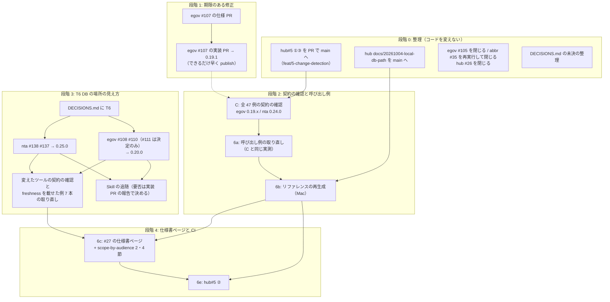
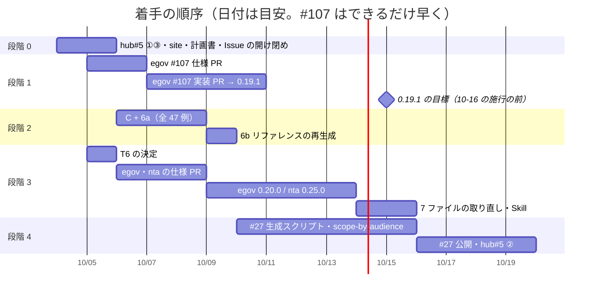

# 段階 6 と、前の計画の後に立った Issue の対応計画（2026-10-04 JST）

前の計画（`2026-09-29-plan-spec-issues.md`、Issue 57 件）は、2026-10-04 JST に Issue の対応としては締めました（同ファイル 9 章の末尾「この計画の締め」）。この計画書は、そこで残った段階 6（呼び出し例の取り直し、リファレンスの再生成、#27 の仕様書ページ、#26 を閉じる判断、houki-hub#5 の②）と最後の契約の確認、そして前の計画の後に立った Issue 9 件を、期限のあるものから順に、劣化を起こさずに片付けるための手順を決めるものです。

章立ては前の計画に合わせました。前の計画の 5 章（劣化を起こさないための決まり）と DECISIONS.md の T1〜T5 はそのまま引き継ぎ、この計画では足すものだけを書きます。

## 1. 2026-10-04 JST 時点の状態

### 1.1 各リポジトリの main

2026-10-04 JST に、Cowork の VM から `git ls-remote https://github.com/shuji-bonji/<repo> refs/heads/main` と、手元の作業コピーの `git rev-parse main` を比べて確かめました（VM から ssh の remote には届かないので https で引いた）。5 つとも一致しています。

| リポジトリ | main | 版 | 指示で聞いていた main との違い |
| --- | --- | --- | --- |
| houki-hub | `9be6b65` | — | 同じ。ただし作業ツリーに未コミットの変更がある（下の 1.3） |
| houki-egov-mcp | `bc96b9a` | 0.19.0（タグ `v0.19.0` は `f3b7fc1`） | `f3b7fc1` の上に `bc96b9a`（docs: ローカル DB のパスと作り直しの案内。ブランチ `docs/20261004-db-path` のマージ）が 1 つ載っている。版は変わらない |
| houki-nta-mcp | `527322a` | 0.24.0 | 同じ |
| houki-abbreviations | `21fbdd7` | 0.7.0 | 同じ |
| houki-research-skill | `7e07f03` | 0.18.0 | 同じ |

`stack.json`（2026-10-03T22:30:01Z 生成）も egov 0.19.0・nta 0.24.0 で `consistency: match` です。

### 1.2 open の Issue（2026-10-04 JST に GitHub API で確認）

| リポジトリ | open |
| --- | --- |
| houki-egov-mcp | #105・#107・#108・#110・#111 |
| houki-nta-mcp | #116・#137・#138 |
| houki-abbreviations | #35 |
| houki-research-skill | なし |
| houki-hub | #3・#5・#6・#7・#8・#10・#22・#26・#27 |

この計画の対象は、上の Issue のうち houki-hub #3・#6・#7・#8・#10・#22 を除いたものです（6 件は前の計画でも対象外で、今回も扱いません）。

### 1.3 この計画を立てる中で見つけたこと

計画の順序に効くので、先に書きます。

1. **houki-hub#5 の①③（前の計画の段階 5b）が main に入っていません。** ブランチ `feat/5-change-detection`（`8b34aec`・`c967ac3`・`5c7237a`）は main の祖先ではなく、houki-hub の PR も作られていません（GitHub API の pulls の一覧に無い）。main の `.github/workflows/stack-check.yml` は今も `cron: '0 21 * * 1'`（毎週月曜）で、`scripts/check-example-versions.mjs` も main にありません。前の計画は「段階 6 の前に入れる」と決めていたので、この計画の段階 0 で入れます
2. **houki-hub のブランチ `docs/20261004-local-db-path`（`eab3d7c`、site の `guide/local-database.md` の書き直し）も main に入っていません。** egov 側の同じ内容（`bc96b9a`）は main に入っています。site の表と egov の README が食い違ったままになるので、段階 0 で入れます
3. **houki-hub の作業ツリーに未コミットの変更が 2 つあります。** `docs/notes/2026-09-29-plan-spec-issues.md`（9 章末尾「この計画の締め」の 11 行）と、未追跡の `docs/notes/2026-10-04-next-plan-instructions.md`。この計画書と一緒にコミットします
4. **e-Gov 法令 API は 2026-10-04 JST に応答しています。** VM から `GET https://laws.e-gov.go.jp/api/2/laws?limit=1` が HTTP 200。houki-abbreviations の `verify-law-ids` は 2026-10-01 の定期実行（`21fbdd7`、失敗）の後、実行されていません（GitHub API の workflow runs で確認）
5. **egov #105 は確かめ終えました（ずれ無し）。** 2026-10-04 JST に e-Gov の `/api/2/laws` を直接引いた結果:
   - `law_id=414AC0000000151&asof=2018-01-01` → `revision_info.law_title` は「行政手続等における情報通信の技術の利用に関する法律」（`amendment_enforcement_date` 2016-11-01）、`current_revision_info.law_title` は「情報通信技術を活用した行政の推進等に関する法律」
   - `asof` 無し → 2 つとも「情報通信技術を活用した行政の推進等に関する法律」
   - 旧題名を `law_title` に、`asof=2018-01-01` で引くと、1 件目が `414AC0000000151` で `revision_info.law_title` が旧題名
   - plugin の houki-egov-mcp（版は確かめていない。0.19.0 の想定）の `get_toc` に `law_name: "行政手続等における情報通信の技術の利用に関する法律"`・`at: "2018-01-01"` を渡すと、`meta.law_id: "414AC0000000151"`・`meta.title` が旧題名で、目次（12 条）が返った

   したがって、`asof` を付けたときの時点の題名は `revision_info.law_title` に入り、`src/services/law-service.ts` 322 行目の `l.revision_info.law_title === searched` で照合できています。確かめたのはこの 1 法令だけです。Issue の 3 つ目の点（完全一致の比較で空白・全角を揃えるか）は、SPEC-EGOV-COMMON-ERRORS-032 のとおり文字列の一致のままで、ずれではありません
6. **DECISIONS.md の「未決」に、決着済みの行が残っています。** 「`search_fulltext` の `limit` の 1〜30 への丸めを `INVALID_ARGUMENT` に変えるか」は、0.16.0 の T1 で丸めをやめる側に決まっています（`specs/current/search_fulltext/spec.md` 22 行目、SPEC-EGOV-SEARCH-FULLTEXT-033）。段階 0 で「決定済み」に移します
7. **egov #107 は 2026-11-01 より前、10 月中に起きます。** shuji の Mac の DB（`~/.cache/houki-egov-mcp/laws.db`、0.19.0 で 2026-10-03 に作り直したもの）で、`SELECT count(*) FROM laws WHERE current_revision_status='UnEnforced' AND amendment_enforcement_date BETWEEN '2026-10-04' AND '2026-10-31'` が **21** でした（2026-10-04 JST、shuji が実行）。Issue の「次に起きるのは 2026-11-01」は当たっていません。施行日ごとの内訳（同日に shuji が `GROUP BY amendment_enforcement_date` で実行）は次のとおりで、最初は 2026-10-05（翌日）です。

   | 施行日 | 版の数 |
   | --- | --- |
   | 2026-10-05 | 5 |
   | 2026-10-16 | 7 |
   | 2026-10-23 | 1 |
   | 2026-10-24 | 5 |
   | 2026-10-30 | 2 |
   | 2026-10-31 | 1 |

   0.19.0 のままでは、施行日の当日の差分を `--sync` で取り込んでも状態が変わらず、`--bulk-download-everything` のやり直しでも直りません（Issue のとおり。直るのは DB を空から作り直したときだけ）

## 2. Issue と作業の割り付け

### 2.1 種類

前の計画の 4 種類（A 不具合、B 横断の判断、C 単独の判断、D 仕様の設置）に、次の 2 つを足します。

| 種類 | 意味 | 進め方 |
| --- | --- | --- |
| E. 確認 | 振る舞いを変えず、実物を流して記録する | houki-hub の `docs/notes/` に記録。劣化が見つかったら Issue にする |
| F. 運用 | CI・site・Issue の開け閉め。MCP の振る舞いを変えない | houki-hub の PR か main 直接（docs/ だけ）、または shuji の Mac での操作 |

### 2.2 横断の判断の新しいテーマ T6「ローカル DB の場所の見え方」

egov #108・#110・#111 と nta #138 は、同じ場面（起動の経路ごとに環境変数が違い、別の DB ファイルを開いていることに気付けない）を egov と nta で扱います。前の計画の T1〜T5 と同じく、規則を先に houki-hub の `docs/DECISIONS.md` に書き、リポジトリごとに仕様 PR を 1 本ずつ書きます。nta #137（タックスアンサーの索引の表を読むときの SQL の例外）は場面が違いますが、同じ nta の DB の扱いなので同じ版に入れます。

T6 で決めること（勧める案は 8 章「人が判断すること」の Q4）:

| 項目 | 決めること | Issue |
| --- | --- | --- |
| T6-a 応答のパス | 検索の `freshness` に `db_path` を常に置くか、ホームを `~` にするか | egov #108（追記）、nta #138 の 1 |
| T6-b DB が無いときの文 | `note`（egov）・`hint`（nta）に開こうとしたパスを入れるか。`HOUKI_*_DB_PATH` が指すファイルが無いときに文を分けるか | egov #108 の 1・2 |
| T6-c 案内のコマンドの形 | `npx -y @shuji-bonji/<pkg>@latest <フラグ>` にするか。環境変数を付けて起動したときは同じ変数を前に付けるか | egov #108 の 3・4 |
| T6-d 起動時のログ | MCP サーバーの起動時のログ（標準エラー出力）に DB のパスとそれを決めた設定を出すか | egov #108（追記）、nta #138 の 1 |
| T6-e 確かめる手段 | 解決したパス・決めた設定・同じフォルダーの別の DB を出すコマンドの名前と形。別の DB があるときの警告 | egov #110、nta #138 の 2 |
| T6-f ファイル名の版 | 次に DB の版を上げるとき、既定のファイル名に版を入れるか | egov #111、nta #138 の 3 |

### 2.3 全項目の割り付け

「害」の段階は前の計画と同じです（誤った法令・条文を根拠にする = 高、探していないのに 0 件と読める・黙って違う DB を使う = 中、表示・文言 = 低）。段階の番号は 4 章の段階で、前の計画の段階とは別の番号です。

#### 前の計画から引き継ぐもの

| # | 内容 | 種類 | 段階 | 害（そのままにしたとき） |
| --- | --- | --- | --- | --- |
| C | 5.2 の契約の確認を egov 0.19.0 / nta 0.24.0 で全 47 例 | E | 2 | 中（段階 5 の版で劣化があっても気付かない） |
| 6a | 呼び出し例の取り直し | F | 2 | 中（site の例が古い code を載せている: `INVALID_ARGUMENT` の 50 MB、`TSUTATSU_NOT_FOUND`、`resolved.aliases`） |
| 6b | リファレンスの再生成 | F | 2 | 低 |
| 6c | #27 の仕様書ページと scope-by-audience の 2 節・4 節 | F | 4 | 低 |
| 6d | #26 を閉じる判断 | F | 0 | 低 |
| 6e | houki-hub#5 の②（CI でのリファレンスの再生成） | F | 4 | 低 |
| 5b | houki-hub#5 の①③（未マージ。1.3 の 1） | F | 0 | 中（段階 2・3 の追随漏れを検知できない） |

#### 前の計画の後に立った Issue（9 件）

| リポジトリ | Issue | 内容（要約） | 種類 | テーマ | 段階 | 害 |
| --- | --- | --- | --- | --- | --- | --- |
| houki-egov-mcp | #107 | 施行日の当日に配り直される版を `unchanged` として飛ばし、施行後も `UnEnforced`、旧版が `CurrentEnforced` のまま | A | — | 1 | **高**（`search_fulltext` が施行後も改正前の条文を返す。2026-10-04〜10-31 に施行日を持つ版が 21（1.3 の 7）） |
| houki-egov-mcp | #108 | `api-fallback` の `note` と案内のコマンド。追記: `freshness.db_path`・起動時のログ | B | T6 | 3 | 中 |
| houki-egov-mcp | #110 | DB の場所と、同じフォルダーの別の版の DB を確かめるコマンド。`--status` の警告 | B | T6 | 3 | 中 |
| houki-egov-mcp | #111 | 次に DB の版を上げるとき、既定のファイル名に版を入れるか | B | T6 | 3（決定だけ） | 低（0.19.0 以降どうしでは新しい版の DB を消さない） |
| houki-egov-mcp | #105 | 法令名の完全一致の照合で時点の題名を取りこぼす可能性 | E | — | 0 | — （1.3 の 5 で確かめ、ずれ無し） |
| houki-nta-mcp | #138 | #108・#110・#111 の nta 版 | B | T6 | 3 | 中 |
| houki-nta-mcp | #137 | `readStoredTaxAnswerIndex` が SQL の例外をすべて `null` にする | C | （T6 と同じ版） | 3 | 低（記事は返る。索引を毎回取り直し、壊れた DB に気付けない） |
| houki-nta-mcp | #116 | 基本通達の範囲を広げるか | — | — | 外 | — |
| houki-abbreviations | #35 | e-Gov のメンテナンスで `verify-law-ids` が 403 | F | — | 0 | 低 |

#116 を外す理由: DECISIONS.md の 2026-09-14 の決定に「措通・評基通の追加と裁決は、立場（Discussion #24 の方向）が決まってから着手する」とあり、#116 が挙げる範囲（財産評価・措置法関係など）はこの決定の対象です。立場はまだ決まっていません。#116 は範囲の検討から始める Issue で、仕様 PR に入る段階にもありません。

## 3. 依存関係

依存の理由:

1. **#107 は日付で決まります。** 施行日の当日の差分で配り直される版が、10 月中だけで 21 あります（1.3 の 7）。0.19.1 の publish より後に施行日が来る版は、その日の `--sync` で状態が正しく変わります。publish より前に施行日が来た版は、0.19.1 に上げた後の `--bulk-download-everything` 1 回で直します（4 章の段階 1）。0.19.1 は取り込み（`--sync`・`--bulk-download-*`）だけを変え、MCP のツールの応答は変えないので、段階 2 の実測とは独立です（図の点線は「0.19.1 が先に出ていれば 0.19.1 で測る」の意味で、待つ必要はありません）
2. **C と 6a は同じ実測で兼ねます。** C は 47 例を流して判定を表にする作業、6a は同じ応答で例の JSON を差し替える作業で、入力（呼び出し）が同じです。2 回流すと、DB の取り込み日による値の差（`days_since_sync`・`staleness`）が 2 回分の差分として出ます
3. **hub#5 ①③ は段階 2 の前に入れます。** ③の `check-example-versions.mjs` が「47 例すべてが古い版で測ったまま」を一覧にし、段階 2 の後で 0 件になることを機械で確かめられます。①は段階 3 の publish の翌日に追随の Issue を立てます
4. **T6 は応答のフィールド（`freshness.db_path`）と `note` の文を変えます。** 変わるのは `freshness` を載せた例（egov `search_fulltext.md`、nta の検索 6 ファイル）だけなので、段階 2 で全例を取り直し、段階 3 ではその 7 ファイルだけを取り直します（4 章の段階 2 の説明）
5. **#27 のページは `specs/current/` から生成します。** 段階 3 で egov の `cli_status`・`search_fulltext`・`db_schema`、nta の `db_schema`・`cli_*` が変わるので、ページの公開は段階 3 の publish の後にします。生成スクリプトの作成は段階 2 の後から並行して進められます

## 4. 着手の順序

### 段階 0: 整理（コードの振る舞いを変えない）

| 作業 | 場所 | 誰が | 内容 |
| --- | --- | --- | --- |
| 0-a hub#5 ①③ を入れる | houki-hub | shuji（PR）、Claude（載せ直しが要れば） | `feat/5-change-detection` を main に載せ直し（分岐元 `fb9337c` の後に main は 33 コミット進んでいる。2026-10-04 確認）、`node --test '.github/scripts/*.test.mjs' 'scripts/*.test.mjs'` を通して PR にする（`.github/` の変更なので main 直接にしない、前の計画 9 章の判断のまま） |
| 0-b site の DB の節を入れる | houki-hub | shuji | `docs/20261004-local-db-path`（`eab3d7c`）。`site/` の変更なので PR か main 直接かを shuji が決める |
| 0-c 計画書のコミット | houki-hub | shuji | この計画書、`2026-09-29-plan-spec-issues.md` の締め、`2026-10-04-next-plan-instructions.md`、`DECISIONS.md` の未決の整理（1.3 の 6） |
| 0-d egov #105 を閉じる | houki-egov-mcp | shuji（gh） | 1.3 の 5 をコメントにして閉じる。本文は `docs/notes/issues-2026-10-04-plan-stage6/egov-105-close.md` |
| 0-e abbr #35 を閉じる | houki-abbreviations | shuji | Actions の `verify-law-ids` を `workflow_dispatch` で再実行し、成功したらコメントして閉じる（本文は同じフォルダーの `abbr-35-close.md`）。cron をずらすかは Q7 |
| 0-f hub #26 を閉じる | houki-hub | shuji（gh） | Q9 で決める。閉じるなら、#26 のチェックリストの残り 1 つ（#27）は #27 が引き継ぐとコメントする |

0-d〜0-f の投稿は `scripts/close-issues-2026-10-04-plan-stage6.sh`（`DRY_RUN=1` と `posted.tsv` 付き、既存の `close-issues-2026-10-03-stage4.sh` と同じ形）で行います。

### 段階 1: egov #107（期限: 10 月中の最初の施行日。過ぎた分は 0.19.1 で直せる形にする）

| 作業 | ブランチ（案） | 進め方 |
| --- | --- | --- |
| 仕様 PR | `spec/<作業日>-ingest-redistributed-revisions` | `cli_bulk_download` の SPEC-EGOV-CLI-BULK-DOWNLOAD-011・014・016、`cli_sync` の SPEC-EGOV-CLI-SYNC-006 を MODIFIED。Issue の再現表（医師法施行規則 `323M40000100047` の 4 版）を受入の例として書く |
| 実装 PR | `fix/<作業日>-0.19.1` | 1 コミット目に再現テスト（2026-09-02 → 09-17 → 10-01 の差分 zip を順に取り込む形の、小さな zip の fixture）。`src/services/bulk/ingester.ts` 316〜320 行目の `unchanged` の判定の後で、CSV の未施行の欄から決めた状態と DB の状態を比べる |
| publish | タグ `v0.19.1` | 目標 2026-10-15（10-16 に 7 版が施行される前）。施行日を過ぎた版は、0.19.1 に上げた後の `--bulk-download-everything` 1 回で直る形にする（下の「利用者の DB の直し方」） |

スキーマの版は上げません（Issue の決めること 4）。したがって #111（ファイル名に版を入れるか）とは同じ版で決める必要がありません。

利用者の DB の直し方について（2026-10-04 JST に改めた）: 1.3 の 7 のとおり、10 月中に施行日を迎える `UnEnforced` の版が 21 あります。0.19.1 の publish より前に施行日が来た版は、0.19.0 の `--sync` では状態が変わらないまま残ります。そこで 0.19.1 には次の 2 つを入れます。

1. 案 A の判定（`content_hash` が同じでも状態を比べて書き換える）は、全件の zip の取り込みにも効くので、0.19.1 に上げた後に `--bulk-download-everything` を 1 回実行すれば、全件の zip の CSV（施行済みの版は未施行の欄が空）で状態が直ります。条の本文は入れ直しません。CHANGELOG と README に「0.19.0 で 2026-10-04 以降に `--sync` した DB は、0.19.1 に上げた後に `--bulk-download-everything` を 1 回実行する」と書きます
2. `--sync` と `--status` で、施行日が今日（日本時間）以前なのに `UnEnforced` の版を数え、1 件以上なら `[WARN]` の行で `--bulk-download-everything` を案内します（終了コードは変えない）。0.19.1 の後に e-Gov が配り直しを省いた場合にも気付けます

施行日ごとの内訳は 1.3 の 7 の表です。2026-10-05 の 5 版は 0.19.1 より前に施行日が来るので、上の 1 で直すことが前提になります。**0.19.1 の publish の目標は 2026-10-15（2 番目の施行日 10-16 の前日）にします。** 間に合えば、後から直す版は 10-05 の 5 版だけです。0.19.1 までの間、shuji の DB で正しい状態が要るときは、0.19.0 のまま別のファイル（`HOUKI_EGOV_DB_PATH`）に空から作り直して名前を変える方法しかありません（`--bulk-download-everything` を同じファイルに重ねても直らない）。

### 段階 2: 契約の確認（C）と呼び出し例の取り直し（6a・6b）

- C と 6a を 1 つの会話で行います（指示 S）。DB は egov・nta とも 2026-10-04 に新しくしたものを使い、流す前に egov は `--status`、nta は DB の取り込み日を記録します
- 流す版は egov 0.19.0（0.19.1 が出ていれば 0.19.1。応答は同じ）と nta 0.24.0。plugin が起動している版を最初に確かめます
- 判定の表は `docs/notes/<作業日>-regression-check-egov-0.19.0-nta-0.24.0.md`（2026-10-03 の回と同じ形）。劣化が 1 件でもあれば、例の差し替えを止めて Issue にします
- 例の差し替えは houki-hub のブランチ `docs/<作業日>-examples-egov-0.19-nta-0.24` に、ツールごとに 1 コミット。見出しは変えず、「実測: vX（日付）」と JSON と例の後の文を差し替えます。2026-10-03 の回の「見つかったこと」1 の 3 件（`get_law_file` の 50 MB の文、`nta_get_kaisei_tsutatsu` の `code`、`resolve_abbreviation` の `aliases`）と、段階 5 の各 proposal.md の「呼び出し例への影響」（egov `get_article_references.md` の「`kind` は 3 つ」→ `suppl` を足して 4 つ、`search_law.md`・`search_fulltext.md` の `total_count`・`hint`・`next_actions`・`expanded_keywords`、nta `nta_search_qa.md` 84 行目の `domain` の説明）を必ず含めます
- 差し替えの後に `node scripts/check-example-versions.mjs`（0-a の後に main にある）で、古い版で測ったままの例が 0 件であることを確かめます。未確認の 1 件（nta `nta_search_tsutatsu` の「DB が古いとき」）は、版の行を取り直せないので、③の対象から外す書き方を指示 S の会話で決めます
- 6b（`node scripts/generate-reference.mjs`）は shuji の Mac で回します。`REGISTRY` は `mcp/<repo>/dist/index.js` を起動するので、egov・nta の作業コピーで `npm run build` が 0.19.x / 0.24.0 の main で済んでいることを先に確かめます

T6 の版（段階 3）の後で取り直しになる例は、`freshness` を載せた 7 ファイル（egov `search_fulltext.md`、nta `nta_search_{bunshokaitou,jimu_unei,kaisei_tsutatsu,qa,tax_answer,tsutatsu}.md`）だけです。この 7 ファイルは、段階 3 の契約の確認（変えたツールだけを流す、前の計画 5.2）でどうせ流すので、そのときに差し替えます。ほかの 40 例は段階 3 で変わりません。

### 段階 3: T6 ローカル DB の場所の見え方

| 順 | 作業 | リポジトリ | ブランチ（案） | 版 |
| --- | --- | --- | --- | --- |
| 1 | T6 の規則を `docs/DECISIONS.md` に書き、4 件の Issue にリンクをコメント | houki-hub | main（docs/） | — |
| 2 | 仕様 PR: #108（本文と追記）・#110 | houki-egov-mcp | `spec/<作業日>-db-location` | — |
| 3 | 仕様 PR: #138（1・2）・#137 | houki-nta-mcp | `spec/<作業日>-db-location` | — |
| 4 | 実装 PR | houki-egov-mcp | `feat/<作業日>-0.20.0` | 0.20.0 |
| 5 | 実装 PR | houki-nta-mcp | `feat/<作業日>-0.25.0` | 0.25.0 |
| 6 | 変えたツールの契約の確認と、7 ファイルの取り直し | houki-hub | `docs/<作業日>-examples-db-location` | — |
| 7 | Skill の追随（`api-fallback` の `note` の文・案内のコマンドを引用している箇所があれば） | houki-research-skill | `docs/<作業日>-egov020-nta025` | 0.18.1 か 0.19.0（直す範囲で決める） |

- #111 と #138 の 3（ファイル名の版）は、決定を DECISIONS.md に書いて Issue を閉じるだけにする案を勧めます（Q4 の e）。コードは変えません。決定が「入れる」になった場合も、実装は次に DB の版を上げる版（egov 版 4、nta 版 13）で行います
- 2 と 3 は別リポジトリなので並行できますが、`note`・`hint` の文と `freshness.db_path` の説明を同じ文にするため、前の計画の段階 4 と同じく egov → nta の順に続けて書きます
- egov の T6-e は `--status` を変えるので、`cli_status` の spec.md の MODIFIED になります。nta には `--status` が無いので、勧める案（Q4 の d）では nta に `--status` を新設します（`cli_status` の spec.md を `spec-init` ではなく仕様 PR の ADDED として置く）

### 段階 4: #27 の仕様書ページと hub#5 ②

| 作業 | 内容 | 始める条件 |
| --- | --- | --- |
| 6c-1 生成スクリプト | `scripts/generate-reference.mjs` と同じ 1 本に、`specs/current/<dir>/spec.md`（egov・nta・abbr）と Skill の `workflows/*.md` を入力に足す（#27 のコメント 2026-09-27 の方針）。出力は `site/docs/specs/<repo>/<dir>.md` の案 | 段階 2 の後（段階 3 と並行してよい） |
| 6c-2 scope-by-audience | `2026-09-29-scope-by-audience.md` の 2 節・4 節の表と図を利用者向けに書き直し、`site/docs/guide/` に 1 ページ。`overview.md` と `disclaimer.md` からリンク。3 節は載せない（同ファイル 6 章の決定） | 6c-1 と同時（仕様 ID と層の対応をリンクで結ぶため） |
| 6c-3 公開 | 段階 3 の publish の後に生成し直して site に載せる | 段階 3 の publish |
| 6e hub#5 ② | `REGISTRY` の `command`/`args` を環境変数で `npx -y @shuji-bonji/<pkg>@latest` に切り替えられるようにし、CI で生成して差分があれば PR を開く。最初に CI の上で `npx -y` の起動と `tools/list` が通るか（nta の better-sqlite3 の prebuilt）を確かめる | 6c-3 の後（仕様書ページも同じ CI で生成し直せるようにするため） |

## 5. 劣化を起こさないための決まり（前の計画の 5 章に足すもの）

### 5.1 変更の種類ごとの検査（足す行）

| 変更の種類 | 起きうる劣化 | マージ前に確かめること |
| --- | --- | --- |
| 取り込みの判定を変える（egov #107） | 状態の書き換えが過不足になる（現行の版が 2 つ、または 0 になる法令ができる） | (1) Issue の再現表の 4 版が「正しい状態」になる受入テスト。(2) shuji の Mac で、DB のコピー（`laws.db` を `PRAGMA wal_checkpoint(TRUNCATE)` の後に複製）に 0.19.1 の `--bulk-download-everything` を実行し、`current_revision_status='CurrentEnforced'` の版が 1 法令に 1 つであること（`GROUP BY law_id HAVING count(*) > 1` が 0 行）。(3) 取り込みの件数の出力（`upserted`・`unchanged`、足すなら `status_changed`）を CHANGELOG に例で書く |
| 応答にパスを足す（T6-a） | 応答を貼った人の利用者名が出る | 勧める案では、MCP の応答はホームを `~` に置き換える。呼び出し例にも `~` の形で載せる（保存先の `saved.path` を例で `~` にしているのと同じ） |
| `note`・`hint` の文を変える（T6-b・c） | Skill と hub の例、egov README の「`note` の先頭ごとの原因と確かめ方」の表が古くなる | 先頭の文（README の表が使う）を変えるかを仕様 PR で決め、変えるなら同じ実装 PR で README の表を直す。Skill の該当箇所（`SKILL.md`・`workflows/tax-research.md`・`workflows/feasibility-check.md`・`examples/invoice-registration.md`・`docs/ERROR-HANDLING.md`・`docs/ARCHITECTURE.md`、2026-10-04 に grep）を実装 PR の報告に列挙する |
| CLI の出力を変える（T6-e） | `--status` を読むスクリプトが壊れる | 行を足すだけにし、既存の行（` DB:` など）の形は変えない。終了コードは変えない |

### 5.2 契約の確認（足すこと）

- 段階 2 は全 47 例を流します（前の計画 9 章の締めの 1）
- 0.19.1（#107）はツールの応答を変えないので、47 例の確認の代わりに、5.1 の取り込みの確認（2）を publish の条件にします
- 段階 3 は変えたツールの例（7 ファイル）を流します
- 例を流す前に、egov は `--status`、nta は取り込み日を記録し、`staleness` が `fresh` でない例は判定から外さず「差分あり（データ側）」と書きます（2026-10-03 の回の判定の意味のまま）

### 5.3 期限のある Issue

- 期限のある Issue（今回は egov #107）は、他の段階を待たずに最初に着手し、patch で出します。規則の議論（T6 のような横断の判断）と同じ版に入れません
- 期限より前に出せない場合に備えて、期限を過ぎた分を後から直す手段（#107 なら、0.19.1 での `--bulk-download-everything` と `--sync`・`--status` の警告）を同じ版に入れます。Issue に書かれた期限（#107 の「次は 2026-11-01」）は、着手の前に実データで確かめます（1.3 の 7 で外れていた）

### 5.4 hub の作業の取り込み漏れ

1.3 の 1・2 のように、houki-hub のブランチが main に入らないまま次の段階に進むことがありました。段階ごとの記録（9 章）に、houki-hub のブランチの状態（main に入ったか）を書く欄を設けます。

## 6. 進め方の単位と並列化

同時に進められるもの:

- 段階 0 と段階 1 の仕様 PR（別リポジトリ）
- 段階 1（egov の取り込み）と段階 2（hub の例）と T6 の決定（hub の DECISIONS.md）
- 段階 3 の egov と nta（別リポジトリ。ただし仕様 PR の文は egov → nta の順に書く）
- 段階 4 の生成スクリプトと段階 3

直列にしか進められないもの:

- egov の作業コピーを使う作業: 段階 1 の実装 PR → 段階 3 の egov の実装 PR（同じチェックアウト。段階 3 の仕様 PR は段階 1 の実装中でも別ブランチで書ける）
- 0-a（③）→ 段階 2 の最後の確認
- 段階 3 の publish → 7 ファイルの取り直し → #27 の公開

## 7. 版の予定

| リポジトリ | 版 | 段階 | 含めるもの |
| --- | --- | --- | --- |
| houki-egov-mcp | 0.19.1 | 1 | #107（スキーマの版は 3 のまま） |
| houki-egov-mcp | 0.20.0 | 3 | #108・#110（#111 は決定だけで閉じる） |
| houki-nta-mcp | 0.25.0 | 3 | #138・#137 |
| houki-research-skill | 0.18.1 または 0.19.0 | 3 | egov 0.20.0 / nta 0.25.0 の追随（文の引用を直すだけなら 0.18.1） |
| houki-abbreviations | なし | 0 | #35 は再実行で閉じる。cron をずらすなら `ci:` の PR（publish しない） |

publish は MCP 3 回、Skill 1 回の計 4 回です。0.19.1 を 0.20.0 に入れれば 1 回減りますが、5.3 の決まりで分けます。

## 8. 決定の記録と、人が判断すること

### 8.1 決定の記録

（shuji が決めたら、日付つきでここに書く）

### 8.2 人が判断すること

| # | 何を | 案 | 勧める案と理由 |
| --- | --- | --- | --- |
| Q1 | C と 6a の順 | (A) C と 6a を今の版（egov 0.19.x / nta 0.24.0）で同じ実測で行う。T6 の後は 7 ファイルだけ取り直す / (B) T6 の publish の後にまとめて 1 回 / (C) C だけ今、6a は T6 の後 | **A。** site の例が今も古い code（`INVALID_ARGUMENT` の 50 MB、`TSUTATSU_NOT_FOUND`）を載せている。T6 で変わるのは 7 ファイルで、そのときの契約の確認でどうせ流す。B は段階 3 が終わるまで（2〜3 週間の見込み）誤りを残す。C は同じ呼び出しを 2 回流す |
| Q2 | egov #107 の出し方 | (A) 0.19.1（patch）で #107 だけを先に出す / (B) T6 と合わせて 0.20.0 / (C) 段階 3 の後に直し、利用者に作り直しを案内 | **A。** 10 月中に施行日を迎える版が 21 あり（最初は 10-05、次は 10-16 に 7 版）、スキーマも応答も変えない修正なので patch で足りる。B は T6 の議論を待つことになる |
| Q3 | #107 の中身（仕様 PR で承認するときの出発点） | Issue の決めること 1〜4 | **1 は案 A**（`content_hash` が同じでも、CSV の未施行の欄から決めた状態が DB と違えば `laws` の状態だけを書き換え、SPEC-EGOV-CLI-BULK-DOWNLOAD-016 の処理を通す。条の本文は入れ直さない。件数は `status_changed` を別に数える）。**2 は案 A**（e-Gov の CSV に従う）。**3 は、0.19.1 に上げた後の `--bulk-download-everything` 1 回で直ることを CHANGELOG と README に書き、`--sync`・`--status` に「施行日が今日以前の `UnEnforced`」の警告を足す**（2026-10-04 に改めた。10 月中に施行日を迎える版が 21 あるため。4 章の段階 1 の「利用者の DB の直し方」）。**4 はスキーマの版を上げず 0.19.1** |
| Q4 | T6 の規則 | 下の a〜e | 下の表 |
| Q5 | nta #137 | (A) 「索引の行が無い」ときだけ `null`、それ以外の SQL の例外は記事を返したうえで `logger.warn` に表の名前と DB のパスを出す。`saveTaxAnswerIndex` の失敗も `logger.warn` / (B) `INTERNAL_ERROR` で返す / (C) 今のまま、仕様に「壊れた表は索引が無いのと同じに扱う」と書く | **A。** 記事は正しく返せるので、応答を失敗にすると利用者の得るものが減る。ログに出せば、`--status`（Q4 の d）と合わせて壊れた DB に気付ける。版は nta 0.25.0（T6 と同じ DB の仕様 PR） |
| Q6 | nta #116 | (A) この計画の外。DECISIONS.md 2026-09-14 の決定を Issue にコメントする / (B) この計画に入れて範囲の検討を始める | **A。** 2026-09-14 の決定（措通・評基通は立場が決まってから）に当たる。立場（Discussion #24）が決まったら、範囲の検討を独立した計画にする |
| Q7 | abbr #35 | (A) 再実行して成功したら閉じる / (B) A に加え、cron を毎月 2 日にずらす `ci:` の PR / (C) A に加え、本文の「再発への備え」（メンテナンスの検知・再試行）を実装 | **B。** 毎月 1 日はメンテナンスと重なるおそれがある、と Issue が書いている。ずらすのは 1 行で、検知の実装（C）は 1 回の失敗に対して大きい |
| Q8 | egov #105 | (A) 1.3 の 5 の結果をコメントして閉じる / (B) 改題した法令を数件足して確かめてから閉じる | **A。** 時点の題名が `revision_info.law_title` に入ることは API の形の問題で、法令ごとに変わる理由が無い |
| Q9 | hub #26 | (A) 今閉じる。残りのチェック（#27）は #27 が引き継ぐ / (B) #27 のページを公開するまで開けておく | **A。** #26 の本題（`specs/` の構築と運用の 1 周）は、前の計画の段階 6 の表の条件（nta #75 が main、abbr の spec-gate が 0.7.0 で 1 周）を満たしている |
| Q10 | hub#5 ①③（未マージ） | (A) 段階 0 で PR にして入れる / (B) 段階 4 の②と一緒に入れる | **A。** 前の計画の決定（段階 6 の前に入れる）のとおり。段階 2 の最後の確認に③を使う |
| Q11 | hub#5 ② の時期 | (A) 段階 4 の最後（#27 の公開の後） / (B) 段階 2 の 6b の代わりに今入れる / (C) この計画の外 | **A。** #27 の生成も同じ CI に載せたい。②は `npx -y` の起動の確認から始まるので、6b（手で回す）を先に済ませて例の差し替えを止めない |
| Q12 | #27 の着手時期 | (A) 生成スクリプトは段階 2 の後、公開は段階 3 の publish の後 / (B) 段階 3 の後にまとめて | **A。** 生成は `specs/current/` を読むだけなので、仕様が変わったら生成し直せばよい |

Q4（T6）の勧める案:

| 項目 | 案 | 勧める案と理由 |
| --- | --- | --- |
| a 応答のパス | `freshness.db_path` を (1) 常に置き、DB を使っていないときは `null` / (2) 置かない。パスは (i) ホームを `~` に置き換える / (ii) 絶対パス | **(1)・(i)。** (1) は T4 の決め方（フィールドを消さず `null`）。(i) は応答を Issue や記事に貼ったときに利用者名を出さないため。CLI の `--status` と起動時のログは絶対パスのまま（利用者の端末にしか出ない） |
| b DB が無いときの文 | `note`（egov）・`hint`（nta）に開こうとしたパスを入れる。先頭の文を (1) 今のまま、後ろにパスを足す / (2) 「ローカル DB（`<パス>`）がありません」などに変える。`HOUKI_*_DB_PATH` が設定されていてファイルが無いときは文を分ける | **(2) と、環境変数のときは分ける。** 今の先頭「bulk DL 未実行のため」は、環境変数が指すファイルが無いときに事実と違う（#108 の 1）。README の表は同じ実装 PR で直す |
| c 案内のコマンド | (A) `npx -y @shuji-bonji/<pkg>@latest <フラグ>`、環境変数で起動したときは `HOUKI_*_DB_PATH=<パス> npx -y …` / (B) 今のまま、README で読み替えを説明 | **A。** どこからでも動く形はこれだけ（handoff の 3）。egov の README と `--help` は既に A の形（`bc96b9a`） |
| d 確かめる手段 | (A) egov は `--status` に「決めた設定」の行と、同じフォルダーの別の DB の `[WARN]` を足す。nta に同じ形の `--status` を新設する / (B) 両方に新しいフラグ `--db-info` / (C) `--status --verbose` | **A。** egov の `--status` は DB が無くても終了コード 0 で動き、既に ` DB:` の行がある。新しいフラグを足すより、利用者が覚えるコマンドが 1 つで済む。nta には DB の状態を出すコマンドが無い（`--health-check` は国税庁サイトの確認）ので、新設は nta #138 の 2 の範囲 |
| e ファイル名の版 | (A) 入れない。0.19.0 / 0.24.0 からは新しい版の DB を書き換えないので、残る事故は 0.18.x / 0.23.x 以前のサーバーだけで、ファイル名を変えても防げない。開発のときは `HOUKI_*_DB_PATH` で別のファイルを使う（egov の CONTRIBUTING.md に既にある。nta にも同じ節を足す） / (B) 次の DB の版上げから入れる | **A。** nta は版 3〜11 を行を保って移行するので、ファイル名を変えると移行の代わりにコピーが要る。egov も版を上げるときは作り直しが要るので、ファイル名で守れるのは「新しい版を試している間、元の DB が残る」ことだけで、それは d の警告と CONTRIBUTING の手順で足りる。#111 と nta #138 の 3 は決定を書いて閉じる |

### 8.3 まだ決めていないこと（この計画の中で決める）

- 0.19.1 の取り込みの件数の表示（`status_changed` の名前と、`--sync` の出力に足すか）は、仕様 PR で決める
- 段階 2 の未確認の 1 例（nta の「DB が古いとき」）を③の照合からどう外すか（例の先頭の行の書き方）は、指示 S の会話で決める
- #27 のページの URL（`/specs/<repo>/<dir>` の案）とサイドバーの構成は、6c-1 の会話で決める

## 9. 記録

このメモは houki-hub `docs/notes/2026-10-04-plan-stage6-and-followups.md` に置きます。段階が進むごとに、この章に「済（日付・PR 番号・コミット）」と、houki-hub のブランチが main に入ったかを書き足します（5.4）。

### 別の会話に渡す指示

| 指示 | 段階 | 内容 | 置き場所 | 状態 |
| --- | --- | --- | --- | --- |
| Q | 1 | egov 0.19.1 の仕様 PR（#107） | `2026-10-04-stage6-instructions.md` | 済（2026-10-04、PR #112、main `c88a3c9`。差分 `20261004-ingest-redistributed-revisions`、ADDED 6・MODIFIED 4） |
| R | 1 | egov 0.19.1 の実装 PR | `2026-10-04-stage6-instructions.md` | 済（2026-10-04、PR #113、main `3ca848e`）。タグと publish は未 |
| S | 2 | 契約の確認（C）と呼び出し例の取り直し（6a） | `2026-10-04-stage6-instructions.md` | 作成済み（2026-10-04） |
| T | 3 | egov 0.20.0 の仕様 PR（#108・#110） | T6 の決定の後に作る（前の計画の `2026-10-03-stage5-spec-instructions.md` の H の形） | 未 |
| U | 3 | nta 0.25.0 の仕様 PR（#138・#137） | T と同じ時期 | 未 |
| V・W | 3 | egov 0.20.0 / nta 0.25.0 の実装 PR | T・U のマージ後 | 未 |
| X | 3 | Skill の追随と 7 ファイルの取り直し | V・W の publish の日 | 未 |
| Y | 4 | #27 の生成スクリプトと scope-by-audience のページ | 段階 2 の後 | 未 |
| Z | 4 | hub#5 ② | Y の公開の後 | 未 |

指示の形は前の計画と同じです: 「場所（起点のコミットと origin の確認）」「最初に読むもの（順番つき）」「Issue ごとの出発点（勧める案）」「守ること（VM の git の注意を含む）」「終わったら報告すること（PR 本文の草案を含む）」。

### 段階 0 の進捗

| 作業 | 状態 |
| --- | --- |
| 0-a hub#5 ①③ | 未。2026-10-04 JST の 2 回目の確認で、ブランチ `feat/5-change-detection` が手元からも origin からも消えていた（コミット `5c7237a` は残っていた）。同じ名前のブランチを `5c7237a` に作り直した。main への取り込み（PR）は未 |
| 0-b site の DB の節 | 済（main `88cb609`） |
| 0-c 計画書のコミット | 済（`5a48edc`・`fab2210`） |
| 0-d egov #105 | 確認済み（1.3 の 5）。コメントと close は未 |
| 0-e abbr #35 | e-Gov は 200 を返す（2026-10-04）。再実行と close は未 |
| 0-f hub #26 | Q9 待ち |

### 段階 1 の進捗

| 作業 | 状態 |
| --- | --- |
| 仕様 PR | 済（2026-10-04 JST、PR #112、main `c88a3c9`）。Q3 の勧める案に加えて、033（全件の取り込みで、全件の CSV に無い未施行の版を前の版にする）を入れた。`[WARN]` の比べる日は計画書の「今日以前」から `last_sync_date` より前に変えた（proposal.md の「人が判断すること」3・4） |
| 実装 PR | 済（2026-10-04 JST、PR #113、main `3ca848e`。#107 は閉じた）。houki-hub の site（`site/docs/mcp/houki-egov.md`）の追随も main に入った（`bb9b7b0`、マージ `65dc62d`） |
| publish の前の確認 | 未（proposal.md の「publish の前の確認」1〜7、shuji の Mac） |
| publish | 未（2026-10-04 JST に確認: タグ `v0.19.1` は無く、npm の latest は 0.19.0。目標 2026-10-15） |
