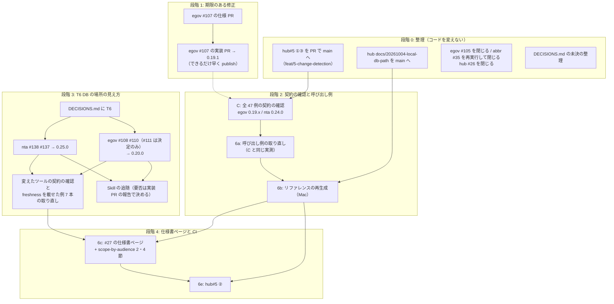

# 段階 6 と、前の計画の後に立った Issue の対応計画（2026-10-04 JST）

前の計画（`2026-09-29-plan-spec-issues.md`、Issue 57 件）は、2026-10-04 JST に Issue の対応としては締めました（同ファイル 9 章の末尾「この計画の締め」）。この計画書は、そこで残った段階 6（呼び出し例の取り直し、リファレンスの再生成、#27 の仕様書ページ、#26 を閉じる判断、houki-hub#5 の②）と最後の契約の確認、そして前の計画の後に立った Issue 9 件を、期限のあるものから順に、劣化を起こさずに片付けるための手順を決めるものです。

章立ては前の計画に合わせました。前の計画の 5 章（劣化を起こさないための決まり）と DECISIONS.md の T1〜T5 はそのまま引き継ぎ、この計画では足すものだけを書きます。

## 1. 2026-10-04 JST 時点の状態

### 1.1 各リポジトリの main

2026-10-04 JST に、Cowork の VM から `git ls-remote https://github.com/shuji-bonji/<repo> refs/heads/main` と、手元の作業コピーの `git rev-parse main` を比べて確かめました（VM から ssh の remote には届かないので https で引いた）。5 つとも一致しています。

| リポジトリ | main | 版 | 指示で聞いていた main との違い |
| --- | --- | --- | --- |
| houki-hub | `9be6b65` | — | 同じ。ただし作業ツリーに未コミットの変更がある（下の 1.3） |
| houki-egov-mcp | `bc96b9a` | 0.19.0（タグ `v0.19.0` は `f3b7fc1`） | `f3b7fc1` の上に `bc96b9a`（docs: ローカル DB のパスと作り直しの案内。ブランチ `docs/20261004-db-path` のマージ）が 1 つ載っている。版は変わらない |
| houki-nta-mcp | `527322a` | 0.24.0 | 同じ |
| houki-abbreviations | `21fbdd7` | 0.7.0 | 同じ |
| houki-research-skill | `7e07f03` | 0.18.0 | 同じ |

`stack.json`（2026-10-03T22:30:01Z 生成）も egov 0.19.0・nta 0.24.0 で `consistency: match` です。

### 1.2 open の Issue（2026-10-04 JST に GitHub API で確認）

| リポジトリ | open |
| --- | --- |
| houki-egov-mcp | #105・#107・#108・#110・#111 |
| houki-nta-mcp | #116・#137・#138 |
| houki-abbreviations | #35 |
| houki-research-skill | なし |
| houki-hub | #3・#5・#6・#7・#8・#10・#22・#26・#27 |

この計画の対象は、上の Issue のうち houki-hub #3・#6・#7・#8・#10・#22 を除いたものです（6 件は前の計画でも対象外で、今回も扱いません）。

### 1.3 この計画を立てる中で見つけたこと

計画の順序に効くので、先に書きます。

1. **houki-hub#5 の①③（前の計画の段階 5b）が main に入っていません。** ブランチ `feat/5-change-detection`（`8b34aec`・`c967ac3`・`5c7237a`）は main の祖先ではなく、houki-hub の PR も作られていません（GitHub API の pulls の一覧に無い）。main の `.github/workflows/stack-check.yml` は今も `cron: '0 21 * * 1'`（毎週月曜）で、`scripts/check-example-versions.mjs` も main にありません。前の計画は「段階 6 の前に入れる」と決めていたので、この計画の段階 0 で入れます
2. **houki-hub のブランチ `docs/20261004-local-db-path`（`eab3d7c`、site の `guide/local-database.md` の書き直し）も main に入っていません。** egov 側の同じ内容（`bc96b9a`）は main に入っています。site の表と egov の README が食い違ったままになるので、段階 0 で入れます
3. **houki-hub の作業ツリーに未コミットの変更が 2 つあります。** `docs/notes/2026-09-29-plan-spec-issues.md`（9 章末尾「この計画の締め」の 11 行）と、未追跡の `docs/notes/2026-10-04-next-plan-instructions.md`。この計画書と一緒にコミットします
4. **e-Gov 法令 API は 2026-10-04 JST に応答しています。** VM から `GET https://laws.e-gov.go.jp/api/2/laws?limit=1` が HTTP 200。houki-abbreviations の `verify-law-ids` は 2026-10-01 の定期実行（`21fbdd7`、失敗）の後、実行されていません（GitHub API の workflow runs で確認）
5. **egov #105 は確かめ終えました（ずれ無し）。** 2026-10-04 JST に e-Gov の `/api/2/laws` を直接引いた結果:
   - `law_id=414AC0000000151&asof=2018-01-01` → `revision_info.law_title` は「行政手続等における情報通信の技術の利用に関する法律」（`amendment_enforcement_date` 2016-11-01）、`current_revision_info.law_title` は「情報通信技術を活用した行政の推進等に関する法律」
   - `asof` 無し → 2 つとも「情報通信技術を活用した行政の推進等に関する法律」
   - 旧題名を `law_title` に、`asof=2018-01-01` で引くと、1 件目が `414AC0000000151` で `revision_info.law_title` が旧題名
   - plugin の houki-egov-mcp（版は確かめていない。0.19.0 の想定）の `get_toc` に `law_name: "行政手続等における情報通信の技術の利用に関する法律"`・`at: "2018-01-01"` を渡すと、`meta.law_id: "414AC0000000151"`・`meta.title` が旧題名で、目次（12 条）が返った

   したがって、`asof` を付けたときの時点の題名は `revision_info.law_title` に入り、`src/services/law-service.ts` 322 行目の `l.revision_info.law_title === searched` で照合できています。確かめたのはこの 1 法令だけです。Issue の 3 つ目の点（完全一致の比較で空白・全角を揃えるか）は、SPEC-EGOV-COMMON-ERRORS-032 のとおり文字列の一致のままで、ずれではありません
6. **DECISIONS.md の「未決」に、決着済みの行が残っています。** 「`search_fulltext` の `limit` の 1〜30 への丸めを `INVALID_ARGUMENT` に変えるか」は、0.16.0 の T1 で丸めをやめる側に決まっています（`specs/current/search_fulltext/spec.md` 22 行目、SPEC-EGOV-SEARCH-FULLTEXT-033）。段階 0 で「決定済み」に移します
7. **egov #107 は 2026-11-01 より前、10 月中に起きます。** shuji の Mac の DB（`~/.cache/houki-egov-mcp/laws.db`、0.19.0 で 2026-10-03 に作り直したもの）で、`SELECT count(*) FROM laws WHERE current_revision_status='UnEnforced' AND amendment_enforcement_date BETWEEN '2026-10-04' AND '2026-10-31'` が **21** でした（2026-10-04 JST、shuji が実行）。Issue の「次に起きるのは 2026-11-01」は当たっていません。施行日ごとの内訳（同日に shuji が `GROUP BY amendment_enforcement_date` で実行）は次のとおりで、最初は 2026-10-05（翌日）です。

   | 施行日 | 版の数 |
   | --- | --- |
   | 2026-10-05 | 5 |
   | 2026-10-16 | 7 |
   | 2026-10-23 | 1 |
   | 2026-10-24 | 5 |
   | 2026-10-30 | 2 |
   | 2026-10-31 | 1 |

   0.19.0 のままでは、施行日の当日の差分を `--sync` で取り込んでも状態が変わらず、`--bulk-download-everything` のやり直しでも直りません（Issue のとおり。直るのは DB を空から作り直したときだけ）

## 2. Issue と作業の割り付け

### 2.1 種類

前の計画の 4 種類（A 不具合、B 横断の判断、C 単独の判断、D 仕様の設置）に、次の 2 つを足します。

| 種類 | 意味 | 進め方 |
| --- | --- | --- |
| E. 確認 | 振る舞いを変えず、実物を流して記録する | houki-hub の `docs/notes/` に記録。劣化が見つかったら Issue にする |
| F. 運用 | CI・site・Issue の開け閉め。MCP の振る舞いを変えない | houki-hub の PR か main 直接（docs/ だけ）、または shuji の Mac での操作 |

### 2.2 横断の判断の新しいテーマ T6「ローカル DB の場所の見え方」

egov #108・#110・#111 と nta #138 は、同じ場面（起動の経路ごとに環境変数が違い、別の DB ファイルを開いていることに気付けない）を egov と nta で扱います。前の計画の T1〜T5 と同じく、規則を先に houki-hub の `docs/DECISIONS.md` に書き、リポジトリごとに仕様 PR を 1 本ずつ書きます。nta #137（タックスアンサーの索引の表を読むときの SQL の例外）は場面が違いますが、同じ nta の DB の扱いなので同じ版に入れます。

T6 で決めること（勧める案は 8 章「人が判断すること」の Q4）:

| 項目 | 決めること | Issue |
| --- | --- | --- |
| T6-a 応答のパス | 検索の `freshness` に `db_path` を常に置くか、ホームを `~` にするか | egov #108（追記）、nta #138 の 1 |
| T6-b DB が無いときの文 | `note`（egov）・`hint`（nta）に開こうとしたパスを入れるか。`HOUKI_*_DB_PATH` が指すファイルが無いときに文を分けるか | egov #108 の 1・2 |
| T6-c 案内のコマンドの形 | `npx -y @shuji-bonji/<pkg>@latest <フラグ>` にするか。環境変数を付けて起動したときは同じ変数を前に付けるか | egov #108 の 3・4 |
| T6-d 起動時のログ | MCP サーバーの起動時のログ（標準エラー出力）に DB のパスとそれを決めた設定を出すか | egov #108（追記）、nta #138 の 1 |
| T6-e 確かめる手段 | 解決したパス・決めた設定・同じフォルダーの別の DB を出すコマンドの名前と形。別の DB があるときの警告 | egov #110、nta #138 の 2 |
| T6-f ファイル名の版 | 次に DB の版を上げるとき、既定のファイル名に版を入れるか | egov #111、nta #138 の 3 |

### 2.3 全項目の割り付け

「害」の段階は前の計画と同じです（誤った法令・条文を根拠にする = 高、探していないのに 0 件と読める・黙って違う DB を使う = 中、表示・文言 = 低）。段階の番号は 4 章の段階で、前の計画の段階とは別の番号です。

#### 前の計画から引き継ぐもの

| # | 内容 | 種類 | 段階 | 害（そのままにしたとき） |
| --- | --- | --- | --- | --- |
| C | 5.2 の契約の確認を egov 0.19.0 / nta 0.24.0 で全 47 例 | E | 2 | 中（段階 5 の版で劣化があっても気付かない） |
| 6a | 呼び出し例の取り直し | F | 2 | 中（site の例が古い code を載せている: `INVALID_ARGUMENT` の 50 MB、`TSUTATSU_NOT_FOUND`、`resolved.aliases`） |
| 6b | リファレンスの再生成 | F | 2 | 低 |
| 6c | #27 の仕様書ページと scope-by-audience の 2 節・4 節 | F | 4 | 低 |
| 6d | #26 を閉じる判断 | F | 0 | 低 |
| 6e | houki-hub#5 の②（CI でのリファレンスの再生成） | F | 4 | 低 |
| 5b | houki-hub#5 の①③（未マージ。1.3 の 1） | F | 0 | 中（段階 2・3 の追随漏れを検知できない） |

#### 前の計画の後に立った Issue（9 件）

| リポジトリ | Issue | 内容（要約） | 種類 | テーマ | 段階 | 害 |
| --- | --- | --- | --- | --- | --- | --- |
| houki-egov-mcp | #107 | 施行日の当日に配り直される版を `unchanged` として飛ばし、施行後も `UnEnforced`、旧版が `CurrentEnforced` のまま | A | — | 1 | **高**（`search_fulltext` が施行後も改正前の条文を返す。2026-10-04〜10-31 に施行日を持つ版が 21（1.3 の 7）） |
| houki-egov-mcp | #108 | `api-fallback` の `note` と案内のコマンド。追記: `freshness.db_path`・起動時のログ | B | T6 | 3 | 中 |
| houki-egov-mcp | #110 | DB の場所と、同じフォルダーの別の版の DB を確かめるコマンド。`--status` の警告 | B | T6 | 3 | 中 |
| houki-egov-mcp | #111 | 次に DB の版を上げるとき、既定のファイル名に版を入れるか | B | T6 | 3（決定だけ） | 低（0.19.0 以降どうしでは新しい版の DB を消さない） |
| houki-egov-mcp | #105 | 法令名の完全一致の照合で時点の題名を取りこぼす可能性 | E | — | 0 | — （1.3 の 5 で確かめ、ずれ無し） |
| houki-nta-mcp | #138 | #108・#110・#111 の nta 版 | B | T6 | 3 | 中 |
| houki-nta-mcp | #137 | `readStoredTaxAnswerIndex` が SQL の例外をすべて `null` にする | C | （T6 と同じ版） | 3 | 低（記事は返る。索引を毎回取り直し、壊れた DB に気付けない） |
| houki-nta-mcp | #116 | 基本通達の範囲を広げるか | — | — | 外 | — |
| houki-abbreviations | #35 | e-Gov のメンテナンスで `verify-law-ids` が 403 | F | — | 0 | 低 |
| houki-nta-mcp | #139（段階 2 で見つけて起票） | 検索の `freshness` が、索引から消えた文書の古い `fetched_at` で止まり、投入をやり直しても `fresh` に戻らない | A | — | 1b | 中（2026-10-07 からタックスアンサーの検索が `outdated` を返し、`warning` の案内では直らない） |

#116 を外す理由: DECISIONS.md の 2026-09-14 の決定に「措通・評基通の追加と裁決は、立場（Discussion #24 の方向）が決まってから着手する」とあり、#116 が挙げる範囲（財産評価・措置法関係など）はこの決定の対象です。立場はまだ決まっていません。#116 は範囲の検討から始める Issue で、仕様 PR に入る段階にもありません。

## 3. 依存関係

依存の理由:

1. **#107 は日付で決まります。** 施行日の当日の差分で配り直される版が、10 月中だけで 21 あります（1.3 の 7）。0.19.1 の publish より後に施行日が来る版は、その日の `--sync` で状態が正しく変わります。publish より前に施行日が来た版は、0.19.1 に上げた後の `--bulk-download-everything` 1 回で直します（4 章の段階 1）。0.19.1 は取り込み（`--sync`・`--bulk-download-*`）だけを変え、MCP のツールの応答は変えないので、段階 2 の実測とは独立です（図の点線は「0.19.1 が先に出ていれば 0.19.1 で測る」の意味で、待つ必要はありません）
2. **C と 6a は同じ実測で兼ねます。** C は 47 例を流して判定を表にする作業、6a は同じ応答で例の JSON を差し替える作業で、入力（呼び出し）が同じです。2 回流すと、DB の取り込み日による値の差（`days_since_sync`・`staleness`）が 2 回分の差分として出ます
3. **hub#5 ①③ は段階 2 の前に入れます。** ③の `check-example-versions.mjs` が「47 例すべてが古い版で測ったまま」を一覧にし、段階 2 の後で 0 件になることを機械で確かめられます。①は段階 3 の publish の翌日に追随の Issue を立てます
4. **T6 は応答のフィールド（`freshness.db_path`）と `note` の文を変えます。** 変わるのは `freshness` を載せた例（egov `search_fulltext.md`、nta の検索 6 ファイル）だけなので、段階 2 で全例を取り直し、段階 3 ではその 7 ファイルだけを取り直します（4 章の段階 2 の説明）
5. **#27 のページは `specs/current/` から生成します。** 段階 3 で egov の `cli_status`・`search_fulltext`・`db_schema`、nta の `db_schema`・`cli_*` が変わるので、ページの公開は段階 3 の publish の後にします。生成スクリプトの作成は段階 2 の後から並行して進められます

## 4. 着手の順序

### 段階 0: 整理（コードの振る舞いを変えない）

| 作業 | 場所 | 誰が | 内容 |
| --- | --- | --- | --- |
| 0-a hub#5 ①③ を入れる | houki-hub | shuji（PR）、Claude（載せ直しが要れば） | `feat/5-change-detection` を main に載せ直し（分岐元 `fb9337c` の後に main は 33 コミット進んでいる。2026-10-04 確認）、`node --test '.github/scripts/*.test.mjs' 'scripts/*.test.mjs'` を通して PR にする（`.github/` の変更なので main 直接にしない、前の計画 9 章の判断のまま） |
| 0-b site の DB の節を入れる | houki-hub | shuji | `docs/20261004-local-db-path`（`eab3d7c`）。`site/` の変更なので PR か main 直接かを shuji が決める |
| 0-c 計画書のコミット | houki-hub | shuji | この計画書、`2026-09-29-plan-spec-issues.md` の締め、`2026-10-04-next-plan-instructions.md`、`DECISIONS.md` の未決の整理（1.3 の 6） |
| 0-d egov #105 を閉じる | houki-egov-mcp | shuji（gh） | 1.3 の 5 をコメントにして閉じる。本文は `docs/notes/issues-2026-10-04-plan-stage6/egov-105-close.md` |
| 0-e abbr #35 を閉じる | houki-abbreviations | shuji | Actions の `verify-law-ids` を `workflow_dispatch` で再実行し、成功したらコメントして閉じる（本文は同じフォルダーの `abbr-35-close.md`）。cron をずらすかは Q7 |
| 0-f hub #26 を閉じる | houki-hub | shuji（gh） | Q9 で決める。閉じるなら、#26 のチェックリストの残り 1 つ（#27）は #27 が引き継ぐとコメントする |

0-d〜0-f の投稿は `scripts/close-issues-2026-10-04-plan-stage6.sh`（`DRY_RUN=1` と `posted.tsv` 付き、既存の `close-issues-2026-10-03-stage4.sh` と同じ形）で行います。

### 段階 1: egov #107（期限: 10 月中の最初の施行日。過ぎた分は 0.19.1 で直せる形にする）

| 作業 | ブランチ（案） | 進め方 |
| --- | --- | --- |
| 仕様 PR | `spec/<作業日>-ingest-redistributed-revisions` | `cli_bulk_download` の SPEC-EGOV-CLI-BULK-DOWNLOAD-011・014・016、`cli_sync` の SPEC-EGOV-CLI-SYNC-006 を MODIFIED。Issue の再現表（医師法施行規則 `323M40000100047` の 4 版）を受入の例として書く |
| 実装 PR | `fix/<作業日>-0.19.1` | 1 コミット目に再現テスト（2026-09-02 → 09-17 → 10-01 の差分 zip を順に取り込む形の、小さな zip の fixture）。`src/services/bulk/ingester.ts` 316〜320 行目の `unchanged` の判定の後で、CSV の未施行の欄から決めた状態と DB の状態を比べる |
| publish | タグ `v0.19.1` | 目標 2026-10-15（10-16 に 7 版が施行される前）。施行日を過ぎた版は、0.19.1 に上げた後の `--bulk-download-everything` 1 回で直る形にする（下の「利用者の DB の直し方」） |

スキーマの版は上げません（Issue の決めること 4）。したがって #111（ファイル名に版を入れるか）とは同じ版で決める必要がありません。

利用者の DB の直し方について（2026-10-04 JST に改めた）: 1.3 の 7 のとおり、10 月中に施行日を迎える `UnEnforced` の版が 21 あります。0.19.1 の publish より前に施行日が来た版は、0.19.0 の `--sync` では状態が変わらないまま残ります。そこで 0.19.1 には次の 2 つを入れます。

1. 案 A の判定（`content_hash` が同じでも状態を比べて書き換える）は、全件の zip の取り込みにも効くので、0.19.1 に上げた後に `--bulk-download-everything` を 1 回実行すれば、全件の zip の CSV（施行済みの版は未施行の欄が空）で状態が直ります。条の本文は入れ直しません。CHANGELOG と README に「0.19.0 で 2026-10-04 以降に `--sync` した DB は、0.19.1 に上げた後に `--bulk-download-everything` を 1 回実行する」と書きます
2. `--sync` と `--status` で、施行日が今日（日本時間）以前なのに `UnEnforced` の版を数え、1 件以上なら `[WARN]` の行で `--bulk-download-everything` を案内します（終了コードは変えない）。0.19.1 の後に e-Gov が配り直しを省いた場合にも気付けます

施行日ごとの内訳は 1.3 の 7 の表です。2026-10-05 の 5 版は 0.19.1 より前に施行日が来るので、上の 1 で直すことが前提になります。**0.19.1 の publish の目標は 2026-10-15（2 番目の施行日 10-16 の前日）にします。** 間に合えば、後から直す版は 10-05 の 5 版だけです。0.19.1 までの間、shuji の DB で正しい状態が要るときは、0.19.0 のまま別のファイル（`HOUKI_EGOV_DB_PATH`）に空から作り直して名前を変える方法しかありません（`--bulk-download-everything` を同じファイルに重ねても直らない）。

### 段階 1b: nta #139（2026-10-04 に足した）

| 作業 | ブランチ（案） | 進め方 |
| --- | --- | --- |
| 仕様 PR | `spec/<作業日>-freshness-orphaned` | `search_rules` の SPEC-NTA-SEARCH-RULES-017（`freshness` の範囲）を MODIFIED。`orphaned_at` の付いた行を範囲から外す（#139 の案 A）。範囲に索引にある文書が 1 件も無いときは、017 の「範囲に文書が 1 件も無いときは付けない」に合わせる（#139 の決めること 2） |
| 実装 PR | `fix/<作業日>-0.24.1` | 受入テストは No.2882 の形（`orphaned_at` 付きで `fetched_at` が古い行が 1 件だけある DB）で書く |
| publish | タグ `v0.24.1` | できるだけ早く。2026-10-07 に No.2882 の行が 30 日を超える。ツールの応答のフィールドは変えないので、契約の確認は検索 6 ツールの例（`freshness` を載せた 6 ファイル）だけを流す |

### 段階 2: 契約の確認（C）と呼び出し例の取り直し（6a・6b）

- C と 6a を 1 つの会話で行います（指示 S）。DB は egov・nta とも 2026-10-04 に新しくしたものを使い、流す前に egov は `--status`、nta は DB の取り込み日を記録します
- 流す版は egov 0.19.0（0.19.1 が出ていれば 0.19.1。応答は同じ）と nta 0.24.0。plugin が起動している版を最初に確かめます
- 判定の表は `docs/notes/<作業日>-regression-check-egov-0.19.0-nta-0.24.0.md`（2026-10-03 の回と同じ形）。劣化が 1 件でもあれば、例の差し替えを止めて Issue にします
- 例の差し替えは houki-hub のブランチ `docs/<作業日>-examples-egov-0.19-nta-0.24` に、ツールごとに 1 コミット。見出しは変えず、「実測: vX（日付）」と JSON と例の後の文を差し替えます。2026-10-03 の回の「見つかったこと」1 の 3 件（`get_law_file` の 50 MB の文、`nta_get_kaisei_tsutatsu` の `code`、`resolve_abbreviation` の `aliases`）と、段階 5 の各 proposal.md の「呼び出し例への影響」（egov `get_article_references.md` の「`kind` は 3 つ」→ `suppl` を足して 4 つ、`search_law.md`・`search_fulltext.md` の `total_count`・`hint`・`next_actions`・`expanded_keywords`、nta `nta_search_qa.md` 84 行目の `domain` の説明）を必ず含めます
- 差し替えの後に `node scripts/check-example-versions.mjs`（0-a の後に main にある）で、古い版で測ったままの例が 0 件であることを確かめます。未確認の 1 件（nta `nta_search_tsutatsu` の「DB が古いとき」）は、版の行を取り直せないので、③の対象から外す書き方を指示 S の会話で決めます
- 6b（`node scripts/generate-reference.mjs`）は shuji の Mac で回します。`REGISTRY` は `mcp/<repo>/dist/index.js` を起動するので、egov・nta の作業コピーで `npm run build` が 0.19.x / 0.24.0 の main で済んでいることを先に確かめます

T6 の版（段階 3）の後で取り直しになる例は、`freshness` を載せた 7 ファイル（egov `search_fulltext.md`、nta `nta_search_{bunshokaitou,jimu_unei,kaisei_tsutatsu,qa,tax_answer,tsutatsu}.md`）だけです。この 7 ファイルは、段階 3 の契約の確認（変えたツールだけを流す、前の計画 5.2）でどうせ流すので、そのときに差し替えます。ほかの 40 例は段階 3 で変わりません。

### 段階 3: T6 ローカル DB の場所の見え方

| 順 | 作業 | リポジトリ | ブランチ（案） | 版 |
| --- | --- | --- | --- | --- |
| 1 | T6 の規則を `docs/DECISIONS.md` に書き、4 件の Issue にリンクをコメント | houki-hub | main（docs/） | — |
| 2 | 仕様 PR: #108（本文と追記）・#110 | houki-egov-mcp | `spec/<作業日>-db-location` | — |
| 3 | 仕様 PR: #138（1・2）・#137 | houki-nta-mcp | `spec/<作業日>-db-location` | — |
| 4 | 実装 PR | houki-egov-mcp | `feat/<作業日>-0.20.0` | 0.20.0 |
| 5 | 実装 PR | houki-nta-mcp | `feat/<作業日>-0.25.0` | 0.25.0 |
| 6 | 変えたツールの契約の確認と、7 ファイルの取り直し | houki-hub | `docs/<作業日>-examples-db-location` | — |
| 7 | Skill の追随（`api-fallback` の `note` の文・案内のコマンドを引用している箇所があれば） | houki-research-skill | `docs/<作業日>-egov020-nta025` | 0.18.1 か 0.19.0（直す範囲で決める） |

- #111 と #138 の 3（ファイル名の版）は、決定を DECISIONS.md に書いて Issue を閉じるだけにする案を勧めます（Q4 の e）。コードは変えません。決定が「入れる」になった場合も、実装は次に DB の版を上げる版（egov 版 4、nta 版 13）で行います
- 2 と 3 は別リポジトリなので並行できますが、`note`・`hint` の文と `freshness.db_path` の説明を同じ文にするため、前の計画の段階 4 と同じく egov → nta の順に続けて書きます
- egov の T6-e は `--status` を変えるので、`cli_status` の spec.md の MODIFIED になります。nta には `--status` が無いので、勧める案（Q4 の d）では nta に `--status` を新設します（`cli_status` の spec.md を `spec-init` ではなく仕様 PR の ADDED として置く）

### 段階 4: #27 の仕様書ページと hub#5 ②

| 作業 | 内容 | 始める条件 |
| --- | --- | --- |
| 6c-1 生成スクリプト | `scripts/generate-reference.mjs` と同じ 1 本に、`specs/current/<dir>/spec.md`（egov・nta・abbr）と Skill の `workflows/*.md` を入力に足す（#27 のコメント 2026-09-27 の方針）。出力は `site/docs/specs/<repo>/<dir>.md` の案 | 段階 2 の後（段階 3 と並行してよい） |
| 6c-2 scope-by-audience | `2026-09-29-scope-by-audience.md` の 2 節・4 節の表と図を利用者向けに書き直し、`site/docs/guide/` に 1 ページ。`overview.md` と `disclaimer.md` からリンク。3 節は載せない（同ファイル 6 章の決定） | 6c-1 と同時（仕様 ID と層の対応をリンクで結ぶため） |
| 6c-3 公開 | 段階 3 の publish の後に生成し直して site に載せる | 段階 3 の publish |
| 6e hub#5 ② | `REGISTRY` の `command`/`args` を環境変数で `npx -y @shuji-bonji/<pkg>@latest` に切り替えられるようにし、CI で生成して差分があれば PR を開く。最初に CI の上で `npx -y` の起動と `tools/list` が通るか（nta の better-sqlite3 の prebuilt）を確かめる | 6c-3 の後（仕様書ページも同じ CI で生成し直せるようにするため） |
| 6f 呼び出し例の照合のスクリプト | 呼び出し例を同じ引数で流し、例の JSON と部分一致で比べて、一致・データ側の差分・形の違いに分ける。一致の例に `- 確かめた版:` を書き戻し、`check-example-versions.mjs` と `stack-check.yml` の Issue がそれを読む（Q14 の案 B を含む）。houki-hub#44。Issue 草案は `docs/notes/issues-2026-10-06-hub43/issue-example-check-script.md` | 6e と同時（`REGISTRY` と stdio の起動の仕組みを共有するため。2026-10-06 JST に shuji が決めた） |

## 5. 劣化を起こさないための決まり（前の計画の 5 章に足すもの）

### 5.1 変更の種類ごとの検査（足す行）

| 変更の種類 | 起きうる劣化 | マージ前に確かめること |
| --- | --- | --- |
| 取り込みの判定を変える（egov #107） | 状態の書き換えが過不足になる（現行の版が 2 つ、または 0 になる法令ができる） | (1) Issue の再現表の 4 版が「正しい状態」になる受入テスト。(2) shuji の Mac で、DB のコピー（`laws.db` を `PRAGMA wal_checkpoint(TRUNCATE)` の後に複製）に 0.19.1 の `--bulk-download-everything` を実行し、`current_revision_status='CurrentEnforced'` の版が 1 法令に 1 つであること（`GROUP BY law_id HAVING count(*) > 1` が 0 行）。(3) 取り込みの件数の出力（`upserted`・`unchanged`、足すなら `status_changed`）を CHANGELOG に例で書く |
| 応答にパスを足す（T6-a） | 応答を貼った人の利用者名が出る | 勧める案では、MCP の応答はホームを `~` に置き換える。呼び出し例にも `~` の形で載せる（保存先の `saved.path` を例で `~` にしているのと同じ） |
| `note`・`hint` の文を変える（T6-b・c） | Skill と hub の例、egov README の「`note` の先頭ごとの原因と確かめ方」の表が古くなる | 先頭の文（README の表が使う）を変えるかを仕様 PR で決め、変えるなら同じ実装 PR で README の表を直す。Skill の該当箇所（`SKILL.md`・`workflows/tax-research.md`・`workflows/feasibility-check.md`・`examples/invoice-registration.md`・`docs/ERROR-HANDLING.md`・`docs/ARCHITECTURE.md`、2026-10-04 に grep）を実装 PR の報告に列挙する |
| CLI の出力を変える（T6-e） | `--status` を読むスクリプトが壊れる | 行を足すだけにし、既存の行（` DB:` など）の形は変えない。終了コードは変えない |

### 5.2 契約の確認（足すこと）

- 段階 2 は全 47 例を流します（前の計画 9 章の締めの 1）
- 0.19.1（#107）はツールの応答を変えないので、47 例の確認の代わりに、5.1 の取り込みの確認（2）を publish の条件にします
- 段階 3 は変えたツールの例（7 ファイル）を流します
- 例を流す前に、egov は `--status`、nta は取り込み日を記録し、`staleness` が `fresh` でない例は判定から外さず「差分あり（データ側）」と書きます（2026-10-03 の回の判定の意味のまま）

### 5.3 期限のある Issue

- 期限のある Issue（今回は egov #107）は、他の段階を待たずに最初に着手し、patch で出します。規則の議論（T6 のような横断の判断）と同じ版に入れません
- 期限より前に出せない場合に備えて、期限を過ぎた分を後から直す手段（#107 なら、0.19.1 での `--bulk-download-everything` と `--sync`・`--status` の警告）を同じ版に入れます。Issue に書かれた期限（#107 の「次は 2026-11-01」）は、着手の前に実データで確かめます（1.3 の 7 で外れていた）

### 5.4 hub の作業の取り込み漏れ

1.3 の 1・2 のように、houki-hub のブランチが main に入らないまま次の段階に進むことがありました。段階ごとの記録（9 章）に、houki-hub のブランチの状態（main に入ったか）を書く欄を設けます。

## 6. 進め方の単位と並列化

同時に進められるもの:

- 段階 0 と段階 1 の仕様 PR（別リポジトリ）
- 段階 1（egov の取り込み）と段階 2（hub の例）と T6 の決定（hub の DECISIONS.md）
- 段階 3 の egov と nta（別リポジトリ。ただし仕様 PR の文は egov → nta の順に書く）
- 段階 4 の生成スクリプトと段階 3

直列にしか進められないもの:

- egov の作業コピーを使う作業: 段階 1 の実装 PR → 段階 3 の egov の実装 PR（同じチェックアウト。段階 3 の仕様 PR は段階 1 の実装中でも別ブランチで書ける）
- 0-a（③）→ 段階 2 の最後の確認
- 段階 3 の publish → 7 ファイルの取り直し → #27 の公開

## 7. 版の予定

| リポジトリ | 版 | 段階 | 含めるもの |
| --- | --- | --- | --- |
| houki-egov-mcp | 0.19.1 | 1 | #107（スキーマの版は 3 のまま） |
| houki-egov-mcp | 0.20.0 | 3 | #108・#110（#111 は決定だけで閉じる） |
| houki-nta-mcp | 0.24.1 | 1b | #139 |
| houki-nta-mcp | 0.25.0 | 3 | #138・#137 |
| houki-research-skill | 0.18.1 または 0.19.0 | 3 | egov 0.20.0 / nta 0.25.0 の追随（文の引用を直すだけなら 0.18.1） |
| houki-abbreviations | なし | 0 | #35 は再実行で閉じる。cron をずらすなら `ci:` の PR（publish しない） |

publish は MCP 4 回（nta 0.24.1 を 2026-10-04 に足した）、Skill 1 回の計 5 回です。0.19.1 を 0.20.0 に入れれば 1 回減りますが、5.3 の決まりで分けます。

## 8. 決定の記録と、人が判断すること

### 8.1 決定の記録

2026-10-04 JST に shuji が決めたこと:

| 項目 | 決定 |
| --- | --- |
| Q1〜Q3 | 勧める案のとおり（段階 1・2 はこの決定で進め、どちらも済。Q3 の 3 は仕様 PR #112 で 033 と `last_sync_date` の比べ方に改めた） |
| Q4（T6 の a〜e）・Q5（nta #137） | 勧める案のとおり。`docs/DECISIONS.md` に 2026-10-04 の 2 行で書いた |
| Q6〜Q9（nta #116 は計画の外、abbr #35 は再実行して閉じ cron を毎月 2 日に、egov #105 を閉じる、hub #26 を閉じる） | 勧める案のとおり。投稿は `scripts/close-issues-2026-10-04-plan-stage6.sh` |
| Q10 | 勧める案のとおり（hub#5 ①③ は PR #39 で main に入った） |
| nta #139（段階 2 で見つかった。下の 2.3 の表） | nta 0.24.1（patch）で、T6 を待たずに先に直す。出発点は #139 の案 A（`orphaned_at` の付いた行を `freshness` の範囲から外す）。`docs/DECISIONS.md` に「期限や日付で害が増える不具合は patch で先に出す」として書いた |
| 2026-10-06: nta 0.26.0（#144・#145、指示 Q26） | 「残りの順序」の 2 として今始め、spec-ids#5 はその後にする。仕様 PR の出発点は指示 Q26 の勧める案のとおり（#144 は `DOC_NOT_FOUND`／`TSUTATSU_NOT_FOUND` に寄せ、`hint` にパスと `--status`、`retryable: false`、`cli_bulk_download` を `next_actions` に入れない。書き戻す 3 ツールはサイトから取れた内容を返して `logger.warn`。#145 は取り込みを続けて `[WARN]`、終了コードは記事ごとの失敗の決まりに揃える）。最終の承認は仕様 PR の「人が判断すること」で行う |

### 8.2 人が判断すること

| # | 何を | 案 | 勧める案と理由 |
| --- | --- | --- | --- |
| Q1 | C と 6a の順 | (A) C と 6a を今の版（egov 0.19.x / nta 0.24.0）で同じ実測で行う。T6 の後は 7 ファイルだけ取り直す / (B) T6 の publish の後にまとめて 1 回 / (C) C だけ今、6a は T6 の後 | **A。** site の例が今も古い code（`INVALID_ARGUMENT` の 50 MB、`TSUTATSU_NOT_FOUND`）を載せている。T6 で変わるのは 7 ファイルで、そのときの契約の確認でどうせ流す。B は段階 3 が終わるまで（2〜3 週間の見込み）誤りを残す。C は同じ呼び出しを 2 回流す |
| Q2 | egov #107 の出し方 | (A) 0.19.1（patch）で #107 だけを先に出す / (B) T6 と合わせて 0.20.0 / (C) 段階 3 の後に直し、利用者に作り直しを案内 | **A。** 10 月中に施行日を迎える版が 21 あり（最初は 10-05、次は 10-16 に 7 版）、スキーマも応答も変えない修正なので patch で足りる。B は T6 の議論を待つことになる |
| Q3 | #107 の中身（仕様 PR で承認するときの出発点） | Issue の決めること 1〜4 | **1 は案 A**（`content_hash` が同じでも、CSV の未施行の欄から決めた状態が DB と違えば `laws` の状態だけを書き換え、SPEC-EGOV-CLI-BULK-DOWNLOAD-016 の処理を通す。条の本文は入れ直さない。件数は `status_changed` を別に数える）。**2 は案 A**（e-Gov の CSV に従う）。**3 は、0.19.1 に上げた後の `--bulk-download-everything` 1 回で直ることを CHANGELOG と README に書き、`--sync`・`--status` に「施行日が今日以前の `UnEnforced`」の警告を足す**（2026-10-04 に改めた。10 月中に施行日を迎える版が 21 あるため。4 章の段階 1 の「利用者の DB の直し方」）。**4 はスキーマの版を上げず 0.19.1** |
| Q4 | T6 の規則 | 下の a〜e | 下の表 |
| Q5 | nta #137 | (A) 「索引の行が無い」ときだけ `null`、それ以外の SQL の例外は記事を返したうえで `logger.warn` に表の名前と DB のパスを出す。`saveTaxAnswerIndex` の失敗も `logger.warn` / (B) `INTERNAL_ERROR` で返す / (C) 今のまま、仕様に「壊れた表は索引が無いのと同じに扱う」と書く | **A。** 記事は正しく返せるので、応答を失敗にすると利用者の得るものが減る。ログに出せば、`--status`（Q4 の d）と合わせて壊れた DB に気付ける。版は nta 0.25.0（T6 と同じ DB の仕様 PR） |
| Q6 | nta #116 | (A) この計画の外。DECISIONS.md 2026-09-14 の決定を Issue にコメントする / (B) この計画に入れて範囲の検討を始める | **A。** 2026-09-14 の決定（措通・評基通は立場が決まってから）に当たる。立場（Discussion #24）が決まったら、範囲の検討を独立した計画にする |
| Q7 | abbr #35 | (A) 再実行して成功したら閉じる / (B) A に加え、cron を毎月 2 日にずらす `ci:` の PR / (C) A に加え、本文の「再発への備え」（メンテナンスの検知・再試行）を実装 | **B。** 毎月 1 日はメンテナンスと重なるおそれがある、と Issue が書いている。ずらすのは 1 行で、検知の実装（C）は 1 回の失敗に対して大きい |
| Q8 | egov #105 | (A) 1.3 の 5 の結果をコメントして閉じる / (B) 改題した法令を数件足して確かめてから閉じる | **A。** 時点の題名が `revision_info.law_title` に入ることは API の形の問題で、法令ごとに変わる理由が無い |
| Q9 | hub #26 | (A) 今閉じる。残りのチェック（#27）は #27 が引き継ぐ / (B) #27 のページを公開するまで開けておく | **A。** #26 の本題（`specs/` の構築と運用の 1 周）は、前の計画の段階 6 の表の条件（nta #75 が main、abbr の spec-gate が 0.7.0 で 1 周）を満たしている |
| Q10 | hub#5 ①③（未マージ） | (A) 段階 0 で PR にして入れる / (B) 段階 4 の②と一緒に入れる | **A。** 前の計画の決定（段階 6 の前に入れる）のとおり。段階 2 の最後の確認に③を使う |
| Q11 | hub#5 ② の時期 | (A) 段階 4 の最後（#27 の公開の後） / (B) 段階 2 の 6b の代わりに今入れる / (C) この計画の外 | **A。** #27 の生成も同じ CI に載せたい。②は `npx -y` の起動の確認から始まるので、6b（手で回す）を先に済ませて例の差し替えを止めない |
| Q12 | #27 の着手時期 | (A) 生成スクリプトは段階 2 の後、公開は段階 3 の publish の後 / (B) 段階 3 の後にまとめて | **A。** 生成は `specs/current/` を読むだけなので、仕様が変わったら生成し直せばよい |

Q4（T6）の勧める案:

| 項目 | 案 | 勧める案と理由 |
| --- | --- | --- |
| a 応答のパス | `freshness.db_path` を (1) 常に置き、DB を使っていないときは `null` / (2) 置かない。パスは (i) ホームを `~` に置き換える / (ii) 絶対パス | **(1)・(i)。** (1) は T4 の決め方（フィールドを消さず `null`）。(i) は応答を Issue や記事に貼ったときに利用者名を出さないため。CLI の `--status` と起動時のログは絶対パスのまま（利用者の端末にしか出ない） |
| b DB が無いときの文 | `note`（egov）・`hint`（nta）に開こうとしたパスを入れる。先頭の文を (1) 今のまま、後ろにパスを足す / (2) 「ローカル DB（`<パス>`）がありません」などに変える。`HOUKI_*_DB_PATH` が設定されていてファイルが無いときは文を分ける | **(2) と、環境変数のときは分ける。** 今の先頭「bulk DL 未実行のため」は、環境変数が指すファイルが無いときに事実と違う（#108 の 1）。README の表は同じ実装 PR で直す |
| c 案内のコマンド | (A) `npx -y @shuji-bonji/<pkg>@latest <フラグ>`、環境変数で起動したときは `HOUKI_*_DB_PATH=<パス> npx -y …` / (B) 今のまま、README で読み替えを説明 | **A。** どこからでも動く形はこれだけ（handoff の 3）。egov の README と `--help` は既に A の形（`bc96b9a`） |
| d 確かめる手段 | (A) egov は `--status` に「決めた設定」の行と、同じフォルダーの別の DB の `[WARN]` を足す。nta に同じ形の `--status` を新設する / (B) 両方に新しいフラグ `--db-info` / (C) `--status --verbose` | **A。** egov の `--status` は DB が無くても終了コード 0 で動き、既に ` DB:` の行がある。新しいフラグを足すより、利用者が覚えるコマンドが 1 つで済む。nta には DB の状態を出すコマンドが無い（`--health-check` は国税庁サイトの確認）ので、新設は nta #138 の 2 の範囲 |
| e ファイル名の版 | (A) 入れない。0.19.0 / 0.24.0 からは新しい版の DB を書き換えないので、残る事故は 0.18.x / 0.23.x 以前のサーバーだけで、ファイル名を変えても防げない。開発のときは `HOUKI_*_DB_PATH` で別のファイルを使う（egov の CONTRIBUTING.md に既にある。nta にも同じ節を足す） / (B) 次の DB の版上げから入れる | **A。** nta は版 3〜11 を行を保って移行するので、ファイル名を変えると移行の代わりにコピーが要る。egov も版を上げるときは作り直しが要るので、ファイル名で守れるのは「新しい版を試している間、元の DB が残る」ことだけで、それは d の警告と CONTRIBUTING の手順で足りる。#111 と nta #138 の 3 は決定を書いて閉じる |

### 8.3 まだ決めていないこと（この計画の中で決める）

- 0.19.1 の取り込みの件数の表示（`status_changed` の名前と、`--sync` の出力に足すか）は、仕様 PR で決める
- 段階 2 の未確認の 1 例（nta の「DB が古いとき」）を③の照合からどう外すか（例の先頭の行の書き方）は、指示 S の会話で決める
- #27 のページの URL（`/specs/<repo>/<dir>` の案）とサイドバーの構成は、6c-1 の会話で決める

## 9. 記録

このメモは houki-hub `docs/notes/2026-10-04-plan-stage6-and-followups.md` に置きます。段階が進むごとに、この章に「済（日付・PR 番号・コミット）」と、houki-hub のブランチが main に入ったかを書き足します（5.4）。

### 別の会話に渡す指示

| 指示 | 段階 | 内容 | 置き場所 | 状態 |
| --- | --- | --- | --- | --- |
| Q | 1 | egov 0.19.1 の仕様 PR（#107） | `2026-10-04-stage6-instructions.md` | 済（2026-10-04、PR #112、main `c88a3c9`。差分 `20261004-ingest-redistributed-revisions`、ADDED 6・MODIFIED 4） |
| QN | 1b | nta 0.24.1 の仕様 PR（#139） | `2026-10-04-stage6-instructions.md` | 済（2026-10-04、PR #140、main `c29cd3c`。017 を MODIFIED 1。セッション `cse_01Psjfdj6qFSsBbpi3GUXzWr`） |
| RN | 1b | nta 0.24.1 の実装 PR（#139） | `2026-10-04-stage6-instructions.md` | 済（2026-10-04、main・タグ `v0.24.1` `09ed4de`、npm 0.24.1 は 15:33 JST、MCP Registry 登録済み。#139 は閉じた） |
| R | 1 | egov 0.19.1 の実装 PR | `2026-10-04-stage6-instructions.md` | 済（2026-10-04、PR #113、main `3ca848e`、v0.19.1 を publish） |
| S | 2 | 契約の確認（C）と呼び出し例の取り直し（6a） | `2026-10-04-stage6-instructions.md` | 済（2026-10-04、PR #38・#39。下の「段階 2 の進捗」） |
| T | 3 | egov 0.20.0 の仕様 PR（#108・#110） | `2026-10-04-stage6-instructions.md` | 済（2026-10-04、PR #114、main `5847995`。セッション `cse_01Kqe2S8it6WECxbsm9ggtiX`） |
| U | 3 | nta 0.25.0 の仕様 PR（#138・#137） | `2026-10-04-stage6-instructions.md` | 済（2026-10-05、PR #142、main `8f98023`。ADDED 15・MODIFIED 23） |
| V | 3 | egov 0.20.0 の実装 PR | `2026-10-04-stage6-instructions.md` | 済（2026-10-04、main・タグ `v0.20.0` `326006f`、npm 0.20.0 は 15:48 JST、MCP Registry 登録済み。#108・#110 は閉じた） |
| W | 3 | nta 0.25.0 の実装 PR | `2026-10-04-stage6-instructions.md` | 作成済み（2026-10-05）。shuji の方針で、仕様に無い細部は実装の側で決めて報告に残す範囲を指示に書いた |
| X | 3 | 呼び出し例の取り直しと契約の確認 | `2026-10-04-stage6-instructions.md` | 済（2026-10-05、hub PR #40、main `854880c`。記録 `2026-10-05-regression-check-egov-0.20.0-nta-0.25.0.md`。劣化 1（`nta_get_tax_answer`、国税庁のページの変更による。#147）） |
| XS | 3 | houki-research-skill の追随 | `2026-10-04-stage6-instructions.md` | 済（2026-10-05、Skill PR #27、main `0889824` = 0.19.0。claude-plugins も更新済み（shuji）） |
| Q146 | 3b | nta #146 の仕様 PR（実装の変更: 不要） | `2026-10-04-stage6-instructions.md` | 済（2026-10-05、PR #148、main `156acfd`。`specs/current` は直し済み。差分のフォルダーは 0.25.1 の実装 PR の取り込みで `specs/releases/v0.25.1/` へ移す） |
| QH | 3c | nta 0.25.1 の仕様 PR（#147、h3） | `2026-10-04-stage6-instructions.md` | 済（2026-10-05、PR #149、main `94fbaec`。案 B: `sections` の要素に `level` を足す。小見出しの欠けは標本の 9 割近い記事で以前から起きていた。取り込み済みの行は `--bulk-download-tax-answer --refresh` を案内） |
| RH | 3c | nta 0.25.1 の実装 PR（#147） | `2026-10-04-stage6-instructions.md` | 済（2026-10-05、PR #151、main・タグ `v0.25.1` `c029602`、npm 0.25.1 は 14:31 JST、MCP Registry 登録済み、plugin 更新済み。#146・#147 は閉じた。publish の前の確認は `cache.dev.db` で行い、`--refresh` で 749 件を入れ直して sections の合計が 2685 → 4372。公開版の `cache.db` も 2026-10-05 14:34〜14:49 JST に `--refresh` で入れ直し済み（plugin の markdown で `### ` を確認）。houki-hub の呼び出し例 `nta_get_tax_answer.md`（No.1222 の例を追加）・`nta_search_tax_answer.md` の取り直しはブランチ `docs/20261005-nta-0.25.1-examples`（`1bbd5da`・`e4eb8aa`）。リファレンスのページの作り直しも済（main `47151ba`）） |
| Q26 | 3b | nta 0.26.0 の仕様 PR（#144・#145） | `2026-10-04-stage6-instructions.md` | 済（2026-10-06、PR #152、main `c696f4a`。差分 `20261006-db-failure-paths`、ADDED 2・MODIFIED 17。「人が判断すること」16 項目を勧める案で承認。出発点から変えたのは 7（サイトから取れないときに開けない DB の応答にするのは GET-TSUTATSU-007 だけ）と 10（フォルダーに入る権限が無いときは別の Issue）） |
| R26 | 3b | nta 0.26.0 の実装 PR（#144・#145） | `2026-10-04-stage6-instructions.md` | 済（2026-10-07、PR #153、main・タグ `v0.26.0` `c5bbb43`、npm 0.26.0 は 10:09 JST、MCP Registry 登録済み、plugin 更新済み（shuji）。#144・#145 は閉じた。PR 本文の「publish の前の確認」の欄は空のまま。実装の会話が起票した #154・#155・#156 は下の「2026-10-07 JST の状態」） |
| Q156 | 3b | nta #156 の仕様 PR（仕様の文だけ） | `2026-10-04-stage6-instructions.md` | 済（2026-10-09、PR #157、main `c75e86a`。差分 `20261009-inspect-pdf-meta-qa-jirei`、実装の変更: 不要、`specs/current` は直し済み。外した例の代わりは `tax-answer` の `6101`。差分のフォルダーは次の nta の実装 PR（0.27.0）の最後のコミットで releases へ移し、その PR で `Closes #156`（#146 の前例）。#156 は open のまま） |
| XS26 | 3b | houki-research-skill の nta 0.26.0 への追随 | `2026-10-04-stage6-instructions.md` | 済（2026-10-09、Skill PR #28、main・タグ `v0.19.1` `4c549d8`、リリース 11:18 JST。claude-plugins も更新済み（shuji）。houki-hub の `stack.json`・README は `d245555`） |
| S5 | 残りの順序 3 | spec-ids#5 の設計 PR | `2026-10-04-stage6-instructions.md` | 済（2026-10-09、spec-ids PR #6、main `d0ce8b7`。設計は `docs/proposals/20261009-approval-front-matter.md`。「人が判断すること」Q18〜Q31 を勧める案で承認。版 0.3.0。`check` に検査 5〜7、`history`、一度だけ使う `migrate`（0.4.0 で外す）。3 リポジトリの取り込み済みの差分 50 件のうち 20 件で current の行と releases が食い違い、16 件は和で解け、4 件（nta F1・F2、abbr F3・F4）は変換の前に前直しする） |
| R5 | 残りの順序 3 | spec-ids 0.3.0 の実装 PR | `2026-10-04-stage6-instructions.md` | 済（2026-10-09、spec-ids PR #7、main・タグ `v0.3.0` `c82c0b4`、npm の latest 0.3.0 は 14:49 JST。テスト 95 件。実データの `migrate`（書き換えなし）で egov は食い違い 0 件、nta は F1・F2 と #156 の差分、abbr は F3・F4 だけ。前直しを当てた写しで変換前後の承認の集合が一致（egov 160 行・nta 224 行・abbr 92 行）） |
| CE | 残りの順序 3 | houki-egov-mcp の変換の PR | `2026-10-04-stage6-instructions.md` | 済（2026-10-09、egov PR #117、main `0cadfe8`、Issue #116 を閉じた。current 20 本・proposal.md 16 本、食い違い 0 件。前後の一致は A（migrate --json と history）・B（変換前の本文と history）とも 20 / 20 機能・160 行。pr-scope は `readFrontMatter` を import し、ci.yml の pr-scope ジョブに `npm ci` を足した。テスト 18 → 22 件。版は上げず publish なし） |
| CN | 残りの順序 3 | houki-nta-mcp の変換の PR（前直し F1・F2・F5） | `2026-10-04-stage6-instructions.md` | 済（2026-10-09、nta PR #159、main `9ed0832`、Issue #158 を閉じた。前直しの前の食い違い 3 件が前直しで 0 件。current 22 本・proposal.md は changes 1・releases 28 を変換（51 files）。前後の一致は A・B とも 22 / 22 機能・226 行。pr-scope は Q23' の例外を足し、テスト 16 → 24 件。例外を外すと #156 の proposal.md で止まることも確かめた。egov のコピーにある `.gitkeep` の除外などは持ち込んでいないので、3 つのコピーは同じではない） |
| CA | 残りの順序 3 | houki-abbreviations の変換の PR（前直し F3・F4） | `2026-10-04-stage6-instructions.md` | 済（2026-10-09、abbr PR #38、main `2b3bbe1`、Issue #37 を閉じた。前直しの前の食い違い 2 件が前直しで 0 件、29 files を変換。pr-scope のテスト 16 → 20 件、Q23' の例外は入れていない。3 つのコピーの違い（`onlyIdsAdded` の判定、`.gitkeep` の除外、取り込み済み差分の `specs/changes/` の残りを消すこと、Q23' の例外、テストの件数）は PR #38 の本文の表。そろえるのは Q20 のとき） |
| D5 | 残りの順序 3 | spec-ids の docs の PR（operations.md）と Issue 草案 2 件、#5 を閉じる | `2026-10-04-stage6-instructions.md` | 済（2026-10-09、spec-ids PR #10、main `0b626cc`、#5 を閉じた。`docs/operations.md` の 11 か所を直した。Issue #8（spec-ids 自身の `specs/`、Q21 の A'）と #9（`spec-ids pr-scope`、Q20）を立てた） |
| Q27 | 残りの順序 2 | houki-nta-mcp 0.27.0 の仕様 PR（#154・#155） | `2026-10-04-stage6-instructions.md` | 済（2026-10-09、nta PR #160、main `a2a9e5f`。front matter の形の最初の仕様 PR（`approved: 2026-10-09`・`pr: 160`、targets 5 つ）。MODIFIED 9。ID の無い節（db_schema の「処理の流れ」、nta_get_tsutatsu の「できないこと」）は差分の spec.md に節として書いた（Q24' の案 A の形）。「人が判断すること」1〜14 を勧める案で承認。11（007 は DB の状態によらず同じ応答）は仕様 PR で足した点。`--status` に加えて `--refresh-stale=<日数>` の終了コードも 0 → 1） |
| R27 | 残りの順序 2 | houki-nta-mcp 0.27.0 の実装 PR（#154・#155、#156 を閉じる） | `2026-10-04-stage6-instructions.md` | 済（2026-10-09、nta PR #161、main・タグ `v0.27.0` `c728de5`、npm 0.27.0 は 21:19 JST、MCP Registry 登録済み。#154・#155・#156 を閉じた。受入テスト 96 件を追加、007 の変更で既存テスト 7 件の期待値を直した。`qa-jirei` で `nta_inspect_pdf_meta` を呼んでいた 4 か所（計画書では 3 か所と見ていた）を `tax-answer` の `6101` に置き換えた。2 つの差分を `specs/releases/v0.27.0/` へ移し、`specs/changes/` は `.gitkeep` だけ（spec-ids 0.3.0 の形での最初の取り込み）。PR 本文の「publish の前の確認」1〜8 は `<結果を記入>` のまま） |
| D5b | 残りの順序 3 | spec-ids の docs の PR（operations.md 5 章） | `2026-10-04-stage6-instructions.md` | 済（2026-10-09、spec-ids PR #11、main `12b3448`。5 章を決まった書き方に、6 章の Steward・Publisher の指示文に 1 文ずつ、10 章から行を外した） |
| XS27 | 残りの順序 2 | houki-research-skill の nta 0.27.0 への追随 | `2026-10-04-stage6-instructions.md` | 済（2026-10-09、Skill PR #29、main・タグ `v0.20.0` `9d2a83c`。`SKILL.md` の鉄則 5 の表に「今は取り込めません」の行を足したので minor。`ERROR-HANDLING.md` の `hint` の表と `--status` の節に EACCES の場面。check-mcp-refs・test 19 件・snapshots とも通過） |
| Y1 | 段階 4 | #27 の仕様書ページと scope-by-audience（設計と試作） | `2026-10-04-stage6-instructions.md` | 済（2026-10-09、hub PR #46、main `690ac1e`。`scripts/spec-pages.mjs`（`generate-reference.mjs specs` から呼ぶ）、`scripts/lib/generated-page.mjs`、試作 4 ページ（nta_get_tsutatsu・search_fulltext・resolve_abbreviation・tax-research）と一覧 4 枚・読み方のページ、人が書く「使いどころ」1 つ、`guide/scope-by-audience.md`、nav の「仕様」と sidebar。main に入ったので GitHub Pages にも公開された（`site/**` の push で deploy）） |
| Y2 | 段階 4 | #27 の仕様書ページの全部の生成と公開 | `2026-10-04-stage6-instructions.md` | 済（2026-10-09、hub PR #47、main `eff9bd9`、GitHub Pages に公開済み。Q26' は A。67 ページ（egov 20・nta 22・abbr 23・Skill 2）と一覧 4 枚。生成スクリプトで Mermaid の書き方の誤り 3 か所・日本語の名前の書式・同じ題・workflow 間のリンクを直した。リファレンスの各ツール・各記号から仕様書ページへリンク。残りは下の「Y2 の後」） |
| Y3 | 段階 4 | ツールごとのページ（#27 の続き。リファレンスを分ける） | `2026-10-04-stage6-instructions.md` | 済（2026-10-10、hub PR #49、main `e518da9`、GitHub Pages に公開。MCP は `/reference/mcp/<server>/<tool>`（egov 14・nta 14）、ライブラリは `/reference/lib/houki-abbreviations/<dir>`（関数 21・値 2）と `types`。今までの 1 ページはツールの一覧と共通の前置きだけにし、今の錨（`#get-law` など）で開くと theme がツールのページへ移す。仕様書ページの先頭は h1 の一言・ツールのページへのリンク・最後の変更の 1 文にし、「使いどころ」はツールのページへ移した。内部リンク 15,718 本とアンカーの壊れは 0 件（NFC/NFD の既知の 2 件は Y4）、Mermaid 132 図の読み込みエラー 0 件、再生成で書き換わるファイル無し。houki-hub#48 は open のまま（PR は Refs #48）） |
| Y4 | 段階 4 | 人が書くページのコンテナと図、壊れたリンク 2 つ | `2026-10-04-stage6-instructions.md` | 済（2026-10-10、hub PR #50、main `2d3d92e`、GitHub Pages に公開。「約束」→「仕様項目」、節の名前を「利用者と得られる結果」「扱わないこと」「検討中のこと」に（spec.md の見出しは変えず生成スクリプトの対応表で。読み方のページに元の見出しとの対応表）。`markdown.anchor.slugify` で見出しの id を NFC にそろえ、壊れたリンク 2 つを直した（id が変わったのは濁点・半濁点を含む見出しだけ、135 ページ）。前提・版の条件を info、取り消せない操作を danger、業法の線を warning に入れた（文は変えていない）。図を 8 個足した。houki-egov・houki-nta のツール表を 3 列にし、houki-egov の表に無かった 5 ツールを足した。142 ページ・内部リンク 15,795 本・Mermaid 140 図で壊れ 0。Refs #27） |
| Z1 | 段階 4 | hub#5 ② と呼び出し例の照合のスクリプト（#44）の設計と試作 | `2026-10-04-stage6-instructions.md` | 作成済み（2026-10-10）。Z と ZC を Z1（設計と試作）と Z2（有効化と全部の例）に分けた |
| Y5 | 段階 4 | scope-by-audience の (1)・(2) と houki-nta.md の `--tsutatsu` の説明 | `2026-10-04-stage6-instructions.md` | 作成済み（2026-10-10）。Q32' の (1) A と (2) の調べた結果で。(3) 業法の線の言い回しは shuji の回答を待って足す |
| Y | 4 | #27 の生成スクリプトと scope-by-audience のページ | 段階 2 の後 | 2026-10-09 に Y1（設計と試作）と Y2（全部の生成と公開）に分けた。下の表の Y1 |
| Z | 4 | hub#5 ② | Y の公開の後 | 未 |
| ZC | 4 | 呼び出し例の照合のスクリプト（6f） | Z と同時 | 未（houki-hub#44、2026-10-06 起票。草案 `docs/notes/issues-2026-10-06-hub43/issue-example-check-script.md`。きっかけは houki-hub#43 の追記 2026-10-06） |

指示の形は前の計画と同じです: 「場所（起点のコミットと origin の確認）」「最初に読むもの（順番つき）」「Issue ごとの出発点（勧める案）」「守ること（VM の git の注意を含む）」「終わったら報告すること（PR 本文の草案を含む）」。

### 段階 0 の進捗

| 作業 | 状態 |
| --- | --- |
| 0-a hub#5 ①③ | 済（2026-10-04 JST、PR #39、main `92a076a`〜`c977a82`）。`feat/5-change-detection`（`5c7237a`）を main `4f7f4ed` の上に載せ直し、段階 2 の会話で決めた 2 点（直接起動の判定を `realpathSync` で揃えて比べる `73fc4fe`、取り直せない例を「- 版の照合: しない（理由）」で照合から外す `c977a82`）を足した。テスト 19 件通過。マージ後の `stack-check` は push（run 37179856214）と `workflow_dispatch`（run 37180037156）の 2 回とも success、`stack-drift` の Issue は 0 件 |
| 0-b site の DB の節 | 済（main `88cb609`） |
| 0-c 計画書のコミット | 済（`5a48edc`・`fab2210`） |
| 0-d egov #105 | 済（2026-10-04、コメントして閉じた。`posted.tsv`） |
| 0-e abbr #35 | cron を毎月 2 日にずらす変更は main に入った（`50bd63b`）。`workflow_dispatch` の実行は success（2026-10-04 14:47 JST、run 37180905129）。#35 は open のまま（スクリプトを流した時点で実行が終わっていなかったため飛ばされたと見られる。スクリプトをもう一度流せば #35 だけが投稿される） |
| 0-f hub #26 | 済（2026-10-04、コメントして閉じた）。nta #116 には計画の外にする理由をコメントした。T6 の決定は egov #108・#110・nta #138 に、方針は nta #137・#139 にコメントし、egov #111 は閉じた |

### 段階 1 の進捗

| 作業 | 状態 |
| --- | --- |
| 仕様 PR | 済（2026-10-04 JST、PR #112、main `c88a3c9`）。Q3 の勧める案に加えて、033（全件の取り込みで、全件の CSV に無い未施行の版を前の版にする）を入れた。`[WARN]` の比べる日は計画書の「今日以前」から `last_sync_date` より前に変えた（proposal.md の「人が判断すること」3・4） |
| 実装 PR | 済（2026-10-04 JST、PR #113、main `3ca848e`。#107 は閉じた）。houki-hub の site（`site/docs/mcp/houki-egov.md`）の追随も main に入った（`bb9b7b0`、マージ `65dc62d`） |
| publish の前の確認 | 未（proposal.md の「publish の前の確認」1〜7、shuji の Mac） |
| publish | 済。タグ `v0.19.1`（`3ca848e`）、npm の latest 0.19.1（2026-10-04 10:07 JST）、MCP Registry にも登録（shuji の `mcp-publisher publish` の出力で確認）。houki-hub の `stack.json` の作り直しは済（main `4f7f4ed`、houki-egov-mcp の `published` が 0.19.1）。plugin（`.claude-plugin/plugin.json`）と claude-plugins の追随は未確認（段階 2 では、Claude Desktop の plugin の egov のツールが会話の途中から見えるようになり、そのツールで流した） |

### 段階 2 の進捗

| 作業 | 状態 |
| --- | --- |
| 契約の確認（C） | 済（2026-10-04 JST）。記録は `2026-10-04-regression-check-egov-0.19.1-nta-0.24.0.md`（main `99f1971`）。egov 0.19.1 / nta 0.24.0 の plugin で 47 例中 46 例を流し、一致 4・差分あり 42・**劣化 0**・未確認 1・判断できない 0 |
| 呼び出し例の取り直し（6a） | 済（PR #38、main `4bc7d31`〜`d5d8e50`）。ツールごとに 1 コミット（egov 14・nta 14）。2026-10-03 の回の見つかったこと 1 の 3 件と、段階 5 の proposal.md の「呼び出し例への影響」を直した。`nta_get_jimu_unei.md` の見出しから「（検索結果の 2 件目）」を外した（検索の順は取り込み直すたびに変わりうるため。shuji の決定） |
| site の生成し直し（6b） | 済（PR #38 の `ce2fb9b`、PR #39 の後の `cd82369`）。差分は呼び出し例と例の先頭の注記だけで、引数の表は変わっていない |
| 未確認の 1 例の扱い | 済（PR #39）。`nta_search_tsutatsu.md` の「DB が古いとき」に「- 版の照合: しない（126 日たった DB を用意できず、取り直せないため）」を置き、`check-example-versions.mjs` は `status: "excluded"` にする。照合の結果は 47 件のうち古い 0・現行 46・照合しない 1 |
| nta の DB | 最初に流したとき、plugin の nta の DB に 2026-10-04 の取り込みの跡が無かった（6 種別とも `stale`）。shuji が `--db-path` と `HOUKI_NTA_DB_PATH` を付けずに `--bulk-download-everything` をやり直した後に検索 6 ツールを流し直した。前回の取り込みがどこに入ったかは確かめていない（T6 の実例になりうる。記録の見つかったこと 2） |
| 見つかった Issue | houki-nta-mcp #139（`freshness` が索引から消えた文書の古い取得日時で止まり、投入をやり直しても `fresh` に戻らない。タックスアンサー No.2882 の行は 2026-10-07 に `outdated` になり、`warning` の案内では直らない）。草案は `docs/notes/issues-2026-10-04-nta-freshness/nta-freshness-orphaned.md`（main `ea270ca`）。対応の版と段階は未定 |
| T6 で取り直す 7 ファイルの比較元 | 記録の「ローカル DB の状態」の表の「取り込み直し後」の列（egov `search_fulltext.md` は last_sync_date 2026-10-04・fresh） |
| houki-hub のブランチ（5.4） | `docs/20261004-examples-egov-0.19-nta-0.24` は PR #38 で main に入った。`feat/5-change-detection` は PR #39 で main に入った。手元の `backup/5-change-detection-before-rebase`（`5c7237a`）は消してよい |

### 段階 1b・3 の進捗（2026-10-04 JST）

| 作業 | 状態 |
| --- | --- |
| nta 0.24.1（#139） | 済。仕様 PR #140、実装は main `09ed4de`（タグ `v0.24.1`）。npm と MCP Registry に 0.24.1。No.2882 の行が 30 日に達する 2026-10-08 06:06 JST より前に出せた |
| egov 0.20.0（T6: #108・#110） | 済。仕様 PR #114、実装は main `326006f`（タグ `v0.20.0`）。npm と MCP Registry に 0.20.0 |
| nta 0.25.0（T6: #138、#137） | 仕様 PR は済（PR #142、2026-10-05）。「人が判断すること」7（`--status` は移行しない）を DECISIONS.md に 2026-10-05 の行で足した。実装は指示 W |
| 7 ファイルの取り直し・Skill の追随（指示 X） | 未。egov `search_fulltext.md` は 0.20.0 で、nta の検索 6 ファイルは 0.25.0 の後にまとめて行う（nta の `freshness` は 0.24.1 で値が、0.25.0 で `db_path` が変わるため、2 回に分けない） |
| houki-hub の追随 | `stack.json` は nta 0.24.1 まで（main `af30aa4`）。egov 0.20.0 の `node scripts/generate-stack.mjs --readme` は未確認 |
| abbr #35 | open のまま（2026-10-04 15:50 頃 JST に確認）。`./scripts/close-issues-2026-10-04-plan-stage6.sh` をもう一度流す |

### 段階 3 の契約の確認の結果（2026-10-05 JST）

| 項目 | 内容 |
| --- | --- |
| 判定 | 一致 27・差分あり 18・**劣化 1**・未確認 1。差分ありのうち 12 は予定どおり（`freshness.db_path`、npx の形、0.24.1 の範囲）、6 は 2026-10-04 の取り込み直しによる値の変化 |
| 劣化 | `nta_get_tax_answer`（No.6101）の `sections` が 7 → 3。国税庁が令和 8 年 4 月 1 日版でページの小見出しを h3 にし、`src/services/tax-answer-parser.ts` の `extractSections()` が h2 だけで節を切るため、小見出しの文字列が落ちる。0.24.1・0.25.0 の変更が原因ではない。Issue の草案は `docs/notes/issues-2026-10-05-regression/nta-get-tax-answer-h3-sections.md`（未投稿）。例 `nta_get_tax_answer.md` は v0.24.0 の実測のまま残した |
| ③ の照合の規則 | X の会話の勧めは (B)「- 確かめた版: vX」の行を足す。全例を流すことは変えずに、PR の差分を振る舞いの変わった例だけにする。(C)（minor が同じなら現行）は patch での変更（今回の 0.24.1）を見落とす。人が判断すること Q14 |
| egov の DB | `--status` の `[WARN]` が実際に出た。`~/.cache/houki-egov-mcp/` に `laws.0191check.db`（4.66 GB）と `laws.v2.bak.db`（7.07 GB）が残っている。消すかは shuji が決める |
| ③ の結果 | 47 例のうち古い 1（`nta_get_tax_answer` の保留分）・現行 45・照合しない 1 |

段階 3c（案）: 劣化の修正を nta 0.25.1（patch）で先に出す。#144・#145・#146（段階 3b、nta 0.26.0）より前。理由は「誤った・欠けた内容を返す」害が #144〜146 より大きく、Issue の案 A（h3 も節の区切りにし、`sections` の形は変えない）なら patch で足りるため。取り込み済みのタックスアンサーの行は作り直しが要る（`full_text` も同じ関数を使うかを仕様 PR で確かめる）。

| # | 何を | 案 | 勧める案 |
| --- | --- | --- | --- |
| Q14 | ③ の照合の規則 | (A) 今のまま / (B) 「確かめた版」の行を足す / (C) minor が同じなら現行 | **B**（X の会話の比較のとおり） |
| Q15 | `nta_get_tax_answer` の h3 の劣化 | (A) nta 0.25.1 で先に直す / (B) 0.26.0 に #144〜146 とまとめる | **A** |

### 残りの順序（2026-10-05 JST、spec-ids#5 を足して決め直した）

spec-ids#5（承認の記録を proposal.md の front matter に移し、current の `- 承認日:` の行を手で書き足さない。`spec-ids history` を足す）は、CI を止める不具合ではない。Issue 自身が「houki-hub シリーズの Issue をある程度片付けてから着手」と書いている。

| 順 | 作業 | 理由 |
| --- | --- | --- |
| 1 | nta 0.25.1（`nta_get_tax_answer` の h3 の劣化、段階 3c） | 今も小見出しの欠けた内容を返している。応答の形を変えない修正なので patch |
| 1' | nta #146（仕様の文だけ、「実装の変更: 不要」） | 1 と並行してよい |
| 2 | nta 0.26.0（#144・#145、段階 3b） | 期限なし・害が小さい |
| 3 | spec-ids#5（spec-ids の仕様 PR → 実装 → egov・nta・abbr の変換） | 1・2 の仕様 PR が今の形（`- 承認日:` の行）で進んでいる間に形を変えると、取り込みの手順が途中で 2 通りになる。1・2 が終わってから変える。変換は current の行を読んで proposal.md の front matter に移すので、1・2 で行が増えても変換の手間は変わらない |
| 4 | #27 の仕様書ページと scope-by-audience（段階 4） | ページは `specs/current` から生成し、承認の履歴も載せる見込み。3 の後なら、生成スクリプトは 687 バイトの行を切り出さずに `spec-ids history` の出力を使える。3 の前に作ると、3 の変換で生成スクリプトの読み方を作り直すことになる |
| 5 | hub#5 ② と呼び出し例の照合のスクリプト（段階 4、6e・6f） | #27 のページも同じ CI で生成し直すため。照合のスクリプトは MCP の起動の仕組みを ② と共有する（2026-10-06 JST に決めた） |

いつ挟んでもよいもの: abbr #35（スクリプトをもう一度流す）、egov の余分な DB のファイルの削除。Q14（③ の照合の規則）は、2026-10-06 JST に 5 の照合のスクリプト（6f）と一緒に入れることにした。

2026-10-06 JST に shuji が決めたこと: 呼び出し例を e2e のテストケースとして流す契約の確認をスクリプトにする（6f）。置き場所は段階 4 の hub#5 ② の近く。きっかけは houki-hub#43 で、`stack.json` と npm が一致して閉じたときに、0.25.0 で測ったままの例 20 件が確かめられないまま残ったこと（追記の文は `docs/notes/issues-2026-10-06-hub43/comment-example-versions.md`）。

### 2026-10-07 JST の状態（nta 0.26.0 の後）

nta 0.26.0 の実装の会話が、次の 3 件を起票した（2026-10-07 JST）。

| Issue | 内容 | 出典 | 害 | 種類 |
| --- | --- | --- | --- | --- |
| houki-nta-mcp #154 | 置き場所のフォルダーに入る権限が無いと、`probeDbState` が「ファイルが無い」と判定し、読むだけのツール・`--status`（終了コード 0）・投入のフラグ（終了コード 1）で扱いが食い違う | v0.26.0 の proposal.md の「人が判断すること」10 | 低（起きる場面が少ない） | A。`--status` の終了コードが変わるので minor |
| houki-nta-mcp #155 | SPEC-NTA-GET-TSUTATSU-007 が案内する `--bulk-download --tsutatsu="<正式名>"` は、基本通達 4 種以外では終了コード 2 で止まる | 同「この差分の外で見つけたこと」2 | 低（案内のとおりに実行すると、すぐ引数の誤りで止まる） | A。案 A（案内を外す）なら `hint` の文だけの変更 |
| houki-nta-mcp #156 | `nta_inspect_pdf_meta` の inputSchema の `docType` は `qa-jirei` を受け付けないのに、SPEC-NTA-DB-SCHEMA-029 の表と SPEC-NTA-INSPECT-PDF-META-001 の例が `qa-jirei` を使っている | 実装の会話で新しく見つけた | 低（仕様の文の誤り。応答は inputSchema のとおり） | 仕様の文だけ（実装の変更: 不要の見込み。#146 と同じ形） |

0.26.0 の追随で残っているもの:

| 作業 | 状態 |
| --- | --- |
| houki-hub の `stack.json`・README・site の版 | 作業ツリーに未コミットの変更がある（`stack.json` の `generatedAt` は 2026-10-07T01:06:32Z で npm の 0.26.0（01:09:11Z）より前のため、`consistency` が `drift`（npm 0.25.1 ≠ local 0.26.0））。`node scripts/generate-stack.mjs --readme` をやり直してからコミットする |
| houki-research-skill の追随 | 未。v0.26.0 の proposal.md の「互換性」の Skill の表の 5 か所（`ERROR-HANDLING.md` 71・84〜92・206〜214 行目、`ERROR-CODES.md` 78・79 行目、`README.md` 156 行目） |
| 呼び出し例 | 影響なし（proposal.md の「呼び出し例への影響」）。③ の照合では nta の例が古い版の扱いになるかを `check-example-versions.mjs` で確かめる |
| PR #153 の「publish の前の確認」の結果 | 本文の欄が空。shuji の Mac での結果を PR のコメントか記録に残すか（Q17） |

| # | 何を | 案 | 勧める案 |
| --- | --- | --- | --- |
| Q16 | #154・#155・#156 と spec-ids#5 の順 | (A) #156（仕様の文だけ）と Skill の追随を今行い、spec-ids#5 の後に #154・#155 を nta 0.27.0 にまとめる / (B) #154・#155・#156 を nta 0.27.0 で先に出し、その後に spec-ids#5 / (C) #155 だけ 0.26.1 で先に出す | **A**。3 件とも害が低く、#156 は実装の変更が要らない見込みで承認の記録の形に影響しない。#154・#155 を先にすると spec-ids#5 の前に仕様 PR が 1 往復増える |
| Q17 | PR #153 の「publish の前の確認」の結果 | (A) PR にコメントで結果を足す / (B) 記録しない | **A**。0.19.1 の回と同じく、確かめたことを後から辿れるようにする |

2026-10-07 JST に shuji が決めたこと: Q16 は案 A（#156 と Skill の追随を今行い、#154・#155 は spec-ids#5 の後に nta 0.27.0 にまとめる）。指示は Q156・XS26。Q17 は案 A で、publish の前の確認の結果を GitHub のコメントに残した。ただし、コメントの置き場所は PR #153 ではなく houki-nta-mcp #156（issuecomment-6030236122、2026-10-07 12:23 JST）で、中身は「publish の前の確認」の 2〜4（公開版の `cache.db` の `shasum` と一覧、4 つの開けない DB の作成、`--status` の 4 つの結果）。4 つとも `[ERROR] DB を開けません: <文>` と `exit=1` で仕様のとおり。macOS の文は VM の Linux と同じ（フォルダーは `disk I/O error`、読む権限の無いファイルは `unable to open database file`）で、v0.26.0 の proposal.md の「確かめていない点」2 は解けた。5〜8（MCP サーバーを stdio で起動して読むだけのツールと書き戻す 3 ツールを呼ぶ、#145 の `[WARN]` と終了コード 0、公開版の `cache.db` が変わっていないこと）の結果はコメントに無い

nta 0.26.0 の「publish の前の確認」5・6 の結果（2026-10-07 12:40〜12:42 JST、shuji の Mac、作業コピーの `dist/index.js`。会話に貼られた出力から写した）:

| 手順 | 結果 | 仕様との比較 |
| --- | --- | --- |
| `call.sh`（stdio で `initialize` → `tools/call`） | `resolve_abbreviation` が応答を返した。待ちは 20 秒でなく `WAIT=5`（書き戻す 3 ツールは `WAIT=12`）で足りた | v0.26.0 の proposal.md の「確かめていない点」6 は解けた |
| 5. 読むだけのツール 4 つ × 開けない DB 4 つ（16 通り） | すべて `isError: true`、`retryable: false`、`next_actions` 無し、`detail.cause` は `--status` と同じ文。`code` は `nta_search_tsutatsu` だけ `TSUTATSU_NOT_FOUND`、ほかは `DOC_NOT_FOUND`。`hint` は `ローカル DB（/tmp/nta-026/<名前>）を開けません。` で始まり、`--status` のコマンドは `HOUKI_NTA_DB_PATH='/tmp/nta-026/text.db' npx -y @shuji-bonji/houki-nta-mcp@latest --status` | SPEC-NTA-DB-SCHEMA-029 のとおり。パスは `/private/tmp/…` にならず、`HOUKI_NTA_DB_PATH` の値のまま。`nta_inspect_pdf_meta` は #156 のため `qa-jirei` ではなく `{"docType":"kaisei","docId":"0026003-067"}` で流した |
| 6. 書き戻す 3 ツール × 開けない DB 2 つ（SQLite でないファイル・読む権限の無いファイル） | `nta_get_tax_answer`・`nta_get_qa`・`nta_get_tsutatsu`（消基通 1-4-1）は `source: "live"` で返り、呼び出しごとに `"level":"warn"` の行が 1 行。`scope` はツール名、`msg` は `ローカル DB を開けないため、DB を使わずに国税庁サイトから取ります。取った内容は DB に書きません（DB: <パス>）`、`meta` は `db_path` と `cause`。`電帳法取通` 4-1 は `TSUTATSU_NOT_FOUND`・`retryable: false`・開けないときの `hint`・`next_actions` 無しで、`warn` の行も出た | SPEC-NTA-DB-SCHEMA-030・GET-TSUTATSU-007、「人が判断すること」7・8 のとおり |
| 6. DB のファイルが変わらないこと | `text.db` の `shasum` は `2b77fa69…` で、作ったときと同じ内容（同じ `printf` の `shasum`）と一致。`perm.db` は `b5a988cd…`（呼ぶ前の値は控えていない） | `text.db` は変わっていない。`perm.db` は比べる値が無い |

7・8 の結果（2026-10-09 JST、shuji の Mac、作業コピーの `dist/index.js`。会話に貼られた出力から写した）:

| 手順 | 結果 | 仕様との比較 |
| --- | --- | --- |
| 7. 1 回目（`HOUKI_NTA_DB_PATH=/tmp/nta-026/ta.db`、`--bulk-download-tax-answer --tax-answer-taxonomy=saigai`） | `exit=0`、`[done] 完了: 16/16 docs (304: 0, 同内容: 0, 更新: 16) 17.2s`。`tax_answer_index_page.fetched_at` は `2026-10-09T01:08:30.049Z`、`document` のタックスアンサーは 16 行 | 前提の DB ができた。v0.26.0 の proposal.md の「確かめていない点」7（`saigai` の件数と所要時間）は 16 件・17.2 秒 |
| 7. 表を壊して 2 回目（`--refresh`） | `[WARN] タックスアンサーの索引を DB に保存できませんでした（表: tax_answer_index、DB: /tmp/nta-026/ta.db）: table tax_answer_index has no column named url。記事の取り込みは続けます` の後に `[done] 完了: 16/16 docs (304: 0, 同内容: 0, 更新: 16) 53.3s`、`exit=0`、`documentsFetched: 16`。`tax_answer_index_page.fetched_at` は 1 回目の値のまま、タックスアンサーは 16 行 | SPEC-NTA-CLI-BULK-DOWNLOAD-014 と「人が判断すること」12〜15 のとおり。`[WARN]` の行は proposal.md の文と 1 字も違わない |
| 8. 公開版の DB | `shasum ~/.cache/houki-nta-mcp/cache.db` は手順 2 と同じ `048c196c92864d4cb28bdcb95af6a524661c0370`。`ls -l ~/.cache/houki-nta-mcp/` も手順 2 と同じ（`cache.db` は 130359296 バイト・Oct 5 14:49） | 公開版の DB は確認の間に変わっていない |
| 8. 片付け | `chmod 600 /tmp/nta-026/perm.db && rm -rf /tmp/nta-026` は、`perm.db` がもう無かったため `chmod` で止まり、`rm -rf` は実行されていない。`/tmp/nta-026/` に `ta.db` と `run1.*`・`run2.*` が残っている | `rm -rf /tmp/nta-026` を実行すれば片付く |

これで nta 0.26.0 の「publish の前の確認」1〜8 はすべて結果がそろい、仕様と食い違う点は無かった（9「結果を実装 PR の本文に書く」は、2〜4 を #156 の issuecomment-6030236122 に、5〜8 をこの会話に残した。PR #153 の本文の欄は空のまま）。

### 2026-10-09 JST の状態（Q156・XS26 の後）

Q16 の案 A の「今行うもの」は終わった。nta #156 の差分の「この差分の外で見つけたこと」（PR #157）から、0.27.0（#154・#155）の実装 PR に渡すものは次の 2 つ。

1. 受入テスト 3 か所（`src/tools/spec-20261004-db-location.test.ts` の 2 か所、`src/tools/spec-20261006-db-failure-paths.test.ts` の 1 か所）が `nta_inspect_pdf_meta` を `docType: 'qa-jirei'` で直接呼んでいる。テスト名の文が仕様と合わなくなった。`qa-jirei` の行を外すか 4 つの値に置き換えるかを Test Designer が決める
2. `LEGAL_STATUS_BY_DOCTYPE` の `qa-jirei` の項と `handleNtaInspectPdfMetaInner` のコメントは、MCP 経由では届かない。消すかを決める

別の差分にするもの（起票するかは未定）: `specs/current/search_rules/spec.md` の `docId` の説明が「`nta_inspect_pdf_meta` にそのまま渡せる。例: 質疑応答事例は `shohi/02/19`」と書いている（`nta_inspect_pdf_meta` には渡せない）。仕様の例の引数を `tools/list` の `inputSchema` で検査する確かめ方は、houki-hub#44 の照合のスクリプトに足すか、受入テストの呼び出しを `inputSchema` の検査を通す形に寄せるか（PR #157 の proposal.md の「この差分の外で見つけたこと」3）。

次は「残りの順序」の 3（spec-ids#5）。spec-ids のリポジトリ（`shuji-bonji/spec-ids`、origin の main `6e3964c`）は、この会話の接続フォルダーに無い。

| # | 何を | 案 | 勧める案 |
| --- | --- | --- | --- |
| Q18 | spec-ids#5 の「人が判断すること」1: front matter のキー名 | (A) Issue の案のまま（proposal.md は `approved`・`pr`・`implementation`・`targets`、current は `spec_id`・`kind`・`approved`・`pr`） / (B) 変える | **A**。`specs/spec-ids.json` の設定と同じく英語のキーにそろい、`implementation` の値（`required` / `none` など）だけを仕様 PR で決めればよい |
| Q19 | 同 2: current に `approvals:` の配列を生成して置くか | (A) 置かない。`spec-ids history` の出力だけにする / (B) `history --write` で生成して置く | **A**。同じ事実を 2 か所に置かないことが #5 の目的で、生成物でも current に置くと差分ごとに 14 本の spec.md が変わる（nta 0.26.0 の差分は 14 の dir に触れた）。#27 の仕様書ページは `history` の出力を使う |
| Q20 | 同 3: `check-pr-scope.mjs` を spec-ids に取り込むか | (A) 取り込む（`spec-ids pr-scope`）。ただし #5 の front matter・`history` の後の版で行う / (B) #5 と同じ版で取り込む / (C) 取り込まず、3 リポジトリのコピーの判定だけを直す | **A**。2026-09-22 の決定（`scripts/` のコピーは版がずれるのでパッケージにする）と同じ理由で取り込む。#5 の版で同時に行うと、3 リポジトリの変換と CI の差し替えが重なり、どちらで止まったかが分かりにくい |
| Q21 | spec-ids#5 の「仕様 PR」の形（spec-ids には自分自身の `specs/` が無い） | (A) `docs/proposals/<日付>-approval-front-matter.md` の設計の文書を 1 本の PR にして承認し、その後に実装 PR / (B) spec-ids に `specs/` を置き、自分の仕様を spec-ids で管理し始める / (C) 設計と実装を 1 本の PR にする | **A**。Issue の進め方 1・2（仕様を先に承認し、実装は後）を保てる。B は #5 の範囲を超える（初版起こしが要る）。C は人が振る舞いを承認する場所が実装のレビューに混ざる |

spec-ids の作業コピーは `/Users/bonji/workspace/shuji-bonji/spec-ids`（2026-10-09 JST にこの会話の接続フォルダーに足した）。origin の main は `6e3964c`。未追跡の `Claude outputs/issue-approval-front-matter.md` がある。

2026-10-09 JST に shuji が決めたこと: Q18〜Q20 は勧める案（A）のとおり。Q21 について、spec-ids 自身に `specs/` を置くべきではないか、という問いが出た（自分の仕様を自分で突き合わせることの循環は気になる、とも）。考えたことと案:

- 置く理由: spec-ids の振る舞い（`check` の検査・出力・終了コード、`next` の採番）は、houki 系 3 リポジトリと family の外（pdf 系、e-shiwake）の CI が頼る約束で、0.2.0 でも互換性の無い変更をした。仕様 ID とテストで守る価値がある。#5 の形（front matter と `history`）を 4 つ目のリポジトリで試すことにもなる
- 循環への手当て: spec-ids の `spec-gate` では、作業ツリーの `bin/` ではなく、1 つ前に publish した版（`npx -y @shuji-bonji/spec-ids@<前の版> check`）で自分の `specs/` を突き合わせる。コンパイラーを 1 つ前の安定版で作るのと同じ考え方で、作業中の `check` の不具合が自分の検査を素通りさせることを防ぐ。`check` の正しさそのものは、今までどおり `test/*.test.mjs`（fixture に対して関数を呼ぶ、`check` を使わないテスト）で守る
- 時期: #5 の前に置くと、初版起こしを今の形（`- 承認日:` の行）で書き、#5 で変換し直すことになる。#5 の後に置けば、spec-ids の `specs/` は最初から新しい形で生まれ、変換が要らない

| # | 何を | 案 | 勧める案 |
| --- | --- | --- | --- |
| Q21（改） | spec-ids 自身の `specs/` | (A) #5 は設計の文書（`docs/proposals/`）で進め、spec-ids の `specs/` は置かない / (A') A で #5 を進め、#5 の publish の後に spec-ids の `specs/` を初版起こしする（新しい形で、別の Issue。`spec-gate` は 1 つ前の publish 版で回す） / (B) #5 の前に `specs/` を初版起こしし、#5 をその最初の差分にする | **A'**。置く価値はあるが、#5 の前に置くと初版起こしと変換が二度手間になる |

2026-10-09 JST に shuji が決めたこと: Q21 は案 A'（#5 は設計の文書で進め、#5 の publish の後に spec-ids 自身の `specs/` を新しい形で初版起こしする。別の Issue）。spec-ids#5 の設計 PR #6 はマージ済み。

#5 の後の順（設計の「互換性」「変換の時期」から）:

1. spec-ids 0.3.0 の実装 PR（指示 R5）→ publish
2. houki-egov-mcp の変換の PR（前直し無し）
3. houki-nta-mcp の変換の PR（前直し F1・F2）。`specs/changes/` が空のときに行う、と設計は書いている。今は #156 の差分（`20261009-inspect-pdf-meta-qa-jirei`、実装の変更: 不要、承認済み）が残っていて、0.27.0（#154・#155）の実装 PR で releases へ移す予定（Q16）。0.27.0 は #5 の後にしたので、このままでは順が回る
4. houki-abbreviations の変換の PR（前直し F3・F4）
5. spec-ids の docs の PR（`docs/operations.md`）、spec-ids 自身の `specs/` の初版起こし（Q21 の A'）
6. nta 0.27.0（#154・#155）、#27 の仕様書ページ（`spec-ids history` の出力を使う）

| # | 何を | 案 | 勧める案 |
| --- | --- | --- | --- |
| Q22' | nta の変換と #156 の差分の順 | (A) 前直しに F5 を足す: #156 の差分を current の `nta_inspect_pdf_meta`・`db_schema` の行に「差分 `20261009-inspect-pdf-meta-qa-jirei` は 2026-10-09（PR #157）」で書き足してから変換する（`targets` が current の行から取れる）。差分のフォルダーは `specs/changes/` に残し、0.27.0 の実装 PR で releases へ移す / (B) nta の変換を 0.27.0 の後にする（0.27.0 の仕様 PR は古い形で書く） / (C) #156 の差分だけを releases へ移す小さな PR を先に出す（移す先のタグが無い） | **A**。F1 と同じ直し方で、`migrate` は `specs/changes/` の proposal.md も変換するので、0.27.0 の仕様 PR は最初から新しい形で書ける。B は Q16 で避けた「途中で形が 2 通りになる」が起きる。C は `specs/releases/<tag>/` の tag が決まらない |

（Q22' は、spec-ids の設計の Q22（`kind` を必須にするか）と番号がぶつからないように ' を付けた。）

spec-ids 0.3.0 の publish の後も、3 リポジトリは `^0.2.0`（lock も 0.2.0）で、CI は `npm ci` の後に `npx spec-ids check` を動かすので、変換の PR で依存を上げるまで 0.2.0 のまま動く。dependabot は 3 リポジトリとも無い（2026-10-09 JST に確かめた）。変換までの間、3 リポジトリで spec-ids を上げる操作（`npm update` など）と `npx -y @shuji-bonji/spec-ids@latest` はしない。houki 系の外（pdf 系、e-shiwake）が spec-ids を使っているかは確かめていない。

2026-10-09 JST に shuji が決めたこと: Q22' は案 A。houki-nta-mcp の変換の前直しに F5 を足す。F5 は、#156 の差分 `20261009-inspect-pdf-meta-qa-jirei`（PR #157、実装の変更: 不要、承認日 2026-10-09）を、current の `specs/current/nta_inspect_pdf_meta/spec.md` と `specs/current/db_schema/spec.md` の「- 承認日:」の行に「差分 `20261009-inspect-pdf-meta-qa-jirei` は 2026-10-09（PR #157）」として書き足すこと（古い形のまま、F1 と同じ直し方）。差分のフォルダーは `specs/changes/` に残り、`migrate` がその proposal.md も front matter に変換する。releases へ移すのは nta 0.27.0（#154・#155）の実装 PR で、その PR に `Closes #156` を書く。nta の変換の指示（CN）は、egov の変換（指示 CE）の報告で分かった落とし穴を入れてから書く。

nta の変換で当たる規則（2026-10-09 JST に nta の `check-pr-scope.mjs` を読んで見つけた）: 実装 PR（`spec/`・`spec-init/` 以外のブランチ）は、`specs/changes/` を `specs/releases/` への移動以外で変えると止まる。Q22' の案 A で `specs/changes/20261009-inspect-pdf-meta-qa-jirei/proposal.md` を残すので、`migrate --write` がこの proposal.md を書き換えると、変換の PR の `pr-scope` が止まる（egov と abbr は `specs/changes/` が空なので当たらない）。

| # | 何を | 案 | 勧める案 |
| --- | --- | --- | --- |
| Q23' | nta の変換の PR で `specs/changes/` の proposal.md を書き換えることを `pr-scope` でどう扱うか | (A) 新しい `check-pr-scope.mjs` に狭い例外を足す: 実装 PR で `specs/changes/<id>/proposal.md` の差分が「先頭に front matter の行を足す」「「- 承認日:」「- 実装の変更:」の行を消す」「「- 実装の変更の補足:」の行を足す」だけなら通す。テストで、通る場合と本文を変えた場合（止める）を確かめる。`pr-scope` を spec-ids に取り込むとき（Q20）に外す / (B) この PR だけ `pr-scope` が RED のままマージする（理由を PR 本文に書く） / (C) 先に #156 の差分を releases へ移す（移す先のタグが無い。Q22' で退けた案） | **A**。CI が止めるべきもの（仕様 PR の外での差分の意図の書き換え）は止めたまま、変換だけを通せる。B は `pr-scope` を RED のまま通す前例になる。例外はテストで範囲を固定する |

2026-10-09 JST に shuji が決めたこと: Q23' は案 A（新しい `check-pr-scope.mjs` に、`specs/changes/` の proposal.md の変換による書き換えだけを通す狭い例外を足し、テストで範囲を固定する。`pr-scope` を spec-ids に取り込むときに外す）。指示 CN をこの形で渡した。

2026-10-09 JST: houki-egov-mcp・houki-nta-mcp・houki-abbreviations の 3 つとも、`specs/` の承認の記録を spec-ids 0.3.0 の front matter に移し終えた（egov #117・nta #159・abbr #38）。spec-ids#5 は open のまま。D5（`docs/operations.md` の追随）の PR で閉じる。

この後の順:

1. D5: spec-ids の docs の PR（#5 を閉じる）。spec-ids 自身の `specs/`（Q21 の A'）と `pr-scope` の取り込み（Q20）の Issue を立てる（着手の時期は後で決める）
2. nta 0.27.0（#154・#155）の仕様 PR。新しい形（front matter）で書く最初の仕様 PR。#156 の差分を releases へ移して閉じる。PR #157 の「この差分の外で見つけたこと」1・2（受入テストの `qa-jirei` の 3 か所、届かない項とコメント）も実装 PR に渡す
3. #27 の仕様書ページと scope-by-audience（段階 4。`spec-ids history` の出力を使う）
4. hub#5 ② と呼び出し例の照合のスクリプト（houki-hub#44）

2026-10-09 JST: spec-ids#5 を閉じた（PR #10）。spec-ids の PR #10 は、ID の無い節（`## 未決` など）の直しの書き方を決めずに、両方を受け付けると書いた（spec-ids の D1）。houki-nta-mcp 0.27.0 の仕様 PR はこの書き方に当たりうるので、先に決める。

| # | 何を | 案 | 勧める案 |
| --- | --- | --- | --- |
| Q24'（spec-ids の D1） | ID の無い節の直しの書き方 | (A) 差分の spec.md に節として書く形（`docs/operations.md` 5 章）に寄せる。過去の 11 件（nta 9・egov 2）は書き直さず、これからの差分だけ / (B) proposal.md の「取り込みのとき」に文章で書く形も正式にする / (C) 決めずに両方を許す（PR #10 の書き方） | **A**（PR #10 の勧めのとおり）。見出し単位の置き換えだけで取り込め、後で取り込みを機械で行うときにも扱える。決まったら spec-ids の docs の小さな PR で 5 章を直す |
| Q25' | spec-ids #8・#9 の時期 | (A) #9（`pr-scope` の取り込み。`migrate` を外す 0.4.0 と同じ版にするかは #9 の中で決める）を段階 4（#27 の仕様書ページ、hub#5 ②、#44）の後、#8 をその後 / (B) nta 0.27.0 の前に #9 / (C) 今は決めない | **A**。3 つのコピーは今のまま動いていて、急ぐ理由が無い。nta の Q23' の例外は #156 の差分が releases へ移れば当たらなくなる |

2026-10-09 JST に shuji が決めたこと:

- Q24'（spec-ids PR #10 の D1）は案 A。ID の無い節（`## 未決` など）の直しは、差分の spec.md に節として書く形に寄せる。過去の 11 件（nta 9・egov 2）は書き直さない。houki-nta-mcp の仕様 PR #160 がこの形の最初の例。spec-ids の `docs/operations.md` 5 章・10 章を直す docs の PR は指示 D5b
- Q25' は案 A。spec-ids#9（`pr-scope` の取り込み）は段階 4（#27 の仕様書ページ、hub#5 ②、houki-hub#44）の後に行い、spec-ids#8（spec-ids 自身の `specs/`）はその後に行う

これで、この時点の順は次のとおり。

1. nta 0.27.0 の実装 PR（指示 R27）と spec-ids の docs の PR（指示 D5b）。別リポジトリなので並行してよい
2. nta 0.27.0 の publish の後の追随（houki-research-skill、houki-hub の site と `stack.json`、変えたツールの契約の確認）
3. 段階 4: #27 の仕様書ページと scope-by-audience（`spec-ids history` の出力を使う）
4. 段階 4: hub#5 ② と呼び出し例の照合のスクリプト（houki-hub#44）
5. spec-ids#9（`pr-scope` の取り込み。nta の Q23' の例外と 3 つのコピーの違いをここで片付ける。`migrate` を外す 0.4.0 と同じ版にするかは #9 の中で決める）
6. spec-ids#8（spec-ids 自身の `specs/`）

nta 0.27.0 の追随で残っているもの（2026-10-09 JST）:

| 作業 | 状態 |
| --- | --- |
| houki-research-skill | 指示 XS27 |
| houki-hub の `stack.json`・README・site の版 | 済（main `6152224`「fix: houki-nta-mcp v0.27.0 に追随」、shuji） |
| houki-hub の site の `--tsutatsu` の説明 | `site/docs/mcp/houki-nta.md` の 186・198・201 行目は `--tsutatsu=<正式名>` と書くが、受け付けるのが基本通達 4 種だけであることを書いていない（v0.27.0 の proposal.md の「実装 PR で直す文書」8）。直すかは shuji が決める（site は都度確認） |
| 変えたツールの契約の確認 | 呼び出し例への影響は無い（proposal.md の「呼び出し例への影響」）。変えたのは開けない DB と `電帳法取通` の場面だけで、呼び出し例にこれらの例は無いので、例を流す確認は省いてよい |
| PR #161 の「publish の前の確認」1〜8 | 本文の欄が `<結果を記入>` のまま。0.26.0 と同じく、結果をコメントに残すか（Q17 と同じ扱い） |

Y1 で決まった形（指示 Y2 の前の表）を確かめる判断:

| # | 何を | 案 | 勧める案 |
| --- | --- | --- | --- |
| Q26' | Y1 の形（URL・載せるもの・承認の履歴・生成スクリプト・scope-by-audience の置き場所）と、Y2 の進め方 | (A) Y1 の形のまま全部を生成する。「使いどころ」は Y2 では新しく書かず、今ある 1 つだけにする。リファレンスの各ツールから仕様書ページへリンクを張る。scope-by-audience の文は shuji が読んでから直す / (B) A に加えて、主なツール（検索・取得）の「使いどころ」を Y2 で書く / (C) Y1 の形のどこかを変える | **A**。生成のページは 67 枚（egov 20・nta 22・abbr 23・Skill 2）で、まず全部が組めて崩れないことを確かめるのが先。人が書く節は、公開後に読まれ方を見て足せる |

確かめていただきたい点: 試作は main に入り、公開されている（4 機能だけのページと「仕様」の nav）。Y2 が入るまでの間、公開されているのは試作の 4 機能だけになる。scope-by-audience（業法の線を書くページ）も試作の文のまま公開されている。

### Y2 の後（2026-10-09 JST）

Y2 は hub PR #47 で main に入り（`eff9bd9`）、GitHub Pages に公開した。Y2 の報告で残ったもの:

| 作業 | 状態 |
| --- | --- |
| houki-nta-mcp の spec.md の Mermaid 3 か所 | 未。cli_health_check の `subgraph --check-baseline-drift` など、cli_refresh の `subgraph 投入の 1 節・1 文書` など、search_rules のラベルの中の `\"`。サイトは生成スクリプトの `mermaidSafe` で描けているが、GitHub で spec.md を開くと描けない |
| 人が書いたページの壊れたリンク 2 つ | 未。`guide/scope-by-audience.md` 93 行目と `mcp/houki-egov.md` 46 行目。VitePress が濁点を含む見出しの id を NFD で作るため、NFC で書いたリンクが合わない。直し方は `config.ts` の `markdown.anchor.slugify` で NFC にそろえるか、リンクを書き換えるか |
| scope-by-audience の文 | shuji の確認待ち。「この位置を支えている仕様」の表に足す行（verify_citations・feasibility-check。common_errors の next_actions はどの ID を指すかを決める）と、設計者・実装者の「提供するもの」の「改正による差分」「毎回同じ結果になる部品」が今は無いこと |
| サイトと各リポジトリの版のずれの検出 | hub#5 ② に入れる。最新の公開タグと、生成したページの冒頭の版を比べる |

Y2 の後、人が読むページの構成を検討した（2026-10-09 JST）。仕様 ID は契約とテストの索引として残し、人が読む本文は仕様書ページに寄せない、という点は shuji と別の意見で一致した。違うのは、リファレンスをツールごとのページに分ける時期だけ。

| # | 何を | 案 | 勧める案 |
| --- | --- | --- | --- |
| Q27' | 人が読むツールの説明の置き場所 | (A) 今の 3 層のまま、橋だけを足す（解説のツール表を「一言・リファレンス・仕様」の 3 列にする。リファレンスの各ツールの錨に spec.md の「使う人と受け取るもの」「処理の流れ」「できないこと」を写す。仕様書ページの先頭を h1 の一言とリンクだけにする）。リファレンスは 1 ページのまま / (B) A の橋に加えて、リファレンスを `/reference/mcp/<server>/<tool>` のツールごとのページに分ける。人が書くのは「使いどころ」とツールの地図だけ。`/specs` は今のまま残す / (C) `/mcp/<server>` の下にツールごとの説明を人が書く | **B**。A のまま spec.md の 3 節と図を写すと、リファレンスは 1 ページで 14 ツール分の図と節が並び、今の 1,551 行より大きく伸びる。見出しも「引数」と同じ名前が 3 種類増える。分けるのは A の 2 つ目を入れるときに 1 回で済む。C は 28 ツール＋23 関数を手で書き、実装とのずれに気付けない。見本（`get_law`）で 1 ページにまとまることを確かめた |
| Q28' | カスタムコンテナと図の使い分け | (A) コンテナの種類ごとに意味を 1 つに決める（tip＝使いどころ、info＝前提と版の条件、warning＝間違えやすいことと業法の線、danger＝取り消せない操作、details＝長い例と経緯と spec.md の図）。人向けの図はノード 10 個ほどまでの手書きにし、spec.md の処理の流れの図は畳む / (B) 決まりを作らず、ページごとに判断する | **A**。今は人が書く 14 ページでコンテナが 2 個しかなく、足すなら最初に意味を決めないと目立たなくなる。見本では spec.md の `get_law` の図がページの 3 割（約 1,800px）を占め、文字が小さかった |

2026-10-09 JST に shuji が決めたこと:

- Q27' は案 B。3 層は残し、リファレンスを `/reference/mcp/<server>/<tool>` のツールごとのページに分ける。Issue 草案の「決めること」1〜3 も勧める案（`/reference/` の下、約束の見出しの一覧を畳んで載せる、経緯の文は出す）。指示 Y3
- Q28' は案 A。コンテナの種類ごとに意味を 1 つに決め、人向けの図はノード 10 個ほどまでの手書きにし、spec.md の処理の流れの図は畳む。人が書くページへの適用と壊れたリンク 2 つは指示 Y4（Y3 の後）

これで、段階 4 の残りの順は次のとおり。

1. Y3: ツールごとのページ（houki-hub#48）
2. Y4: 人が書くページのコンテナと図（壊れたリンク 2 つを含む）
3. hub#5 ②（CI での生成し直しと、版のずれの検出）と呼び出し例の照合のスクリプト（houki-hub#44）。Y3 でリファレンスが分かれるので、#44 は分かれた後の形で作る
4. houki-nta-mcp の spec.md の Mermaid 3 か所は、nta の次の仕様 PR で ID の無い節（処理の流れ）の直しとして入れる（Q24' の A の形）

Y3 の後（2026-10-10 JST）:

| # | 何を | 案 | 勧める案 |
| --- | --- | --- | --- |
| Q29' | houki-hub#48 と #27 を閉じる時期 | (A) #48 は Y3 で本題（ツールごとのページ）が済んだので今閉じる。#27 は Y4（人が書くページ）の後に閉じ、CI での生成し直しと版のずれの検出は hub#5 ② に任せる / (B) 2 つとも Y4 の後に閉じる / (C) #27 は hub#5 ② の後まで開けておく | **A**。#48 の決めること 1〜3 は Y3 で入った。#27 の「ツールごとに 1 ページで説明する」は Y2・Y3 で満たし、Y4 は読みやすさの仕上げ。CI での生成し直しは hub#5 の範囲で、#27 を開けておく理由にならない |

2026-10-10 JST に shuji が決めたこと（Q30'）: 仕様書ページとツールのページで、仕様 ID 1 つが表すものを「約束」と呼んでいた（比喩で、仕様書の用語として一般的でない）。呼び名は「仕様項目」にする（見出し・表の列名・用語の説明）。説明文でツールが何をするかを述べるときは「振る舞い」を使ってよい。「仕様項目」は項目そのもの、「振る舞い」はツールの動きを指し、2 つを混ぜない。「規定」「条項」は法令の規定・通達の条項と同じ語になるので使わない。生成スクリプト・読み方のページ・人が書くページの置き換えは、指示 Y4 のやること 7 に入れた。

2026-10-10 JST に shuji が決めたこと（Q31'）: 仕様書ページとツールのページの節の名前を、利用者向けに変える。「使う人と受け取るもの」→「利用者と得られる結果」、「できないこと」→「扱わないこと」、「まだ決めていないこと」→「検討中のこと」。見出しだけでなく、各節の冒頭の一文と、読み方のページ・site/README.md の説明も直す。指示 Y4 のやること 8 に入れた。

変える場所: 調べると、spec.md の見出しはもともと `## アクター`・`## できないこと`・`## 未決` で、生成スクリプト（`scripts/spec-pages.mjs` の対応表）がサイト用の名前に置き換えていた（`アクター` → 「使う人と受け取るもの」など）。そのため、spec.md の見出しは変えず、対応表の名前だけを変える。3 リポジトリの 65 本の spec.md に仕様 PR を出す案（前の回答の案 B）は取り下げる。spec.md の見出しは、仕様を書く人と spec-ids の文書（`docs/operations.md` 5 章の「`## できないこと` `## 未決` など ID の無い節」）が使う名前で、読み手が違う。読み方のページには、節の見出しをサイト用の名前に置き換えていることを書く。

Y4 の後（2026-10-10 JST）: 段階 4 のうち、#27 の仕様書ページ（Y1〜Y4）は済んだ。残りは次のとおり。

| 作業 | 状態 |
| --- | --- |
| houki-hub#48・#27 を閉じる | 2026-10-10 に shuji が閉じると決めた（Q29' の A）。コメントの文は `docs/notes/issues-2026-10-10-hub27-close/` の 2 つ。投稿は shuji |
| `site/docs/mcp/houki-nta.md` の `--tsutatsu` の説明 | 指示 Y5 に入れた。Y4 の指示では直す案を報告に挙げるだけにしたが、PR #50 の本文には挙がっていない |
| scope-by-audience の文の確認 | (1)・(2) は指示 Y5。(3) 業法の線の言い回し（「当てはめ」の行、図の A3）は shuji の回答待ち |
| houki-nta-mcp の spec.md の Mermaid 3 か所 | nta の次の仕様 PR で直す（Y2 の後の表） |
| hub#5 ② と呼び出し例の照合のスクリプト（houki-hub#44） | 次の作業。Y3 でリファレンスがツールごとのページに分かれ、呼び出し例の置き場所とページの作り直しの仕組みが変わったので、その形で作る |

2026-10-10 JST に shuji が決めたこと（Q32'、scope-by-audience の文の確認）:

| # | 何を | 決めたこと |
| --- | --- | --- |
| (1) | 「法規シリーズが提供するもの」の設計者・実装者の行が、まだ提供していないもの（改正による差分、毎回同じ結果になる部品）を「提供するもの」に書いている | **A**。士業者の行と同じく「今後の対応」と書き分ける。今あるのは法令の構造化データと、仕様と法令の対応付け（feasibility-check）。同じ節の 129 行目（「設計者・実装者に向けた範囲は、…毎回同じ結果になる部品です」）も同じ形にそろえる |
| (2) | 「この位置を支えている仕様」の表に、書きかけのコメント（verify_citations・next_actions・feasibility-check）が残っている | 新しい仕様は要らない。3 つとも仕様と仕様書ページがすでにある。`verify_citations` は houki-egov-mcp のツール（`/specs/houki-egov/verify_citations`、仕様 ID 48 件）。`feasibility-check` は Skill の workflow（`/specs/houki-research/feasibility-check`）。`next_actions` はエラーと成功の応答に付く案内のフィールドで、形は common_errors の「エラー応答のフィールド」の表（egov・nta）が決め、中身は各ツールの仕様 ID が決める（例: SPEC-EGOV-GET-RELATED-LAWS-008、すでに表にある SPEC-NTA-GET-TSUTATSU-013）。上の「専門家の仕事の中での位置」の表は、法源への到達の行で 2 つ（引用の実在確認、次に読む法令の案内）を「担います」の根拠に挙げているので、表に載せないと根拠のリンクが欠ける。直しは表にリンクを足してコメントを消すだけで、指示 Y5 に入れた |

(2) のリンクの粒度（2026-10-10 JST、shuji の指摘）: 表の今の行は「ツール名と代表の仕様 ID」を 1 つのリンクにしている（SPEC-NTA-GET-TSUTATSU-013）。足す 3 つも同じ粒度にする（案 A）。verify_citations は SPEC-EGOV-VERIFY-CITATIONS-004、next_actions はエラーの側の SPEC-EGOV-COMMON-ERRORS-032 と成功の側の SPEC-EGOV-GET-RELATED-LAWS-008。feasibility-check は Skill の workflow で仕様 ID を持たない（tax-research も同じ）ので、ページへのリンクのままにする。next_actions のフィールドの形を決めている common_errors の「エラー応答のフィールド」の表には仕様 ID が無い。ID を付けるかは、次の egov・nta の仕様 PR で検討する（今は決めない）。

