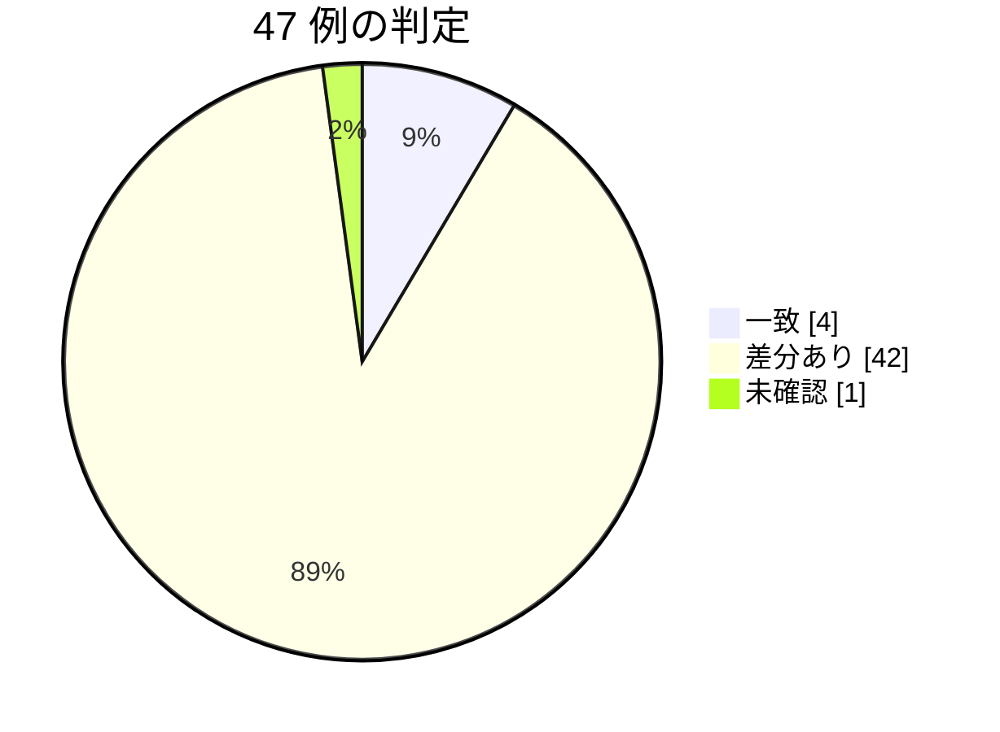

# 契約の確認 — egov 0.19.1 / nta 0.24.0（2026-10-04 JST）

段階 5 の版（houki-egov-mcp 0.18.0・0.19.0、houki-nta-mcp 0.24.0）と、段階 6 の段階 1 の houki-egov-mcp 0.19.1 が publish された。計画書（`2026-10-04-plan-stage6-and-followups.md`）の段階 2 に従い、reference-examples の呼び出し例 47 件を同じ引数で流し、例の主張が今も成り立つかを確かめた記録。同じ応答で例を取り直した（6a）ので、例の差し替えの状態も書く。

結論: **劣化は 0 件。** 一致 4 件、差分あり 42 件、未確認 1 件、判断できない 0 件。差分のほとんどは、段階 4（T4）から例に足していなかった `null` のフィールドと、段階 5 で予定どおり変えた応答（`search_law` の `total_count`、`explain_law_type` の `aliases`、`nta_get_kaisei_tsutatsu` の `code` など）。nta のローカル DB は、最初に流したとき 2026-10-04 に取り込み直した跡が plugin の応答に無く、shuji が `--bulk-download-everything` をやり直した後に検索 6 ツールを流し直した。タックスアンサーだけは取り込み直しの後も `stale` のままで、原因は索引から消えた記事 1 件の古い取得日時だった（「見つかったこと」2・7）。



## やり方

- 対象: `scripts/reference-examples/{houki-egov,houki-nta}/ja/*.md` の呼び出し例。egov 24 件、nta 23 件
- 実行: Claude Desktop の plugin（houki-egov-mcp 0.19.1 / houki-nta-mcp 0.24.0）を、例と同じ引数で 1 回ずつ呼んだ。2026-10-04 10:00〜10:25 頃（JST、+09:00）。版は shuji が Mac で `npx -y @shuji-bonji/houki-egov-mcp@latest --version`（`v0.19.1`）と `npx -y @shuji-bonji/houki-nta-mcp@latest --version`（`v0.24.0`）で確かめた
- 比べ方: 本文の一字一句ではなく、例が述べている「形」と「主張」（件数、ID、順、code、next_actions の action など）を比べた
- 判定の意味は 2026-10-03 の回と同じ。「一致」は例の主張がすべて成り立った。「差分あり」は形か値が変わったが主張は成り立つ（フィールドの追加、DB の取り込み日による値の変化、文言だけの差、仕様で決めた変更）。「劣化」は例の主張が成り立たなくなったもの。「未確認」は条件を再現できず流していないもの。「判断できない」は主張が成り立つかどうかを決められないもの

ローカル DB の状態:

egov（shuji が Mac で実行した `npx -y @shuji-bonji/houki-egov-mcp@latest --status` の出力。ホームは `~` に置き換えた）:

```text
[status] @shuji-bonji/houki-egov-mcp v0.19.1
  DB: ~/.cache/houki-egov-mcp/laws.db
  laws:     9,003 (版: 10,414)
  articles: 1,225,967
  sync:
    last_sync_date:  2026-10-04
    last_full_dl_at: 2026-10-03T19:19:36.391Z
    days_since_sync: 0
    staleness:       fresh
```

nta（検索ツールの応答の `freshness`。種別ごと）。最初に流したとき（10:00 頃）と、shuji が `npx -y @shuji-bonji/houki-nta-mcp@latest --bulk-download-everything` を実行した後（13:30 頃。質疑応答事例は 1,841 件すべて 304、`documentsNotModified: 1841`）の 2 回分:

| 種別 | 検索ツール | 1 回目 oldest / newest | 1 回目 staleness（日数） | 取り込み直し後 oldest / newest | 取り込み直し後 staleness（日数） |
| --- | --- | --- | --- | --- | --- |
| 基本通達 | `nta_search_tsutatsu` | 09-07T20:39:32Z / 09-07T20:49:00Z | stale（26） | 10-04T03:14:49Z / 10-04T03:24:14Z | fresh（0） |
| 改正通達 | `nta_search_kaisei_tsutatsu` | 09-07T20:49:01Z / 09-07T20:51:23Z | stale（26） | 10-04T03:24:14Z / 10-04T03:26:38Z | fresh（0） |
| タックスアンサー | `nta_search_tax_answer` | 09-07T21:01:50Z / 09-19T05:06:08Z | stale（26） | **09-07T21:06:49Z** / 10-04T03:51:17Z | **stale（26）** |
| 事務運営指針 | `nta_search_jimu_unei` | 09-12T18:40:26Z / 09-12T18:41:02Z | stale（21） | 10-04T03:26:38Z / 10-04T03:27:13Z | fresh（0） |
| 質疑応答事例（全税目） | `nta_search_qa` | 09-11T10:37:09Z / 09-24T08:42:22Z | stale（22） | 10-04T03:51:26Z / 10-04T04:26:15Z | fresh（0） |
| 文書回答事例 | `nta_search_bunshokaitou` | 09-08T07:27:19Z / 09-08T07:46:15Z | stale（25） | 10-04T03:27:23Z / 10-04T03:37:07Z | fresh（0） |

日付はすべて 2026 年、時刻は UTC。検索の 6 ツールの判定と例の差し替えは、取り込み直し後の応答で行った。

## 1. houki-egov-mcp 0.19.1

| ツール | 例の見出し | 例の実測版 | 判定 | 差分の中身 |
| --- | --- | --- | --- | --- |
| explain_law_type | 「通達は守らなくてよいのか」 | v0.5.3 | 差分あり | `info.aliases` から `通知` が消えた（0.18.0、`20261003-search-explain-attachment`）。`see_also` が GitHub の URL（T5）。ほかの `info` のフィールドと `related_tools` は同じ |
| get_article_references | 「所得税法 57 条の 2 第 2 項が引いている法令」 | v0.10.0 | 差分あり | `meta.at: null` が増えた（T4）。references 10 件・delegations 2 件（count 7/7、`target_law` は施行規則・施行令）・next_actions 7 件は同じ。本文に附則の参照が無いので `kind: "suppl"`（0.18.0）は出ない。例の文「`kind` は 3 つです」を 4 つに直した |
| get_attachment | 「日章旗の寸法図をディスクに置く」 | v0.15.0 | 差分あり | `meta.at: null` が増えた（T4）。kind "file"、saved.bytes 12614、response_content_type "image/jpeg"、location 別記第一（第一条関係）、updated は同じ |
| get_attachment | 一覧に無い `src` を渡したとき（`ATTACHMENT_NOT_FOUND`） | v0.15.0 | 一致 | error / code / hint（添付 2 件）/ next_actions[0]（list_attachments）が同じ |
| get_law | 「消費税法 57 条の 2 第 1 項の本文を JSON で」 | v0.5.3 | 差分あり | `data.item_num: null`・`data.suppl_index: null`（0.18.0、SPEC-EGOV-GET-LAW-043）・`meta.at: null` が増えた。article_num "57_2"・paragraph_num 1・node と本文は同じ |
| get_law | 「消費税法 30 条 2 項を Markdown で」 | v0.5.4 | 差分あり | `meta.at: null` が増えた。markdown（号は「一」「二」、イ・ロは箇条書き、末尾の出典の行）は同じ |
| get_law | 「所得税法 89 条 1 項を Markdown で」（項の直下の表） | v0.5.4 | 差分あり | `meta.at: null` が増えた。見出し行が空の表 7 行と本文は同じ |
| get_law | 枝番号の号（消費税法 2 条 1 項 8 号の 2） | v0.6.0 | 差分あり | `meta.at: null` が増えた。見出しと本文は同じ |
| get_law | 存在しない条を指定したとき（`ARTICLE_NOT_FOUND`） | v0.5.3 | 一致 | error / code / hint / next_actions[0] が同じ |
| get_law_file | 「民法の全文を Word で」（URL だけ） | v0.15.0 | 差分あり | `meta.at: null` が増えた。content_type・url・note は同じ |
| get_law_file | 「2020 年 4 月 1 日時点の国旗国歌法を HTML で保存」 | v0.15.0 | 差分あり（例の文が古い） | 応答は例と同じ（url に `?asof=2020-04-01`、saved.bytes 38537、law_revision_id、meta.at "2020-04-01"）。例の後の文「50 MB を超えるときは … `INVALID_ARGUMENT`」を `FILE_TOO_LARGE` に直した（2026-10-03 の回の見つかったこと 1） |
| get_law_range | 「民法の契約の章をまとめて読みたい」 | v0.14.0 | 差分あり | `meta.at: null` が増えた。body_chars は例 29911 → 現行 29919（2026-09-21 の回から同じ値。e-Gov の本文の更新）。article_count 198、returned_count 186、truncated、first・last、next_from_article "685"、next_actions[0].example は同じ |
| get_law_range | 「遺留分の章だけ読みたい」（`path`） | v0.14.0 | 差分あり | 応答に `meta.at: null` が増えた（例は `meta` を載せていない）。article_count 8、body_chars 2284、第1044条に caption 無し、truncated false は同じ |
| get_law_range | 「章だけ指定したら候補が返ってきた」 | v0.14.0 | 一致 | INVALID_ARGUMENT、hint に 5 パス、next_actions 5 件が同じ |
| get_law_range | 「附則の 7 本目を読む」 | v0.14.0 | 差分あり | 応答に `meta.at: null` が増えた。article_count 0、body_chars 21、articles []、note は同じ |
| get_law_revisions | 「消費税法の直近の改正と施行日」 | v0.5.3 | 差分あり | `meta.at: null` が増えた。total 65、2 件の law_revision_id・日付・status "UnEnforced" は同じ |
| get_related_laws | 「所得税法の施行令と施行規則」 | v0.10.0 | 差分あり | `meta.at: null` が増えた。related 2 件（abbr 所令 / 所規）、not_found []、method、next_actions 2 件は同じ |
| get_toc | 「民法の大区分だけ見たい」 | v0.14.0 | 差分あり | `meta.at: null` が増えた。toc 5 件（Part1〜Part5）、suppl.count 67 / article_count 201、node_count 5、truncated true、附則(1) paragraph_only、附則(3) extract は同じ |
| list_attachments | 「国旗国歌法の日章旗の寸法図はどこにあるか」 | v0.15.0 | 差分あり | `meta.at: null` が増えた。count 2、location 別記第一 / 別記第二、zip_url、next_actions 1 件は同じ |
| list_attachments | 「戸籍法施行規則の様式（届書の書式）を一覧で」 | v0.15.0 | 差分あり | `meta.at: null` が増えた。`2FH00000076885.pdf` の updated は例 "…10:10:24+09:00" → 現行 "…10:10:26+09:00"（2026-09-21 の回から同じ値）。count 42・jpg 7・pdf 35・law_revision_id・next_actions 2 件は同じ |
| resolve_abbreviation | 「消基通 は何の略で、どのサーバーが担当か」 | v0.5.3 | 差分あり（例の文が古い） | `in_scope: false` と `hint` が付いた（0.16.0）。`resolved.aliases` が返らない（houki-abbreviations 0.7.0）。`law_id` null・`source_mcp_hint` "houki-nta" は同じ。2026-10-03 の回の見つかったこと 1 のとおり例を直した |
| search_fulltext | 「民法で不法行為に関係する条は」 | v0.5.3 | 差分あり | `filters.domain.note` が「分野での絞り込みはしていません（domain の引数は 0.18.0 で外しました）」（0.18.0）。freshness は last_sync_date "2026-10-04"・fresh。score が少し変わった（0.701 / 0.685 / 0.677）。source "bulk"、count 3、ヒット順 724 / 724の2 / 719、law_scope は同じ。`expanded_keywords` は無い（法令名と語をそのまま検索したため） |
| search_law | 「個情法の正式名と法令番号を知りたい」 | v0.5.3 | 差分あり | `total_count` が例 3 → 現行 17（0.18.0、SPEC-EGOV-SEARCH-LAW-006。e-Gov で一致した総数）。`hint: null` と `next_actions: []` が増えた（SPEC-EGOV-SEARCH-LAW-017）。query.resolved と results の 3 件は同じ |
| verify_citations | 「書こうとしている引用 5 件をまとめて確かめる」 | v0.14.0 | 差分あり | summary（3/1/1）と各件の status・code・reason は同じ。`article.suppl_index: null`（0.18.0）と `meta`（`at: null`）が増えた。not_found・ambiguous の件にも `resolved_by: "abbreviation"` と `law` が付いている（2026-10-03 の回の「例は抜粋で省いた可能性あり」は、今回の取り直しで例に足した） |

劣化: なし。段階 5 の proposal.md の「呼び出し例への影響」に挙がった箇所（`get_article_references.md` の `kind` の数、`search_law.md` の `total_count`・`hint`・`next_actions`、`search_fulltext.md` の `filters.domain.note`、`explain_law_type.md` の `aliases` の `通知`）は、どれも予定どおりの値で返った。0.19.0 / 0.19.1 は MCP のツールの応答を変えていない（CHANGELOG の「互換性」のとおり）。

## 2. houki-nta-mcp 0.24.0

| ツール | 例の見出し | 例の実測版 | 判定 | 差分の中身 |
| --- | --- | --- | --- | --- |
| nta_get_bunshokaitou | 「産科医療特別給付事業の給付金は非課税か」（本庁系） | v0.10.4 | 差分あり | `document.orphanedAt` と、上の段の `index_status` / `orphaned_at` / `notice` が `null` で付いた（T4）。document の各値・fetchedAt（2026-09-08）・legal_status は同じ |
| nta_get_bunshokaitou | 国税局系（`tokyo/shohi/251017`） | v0.10.4 | 差分あり | 同上。本文・issuer・関係する法令条項等の行は同じ |
| nta_get_jimu_unei | 「酒税の書面添付制度の事務運営指針」（検索結果の 2 件目） | v0.10.4 | 差分あり（見出しが古い） | attachedPdfs[] に `kind: "attachment"`、索引の印の null、`legal_status.note` が「通達・事務運営指針は行政内部文書であり、…」（0.23.0）。fetchedAt が 2026-09-12（DB の再取得）。取り込み直し後の `nta_search_jimu_unei` では、この文書は 2 件目ではなく 3 件目になった（下の `nta_search_jimu_unei` の行）。見出しの「（検索結果の 2 件目）」は変えない指示なので、そのままにした |
| nta_get_kaisei_tsutatsu | 「令和 7 年 4 月 1 日の消基通改正の本文と添付 PDF」 | v0.10.4 | 差分あり | attachedPdfs[] に `kind: "comparison"`（3 件とも）、索引の印の null。そのほかは同じ |
| nta_get_kaisei_tsutatsu | 「docId を打ち間違えたとき」 | v0.14.1 | 差分あり（例の JSON が古い） | `code` が `TSUTATSU_NOT_FOUND` → `DOC_NOT_FOUND`（SPEC-NTA-GET-KAISEI-TSUTATSU-001・002）。error・hint・available_doc_ids（30 件）・next_actions・tool は同じ形。DB は 118 件のまま。2026-10-03 の回の見つかったこと 1 のとおり例を直した。例の `available_doc_ids` の先頭 3 件が実際の並びと違っていた（例は 1・5・15 件目を並べていた）ので、実際の先頭 3 件にした |
| nta_get_qa | 「消費税の質疑応答事例 02/19」 | v0.17.0 | 差分あり | 上の段の索引の印（`index_status` / `orphaned_at` / `notice`）が null で付いた。qa の各値・related_laws・related_tsutatsu・next_actions は同じ |
| nta_get_qa | 枝番号の号を挙げている事例（法人税 33/02） | v0.14.0 | 差分あり | related_laws 3 件（item "12の8" を含む）と next_actions 3 件は同じ。索引の印の null が付いた（例は抜粋で載せていない） |
| nta_get_tax_answer | 「No.6101 消費税の基本的なしくみ」 | v0.17.0 | 差分あり（例の文が古い） | `taxAnswer.basisDate`（2025-04-01）と索引の印の null が付いた。sections の見出し 7 つ・effectiveDate・fetchedAt は同じ。例の冒頭の「番号の先頭の桁で税目を判定します」は 0.24.0（#128、SPEC-NTA-GET-TAX-ANSWER-003）から「国税庁の索引で URL を決めます」なので直した |
| nta_get_tsutatsu | 「消基通 1-7-2（登録番号の構成）の本文」 | v0.21.0 | 一致 | clause・paragraphs 3 件・fetchedAt・base_laws・next_actions が同じ。例の文の「法令名を渡すと `OUT_OF_SCOPE`」も `name: "消費税法"` で確かめた |
| nta_inspect_pdf_meta | 「改正通達 0025004-026 の PDF は、どれをどう読めばよいか」 | v0.20.0 | 差分あり | 索引の印の null が付いた。attachedPdfs 3 件の kind・read_strategy・layout_note、next_actions 2 件は同じ |
| nta_inspect_pdf_meta | 「新旧対照表だけを保存して、表として取る」 | v0.20.0 | 差分あり | 索引の印の null が付いた。saved 3 件の bytes と cached: true は同じ |
| nta_search_bunshokaitou | 「産科医療の給付金に関する文書回答事例」 | v0.10.4 | 差分あり | 2 件の docId・順・issuedAt は同じ。results[] に basisDate / index_status / orphaned_at の null が付いた（T4）。snippet が長くなり、score が少し変わった（0.518 / 0.490）。fresh |
| nta_search_bunshokaitou | 別紙の本文にしかない語で引く | v0.10.4 | 差分あり | 1 件・docId・score（0.536）は同じ。results[] に null 3 つ。fresh |
| nta_search_bunshokaitou | 税目の別表記をまとめて検索する | v0.14.0 | 差分あり | 3 件の docId・taxonomy・順と search_notes の文は同じ。results[] に null 3 つ。fresh |
| nta_search_jimu_unei | 「書面添付制度の事務運営指針」 | v0.10.4 | 差分あり（データ側） | 1 件目（hojin/090401-2）は同じ。2 件目が `shozei/090401` から `shotoku/shinkoku/090401` に変わった（score 0.4457。`shozei/090401` は 0.4455 で 3 件目。2〜5 件目は 0.441〜0.446 に並ぶ）。results[] に null 3 つ。`legal_status.note` が「通達・事務運営指針は行政内部文書であり、…」になった（0.24.0、#80。2026-10-03 の回の見つかったこと 3 が片付いた）。fresh |
| nta_search_kaisei_tsutatsu | 「インボイス関係の改正通達を新旧対照表付きで」 | v0.10.4 | 差分あり | 2 件の docId・順・scoreReasons（略称展開）は同じ。score 0.250 / 0.248。results[] に null 3 つ。search_notes（略称展開の説明）が付いた。fresh |
| nta_search_qa | 「テレワークに関係する質疑応答事例」 | v0.10.4 | 差分あり | 1 件（hojin/04/16）は同じ。results[] に issuedAt / basisDate / index_status / orphaned_at の null。score 0.341。fresh。例の文の `hasPdf: true` の場合（`results: []` と「PDF 付きの文書はありません」の hint）も確かめた |
| nta_search_qa | 税目（topic）で絞る | v0.13.0 | 差分あり（例の文が古い） | 1 件（shohi/21/10）は同じ、score 0.199。results[] に null 4 つ。fresh。例の後の文の `domain` の説明は、0.24.0（#72）で `domain` を外し、渡すと `INVALID_ARGUMENT` になったので古い（CHANGELOG と SPEC-NTA-SEARCH-QA の差分のとおり。plugin のツールの inputSchema に `domain` が無いことも確かめた）。直した |
| nta_search_qa | キーワードに合う文書が無いとき | v0.13.0 | 差分あり | results []・hint の文（1,841 件）は同じ。fresh |
| nta_search_tax_answer | 「医療費控除のタックスアンサー」 | v0.10.4 | 差分あり（データ側） | 1 件目（1131）は同じ。2 件目が 1127 から 1128 に変わった（score 0.2495 / 0.2495 でほぼ同じ。1127 は 3 件目）。basisDate が "2026-04-01"（国税庁のページの更新）、索引の印の null、next_actions（nta_get_tax_answer、no 1131）が付いた（T5）。`--bulk-download-everything` の後も `oldest_fetched_at` が 2026-09-07 のままで `stale`。原因は索引から消えた No.2882 の古い取得日時で、SPEC-NTA-SEARCH-RULES-017（範囲は「タックスアンサー全体」）のとおり。最初は判断できないとして差し替えを止め、原因を確かめてから差し替えた（見つかったこと 7） |
| nta_search_tsutatsu | 「軽減税率に関係する通達の節は」 | v0.11.1 | 差分あり | count 2・hits 2 件（5-9-10 / 5-9-5）・base_laws_by_tsutatsu・next_actions は同じ。score 0.4414 / 0.4384。snippet が長い。fresh |
| nta_search_tsutatsu | DB が古いとき（`staleness: "outdated"`） | v0.10.2 | 未確認 | 126 日たった DB を用意できないため流していない |
| resolve_abbreviation | 「電帳法 は houki-nta-mcp で引けるか」 | v0.10.4 | 差分あり | resolved・in_scope: false・hint は同じ。next_actions（delegate_to_mcp、mcp houki-egov）が付いた（T5） |

劣化: なし。0.24.0 で変えた応答のうち例に出るもの（`nta_search_jimu_unei` の `legal_status.note`、`nta_search_qa` の `domain` の削除、`nta_get_tax_answer` の URL の決め方）は、CHANGELOG の「互換性」のとおりだった。

## 3. 呼び出し例の差し替え（6a）の状態

houki-hub のブランチ `docs/20261004-examples-egov-0.19-nta-0.24`（分岐元 main `50bffd0`）に、ツールごとに 1 コミットで差し替えた。

| サーバー | 差し替えたファイル | 保留したファイル |
| --- | --- | --- |
| houki-egov | 14 ファイル（24 例）すべて | なし |
| houki-nta | 取得 7 ファイル（`nta_get_*` 6・`nta_inspect_pdf_meta`）と `resolve_abbreviation.md`（12 例）、検索 6 ファイル（`nta_search_*`。10 例） | `nta_search_tsutatsu.md` の未確認の 1 例 |

## 見つかったこと

1. **2026-10-03 の回の見つかったこと 1 の 3 件は直した**: `get_law_file` の 50 MB の文（→ `FILE_TOO_LARGE`）、`nta_get_kaisei_tsutatsu` の `code`（→ `DOC_NOT_FOUND`）、egov `resolve_abbreviation` の `resolved.aliases`（外した）と `in_scope`・`hint`（足した）
2. **最初に流したとき、nta の DB に 2026-10-04 の取り込みの跡が無かった**: 計画では egov・nta とも 2026-10-04 に DB を新しくしてから流す前提だったが、plugin の nta の検索 6 ツールが返す `freshness` は、どの種別も `oldest_fetched_at` が 2026-09-07〜09-12、`newest_fetched_at` が最大で 2026-09-24 だった。差分更新で 304 が返った節・文書も `fetched_at` は書き換わる（cli_refresh の未決 1）ので、plugin が開く DB（既定 `~/.cache/houki-nta-mcp/cache.db`）とは別のファイルに取り込んだ可能性がある。段階 3 の T6（DB の場所の見え方）の実例になりうる。shuji が `--db-path` と `HOUKI_NTA_DB_PATH` を付けずに `--bulk-download-everything` を実行した後は、タックスアンサーを除いて `fresh` になった。このとき質疑応答事例は 1,841 件すべて 304 だったので、plugin の DB には前回の `last_modified` / `etag` が入っていた。前回の 2026-10-04 の取り込みがどのファイルに入ったのか、そもそも実行されていなかったのかは確かめていない
3. **例の文の古さが別に 2 件あった**: `nta_get_tax_answer.md` の冒頭の「番号の先頭の桁で税目を判定します」（0.24.0 から国税庁の索引で URL を決める）と、`nta_get_kaisei_tsutatsu.md` の `available_doc_ids` の先頭 3 件（実際の並びと違っていた）。どちらも直した
4. **応答の上の段の `notice` と `qa.notice` は別のもの**: `nta_get_qa` の json は、上の段の `notice`（索引から外れたときの注記、索引にあれば `null`）と `qa.notice`（国税庁のページ下部の注記）を両方持つ。仕様どおりで劣化ではないが、名前が同じなので例の文で区別を書いた
5. **plugin の egov のツールが会話の途中まで見えなかった**: 会話の始めは `plugin_houki-egov-mcp_*` がツールの一覧に無く、途中で現れた。0.19.1 への更新の後に plugin が再起動した時刻と関係する可能性がある（確かめていない）
6. 未確認 1 件（nta `nta_search_tsutatsu` の「DB が古いとき」）は、前回と同じく流していない。`check-example-versions.mjs` の照合から外す書き方は 4 章
7. **タックスアンサーは、取り込み直しの後も `staleness: "stale"` のまま。原因は索引から消えた記事 1 件**: `nta_search_tax_answer` の `freshness` は、`newest_fetched_at` が 2026-10-04T03:51Z になったのに、`oldest_fetched_at` が 2026-09-07T21:06:49Z のまま残り、`days_since_oldest: 26` で `stale` だった。shuji が `~/.cache/houki-nta-mcp/cache.db` を引いた結果、`doc_type = 'tax-answer'` で `fetched_at < '2026-10-01'` の行は 1 件だけで、No.2882（`gensen/2882.htm`、`orphaned_at` は 2026-10-04T02:11:37Z）だった。投入は索引から消えた記事に `orphaned_at` を付けて行を残し（SPEC-NTA-SEARCH-RULES-011、行は消さない）、取り直さないので `fetched_at` は古いまま残る。`freshness` の範囲は「タックスアンサー全体」（SPEC-NTA-SEARCH-RULES-017）で、索引から消えた行を外すとは書いていない。したがって今の動きは仕様どおりで、劣化ではない。ただし次の点で仕様の穴になっている
   - 索引から消えた文書が 1 件でもあると、その種別は投入を何度やり直しても `fresh` に戻らない。No.2882 の行は 2026-10-07（2026-09-07 から 30 日）に `outdated` になり、`warning` は「最新化するには `--bulk-download-tax-answer` を実行してください」と案内するが、実行しても直らない
   - 同じことは、索引から文書が消えうる他の 4 種別（質疑応答事例・改正通達・事務運営指針・文書回答事例）でも起きうる
   - houki-nta-mcp の Issue の草案を `docs/notes/issues-2026-10-04-nta-freshness/nta-freshness-orphaned.md` に置いた（投稿は shuji）
8. **jimu-unei と tax-answer の検索の順が入れ替わった**: どちらも 2 件目以降の score がほぼ同じ（差が 0.0002〜0.0005）で、取り込み直しで順が変わった。`nta_get_jimu_unei.md` の見出し「（検索結果の 2 件目）」が実際と合わなくなった。見出しは変えない指示なので残した。見出しから「（検索結果の 2 件目）」を外すかは shuji が決める
9. **`check-example-versions.mjs` は macOS の `/tmp` から起動すると何も出さない**: `feat/5-change-detection` の版を `/tmp` に取り出して `node /tmp/check-example-versions.mjs` で起動すると、`resolve(process.argv[1])`（`/tmp/…`）と `fileURLToPath(import.meta.url)`（`/private/tmp/…`）が一致せず、`main()` が呼ばれないまま終了コード 0 で終わる。`/private/tmp/…` で起動すると動いた（例 47 件のうち古い 11、現行 36。取り込み直しの前の結果）。0-a で `realpathSync` で比べる形に直す案

## 4. 未確認の 1 例を `check-example-versions.mjs` の照合から外す書き方（案）

`check-example-versions.mjs` は main に入っていない（`feat/5-change-detection` にある。計画書の 0-a）。そのため、ここでは書き方を決めて報告するだけにし、スクリプトは変えていない。

案: 例の先頭の「- 実測: vX（日付）」の次の行に、照合から外すことと理由を書く行を置く。

```markdown
::: details 呼び出し例 — DB が古いとき（`staleness: "outdated"`）
- 実測: v0.10.2（2026-09-07）。同じ呼び出しを、最後の取り込みから 126 日たった DB に対して行ったときの応答です
- 版の照合: しない（126 日たった DB を用意できず、取り直せないため）
```

`parseExamples` は `- 版の照合: しない` の行を見たら `excluded: true` と理由を持たせ、`classifyExamples` は `status: "excluded"` を返す。`--strict` の失敗の数には入れず、表には「照合しない」として理由と一緒に出す。見出しの直後の行の並びで決める今の読み方（`MEASURED_RE`）を変えずに済み、外した例が表から消えないので見落としにもならない。

`feat/5-change-detection` の `scripts/check-example-versions.mjs` を、作業コピーに置かずに現行版を引数で渡して流した結果（`--current houki-egov=0.19.1 --current houki-nta=0.24.0`）: 検索 6 ファイルを差し替えた後で、例 47 件のうち古い 1、現行 46。古い 1 件は未確認の 1 例だけ。

## 5.2 の条件との関係

計画書 5.2 は段階 2 で全 47 例を流すとしている。今回は 46 件を流し、劣化は 0 件だった。0.19.1 はツールの応答を変えないので、publish の条件は 5.1 の取り込みの確認（2）のまま。

実行環境: Claude Desktop の plugin（houki-egov-mcp 0.19.1 / houki-nta-mcp 0.24.0）。呼び出しは 1 件ずつ手で行い、判定の作業表は残していない（この文書の表がすべて）。
