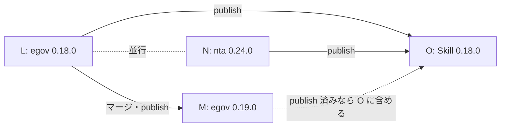

# 段階 5 の実装 PR の指示（egov 0.18.0・0.19.0 / nta 0.24.0）と Skill の追随

2026-10-04（JST）に作った、段階 5 の実装を別の会話に渡すための指示です。仕様 PR は egov・nta ともすべて承認・マージ済みです。AGENTS.md の決まり（Steward と Coder は同じ会話で起動しない）に従い、実装は新しい会話で行います。仕様 PR の指示は `2026-10-03-stage5-spec-instructions.md`（H〜K）です。

マージ済みの仕様 PR（2026-10-04 に origin の main で確認。egov `3bef281`、nta `2eab6e9`）:

| リポジトリ | 差分（`specs/changes/`） | PR | Issue | 版 |
| --- | --- | --- | --- | --- |
| houki-egov-mcp | `20261003-law-resolution` | #95 | #45・#51・#63・#87 | 0.18.0 |
| houki-egov-mcp | `20261003-search-explain-attachment` | #96 | #55・#67・#88・#62・#72 | 0.18.0 |
| houki-egov-mcp | `20261003-law-type-and-reference-actions` | #99 | #97・#98 | 0.18.0 |
| houki-egov-mcp | `20261003-db-cli` | #100 | #58・#59・#60・#61・#71 | 0.19.0 |
| houki-egov-mcp | `20261003-db-cli-followup` | #103 | #101・#102 | 0.19.0 |
| houki-nta-mcp | `20261003-specs-current-catchup`（実装の変更: 不要。current は反映済み） | #132 | #123 | 0.24.0 |
| houki-nta-mcp | `20261003-search-rules` | #133 | #80・#81・#72 | 0.24.0 |
| houki-nta-mcp | `20261003-source-paths` | #134 | #120・#128・#131 | 0.24.0 |
| houki-nta-mcp | `20261003-db-cli` | #135 | #106・#107・#109・#110・#111・#112（と #128 の索引のテーブル） | 0.24.0 |

## 4 つの会話と順序

| 指示 | 内容 | 始める条件 |
| --- | --- | --- |
| L | houki-egov-mcp 0.18.0 の実装 PR | すぐ |
| M | houki-egov-mcp 0.19.0 の実装 PR | L の実装 PR がマージされた後（同じチェックアウトを使い、取り込みの順が 0.18.0 → 0.19.0 と決まっているため） |
| N | houki-nta-mcp 0.24.0 の実装 PR | すぐ（L と並行） |
| O | houki-research-skill 0.18.0 の追随 | egov 0.18.0 と nta 0.24.0 の両方を publish した日（どちらも code を置き換えるので、T2 の互換の扱いで Skill の `docs/ERROR-CODES.md` を同じ日に直す） |



publish の前の契約の確認（計画書 5.2）は shuji が Mac で行います。egov 0.18.0 は変えたツールの例、egov 0.19.0 は全 47 例（版 3 の DB を `--bulk-download-everything` で作り直してから）、nta 0.24.0 は全 47 例（版 12 への移行の後の DB で）を流します。

---

## 指示 L: houki-egov-mcp 0.18.0

```text
houki-egov-mcp の段階 5（0.18.0）の実装 PR を作ってください。この会話の役は Test Designer → Coder → Spec Publisher です（AGENTS.md の「役割」）。仕様 PR は 3 本とも承認・マージ済みで、この会話では仕様の意図を変えません。

## 場所と版

- リポジトリ: /Users/bonji/workspace/shuji-bonji/houki-hub/mcp/houki-egov-mcp（Cowork の device_bash では $HOME/mnt/houki-hub/mcp/houki-egov-mcp）
- 起点: main の 3bef281。作業の前に git fetch https://github.com/shuji-bonji/houki-egov-mcp.git main で main が origin と同じか確かめる
- ブランチ: feat/<作業日の yyyymmdd>-0.18.0
- 版: 0.17.0 → 0.18.0
- この PR で閉じる Issue: #45 #51 #63 #87 #55 #67 #88 #62 #72 #97 #98
- 0.19.0 の差分（20261003-db-cli・20261003-db-cli-followup）はこの PR では触らない。specs/changes/ に残したままにする

## 最初に読むもの（この順）

1. AGENTS.md（PR の種類・役割・仕様 ID・REMOVED のテストの扱い・ff マージ）と CONTRIBUTING.md の「コーディング規約」
2. specs/changes/20261003-law-resolution/ の proposal.md と specs/*/spec.md（PR #95）
3. specs/changes/20261003-search-explain-attachment/ の proposal.md と specs/*/spec.md（PR #96）
4. specs/changes/20261003-law-type-and-reference-actions/ の proposal.md と specs/*/spec.md（PR #99）
5. 差分が参照する specs/current/<dir>/spec.md の仕様 ID
6. 前の版の実装 PR の形の手本: specs/releases/v0.17.0/ と CHANGELOG.md の 0.17.0

各 proposal.md の「実装の変更」「実装 PR で直す文書」「互換性」「取り込みのとき（Publisher）」が、この会話の作業の一覧です。「人が判断すること」は書かれている側で承認済みです。仕様の本文が正で、proposal.md の表は要約です。仕様に書かれていない判断が要ったら、実装で決めずに止めて私に聞いてください。

## 守ること

- specs/changes/ は書き換えない。specs/current/ は最後の取り込みのコミットでだけ書く
- テストは仕様の本文と「例:」から書き、実装を見て期待値を足さない。it の名前の先頭に仕様 ID を入れる
- テストを消して GREEN にしない。既存のテストの期待値が承認済みの差分で変わるとき（完全一致しない法令名で 1 件目を使う、附則の条を本則の条として返す、404 が SOURCE_API_ERROR、domain を受け付ける、ImperialOrdinance、通達の aliases に通知、など）は、その差分の仕様 ID を名前に入れて書き換える
- 値の無いフィールドは null で置き、キーを消さない（T4）。新しく足す suppl_index・target_law・hint・next_actions も、無いときは null か [] で常に置く（各差分の本文どおり）
- code を置き換える箇所（SOURCE_API_ERROR → LAW_NOT_FOUND / INVALID_ARGUMENT など）は、proposal.md の「互換性」の表のとおりにし、表に無い置き換えはしない
- e-Gov への実際の問い合わせはテストで行わない（既存のテストと同じく応答を差し替える）。proposal.md の「確かめた値」の e-Gov の応答（404004・404001・400044、保険法の 114 件など）を差し替えの値に使う
- TS のコードで文字列を + でつながない（テンプレートリテラル）
- 公開文書（README・tools/list の description・CLI の使い方）の文は「〜します」「〜です」で書く
- 仕様と実装の食い違いや、仕様どおりにすると壊れる箇所を見つけたら、コードで勝手に合わせずに報告する（新しい specs/changes が要る）
- コミットを作るところまで。署名・push・PR の作成・マージ・タグは私が行う

## コミットの順

1. test: law-resolution … → feat/fix: law-resolution …（#45・#51・#63・#87）
2. test: search-explain-attachment … → feat/fix: …（#55・#67・#88・#62・#72）
3. test: law-type-and-reference-actions … → fix: …（#97・#98）
4. docs: 3 つの proposal.md の「実装 PR で直す文書」（tools/list の description・README の表）
5. chore: v0.18.0 — package.json・server.json の版と CHANGELOG
6. spec: 3 つの差分を specs/current/ に取り込み、specs/releases/v0.18.0/ へ移す（最後のコミット）

test: のコミットでは新しいテストが落ち、次の feat: / fix: で通ることを確かめる。差分をまたぐ箇所（search_law・search_fulltext・list_attachments）は、上の順を崩さずに分ける。

## CHANGELOG の 0.18.0

- 日付は仮に作業日を書く。publish する日に私が直す
- 「互換性」の節に、3 つの proposal.md の「互換性」の表をまとめて書く（旧 → 新、Issue 番号と仕様 ID）。T2 の互換の扱い（旧 code を並行して返さない、同じ日に houki-research-skill の docs/ERROR-CODES.md を直す）も書く
- 閉じる Issue を列挙する

## 取り込み（最後のコミット）

- 3 つの proposal.md の「取り込みのとき（Publisher）」に従う。順は law-resolution → search-explain-attachment → law-type-and-reference-actions
- 各 spec.md の承認日の行に「差分 `<名前>` は 2026-10-03（PR #95 / #96 / #99）」を足す。日付は各 proposal.md の「- 承認日:」の行の値を写す
- git mv で 3 つの差分を specs/releases/v0.18.0/ へ移し、各 proposal.md の「状態」を「取り込み済み（v0.18.0）」にする
- npx spec-ids check と、BASE_REF=main HEAD_REF=<ブランチ> node .github/scripts/check-pr-scope.mjs を通す

## 検証

- npm run build・npm test・npm run lint・npx spec-ids check は私の Mac か CI で通す。結果を貼るので、落ちたら直す
- Cowork の VM（device_bash）で作業する場合: git を使う前に houki-hub フォルダーの削除許可を取る（.git の lock が残るため。接続し直すと許可が消える）。VM の git には user.name が無いので GIT_AUTHOR_NAME="shuji narumi" GIT_AUTHOR_EMAIL="71716610+shuji-bonji@users.noreply.github.com"（COMMITTER も同じ）を渡す。git fetch の後に .git/objects/maintenance.lock が残ったら消す。node_modules は Mac と共有しているので npm install・npm rebuild はしない。VM から npm の registry と GitHub の SSH には届かない
- 呼び出し例の grep: 実装の前に、houki-hub の scripts/reference-examples/houki-egov/ja/ と houki-research-skill の skills/houki-research/ を ImperialOrdinance・domain・suppl で grep し直す（proposal.md の「呼び出し例への影響」は 2026-10-03 の結果）

## 終わったら報告すること

- コミットの一覧（ハッシュと件名）
- 新しく足したテストと書き換えたテストの数、仕様 ID ごとの対応
- spec-ids check と pr-scope の結果
- 仕様に無い判断が要った点、食い違いの報告
- 契約の確認で出るはずの差分の一覧（ツールごと。code が変わる例、suppl_index・target_law・hint・next_actions の追加など）
- houki-research-skill で直す箇所の一覧（O の会話に渡す）
- PR 本文の草案（Closes #45 #51 #63 #87 #55 #67 #88 #62 #72 #97 #98、仕様 PR #95 #96 #99 への言及、末尾に 🤖 Generated with [Claude Code](https://claude.com/claude-code)）
```

---

## 指示 M: houki-egov-mcp 0.19.0

L の実装 PR がマージされた後に、新しい会話に貼ります。

```text
houki-egov-mcp の段階 5（0.19.0、DB と CLI）の実装 PR を作ってください。この会話の役は Test Designer → Coder → Spec Publisher です。仕様 PR は 2 本とも承認・マージ済みで、この会話では仕様の意図を変えません。

## 場所と版

- リポジトリ: /Users/bonji/workspace/shuji-bonji/houki-hub/mcp/houki-egov-mcp（device_bash では $HOME/mnt/houki-hub/mcp/houki-egov-mcp）
- 起点: main の f1dee68（v0.18.0 のタグと同じ）。git fetch で origin と同じか確かめ、specs/releases/v0.18.0/ があり、specs/changes/ に 20261003-db-cli と 20261003-db-cli-followup だけが残っていることを確かめる
- 0.18.0 では、取り込みのコミットの後に search_law の 0 件の判定の直し（d0dffa0、#55）と law-search.ts のコメントの直し（f1dee68）が入っている。0.19.0 の差分はこの 2 つと重ならない見込みだが、search_fulltext の spec.md を触るときは specs/current の今の本文を正にする
- 0.18.0 の後に立った #105（法令名の完全一致の照合で、時点の題名を取りこぼす可能性）は 0.19.0 に含めない。仕様 PR が無いので、この会話では触らない
- ブランチ: feat/<作業日の yyyymmdd>-0.19.0
- 版: 0.18.0 → 0.19.0
- この PR で閉じる Issue: #58 #59 #60 #61 #71 #101 #102

## 最初に読むもの（この順）

1. AGENTS.md と CONTRIBUTING.md
2. specs/changes/20261003-db-cli/ の proposal.md と specs/*/spec.md（PR #100）。とくに「場面ごとの規則」の表 1・表 2
3. specs/changes/20261003-db-cli-followup/ の proposal.md と specs/*/spec.md（PR #103）
4. 差分が参照する specs/current/<dir>/spec.md（db_schema・cli_entry・cli_bulk_download・cli_sync・cli_status・search_fulltext）
5. 手本: specs/releases/v0.18.0/ と CHANGELOG.md の 0.18.0

## 守ること

指示 L の「守ること」と同じ。加えて:
- DB のスキーマの版は 3 に 1 回だけ上げる（#59・#60・#71 を分けない）
- REMOVED の SPEC-EGOV-DB-SCHEMA-024 のテスト（src/spec-tests/20261001-t3-normalize/normalize.test.ts の 024 の it）は、取り込みと同じコミットで消す（AGENTS.md）。clearAllData とその仕様 ID の無いテストは、proposal.md の「実装の変更」のとおり消してよい
- 新しい版・読めない版の DB はどの入口も書き換えないこと（SPEC の表 2）を、実ファイルを使うテストで確かめる。テストは一時ディレクトリの DB だけを使い、~/.cache の利用者の DB に触れない
- 環境変数の検査（#102）は、egov-client.ts の読み込み時の createLimit() より前に済ませる（proposal.md の「実装の変更」）

## コミットの順

1. test: db-cli … → feat/fix: db-cli …（#58・#59・#60・#61・#71。スキーマの版上げを含む）
2. test: db-cli-followup … → fix: …（#101・#102）
3. docs: 2 つの proposal.md の「実装 PR で直す文書」（README・CLI の使い方。約 290 MB の取り込み直しの案内を含む）
4. chore: v0.19.0 — package.json・server.json の版と CHANGELOG
5. spec: 2 つの差分を specs/current/ に取り込み、specs/releases/v0.19.0/ へ移す（最後のコミット）

## CHANGELOG の 0.19.0

- 「互換性」の節に、2 つの proposal.md の「互換性」の表をまとめて書く。DB の版が 3 になり、--bulk-download-everything で作り直す必要があること（約 290 MB）、0.19.0 で作った DB を 0.18.0 以前で開いたときの動き、CLI の終了コード 2 の追加を目立つ位置に書く
- 閉じる Issue を列挙する。日付は仮に作業日

## 取り込み（最後のコミット）

- 2 つの proposal.md の「取り込みのとき（Publisher）」に従う。順は db-cli → db-cli-followup（SPEC-EGOV-SEARCH-FULLTEXT-004 の箇条書きへの 1 行の追記は db-cli-followup の取り込みで行う）
- 承認日の行に「差分 `20261003-db-cli` は 2026-10-03（PR #100）」「差分 `20261003-db-cli-followup` は 2026-10-03（PR #103）」を足す（各 proposal.md の値を写す）
- git mv で specs/releases/v0.19.0/ へ移し、「状態」を「取り込み済み（v0.19.0）」にする
- npx spec-ids check と pr-scope を通す

## 検証

指示 L の「検証」と同じ。加えて、契約の確認（全 47 例）は私が Mac で版 3 の DB を作り直してから行うので、作り直しの手順（コマンドと所要時間の目安）を報告に書く。houki-hub の scripts/reference-examples/houki-egov/ja/ で freshness の warning の文や CLI の出力を載せた例を grep し、変わるものを一覧にする（proposal.md の「互換性」の末尾で未確認とした点）。

## 終わったら報告すること

指示 L と同じ（Closes #58 #59 #60 #61 #71 #101 #102、仕様 PR #100 #103）。加えて、DB の作り直しの手順と、0.18.0 以前で同じ DB を開いたときの動きの確認結果。
```

---

## 指示 N: houki-nta-mcp 0.24.0

```text
houki-nta-mcp の段階 5（0.24.0）の実装 PR を作ってください。この会話の役は Test Designer → Coder → Spec Publisher です。仕様 PR は 4 本とも承認・マージ済みで、この会話では仕様の意図を変えません。

## 場所と版

- リポジトリ: /Users/bonji/workspace/shuji-bonji/houki-hub/mcp/houki-nta-mcp（device_bash では $HOME/mnt/houki-hub/mcp/houki-nta-mcp）
- 起点: main の 2eab6e9。git fetch https://github.com/shuji-bonji/houki-nta-mcp.git main で origin と同じか確かめる
- ブランチ: feat/<作業日の yyyymmdd>-0.24.0
- 版: 0.23.0 → 0.24.0
- この PR で閉じる Issue: #123 #80 #81 #72 #120 #128 #131 #106 #107 #109 #110 #111 #112

## 最初に読むもの（この順）

1. AGENTS.md と CONTRIBUTING.md
2. specs/changes/20261003-specs-current-catchup/proposal.md（PR #132。実装の変更は不要で、specs/current へは仕様 PR の中で反映済み。この PR では releases/ へ移すだけ）
3. specs/changes/20261003-search-rules/（PR #133）
4. specs/changes/20261003-source-paths/（PR #134）。#128 の索引は案 1（新しいテーブル）で承認され、テーブルは 5 の差分のスキーマに入っている
5. specs/changes/20261003-db-cli/（PR #135）。とくに「場面ごとの規則」「利用者の取り込み直し」
6. 差分が参照する specs/current/<dir>/spec.md と、houki-egov-mcp の specs/changes/20261003-db-cli/proposal.md（PR #100。nta #106・#107 の規則の出どころ。読むだけ）
7. 手本: specs/releases/v0.23.0/ と CHANGELOG.md の 0.23.0

各 proposal.md の「実装の変更」「実装 PR で直す文書」「互換性」「取り込みのとき（Publisher）」が、この会話の作業の一覧です。「人が判断すること」は書かれている側で承認済みです。仕様に書かれていない判断が要ったら、実装で決めずに止めて私に聞いてください。

## 守ること

- specs/changes/ は書き換えない。specs/current/ は最後の取り込みのコミットでだけ書く
- テストは仕様の本文と「例:」から書き、実装を見て期待値を足さない。既存のテストと同じく it（または describe）の名前の先頭に仕様 ID を入れる
- テストを消して GREEN にしない。期待値が承認済みの差分で変わる既存のテストは、その差分の仕様 ID を名前に入れて書き換える（db-cli の proposal.md の「取り込みのとき」に一覧がある: CLI の終了コード 1 → 2、--version の文、日数の誤り、など）
- REMOVED の仕様 ID（SPEC-NTA-SEARCH-QA-002・003、SPEC-NTA-GET-TAX-ANSWER-002）のテストは、取り込みと同じコミットで消す（各 proposal.md に場所がある）。clearAllData とその仕様 ID の無いテストは proposal.md のとおり消してよい
- DB のスキーマの版は 12 に 1 回だけ上げる。版 3〜11 の DB は行を保ったまま移行する（SPEC-NTA-DB-SCHEMA-022）。document の CHECK 制約は ALTER TABLE で足せないので、表の作り直しで行を失わないことをテストで確かめる。テストは一時ディレクトリの DB だけを使い、~/.cache の利用者の DB に触れない
- 国税庁サイトへの実際の取得はテストで行わない（既存のテストと同じく差し替える）。タックスアンサーの索引（/taxanswer/code/）は、houki-hub の docs/notes/2026-10-03-issue-draft-nta-tax-answer-8xxx.md の実測値（755 件、129 件の食い違い、8001 の saigai など）を差し替えの値に使う
- code を置き換える箇所（SOURCE_API_ERROR → SOURCE_TIMEOUT / SOURCE_RATE_LIMITED / SOURCE_UNAVAILABLE、403・400 の retryable: false など）は proposal.md の「互換性」の表のとおりにする
- TS のコードで文字列を + でつながない（テンプレートリテラル）。公開文書の文は「〜します」「〜です」
- 仕様と実装の食い違いを見つけたら、コードで勝手に合わせずに報告する
- コミットを作るところまで。署名・push・PR の作成・マージ・タグは私が行う

## コミットの順

1. test: search-rules … → fix/feat: search-rules …（#81・#80・#72）
2. test: source-paths … → feat/fix: source-paths …（#120・#128・#131。索引の保存先のテーブルは 3 のスキーマで足すので、2 では保存の関数を 3 の後に書くか、3 を先にするかを決めて報告する）
3. test: db-cli … → feat/fix: db-cli …（#106・#107・#109・#110・#111・#112。スキーマの版 12）
4. docs: 3 つの proposal.md の「実装 PR で直す文書」
5. chore: v0.24.0 — package.json・server.json の版と CHANGELOG
6. spec: 3 つの差分を specs/current/ に取り込み、4 つの差分（catchup を含む）を specs/releases/v0.24.0/ へ移す（最後のコミット）

## CHANGELOG の 0.24.0

- 「互換性」の節に、3 つの proposal.md の「互換性」の表をまとめて書く。code の置き換え（T2 の互換の扱い。houki-research-skill の docs/ERROR-CODES.md を同じ日に直す）、nta_search_qa の domain を外したこと、nta_get_tax_answer の先頭の桁の検査を外したこと
- DB の版 12 への移行は取り込み直し不要であること、ただし「0.24.0 に上げた後は、同じ DB を 0.23.x 以前の CLI や MCP サーバーで開かない」（0.23.x は版が新しい DB を作り直す）を目立つ位置に書く
- 閉じる Issue を列挙する（#123 を含む）。日付は仮に作業日

## 取り込み（最後のコミット）

- 各 proposal.md の「取り込みのとき（Publisher）」に従う。順は search-rules → source-paths → db-cli。catchup は移すだけで、「状態」を proposal.md に書かれた文にする
- 承認日の行に、各 proposal.md の「- 承認日:」の値を写す（catchup・search-rules・source-paths は 2026-10-03、db-cli は 2026-10-04。PR #132〜#135）
- git mv で 4 つを specs/releases/v0.24.0/ へ移す
- npx spec-ids check と、BASE_REF=main HEAD_REF=<ブランチ> node .github/scripts/check-pr-scope.mjs を通す

## 検証

- npm run build・npm test・npm run lint・npx spec-ids check は私の Mac か CI で通す。結果を貼るので、落ちたら直す
- Cowork の VM の注意は指示 L と同じ（削除許可、GIT_AUTHOR_*、maintenance.lock、npm install・npm rebuild をしない）
- 版 11 → 12 の移行は、私が Mac で利用者の DB のコピーに対して確かめる。確かめ方（コピーの作り方、移行の前後で数える表と行数、CHECK に合わない行があったときの動き）を報告に書く
- 契約の確認（全 47 例）は私が Mac で版 12 への移行の後に行う

## 終わったら報告すること

- コミットの一覧（ハッシュと件名）
- 新しく足したテストと書き換えた・消したテストの数、仕様 ID ごとの対応
- spec-ids check と pr-scope の結果
- 仕様に無い判断が要った点（とくにコミットの順 2・3 の扱い）、食い違いの報告
- 契約の確認で出るはずの差分の一覧（ツールごと。code の置き換え、legal_status.note、domain、8xxx など）
- 版 11 → 12 の移行の確かめ方
- houki-research-skill で直す箇所の一覧（O の会話に渡す。SOURCE_* の 4 つ、error-recovery-patterns.md のシナリオ 4、ERROR-HANDLING.md の retry の書き方を含む）
- PR 本文の草案（Closes #123 #80 #81 #72 #120 #128 #131 #106 #107 #109 #110 #111 #112、仕様 PR #132〜#135 への言及、末尾に 🤖 Generated with [Claude Code](https://claude.com/claude-code)）
```

---

## 指示 O: houki-research-skill 0.18.0

egov 0.18.0・0.19.0 と nta 0.24.0 はすべて 2026-10-04 に publish 済みです。O は 3 つの版をまとめて 1 回で追随します（以前の版の指示にあった「0.19.0 は後で patch 0.18.1」は取りやめ）。

```text
houki-research-skill を houki-egov-mcp 0.19.0（0.18.0 の変更を含む）と houki-nta-mcp 0.24.0 に追随させてください。3 つの版とも 2026-10-04 に publish 済みです。版は 0.17.1 → 0.18.0 です。

## 場所

- リポジトリ: /Users/bonji/workspace/shuji-bonji/houki-hub/skill/houki-research-skill（device_bash では $HOME/mnt/houki-hub/skill/houki-research-skill）
- 起点: main（2026-10-04 時点は 1f2a15d、0.17.1。scripts/mcp-refs.config.json は egov 0.17.0 / nta 0.23.0。MCP 側の main は egov f3b7fc1（v0.19.0）、nta 527322a（v0.24.0））。git fetch で origin と同じか確かめる
- ブランチ: docs/<作業日の yyyymmdd>-egov019-nta024

## 直すもの

入力は、houki-egov-mcp の CHANGELOG.md の 0.18.0・0.19.0 と houki-nta-mcp の CHANGELOG.md の 0.24.0 の「互換性」の節、各 MCP の specs/releases/v0.18.0/・v0.19.0/・v0.24.0/ の proposal.md の「互換性」「呼び出し例への影響」です（L・N の会話の報告があれば、その「houki-research-skill で直す箇所」も）。2026-10-04 に grep して見つけた箇所を下に挙げますが、作業の前に grep し直してください。


- docs/ERROR-CODES.md: 各 MCP の specs/current/common_errors/spec.md に合わせる
  - egov: LAW_NOT_FOUND（完全一致が無いときの候補、law_id を決めた後の 404）、INVALID_ARGUMENT（時点が 2017-04-01 より前、domain・ImperialOrdinance）、OUT_OF_SCOPE を返すツールに search_fulltext
  - nta: SOURCE_TIMEOUT・SOURCE_RATE_LIMITED・SOURCE_UNAVAILABLE を nta の列にも足し、SOURCE_API_ERROR の 403・400 は retryable: false
- docs/ERROR-HANDLING.md: nta の SOURCE_* の分岐と、retry の回数の書き方の不揃い（houki-nta-mcp #120 の 2026-10-03 のコメント）
- examples/error-recovery-patterns.md のシナリオ 4 の SOURCE_TIMEOUT（nta #120 のコメント）
- workflows/feasibility-check.md 86 行目の search_law { "keyword": "<語>", "domain": "tax" } から domain を外し、scripts/test/tool-refs.test.mjs の対応する箇所も直す
- get_article_references の kind の一覧に suppl を書いている箇所があれば足す
- SKILL.md 166 行目と workflows/tax-research.md 223 行目の「8xxx 帯の docId は nta_get_tax_answer で取れない（INVALID_ARGUMENT で断られ…）」: nta 0.24.0 で 8xxx 帯を取れるようになった（#128）ので、文を消すか「v0.24.0 以上では取れる」に直す
- docs/CITATION.md・examples の legal_status.note の引用: 事務運営指針を引用する箇所があれば、nta 0.24.0 の「通達・事務運営指針は行政内部文書であり、…」にする（通達の箇所は今のまま）
- search_fulltext の api-fallback の説明（SKILL.md 120 行目、workflows/tax-research.md 129 行目、workflows/feasibility-check.md 85・268 行目、examples/invoice-registration.md 38 行目）: egov 0.19.0 では「DB が無い」に加えて「DB の版が古い（0.18.x 以前に作った DB）・新しい・読めない」ときも search_law に切り替え、note で作り直しを案内する。文に足す
- egov 0.19.0 の DB の作り直し: 0.18.x 以前に作った DB は使えず、houki-egov-mcp --bulk-download-everything（約 290 MB）で作り直す。作り直した DB を 0.18.x 以前で開くと全テーブルが消える。SKILL.md 339 行目付近の前提の一覧と README の表に書く
- search_fulltext の段落だけの附則のヒットは「附則(<n>)」（egov 0.19.0、#101）。「intro」を載せた例があれば直す（2026-10-04 の grep では無かった）
- SKILL.md・docs のローカル DB の案内: nta 0.24.0 で DB が版 12 になり、0.23.x 以前で開くと作り直されること（nta の CHANGELOG の 0.24.0 の冒頭の注意）を、案内に書く必要があるか確かめる
- README.md の対応する MCP の版の表（155・156 行目付近）に、0.18.0 / 0.24.0 で使うようになった機能があれば書き足す
- SKILL.md・workflows・examples の呼び出し例を、新しい inputSchema（get_law・verify_citations の suppl_index、law_type の ImperialOrder・Constitution）で grep し直す
- scripts/mcp-refs.config.json の版を egov 0.19.0 / nta 0.24.0 に上げ、node scripts/update-mcp-snapshots.mjs で mcp-snapshots/ を作り直し、node scripts/check-mcp-refs.mjs を通す（VM から npm に届かないときは、私が Mac で回すコマンドを報告に書く）
- 版を書いている箇所（0.17.1 で grep する。mcp-snapshots/ は除く）を 0.18.0 にし、CHANGELOG に「egov 0.18.0・0.19.0 / nta 0.24.0 に追随」と直した箇所を書く

## 守ること・報告すること

- 公開文書の文は「〜します」「〜です」で書く。code・フィールド名は各 MCP の specs/current の値をそのまま使う
- コミットを作るところまで。署名・push・PR・マージ・タグは私が行う
- VM の git の注意は指示 L と同じ
- 報告: コミットの一覧、直した箇所の一覧（ファイルと行）、check-mcp-refs の結果（または私が回すコマンド）、PR 本文の草案
```

---

## publish の後

- houki-hub の `stack.json` と README の表は、shuji の Mac で `node scripts/generate-stack.mjs --readme` を回す
- 段階 6 の呼び出し例の書き直しは、段階 5 の最後の publish の後に、DB を取り込み直してから行う（`2026-10-03-regression-check-egov-0.17.0-nta-0.23.0.md` の「見つかったこと」1・2 と、各 proposal.md の「呼び出し例への影響」が入力）
