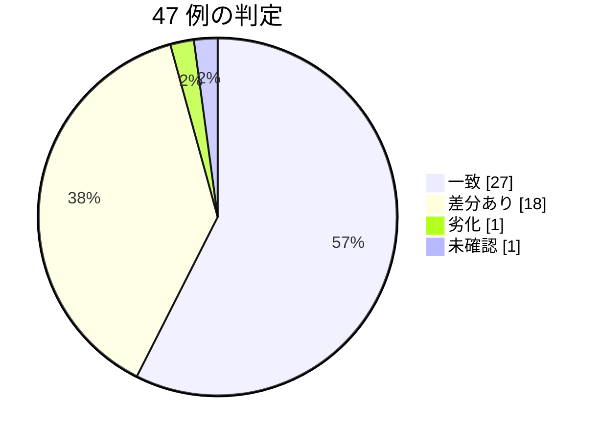

# 契約の確認 — egov 0.20.0 / nta 0.25.0（2026-10-05 JST）

段階 3（T6 ローカル DB の場所の見え方）の版の houki-egov-mcp 0.20.0 と、houki-nta-mcp 0.24.1（#139）・0.25.0 が publish された。reference-examples の呼び出し例 47 件を同じ引数で流し、例の主張が今も成り立つかを確かめた記録。2026-10-04 の回（`2026-10-04-regression-check-egov-0.19.1-nta-0.24.0.md`）と同じく、同じ応答で例を取り直した（6a）ので、例の差し替えの状態も書く。

結論: **劣化は 1 件（`nta_get_tax_answer`）。** 一致 27 件、差分あり 18 件、劣化 1 件、未確認 1 件、判断できない 0 件。差分ありのうち 12 件は予定どおりの変更（`freshness.db_path`、案内のコマンドの npx の形、0.24.1 の `freshness` の範囲）、6 件は 2026-10-04 の取り込み直しによる値の変化（`fetchedAt` と、国税庁のページの更新）。劣化の 1 件は、国税庁がタックスアンサーのページの小見出しを h3 にしたため、`sections` から小見出しが落ちたもので、0.24.1・0.25.0 の変更が原因ではない（見つかったこと 1）。



## やり方

- 対象: `scripts/reference-examples/{houki-egov,houki-nta}/ja/*.md` の呼び出し例。egov 24 件、nta 23 件
- 実行: Claude Desktop の plugin（houki-egov-mcp 0.20.0 / houki-nta-mcp 0.25.0）を、例と同じ引数で 1 回ずつ呼んだ。2026-10-05 05:19〜05:30 頃（JST、+09:00）。版は shuji が Mac で `npx -y @shuji-bonji/houki-egov-mcp@latest --version`（`v0.20.0`）と `npx -y @shuji-bonji/houki-nta-mcp@latest --version`（`v0.25.0`）で確かめ、Claude Desktop を再起動してから流した
- 比べ方: 本文の一字一句ではなく、例が述べている「形」と「主張」（件数、ID、順、code、next_actions の action など）を比べた。呼び出しのたびに変わる `retrieved_at`・「取得日時」は比べず、値だけを差し替えた
- 判定の意味は 2026-10-03・10-04 の回と同じ。「一致」は例の主張がすべて成り立った。「差分あり」は形か値が変わったが主張は成り立つ（フィールドの追加、DB の取り込み日による値の変化、文言だけの差、仕様で決めた変更）。「劣化」は例の主張が成り立たなくなったもの。「未確認」は条件を再現できず流していないもの。「判断できない」は主張が成り立つかどうかを決められないもの
- 「前回との差」の列は、2026-10-04 の回の判定と比べて何が変わったか。前回「差分あり」で今回「一致」の行は、前回の差分（`meta.at: null` など）を前回の取り直しで例に入れ済みだったもの

ローカル DB の状態（shuji が Mac で実行した `--status` の出力。ホームは `~` に置き換えた）:

```text
[status] @shuji-bonji/houki-egov-mcp v0.20.0
  DB: ~/.cache/houki-egov-mcp/laws.db
  DB の場所の設定: 既定
[WARN] 同じフォルダーに、この DB のほかに laws*.db のファイルがあります: laws.0191check.db (4.66 GB, 2026-10-04 09:43), laws.v2.bak.db (7.07 GB, 2026-09-19 18:40)。MCP サーバーと CLI が別のファイルを開いていないか確かめてください
  laws:     9,003 (版: 10,414)
  articles: 1,225,967
  sync:
    last_sync_date:  2026-10-04
    last_full_dl_at: 2026-10-03T19:19:36.391Z
    days_since_sync: 0
    staleness:       fresh
```

```text
[status] @shuji-bonji/houki-nta-mcp v0.25.0
  DB: ~/.cache/houki-nta-mcp/cache.db
  DB の場所の設定: 既定
  schema_version: 12
  tsutatsu: 4 (clause: 3459, fetched_at: 2026-10-04T03:14:49.904Z 〜 2026-10-04T03:24:14.467Z)
  qa-jirei: 1841 (fetched_at: 2026-10-04T03:51:26.746Z 〜 2026-10-04T04:26:15.744Z)
  tax-answer: 750 (国税庁の索引から消えた: 1, fetched_at: 2026-10-04T03:37:08.048Z 〜 2026-10-04T03:51:17.445Z)
  kaisei: 118 (fetched_at: 2026-10-04T03:24:14.576Z 〜 2026-10-04T03:26:38.132Z)
  jimu-unei: 32 (fetched_at: 2026-10-04T03:26:38.243Z 〜 2026-10-04T03:27:13.440Z)
  bunshokaitou: 489 (fetched_at: 2026-10-04T03:27:23.963Z 〜 2026-10-04T03:37:07.872Z)
```

どちらも DB の場所の設定は `既定` で、plugin の応答の `freshness.db_path`（`~/.cache/houki-egov-mcp/laws.db`・`~/.cache/houki-nta-mcp/cache.db`）と同じファイルだった。DB は 2026-10-04 の回の取り込み直しのままで、今回は取り込んでいない。

## 1. houki-egov-mcp 0.20.0

| ツール | 例の見出し | 判定 | 差分の中身 | 前回との差 |
| --- | --- | --- | --- | --- |
| explain_law_type | 「通達は守らなくてよいのか」 | 一致 | `info`（aliases 2 つ）・`related_tools`・`see_also` が同じ | 前回は差分あり（`aliases` の `通知` が消えた）。前回の取り直しで例に入れ済み |
| get_article_references | 「所得税法 57 条の 2 第 2 項が引いている法令」 | 一致 | references 10 件・delegations 2 件・next_actions 7 件が同じ | 前回は差分あり（`meta.at`）。例に入れ済み |
| get_attachment | 「日章旗の寸法図をディスクに置く」 | 一致 | kind・saved.bytes 12614・response_content_type・location・updated が同じ | 前回は差分あり（`meta.at`）。例に入れ済み |
| get_attachment | 一覧に無い `src`（`ATTACHMENT_NOT_FOUND`） | 一致 | error / code / hint / next_actions[0] が同じ | 変わらず |
| get_law | 「消費税法 57 条の 2 第 1 項の本文を JSON で」 | 一致 | `item_num`・`suppl_index`・`meta.at` の null と node・本文が同じ | 前回は差分あり。例に入れ済み |
| get_law | 「消費税法 30 条 2 項を Markdown で」 | 一致 | markdown（号・イ・ロ・出典の行）が同じ | 前回は差分あり（`meta.at`）。例に入れ済み |
| get_law | 「所得税法 89 条 1 項を Markdown で」 | 一致 | 見出し行が空の表 7 行と本文が同じ | 同上 |
| get_law | 枝番号の号（消費税法 2 条 1 項 8 号の 2） | 一致 | 見出しと本文が同じ | 同上 |
| get_law | 存在しない条（`ARTICLE_NOT_FOUND`） | 一致 | error / code / hint / next_actions[0] が同じ | 変わらず |
| get_law_file | 「民法の全文を Word で」 | 一致 | content_type・url・note が同じ（`note` の保存先は利用者のホームの絶対パスで返り、例は `~`） | 前回は差分あり（`meta.at`）。例に入れ済み |
| get_law_file | 「2020 年 4 月 1 日時点の国旗国歌法を HTML で保存」 | 一致 | url の `?asof=2020-04-01`、saved.bytes 38537、law_revision_id、meta.at が同じ | 前回は差分あり（例の文の `FILE_TOO_LARGE`）。直し済み |
| get_law_range | 「民法の契約の章をまとめて読みたい」 | 一致 | article_count 198、returned_count 186、body_chars 29919、next_from_article "685" が同じ | 前回は差分あり（`meta.at`）。例に入れ済み |
| get_law_range | 「遺留分の章だけ読みたい」 | 一致 | article_count 8、body_chars 2284、第1044条に caption 無しが同じ | 同上 |
| get_law_range | 「章だけ指定したら候補が返ってきた」 | 一致 | INVALID_ARGUMENT、hint に 5 パス、next_actions 5 件が同じ | 変わらず |
| get_law_range | 「附則の 7 本目を読む」 | 一致 | article_count 0、body_chars 21、note が同じ | 前回は差分あり（`meta.at`）。例に入れ済み |
| get_law_revisions | 「消費税法の直近の改正と施行日」 | 一致 | total 65、2 件の law_revision_id・日付・status が同じ | 同上 |
| get_related_laws | 「所得税法の施行令と施行規則」 | 一致 | related 2 件・not_found []・next_actions 2 件が同じ | 同上 |
| get_toc | 「民法の大区分だけ見たい」 | 一致 | toc 5 件、suppl.count 67 / article_count 201、node_count 5、truncated が同じ | 同上 |
| list_attachments | 「国旗国歌法の日章旗の寸法図はどこにあるか」 | 一致 | count 2、location、zip_url、next_actions 1 件が同じ | 同上 |
| list_attachments | 「戸籍法施行規則の様式（届書の書式）を一覧で」 | 一致 | count 42（jpg 7・pdf 35）、law_revision_id、updated、next_actions 2 件が同じ | 同上 |
| resolve_abbreviation | 「消基通 は何の略で、どのサーバーが担当か」 | 一致 | resolved・`in_scope: false`・hint が同じ | 前回は差分あり（`in_scope`・`hint`・aliases）。直し済み |
| search_fulltext | 「民法で不法行為に関係する条は」 | 差分あり（予定どおり） | `freshness.db_path: "~/.cache/houki-egov-mcp/laws.db"` が増えた（0.20.0、SPEC-EGOV-SEARCH-FULLTEXT-042・043）。hits 3 件（724 / 724の2 / 719）・score（0.701 / 0.685 / 0.677）・`filters.domain.note`・law_scope・鮮度の 4 つは同じ。例の冒頭の注意のコマンドを npx の形にし、`note` の先頭に DB のパスが入ることと `db_path` の説明を足した | 前回は差分あり（`filters.domain.note`）。今回は `db_path` |
| search_law | 「個情法の正式名と法令番号を知りたい」 | 一致 | total_count 17、results 3 件、`hint: null`、`next_actions: []` が同じ | 前回は差分あり（`total_count` など）。例に入れ済み |
| verify_citations | 「書こうとしている引用 5 件をまとめて確かめる」 | 一致 | summary（3/1/1）と各件の status・code・reason・`suppl_index` が同じ | 前回は差分あり。例に入れ済み |

劣化: なし。0.20.0 の proposal.md の「呼び出し例への影響」に挙がった `search_fulltext.md` の 2 か所（`freshness.db_path` と冒頭の注意のコマンド）は、予定どおりの値で返り、例を直した。0.19.1 と 0.20.0 は `search_fulltext` 以外のツールの応答を変えていない（CHANGELOG の「互換性」のとおり）。`api-fallback` の例は今回も足していない（proposal.md の「足すかは段階 3 の作業 6 で決める」。足すなら DB の無い場所を指す houki-egov-dev で取る必要があり、plugin では取れない）。

## 2. houki-nta-mcp 0.25.0

| ツール | 例の見出し | 判定 | 差分の中身 | 前回との差 |
| --- | --- | --- | --- | --- |
| nta_get_bunshokaitou | 「産科医療特別給付事業の給付金は非課税か」（本庁系） | 差分あり（データ側） | `fetchedAt` が 2026-09-08 → 2026-10-04T03:27:25Z（2026-10-04 の取り込み直し）。document の各値・索引の印の null・legal_status は同じ。冒頭の注意のコマンドを npx の形にした | 前回は差分あり（索引の印の null） |
| nta_get_bunshokaitou | 国税局系（`tokyo/shohi/251017`） | 差分あり（データ側） | `fetchedAt` が 2026-09-08 → 2026-10-04T03:35:35Z。本文・issuer は同じ | 同上 |
| nta_get_jimu_unei | 「酒税の書面添付制度の事務運営指針」 | 差分あり（データ側。例の文が古い） | `fetchedAt` が 2026-09-12 → 2026-10-04T03:26:50Z。`fullText` の 1 行目に「改正 令和8年9月17日」が増えた（国税庁が改正した）。別紙 1・2 の PDF が 191KB / 158KB → 87KB / 69KB。例の文「令和 6 年 3 月 27 日まで 3 回改正」を「令和 8 年 9 月 17 日まで 4 回改正」に直した | 前回は差分あり（`kind`・`legal_status.note`） |
| nta_get_kaisei_tsutatsu | 「令和 7 年 4 月 1 日の消基通改正の本文と添付 PDF」 | 差分あり（データ側） | `fetchedAt` が 2026-09-07 → 2026-10-04T03:24:16Z。attachedPdfs 3 件（`kind: "comparison"`）と本文は同じ | 前回は差分あり（`kind`） |
| nta_get_kaisei_tsutatsu | 「docId を打ち間違えたとき」 | 差分あり（予定どおり） | `hint` の末尾のコマンドが `npx -y @shuji-bonji/houki-nta-mcp@latest --bulk-download-kaisei`（0.25.0、SPEC-NTA-GET-KAISEI-TSUTATSU-002）。code・118 件・available_doc_ids の先頭 3 件と 15 件目・next_actions は同じ。例の後の文（改正通達が 1 件も無いときの `hint` と `example.command`）を 0.25.0 の文（SPEC-NTA-DB-SCHEMA-029）に直した | 前回は差分あり（`code`） |
| nta_get_qa | 「消費税の質疑応答事例 02/19」 | 差分あり（データ側） | `fetchedAt` が 2026-09-12 → 2026-10-04T04:15:41Z。qa の各値・related_laws・related_tsutatsu・next_actions は同じ | 前回は差分あり（索引の印の null） |
| nta_get_qa | 枝番号の号を挙げている事例（法人税 33/02） | 一致 | related_laws 3 件（item "12の8"）と next_actions 3 件が同じ | 前回は差分あり。例に入れ済み |
| nta_get_tax_answer | 「No.6101 消費税の基本的なしくみ」 | **劣化** | `sections` の見出しが 7 つ → 3 つ（概要・根拠法令等・関連リンク）。小見出し 4 つの文字列が落ち、その本文は「概要」の paragraphs に入る。`effectiveDate` が「令和8年4月1日現在法令等」、`basisDate` が 2026-04-01、`fetchedAt` が 2026-10-04T03:47:44Z。原因は国税庁のページの小見出しが h3 になったこと（見つかったこと 1）。**例は差し替えていない**。Issue の草案を `issues-2026-10-05-regression/` に置いた | 前回は差分あり（`basisDate`、例の文） |
| nta_get_tsutatsu | 「消基通 1-7-2（登録番号の構成）の本文」 | 差分あり（データ側） | `fetchedAt` が 2026-09-07 → 2026-10-04T03:14:56Z。clause・paragraphs 3 件・base_laws・next_actions は同じ | 前回は一致 |
| nta_inspect_pdf_meta | 「改正通達 0025004-026 の PDF は、どれをどう読めばよいか」 | 一致 | attachedPdfs 3 件の kind・read_strategy・layout_note、next_actions 2 件が同じ | 前回は差分あり（索引の印の null）。例に入れ済み |
| nta_inspect_pdf_meta | 「新旧対照表だけを保存して、表として取る」 | 一致 | saved 3 件の bytes と `cached: true` が同じ | 同上 |
| nta_search_bunshokaitou | 「産科医療の給付金に関する文書回答事例」 | 差分あり（予定どおり） | `freshness.db_path` が増えた（SPEC-NTA-SEARCH-RULES-022）。2 件の docId・順・score（0.518 / 0.490）・freshness の値は同じ。冒頭の注意のコマンドを npx の形にした | 前回は差分あり（null 3 つ） |
| nta_search_bunshokaitou | 別紙の本文にしかない語で引く | 差分あり（予定どおり） | `freshness.db_path`。1 件・docId・score（0.536）は同じ | 同上 |
| nta_search_bunshokaitou | 税目の別表記をまとめて検索する | 差分あり（予定どおり） | `freshness.db_path`。3 件の docId・taxonomy・順と search_notes は同じ | 同上 |
| nta_search_jimu_unei | 「書面添付制度の事務運営指針」 | 差分あり（予定どおり） | `freshness.db_path`。2 件（hojin/090401-2・shotoku/shinkoku/090401）・score（0.463 / 0.446）は同じ | 前回は差分あり（2 件目の入れ替わり） |
| nta_search_kaisei_tsutatsu | 「インボイス関係の改正通達を新旧対照表付きで」 | 差分あり（予定どおり） | `freshness.db_path`。2 件の docId・順・scoreReasons・search_notes は同じ | 前回は差分あり（null 3 つ） |
| nta_search_qa | 「テレワークに関係する質疑応答事例」 | 差分あり（予定どおり） | `freshness.db_path`。1 件（hojin/04/16）・score 0.341 は同じ | 同上 |
| nta_search_qa | 税目（topic）で絞る | 差分あり（予定どおり） | `freshness.db_path`。1 件（shohi/21/10）・score 0.199・税目で絞った範囲の freshness は同じ | 前回は差分あり（`domain` の文） |
| nta_search_qa | キーワードに合う文書が無いとき | 差分あり（予定どおり） | `freshness.db_path`。results []・hint（1,841 件）は同じ。例の後の文（質疑応答事例が 1 件も無いときの `hint` と `next_actions`）を 0.25.0 の文（SPEC-NTA-DB-SCHEMA-029）に直した | 前回は差分あり |
| nta_search_tax_answer | 「医療費控除のタックスアンサー」 | 差分あり（予定どおり） | `freshness` が `stale`（oldest 2026-09-07T21:06:49Z、26 日）→ `fresh`（oldest 2026-10-04T03:37:08Z、0 日）。0.24.1 で索引から消えた No.2882 を範囲から外したため（SPEC-NTA-SEARCH-RULES-017、#139）。`--status` の tax-answer の範囲（03:37:08 〜 03:51:17）とも合う。`freshness.db_path` が増えた。2 件（1131・1128）・score・basisDate・next_actions は同じ。例の 3 行目と 60 行目の段落（No.2882 で `stale` になる説明）を 0.24.1 の動きに直した | 前回は差分あり（データ側。`stale` の原因を調べた） |
| nta_search_tsutatsu | 「軽減税率に関係する通達の節は」 | 差分あり（予定どおり） | `freshness.db_path`。count 2・hits（5-9-10 / 5-9-5）・score・base_laws_by_tsutatsu・next_actions は同じ。冒頭の注意のコマンドを npx の形にした | 前回は差分あり |
| nta_search_tsutatsu | DB が古いとき（`staleness: "outdated"`） | 未確認 | 126 日たった DB を用意できないため流していない。`warning` のコマンドを SPEC-NTA-SEARCH-RULES-017 の形（`npx -y @shuji-bonji/houki-nta-mcp@latest --bulk-download-all`）に、`freshness.db_path` を SPEC-NTA-SEARCH-RULES-022 に合わせて書き足し、実測していないことを例に書いた。「- 版の照合: しない」の行はそのまま | 変わらず（未確認） |
| resolve_abbreviation | 「電帳法 は houki-nta-mcp で引けるか」 | 一致 | resolved（aliases 4 つ）・`in_scope: false`・hint・next_actions が同じ | 前回は差分あり（next_actions）。例に入れ済み |

劣化: 1 件（`nta_get_tax_answer`）。0.24.1・0.25.0 で変えた応答（検索 6 ツールの `freshness.db_path`、案内のコマンド、`nta_search_tax_answer` の `freshness` の範囲）は、CHANGELOG の「互換性」と proposal.md の「呼び出し例への影響」のとおりだった。

## 3. 呼び出し例の差し替え（6a）の状態

houki-hub のブランチ `docs/20261005-examples-egov-0.20-nta-0.25`（分岐元 origin/main `f36864a`）に、ツールごとに 1 コミットで差し替えた（27 コミット）。

| サーバー | 差し替えたファイル | 保留したファイル |
| --- | --- | --- |
| houki-egov | 14 ファイル（24 例）すべて | なし |
| houki-nta | `nta_get_tax_answer.md` を除く 13 ファイル（22 例。未確認の 1 例は文だけを仕様に合わせた） | `nta_get_tax_answer.md`（劣化。v0.24.0 の実測のまま） |

一致の例も、実測の行を `v0.20.0（2026-10-05）` / `v0.25.0（2026-10-05）` にし、`retrieved_at`・「取得日時」を今回の値にした。

`node scripts/check-example-versions.mjs`: 例 47 件のうち古い 1 / 現行 45 / 照合しない 1。古い 1 件は保留した `nta_get_tax_answer` の例。指示の「古い 0」にはならない（劣化の例を差し替えないため）。

## 見つかったこと

1. **`nta_get_tax_answer` の `sections` から小見出しが落ちる（劣化）**: No.6101 の `sections` が 7 つ → 3 つになった。2026-10-05 JST に国税庁のページを見ると、「消費税の負担者」「課税のしくみ」「申告・納付」「納税事務の負担軽減措置等」は「概要」（h2）の下の h3 だった。`src/services/tax-answer-parser.ts` の `extractSections()` は h2 だけで節を切り、h3 を集めないので、小見出しの文字列が捨てられ、その本文が「概要」に入る。パーサーは 0.10.0 から変わっていないので、0.24.1・0.25.0 の変更が原因ではなく、国税庁が令和 8 年 4 月 1 日版でページを更新し、2026-10-04 の取り込み直しで新しい形を読んだのがきっかけと考えられる（前のページが h2 だったことは、行が上書きされたため確かめていない）。Issue の草案は `docs/notes/issues-2026-10-05-regression/nta-get-tax-answer-h3-sections.md`（投稿は shuji）
2. **0.24.1 の `freshness` の範囲は予定どおり**: 2026-10-04 の回の見つかったこと 7（No.2882 で `stale` のまま）は、`nta_search_tax_answer` が `fresh` を返すようになって片付いた。`--status` の tax-answer の行も「国税庁の索引から消えた: 1」と出し、`fetched_at` の範囲から No.2882 を外している（03:37:08 〜）。検索の `freshness` と `--status` の範囲が同じ規則であることを、この 1 件で確かめた
3. **事務運営指針 `shozei/090401` が 2026-09-17 に改正されていた**: 取り込み直しで `fullText` の 1 行目に「改正 令和8年9月17日」が増え、別紙の PDF も差し替わっていた（サイズが半分以下）。例の文の改正回数を直した
4. **egov の `--status` の `[WARN]` が実際に出た**: `~/.cache/houki-egov-mcp/` に `laws.0191check.db`（4.66 GB）と `laws.v2.bak.db`（7.07 GB）が残っている。0.20.0 の #110 のとおりの表示で、MCP サーバーと CLI はどちらも `laws.db` を開いている。2 つのファイルが要らなければ消してよい（合わせて約 11.7 GB）。消すかは shuji が決める
5. **nta の取得ツールの `fetchedAt` が一斉に変わった**: 前回の取得ツールの例は 2026-10-04 13:30 頃の取り込み直しの前に流していたので、`fetchedAt` が 2026-09 のままだった。今回は 5 ツール 6 例で 2026-10-04 の値になった。例の主張は変わらない

## 4. 呼び出し例の版の照合の規則（③）の案

今回、0.20.0 / 0.25.0 で応答の形の変わらない egov 23 例・nta 10 例も「古い」になった。3 案を比べる。

| 観点 | (A) 今のまま | (B) 「- 確かめた版: vX」の行を足す | (C) minor が同じなら現行 |
| --- | --- | --- | --- |
| 流す手間 | minor のたびに全 47 例を流し、JSON の時刻まで差し替える | 全例を流すのは同じ。形が同じなら 1 行を上げるだけ | patch では流さない。minor では全例 |
| 漏れ | 無い | 無い（全例を流すので） | patch で応答が変わった例を見落とす（今回の 0.24.1 は patch で `nta_search_tax_answer` の `freshness` と例の文を変えた） |
| 例の JSON と版の対応 | 実測の行の版と JSON が常に一致 | 実測の行は JSON を取った版、確かめた行は最後に流した版。2 つの意味を分けて書ける | 実測の行の版が古いままでも現行扱いになり、どの版で確かめたかが残らない |
| 差分の見やすさ | 時刻だけの差分が PR に大量に出る（今回 egov 14 ファイル） | 振る舞いの変わったファイルだけ JSON が変わる | — |
| スクリプトの変更 | 無し | `parseExamples` に「確かめた版」を読ませ、照合はその版で行う | `compareVersions` を minor までにする |

勧める: **(B)**。全例を流すことは変えずに漏れを防ぎつつ、PR の差分を振る舞いの変わった例だけにできる。(C) は今回の 0.24.1 のような patch での変更を見落とすので勧めない。(B) にするときは、「確かめた版」の行が無い例は実測の版で照合する（今の例はそのまま動く）。

## 5.2 の条件との関係

計画書 5.2 の段階 3 の確認として、全 47 例のうち 46 件を流した。劣化の 1 件は 0.24.1・0.25.0 の変更が原因ではない（見つかったこと 1）ので、段階 3 の版の publish を取り消す理由にはならない。直すかは Issue で決める。

実行環境: Claude Desktop の plugin（houki-egov-mcp 0.20.0 / houki-nta-mcp 0.25.0）。呼び出しは 1 件ずつ手で行い、判定の作業表は残していない（この文書の表がすべて）。
