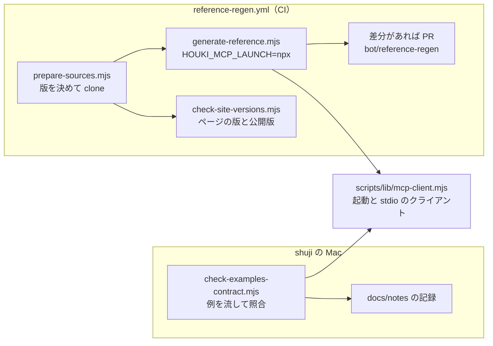

# houki-hub#5 ② と #44 の設計と試作: CI でのページの作り直しと、呼び出し例の照合

- 日付: 2026-10-10（JST）
- 対象: houki-hub の `scripts/`・`.github/`（サイトの `site/` と生成ページは変えていない）
- 出典: houki-hub#5 の②（CI でリファレンスと仕様書ページを作り直し、差分があれば PR を開く。サイトと各リポジトリの版のずれを検出する）、houki-hub#44（呼び出し例を同じ引数で流し、例と同じ応答が返るかを機械で確かめる）。位置づけは `docs/notes/2026-10-04-plan-stage6-and-followups.md` 4 章の段階 4（6e・6f）、Q14、「Y2 の後」の表、「Y4 の後」
- 状態: ブランチ `feat/20261010-hub5-regen-and-examples-check`。workflow は `workflow_dispatch` だけで、schedule と push のトリガーは付けていない。呼び出し例の書き換えは 2 例だけ

この文書は、2 つの仕組みの「決めること」10 項目の案と勧める案、試作で確かめた値、確かめていない点をまとめる。試作は勧める案で作った。

## 1. 全体の形

2 つの仕組みは、MCP サーバーの起動の仕組み（`scripts/lib/mcp-client.mjs`）を共有する。ページの作り直しは CI で回し、呼び出し例の照合は shuji の Mac で回す。



## 2. 試作したもの

| ファイル | 役割 |
| --- | --- |
| `scripts/lib/mcp-client.mjs` | 新規。MCP サーバーの一覧（`MCP_SERVERS`）、起動の仕方の切り替え（`launchConfig`）、stdio の JSON-RPC クライアント（`McpStdioClient`）。`generate-reference.mjs` の `handshake` をここに移した |
| `scripts/generate-reference.mjs` | `REGISTRY` から `command`・`args`・`env` を外し、起動は `launchConfig` に任せる。ライブラリの `.d.ts` と使用状況の走査も `HOUKI_SOURCE_DIR` を読む |
| `scripts/spec-pages.mjs` | `HOUKI_SOURCE_DIR` を `HOUKI_SPECS_SOURCE` の新しい名前として読む。spec-ids を clone の置き場所の `node_modules` からも探す |
| `.github/scripts/prepare-sources.mjs` | 新規。公開版を決め、各リポジトリをそのタグで浅く clone し、`versions.json` と `GITHUB_ENV` を書く |
| `scripts/check-site-versions.mjs` | 新規。生成ページの冒頭の版と公開版を比べる |
| `.github/workflows/reference-regen.yml` | 新規。`workflow_dispatch` だけ。既定（`open_pr: false`）は差分を実行の要約と artifact に出すだけ |
| `scripts/lib/example-contract.mjs` | 新規。例の読み取り、jsonc をパターンとして読む処理、比べ方の規則 |
| `scripts/check-examples-contract.mjs` | 新規。照合のスクリプト（CLI） |
| テスト 4 本 | `scripts/check-examples-contract.test.mjs`・`scripts/check-site-versions.test.mjs`・`scripts/mcp-client.test.mjs`・`.github/scripts/prepare-sources.test.mjs`。既存と合わせて 65 件が通る |
| 呼び出し例 2 例 | `get_law.md` の `ARTICLE_NOT_FOUND` の例に `- ローカル DB: 不要`、`nta_search_tax_answer.md` に `` - 照合: `results` は 1 件目だけ（…） `` |
| `scripts/reference-examples/README.md` | 「照合のスクリプトが読む行」の節を足した |

起動の仕方は環境変数 `HOUKI_MCP_LAUNCH` で切り替える。

| 値 | 起動するもの | 使う場面 |
| --- | --- | --- |
| `local`（既定） | `mcp/<repo>/dist/index.js`（作業コピー） | Mac での生成。今までと同じ |
| `checkout` | `$HOUKI_SOURCE_DIR/<repo>/dist/index.js` | clone を build したとき（案 A を取るとき用） |
| `npx` | `npx -y <npm>@<版>`。版は `HOUKI_MCP_VERSIONS="houki-egov=0.20.0,houki-nta=0.27.0"` | CI と、公開版での照合 |

## 3. 確かめた値（2026-10-10 JST）

Ubuntu 24.04.5・x86_64・Node 22.22.0 のコンテナ（GitHub の `ubuntu-latest` と同じ OS と CPU）で確かめた。

| 何を | 結果 |
| --- | --- |
| `npx -y @shuji-bonji/houki-nta-mcp@0.27.0` の `tools/list` | 通った。空のホームから 6.3 秒、14 ツール。better-sqlite3 12.11.1 が入り、`build/Release/better_sqlite3.node` ができた（ソースからの build なら数十秒かかるので、prebuilt を取ったと見ている） |
| `npx -y @shuji-bonji/houki-egov-mcp@0.20.0` | 通った。`tools/call resolve_abbreviation { "abbr": "消基通" }` も例と同じ応答 |
| 起動したときの副作用 | 2 つとも、`tools/list` だけでも起動時に `~/.cache/<repo>/` に DB のファイルを作る。CI では害はない |
| `prepare-sources.mjs`（版の決定・clone 4 つ・tarball の重ね・typescript と spec-ids の導入） | 6.3 秒 |
| `generate-reference.mjs`（npx で 2 サーバー、clone から仕様書ページ 67 枚とライブラリ） | 5.2 秒。MCP のツールのページは 28 枚とも書き換え 0（コミット済みのページと同じ） |
| 公開版から作り直したときの差分 | 46 ファイル。全部が egov と abbreviations の仕様書ページと、abbreviations のリファレンス 1 枚。下の「見つかったこと」 |
| `check-examples-contract.mjs --db absent`（全 48 例、egov 0.20.0・nta 0.27.0） | 約 20 秒。一致 25・データ側の差分 2・形の違い 0・未確認 20・照合しない 1（6 章） |
| 照合のスクリプトが劣化を拾えるか | nta 0.25.0（houki-nta-mcp #147 の h3 の劣化がある版）で `nta_get_tax_answer` の 2 例を流すと、2 例とも「形の違い」（`taxAnswer.sections` 要素が足りない: 例 7 件 → 3 件、例 12 件 → 7 件）。0.27.0 では 2 例とも一致 |

見つかったこと: 今のサイトの egov と abbreviations の仕様書ページは、公開していない作業コピーから作られている。houki-egov-mcp の作業コピーは `v0.20.0` の 5 コミット先、houki-abbreviations は `v0.7.0` の 9 コミット先で、その間に spec.md へ front matter（`approved`・`pr`）が足された。公開版のタグの spec.md には front matter が無いので、公開版から作り直すと「承認の履歴」の節と「最後に仕様が変わったのは…」の行が消える。ページの冒頭の版はどちらも `v0.20.0`・`v0.7.0` のままなので、版の比較（`check-site-versions.mjs`）ではこのずれを拾えない。中身のずれは、公開版から作り直したときの差分で分かる。

## 4. hub#5 ②: 決めること 1〜5

### 決めること 1: 入力の取り方

| 案 | 内容 | 長所 | 短所 |
| --- | --- | --- | --- |
| A | 全部 checkout。各リポジトリを最新の公開タグで clone し、`npm ci && npm run build` してから `node dist/index.js` で起動する | 入力の出どころが 1 つ（タグ）。spec-ids も各リポジトリの `node_modules` に入る | 3 リポジトリの `npm ci`（devDependencies に TypeScript 7・Biome・vitest など）と build が要り、数分かかる。build の結果が公開した tarball と同じとは限らない |
| **B** | `tools/list` は `npx -y <npm>@<版>`。specs/・Skill の workflows/・MCP の src/ はタグで浅く clone。abbreviations の `.d.ts` は公開した tarball の `dist/` を clone に重ねる。typescript と spec-ids は clone の置き場所に 1 回だけ入れる | build が要らず、準備と生成で合わせて約 12 秒。起動するものが利用者（plugin は npx）と同じ | 入力の出どころが npm と GitHub の 2 つになる。タグと npm の版がずれたら気づく仕組みが要る（`versions.json` の `note`） |
| C | 全部 npm | 一番簡単 | specs/ と workflows/ が npm のパッケージに無いので、仕様書ページを作れない |

勧める案: **B**（試作はこの形）。better-sqlite3 は Ubuntu・x86_64・Node 22 で npx から入り、`tools/list` まで通った（3 章）。ライブラリの `.d.ts` は、公開した tarball に `@since`・`@group` の JSDoc が残っている（`dist/index.d.ts` に 32 か所）ので、build せずに読める。

typescript の版は houki-abbreviations の devDependencies の範囲（`v0.7.0` では `^5.7.0`）に合わせた。MCP の 2 つは TypeScript 7 だが、読むのは abbreviations の `.d.ts` だけなので関係しない。spec-ids は clone したリポジトリの中で一番新しい範囲（今は nta の `^0.3.0`）にした。abbreviations と egov のタグは `^0.2.0` で、承認の履歴を読む `history()` は 0.3.0 から。

### 決めること 2: どの版で作るか

| 案 | 内容 |
| --- | --- |
| **A** | npm の `dist-tags.latest`。npm に無い Skill は GitHub の最新のタグ（semver の一番大きいもの）。最新のタグと npm が食い違えば、npm の版で作り、食い違いを `versions.json` と PR の本文に出す |
| B | `stack.json` の `published` |
| C | 各リポジトリの最新のタグ |

勧める案: **A**。`stack.json` は Mac で `generate-stack.mjs` を回したときにしか変わらないので、B だと CI の生成が手作業を待つ。C は、タグを打ったが publish が終わっていない・失敗したときに、まだ公開されていない版のページになる（各リポジトリの publish はタグの push で動く）。

### 決めること 3: 差分があったときの出し方と、使うトークン

| 案 | 内容 |
| --- | --- |
| **A** | 決まった名前のブランチ `bot/reference-regen` に force-push し、開いている PR があれば本文を差し替え、無ければ PR を開く |
| B | 実行のたびに新しいブランチと PR |
| C | Issue にするだけ（ページは人が Mac で作り直す） |
| D | main に直接 push |

勧める案: **A**。毎日回しても PR は 1 つで、中身はいつも最新の公開版から作ったものになる。D は「hub の site/ は都度確認」の決まりに合わない。

トークンは `GITHUB_TOKEN`（`contents: write`・`pull-requests: write`）で足りる。ただし次の 2 点がある。

- リポジトリの Settings → Actions → General の「Allow GitHub Actions to create and approve pull requests」が有効でないと、PR を開けない（確かめていない。7 章のコマンド）
- `GITHUB_TOKEN` で開いた PR と push では、他の workflow が動かない。houki-hub には `pull_request` で動く workflow が無い（`stack-check.yml` は schedule・dispatch・main への push、`deploy.yml` は main への push）ので、今は失うものが無い。shuji がマージしたときの main への push は shuji の操作なので、`deploy.yml` は今までどおり動く
- runner の `git commit` は署名されない。署名を求める branch protection を入れるなら、GitHub の API でコミットを作る（GitHub が署名する）形に変える（Z2 に渡す）

試作の workflow は、入力 `open_pr` が `false`（既定）のときは PR を開かず、差分を実行の要約と artifact に置くだけにした。最初の数回はこれで中身を見る。

### 決めること 4: 版のずれの検出をどこに置くか

| 案 | 内容 |
| --- | --- |
| A | `stack-check.yml` に足す |
| **B** | 新しい workflow（`reference-regen.yml`）の中で、作り直す前に回す |
| C | 両方 |

勧める案: **B**。版の比較は `prepare-sources.mjs` が決めた版（`versions.json`）を使うので、作り直しと同じ job に置くと読む回数が 1 回で済む。`stack-check.yml` は `stack.json` と npm の比較で、clone を要らない軽い検査のまま残す。

比べるのは、生成ページ（`site/docs/reference/`・`site/docs/specs/` の 7 フォルダー、126 枚）の冒頭の「**vX.Y.Z** の … から自動生成しました」の版と、公開版。判定はリポジトリごとに「一致」「サイトが古い」「サイトが新しい」「判定不能」。3 章のとおり、冒頭の版が同じでも中身が公開版と違うことがあるので、版の比較は「作り直しに失敗して古いまま」「一部のページだけ古い」を見つける補助で、主な検出は作り直しの差分。

### 決めること 5: いつ回すか

| 案 | 内容 |
| --- | --- |
| A | 毎日 |
| B | 各リポジトリのタグの push を受けて（`repository_dispatch`） |
| C | 手動だけ |

勧める案: **今は C、有効にするときに A と C**。B は送信側にリポジトリを跨ぐ PAT が要り、#5 ④ で取らないと決めた形と同じ。A の時刻は `stack-check.yml`（07:17 JST）の後の 07:37 JST（`cron: '37 22 * * *'`）を勧める。`stack-check.yml` が `stack.json` のずれを Issue にし、その 20 分後にページの PR が立つ順になる。

## 5. #44: 決めること 6〜10

### 決めること 6: 置き場所と回す場所

勧める案（Issue のとおり）: `scripts/check-examples-contract.mjs` を shuji の Mac で回す。DB の要る例は手元のローカル DB を引くため。起動は `generate-reference.mjs` と同じ `scripts/lib/mcp-client.mjs` を使い、共通部分は `scripts/lib/` に分けた（起動とクライアントは `mcp-client.mjs`、比べ方の規則は `example-contract.mjs`）。

起動の既定は npx（`stack.json` の `published` の版）。公開した直後で `stack.json` が古いときは `--version houki-nta=0.27.1`、公開前のビルドを試すときは `--launch local`。

DB の要らない例は CI でも流せる（6 章のとおり、DB の無い環境で 27 例が判定できた）。`reference-regen.yml` に `--db absent` で足して PR の本文に載せる案は、Z2 で決める（今は入れていない）。

### 決めること 7: 比べ方の規則

例の jsonc を部分一致のパターンとして読む。実装した規則は次のとおり（`scripts/lib/example-contract.mjs`）。

| 例の書き方 | 比べ方 |
| --- | --- |
| 書いてあるキー | 応答にあること。無ければ形の違い |
| 書いてある値 | 同じであること。型が違えば形の違い。数の違いと、長い文字列（40 文字を超えるか、改行を含む）の違いはデータ側の差分。短い文字列（`code`・`source` など）と真偽値の違いは形の違い |
| 文字列の中の `…` | 省いた部分。`…` で区切った断片が同じ順で現れればよい（`…` で始まらなければ前方一致、終わらなければ後方一致） |
| `"…"` だけの値・裸の `…` | どんな値でもよい |
| 配列の中のコメント（`// …計 8 件`）・`"…"` だけの要素 | 途中で切った配列。例の要素が応答の中に同じ順で現れればよい（間を飛ばしてよい。`get_law_range` の例は 1044 の次に 1046 を載せている） |
| 切っていない配列 | 要素の数まで比べる。短ければ形の違い、長ければデータ側の差分 |
| オブジェクトの中のコメント（`/* … */`・`// retrieved_at は省略`）・`"…": "…"` | キーを省いてある。例に無いキーを「増えた」と数えない |
| 例に無いキーが応答にある | 失敗にせず「増えた」として報告する。「返る JSON（抜粋）」のように見出しに「抜粋」「省略」があれば報告しない |
| 「**返る JSON の \`taxAnswer.sections\`**」 | 応答のその位置の値と比べる |
| 「**\`markdown\` の中身**」の text | 応答の `markdown` の行と比べる。例の各行（空行を除く）が同じ順で現れればよい。「取得日時:」の行は比べない |
| 例が `error` と `code` を持つ、または見出しに `isError: true` | エラーの応答を期待する。成功・エラーが違えば形の違い |

毎回変わる値のパスの一覧（`VOLATILE_RULES`、family で共通）:

| 種類 | パス | 比べ方 |
| --- | --- | --- |
| 呼び出しのたびに変わる | `**.retrieved_at` | 値があることだけ |
| 取り込みのたびに変わる | `**.fetchedAt`・`freshness.oldest_fetched_at`・`freshness.newest_fetched_at` | 日時の形であること |
| 取り込みのたびに変わる | `freshness.days_since_oldest`・`freshness.last_sync_date`・`freshness.days_since_sync`・`freshness.last_full_dl_at` | 値があることだけ |
| 環境で変わる | `**.db_path`・`**.saved.path`・`**.saved[].path`・`**.file_path` | `~` か `/` で始まること |
| 環境で変わる | 応答の全部の文字列の中の利用者のホーム | 比べる前に `~` に置き換える |
| 本文の長さで少し動く | `**.score` | ±0.01 |
| 国税庁・e-Gov の更新で変わる | `**.effectiveDate`・`**.basisDate`・`**.bytes`・`**.updated` | 違ってもデータ側の差分 |
| 順が入れ替わる | `results`・`hits` の 2 件目以降 | 値の違いはデータ側の差分（1 件目は固定） |

Issue の表から変えたところ: `meta.at` は一覧に入れなかった。`get_law` などの `meta.at` は引数の `at` をそのまま返す値で（渡さなければ `null`）、呼び出しのたびには変わらない。

DB の無い環境（`--db absent`）では次の 2 つを足す。

- `source` の違いはデータ側の差分にする。「ローカル DB: 不要。ただし DB に構造があればそこから返る」の例は、DB が無いと国税庁サイトから取って `source: "live"` を返すため
- サーバーの DB と保存先を使い捨てのフォルダーに向ける（`HOUKI_EGOV_DB_PATH`・`HOUKI_EGOV_FILES_DIR`・`HOUKI_NTA_DB_PATH`・`HOUKI_NTA_FILES_DIR`）。応答の文字列の中のそのフォルダーは、比べる前に既定の置き場所（`~/.cache/<repo>/files` など）の書き方に戻す。試作の途中で、前の実行が国税庁サイトから取って DB に書き戻した応答を次の実行が `source: "db"` で返し、0.25.0 の劣化が見えなくなることがあった。この規則はそれを防ぐ

データ側の差分と形の違いの分け方は、「例が述べている主張が成り立たなくなったか」で決めた。キーの欠け・型の違い・配列が短い・`code` や `source` の違いは主張が変わる。本文の文字列・件数・日付は、国税庁と e-Gov の更新で変わる。houki-nta-mcp #147（`sections` が 7 → 3）は「配列が短い」で形の違いになる（3 章）。

### 決めること 8: 例ごとの例外の書き方

勧める案: Issue の草案のとおり、例の冒頭に `- 照合:` の行で書く。試作で読める形は次の 5 つ（文は「。」で区切って並べてよい。末尾の（…）は理由）。

| 書き方 | 意味 |
| --- | --- |
| `- 照合: しない（理由）` | この例は照合しない |
| `` - 照合: `meta.title`・`meta.url` は見ない `` | そのパスは値も有無も比べない |
| `` - 照合: `score` は ±0.05 `` | 数値の幅 |
| `` - 照合: `results` は 1 件目だけ（理由） `` | 配列の 1 件目だけ比べる |
| `` - 照合: `body` はデータ `` | 違ってもデータ側の差分にする |

読めない文は結果の「注記」に出す。今の例の前提の行との関係は次のとおりにした。

| 前提の行 | 照合のスクリプトの扱い |
| --- | --- |
| `- ローカル DB: あり…` | DB が要る。`--db absent` では流さず「未確認」 |
| `- ローカル DB: 不要…` | 流す |
| `- ローカル DB:` の行が無い | `--db absent` では流さず「未確認」（DB が要るか分からない）。`--db present` では流す |
| `- 版の照合: しない（理由）` | 照合も「照合しない」。取り直せない例は、今の応答と比べても例と合わないため |

行が無い例は 48 例のうち 4 例あった。試作で `get_law.md` の `ARTICLE_NOT_FOUND` の例に `- ローカル DB: 不要` を足し、残りは 3 例（`nta_get_qa` の 33/02、`nta_search_bunshokaitou` の「別紙の本文にしかない語で引く」、`nta_search_tsutatsu` の「DB が古いとき」）。全部の例に行をそろえるのは Z2。

もう 1 例、`nta_search_tax_answer.md` に `` - 照合: `results` は 1 件目だけ（2 件目以降は score がほぼ同じで、DB を取り込み直すと順が入れ替わる） `` を足した。例の本文が「2 件目は取り込み直す前は No.1128 だった」と書いている例で、family 共通の規則（2 件目以降の値の違いはデータ側の差分）より強く、2 件目を比べない。DB の要る例なので、この会話では流していない（読み取りはテストで確かめた）。

例のファイルの行は、そのままツールのページに写る（`generate-reference.mjs` は例の本文をそのまま付ける）。`- 照合:` の行は照合のスクリプトのための行なので、ページに出さないように生成側で落とす案を勧める（Z2 で決める。今の試作は落としていない）。

### 決めること 9: 「確かめた版」の書き戻し（Q14 の案 B）

| 案 | 内容 |
| --- | --- |
| A | 書き戻さない（結果は docs/notes だけ） |
| **B** | 「一致」の例だけ、`- 実測:` の次の行に `- 確かめた版: vX（YYYY-MM-DD）` をスクリプトが書く（`--write-verified`） |
| C | B に加えて、「データ側の差分」の例にも書く |

勧める案: **B**（Q14 の決定どおり）。データ側の差分の例は、例の値を書き直すかを人が決めるので書かない。読む側は次の形にする。

- `check-example-versions.mjs` は「実測」と「確かめた版」の新しいほうを公開版と比べる
- 表示の「古い」を「前の版で実測」にする（版番号を比べただけだと分かる名前）
- `stack-check.yml` の Issue は、`stack.json` のずれ（`generate-stack.mjs` で直る）と、確かめていない例（照合のスクリプトで直る）を別の節にする

試作では書き戻しを作っていない。上の 3 つと一緒に Z2 で入れる。

### 決めること 10: 結果の出し方

勧める案: 表（Markdown）を標準出力に、`--json` で機械可読。表の列は、docs/notes の regression-check の記録（`2026-09-21-regression-check.md` など）と同じ並びにした（サーバー・ツール・例の見出し・例の実測版・判定・違いの中身）。表の上に起動したもの（版と `npx -y …` の形）とローカル DB の扱いを書く。記録は今までと同じく `docs/notes/<日付>-contract-check-egov-<版>-nta-<版>.md` に貼る。

判定の名前と、今までの手作業の記録の名前の対応:

| スクリプト | 手作業の記録 |
| --- | --- |
| 一致 | 一致 |
| データ側の差分 | 差分あり（値の変化） |
| 形の違い | 差分あり（形の変化）か劣化。どちらかは人が決める |
| 未確認 | 未確認 |
| 照合しない | （無し。今まで「未確認」に入れていた） |

## 6. 試作で流した例と結果

DB の無い環境（`--db absent`）で全 48 例を流した。起動は npx で egov 0.20.0・nta 0.27.0（`stack.json` の `published`）。依頼の「3〜5 例」より多いが、全部流しても約 20 秒なので全部を載せる。DB の要る 20 例は Mac で流す。

| 判定 | 件数 | 例 |
| --- | --- | --- |
| 一致 | 25 | egov 23 例（`search_fulltext` 以外の 13 ツールの全例。`get_law` 5 例・`get_law_range` 4 例・`get_attachment`・`get_law_file`・`list_attachments` 各 2 例など）、nta 2 例（`resolve_abbreviation`、`nta_get_tax_answer` の No.1222） |
| データ側の差分 | 2 | `nta_get_qa`（02/19）と `nta_get_tax_answer`（No.6101）。どちらも `source` が `"db"` → `"live"` だけで、DB の無い環境による |
| 形の違い | 0 | |
| 未確認 | 20 | DB の要る例 18、「- ローカル DB:」の行が無い例 2 |
| 照合しない | 1 | `nta_search_tsutatsu` の「DB が古いとき」（`- 版の照合: しない`） |

一致のうち `get_law_range` の「附則の 7 本目を読む」は、「増えた: `meta`」を報告した（例に `meta` を載せていない）。DB の要らない egov の例は、`search_fulltext`（DB が要る）を除いて全部が一致した。

## 7. 確かめていない点

| 何を | なぜ | 確かめ方 |
| --- | --- | --- |
| GitHub の runner の上で workflow が通るか | この会話では GitHub Actions を動かせない。同じ OS・CPU・Node のコンテナで、workflow の step を順に流して通った（PR を開く step を除く） | main に入れた後、Actions から `open_pr: false` で 1 回回す |
| `GITHUB_TOKEN` で PR を開けるか | リポジトリの設定を読む権限が無い | `gh api repos/shuji-bonji/houki-hub/actions/permissions/workflow` の `can_approve_pull_request_reviews` と、Settings → Actions → General の「Allow GitHub Actions to create and approve pull requests」 |
| better-sqlite3 が prebuilt で入ったか、ソースから build したか | npx の出力を残していない。6.3 秒で終わったので prebuilt と見ている | runner の実行ログの `prebuild-install` の行 |
| DB の要る 20 例の照合 | VM とコンテナに国税庁・e-Gov の DB が無い | 8 章の Mac のコマンド |
| `--db present` で DB に無い文書を引いたときの書き戻し | 照合のスクリプトは手元の DB をそのまま使うので、`nta_get_*` が国税庁サイトから取った応答を DB に書き戻す（README の「ローカル DB の状態で応答が変わるツール」と同じ） | 気になるときは `HOUKI_NTA_DB_PATH` に DB の写しを渡す |
| Mac の `generate-reference.mjs`（`local`）で、作業コピーから作ったページが変わらないか | 起動の部分を `mcp-client.mjs` に移した | 8 章の 1 つ目のコマンドで差分が出ないこと（VM で確かめた結果はコミットの報告に書く） |

## 8. Mac で回すコマンド

houki-hub の作業コピーで回す。

```sh
# 1. 今までどおり作業コピーから作って、ページが変わらないこと（起動を mcp-client.mjs に移した確認）
node scripts/generate-reference.mjs houki-egov houki-nta && git status --short site/docs

# 2. 呼び出し例の照合（手元の DB を引く。全 48 例）
node scripts/check-examples-contract.mjs > /tmp/contract.md; head -8 /tmp/contract.md

# 3. 公開版で作り直したときの差分を、手元で見る（CI と同じ手順。site/docs が書き換わるので、見たら戻す）
node .github/scripts/prepare-sources.mjs --out /tmp/houki-sources
HOUKI_SOURCE_DIR=/tmp/houki-sources HOUKI_MCP_LAUNCH=npx \
  HOUKI_MCP_VERSIONS=$(node -p "require('/tmp/houki-sources/versions.json').mcpVersions") \
  node scripts/generate-reference.mjs
git diff --stat -- site/docs; git checkout -- site/docs

# 4. サイトの生成ページの版と公開版
node scripts/check-site-versions.mjs

# 5. PR を開く設定の確認
gh api repos/shuji-bonji/houki-hub/actions/permissions/workflow
```

## 9. Z2（有効化と全部の例）に渡すこと

1. `reference-regen.yml` を main に入れ、`open_pr: false` で 1 回回して要約を見る。PR を開く設定を有効にし、`open_pr: true` でもう 1 回
2. 最初の PR は、egov と abbreviations の仕様書ページから「承認の履歴」が消える（3 章）。egov と abbreviations の次の版を公開してから回すか、PR を閉じて待つかを決める
3. schedule（`cron: '37 22 * * *'`、07:37 JST）を足す
4. 署名を求めるかを決める（求めるなら、API でコミットを作る形に変える）
5. 全部の例に `- ローカル DB:` の行をそろえる（残り 3 例）
6. `- 照合:` の行をページに出さないよう、`generate-reference.mjs` で落とすか決める
7. 確かめた版の書き戻し（`--write-verified`）と、`check-example-versions.mjs`・`stack-check.yml` の Issue の変更（決めること 9）
8. Mac で全 48 例を流して、形の違いとデータ側の差分の例を見る。規則で吸収すべきもの（family 共通の一覧に足す）と、例を直すものに分ける
9. DB の要らない例を `reference-regen.yml` で `--db absent` で流し、PR の本文に載せるかを決める
10. 公開の手順（各 MCP の publish の後、patch を含む）に照合のスクリプトを入れる（#44 の「やること」5）
