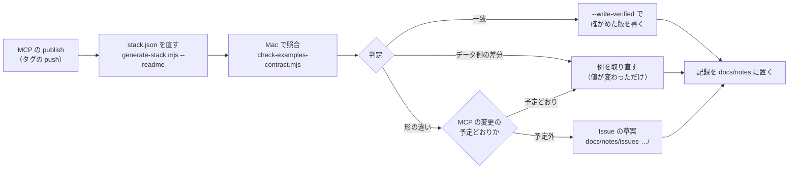

# 手順: MCP を公開した後の、呼び出し例の照合

- 日付: 2026-10-10（JST）
- 対象: houki-egov-mcp・houki-nta-mcp を npm に公開した後（patch を含む）
- 出典: houki-hub#44 のやること 5、設計の文書 `docs/notes/2026-10-10-design-hub5-regen-and-examples-check.md`
- 今までの手作業の手順（`2026-09-21-regression-check.md` の「やり方」1、Claude Desktop の plugin で例を流して表にする）は、この手順に置き換える。2026-09-21 の記録は直さずに残す

この文書は、公開した版で全部の呼び出し例を流し、例が述べている応答が今も返るかを確かめる手順をまとめる。照合はスクリプト（`scripts/check-examples-contract.mjs`）が行い、人と LLM は「形の違い」と「データ側の差分」の例だけを見る。

## いつ流すか

| きっかけ | 流すもの | 流す場所 |
| --- | --- | --- |
| egov か nta を npm に公開した後（patch を含む） | この文書の手順。全 48 例 | shuji の Mac（DB の要る例は手元のローカル DB を引くため） |
| 毎日 07:37 JST（`reference-regen.yml`） | DB の要らない例だけ（`--db absent`） | GitHub Actions。結果はページを作り直す PR の本文と実行の要約に出る |

CI の照合は DB の要る例（約 20 例）を流さない。公開の後の Mac の照合は省かない。



## 手順

houki-hub の作業コピーで流す。

```sh
# 1. stack.json を公開版に合わせる（照合のスクリプトは stack.json の published の版を npx で起動する）
node scripts/generate-stack.mjs --readme

# 2. 全部の例を流す（表）。公開の直後で stack.json を直す前なら --version houki-nta=0.27.1 のように版を渡す
node scripts/check-examples-contract.mjs > /tmp/contract.md; head -8 /tmp/contract.md

# 3. 結果を分けた後、「一致」の例に確かめた版を書く（もう一度全部を流す）
node scripts/check-examples-contract.mjs --write-verified > /tmp/contract-verified.md
git diff --stat -- scripts/reference-examples

# 4. 前の版で実測したまま確かめていない例が残っていないか
node scripts/check-example-versions.mjs
```

- 手元の DB は、照合の前に取り込み直さなくてよい。DB の取り込み日で変わる値（`freshness` の日時・件数）は、比べ方の規則がデータ側の差分か「値があることだけ」にしている
- `--db present`（既定）は手元の DB をそのまま引く。`nta_get_*` が DB に無い文書を国税庁サイトから取ったときは、その応答が手元の DB に書き戻される（`scripts/reference-examples/README.md` の「ローカル DB の状態で応答が変わるツール」）。触りたくなければ `HOUKI_NTA_DB_PATH` に DB の写しを渡す
- 公開前のビルドを試すときは `--launch local`（`mcp/<repo>/dist` を起動）。このときは `--write-verified` を付けても確かめた版を書かない（公開版を確かめた記録にするため）

## 結果の見方

表の判定は 5 つ。

| 判定 | 意味 | すること |
| --- | --- | --- |
| 一致 | 例が述べている形と値が今も成り立つ | 手順 3 で「- 確かめた版: vX（日付）」を書く。例の本文は変えない |
| データ側の差分 | 本文の文字列・件数・日付など、国税庁・e-Gov の更新で変わる値だけが違う | 例を取り直すかを決める。例の主張（何が返るか）が変わらず、値が少し違うだけなら、そのままでもよい |
| 形の違い | キーが無い・型が違う・配列が短い・エラーかどうかが違う・短い値（`code`・`source` など）が違う | 下の「形の違いの分け方」 |
| 未確認 | この環境で流せなかった（起動・呼び出しの失敗、例が読めない） | 「違いの中身」の列の理由を見て、起動の問題なら直して流し直す |
| 照合しない | 例に「- 照合: しない」か「- 版の照合: しない」の行がある | 何もしない |

形の違いの分け方:

1. 公開した版の CHANGELOG と仕様 PR に、その変更が書いてあるか見る。書いてあれば **例を取り直す**（予定どおりの変更）
2. 書いていなければ **MCP の劣化** として Issue の草案を `docs/notes/issues-<日付>-contract/` に置く（例: houki-nta-mcp #147、`taxAnswer.sections` が 7 件 → 3 件）。例は直さずに残す（直すと劣化の証拠が消える）
3. 例の書き方や比べ方の規則が原因（毎回変わる値なのに比べている、など）なら、**規則で吸収する**。family で共通のものは `scripts/lib/example-contract.mjs` の `VOLATILE_RULES` に足し、その例だけのものは例に `- 照合:` の行を書く

「増えた」（例に無いキーが応答にある）は判定に数えない。新しいフィールドを例に載せるかは、取り直すときに決める。

## 記録

結果の表を `docs/notes/<日付>-contract-check-egov-<版>-nta-<版>.md` に置く。書くことは次のとおり。

- 起動したもの（表の上の「起動:」の行）とローカル DB の状態（`freshness` の `last_sync_date` など）
- 集計の行と、形の違い・データ側の差分の例の分け方（取り直す・規則に足す・Issue にする）
- Issue の草案のパス

各 MCP リポジトリの公開の手順（AGENTS.md の Publisher の節）にこの手順を足すかは、houki-hub#44 を閉じるときに決める。
