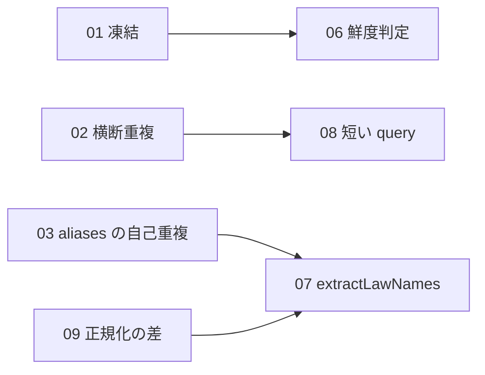

# houki-abbreviations 初版仕様の「未決」の振り分け（2026-09-27）

houki-abbreviations PR #10 で、公開 API 23 件の `specs/current/<dir>/spec.md` を起こしました。そのとき「未決」に残った 116 件を振り分け、判断が要る項目を Issue にするための下書きです。進め方は houki-nta-mcp の振り分け（`../issues-2026-09-26-nta-undecided/`）と同じです。

## 振り分けの規則

各 `spec.md` の「未決」の書き方で、次の 3 種類に分けます。

- **テストを足す（63 件）:** 今の振る舞いのまま「できること」にしてよい項目です。欠けているのは受入テストと仕様 ID だけです。
- **テストを直す（4 件）:** テストの名前と中身が合っていない項目です。直すのは Test Designer で、Issue は要りません。
- **Issue にする（52 件）:** 直す・残す・禁じるの判断が先に要る項目です。テストを先に書くと、決めていない振る舞いを固定してしまいます。

もとの 116 件に対して、`limit` の 3 項目（search_by_name 4、find_similar 5、suggest_correction 3）をそれぞれ 2 つに分けたので、合計は 119 件です。既定値と 1 未満の値はテストを足す側に残し、`NaN` と上限は新しい項目（search_by_name 5、find_similar 8、suggest_correction 5）にして Issue 10 へ移します。

## Issue にするもの（houki-abbreviations に 13 件）

| # | 本文 | 題名 | 対象の未決 |
|---|---|---|---|
| 01 | `01-mutable-entries.md` | 辞書のエントリと公開定数を実行時に書き換えられ、他の関数の結果が変わる | 9 件 |
| 02 | `02-cross-entry-duplicates.md` | 名前がエントリをまたいで重複したときの扱いと、validateAllEntries が見逃す値 | 5 件 |
| 03 | `03-self-duplicate-aliases.md` | aliases に自分の abbr・formal と同じ値を持つエントリがあり、extractLawNames が同じ一致を 2 件返す | 3 件 |
| 04 | `04-counts-and-zero-keys.md` | 辞書の件数と、件数 0 の種別・MCP を約束にするか（getAbbreviationStats） | 3 件 |
| 05 | `05-docs-mismatch.md` | README・JSDoc・CONTRIBUTING の記述が v0.6.0 の実際の結果と合わない | 7 件 |
| 06 | `06-broken-fetched-at.md` | 壊れた取得時刻や NaN が鮮度判定で fresh / outdated になる | 7 件 |
| 07 | `07-extract-spanning-and-width.md` | extractLawNames が 2 つの法令名にまたがる一致を返し、全角の表記を吸収しない | 2 件 |
| 08 | `08-fuzzy-short-query.md` | findSimilar・suggestCorrection が短い query で意味の違う略称や入力そのものを候補に返す | 2 件 |
| 09 | `09-normalization-differs.md` | 関数ごとに全角・ダッシュ類・大文字の扱いが揃っていない | 4 件 |
| 10 | `10-limit-nan.md` | limit に NaN を渡したときの扱いと上限が関数ごとに違う | 3 件 |
| 11 | `11-law-id-strictness.md` | isValidLawId が元号の桁と府省コードの範囲を確かめない | 2 件 |
| 12 | `12-numerals-and-characters.md` | 漢数字・大きな数・BMP 外の文字で入力が意図と違う値になる | 4 件 |
| 13 | `13-kokuji-category.md` | 告示を辞書に入れるときの category が CATEGORIES に無い | 1 件 |

同じ判断が複数の関数に出ているので、判断 1 つにつき Issue 1 件にしました。01・02・03 は辞書を読み込む MCP（houki-egov-mcp・houki-nta-mcp）すべてに関わるので、先に決めることをおすすめします。05 は文書だけを直す行なら、仕様 PR を通さず実装 PR 1 本で閉じられます。

矢印は「左を決めると右の決め方が変わる」関係です（例: 03 で辞書の自己重複を禁じれば、07 の抽出側の対応が軽くなる）。

## 起票と、Issue 番号の反映

1. `scripts/create-issues-2026-09-27-abbr.sh` で起票します（`DRY_RUN=1` で題名だけ表示）。作成した番号は `created.tsv` に残ります。
2. houki-abbreviations のブランチ `spec/20260927-undecided-to-issues` を checkout した状態で、`scripts/apply-issue-numbers-2026-09-27-abbr.sh` を実行します。`spec.md` と proposal.md の仮の番号 `#ISSUE-01`〜`#ISSUE-13` を、`created.tsv` の番号に置き換えます（コミットはしません）。
3. 置き換えを確かめてから `git commit --amend` し、署名して push、仕様 PR を開きます（「実装の変更: 不要」）。

## テストを足す・直す項目（67 件）

「未決」の番号で示します。Issue に移した番号は含みません。

| 関数 | テストを足す | テストを直す |
|---|---|---|
| abbreviation_entries | 3, 4, 5, 6 | — |
| compute_days_since | — | — |
| extract_law_names | 4, 5, 6, 7, 8 | — |
| find_similar | 3, 4, 5, 6, 7 | — |
| get_abbreviation_stats | 3, 4 | — |
| get_all_names | 1, 2, 5 | — |
| is_valid_law_id | 3, 4 | — |
| judge_staleness | 3 | — |
| kanji_to_number | 1, 3, 4, 5 | — |
| levenshtein | — | 2 |
| list_by_category | 2, 3, 4, 5 | — |
| list_by_domain | 3, 4, 5 | — |
| list_by_source_mcp_hint | 2, 3, 4, 5 | — |
| lookup_by_law_id | — | 2 |
| lookup_by_law_num | 3, 4 | 1, 2 |
| normalize_jp_text | 1, 2, 4 | — |
| normalize_law_num | 2, 3, 4, 6 | — |
| normalize_search_query | 2 | — |
| public_constants | 2, 4 | — |
| resolve_abbreviation | 3, 4, 6, 7, 8 | — |
| search_by_name | 1, 2, 3, 4 | — |
| suggest_correction | 3, 4 | — |
| validate_all_entries | 1, 5, 6 | — |

補足:

- どれも fixtures か同梱辞書で確かめられ、実装の変更は要りません。仕様 PR で ADDED の差分を `specs/changes/` に出し、実装 PR で Test Designer がテストを書き、Publisher が `specs/current/` に取り込みます。
- `list_by_*` の 3 関数（返す順、毎回新しい配列、未知の値は `[]`）と、`null` / `undefined` を渡したときの結果（normalize 系・`kanjiToNumber`・`isValidLawId`・`resolveAbbreviation`）は、関数をまたいで同じ形のテストになります。テーマごとに 1 本の仕様 PR にまとめられます。
- 「テストを直す」4 件は、Test Designer がテストの中身（入力と describe 名）を直す実装 PR で扱います。振る舞いは変わらないので、仕様 PR は要りません。lookup_by_law_num 1 は直したテストに SPEC-ABBR-LOOKUP-BY-LAW-NUM-002 を付けます。
