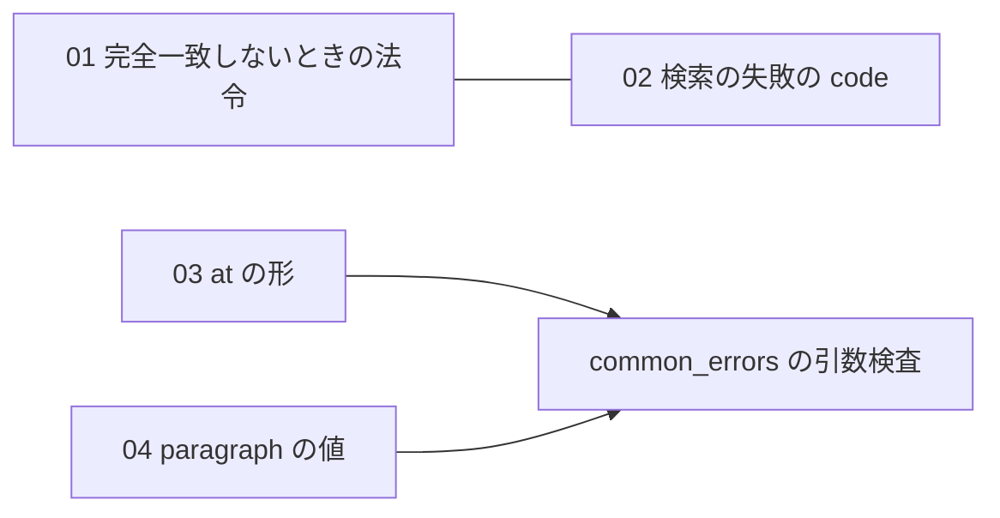

# houki-egov-mcp 初版仕様の「未決」のうち、複数のツールにまたがる 5 件（2026-09-28）

houki-egov-mcp の初版起こし（ブランチ `spec-init/egov-initial`、20 単位）で「未決」に残った判断が要る項目のうち、同じ原因・同じ判断が複数のツールに出ているものを Issue 1 件ずつにした下書きです。状態の全体は `../2026-09-28-egov-initial-specs.md` にあります。

## Issue にするもの（houki-egov-mcp に 5 件）

| # | 本文 | 題名 | 対象の未決 |
|---|---|---|---|
| 01 | `01-law-name-first-hit.md` | 法令名が完全一致しないとき、検索結果の 1 件目の法令を知らせずに使う | 8 件（6 ツール + verify_citations） |
| 02 | `02-law-search-failure-not-found.md` | 法令名の検索が e-Gov の障害で失敗しても LAW_NOT_FOUND を返し、存在しない法令と見分けられない | 8 件（8 ツール） |
| 03 | `03-at-format.md` | 時点の引数 at の形を確かめず、形の誤りや成立前の日付の結果がツールごとに違う | 6 件（6 ツール） |
| 04 | `04-paragraph-value.md` | paragraph に 0・負の数・小数を渡すと ARTICLE_NOT_FOUND になり、item の扱いと揃っていない | 2 件（2 ツール） |
| 05 | `05-file-size-limit-code.md` | 50 MB を超えるファイルの保存を INVALID_ARGUMENT で断り、全部取得してから判定する | 2 件（2 ツール） |

01 と 02 は同じ処理（略称辞書に `law_id` が無い名前を e-Gov の法令名検索で法令に決める処理）から出ています。`verify_citations` だけは別の決め方（完全一致した 1 件だけを採る、検索の失敗はツール全体の `SOURCE_*`）をしているので、どちらに揃えるかを 01・02 で一緒に決めるのがよいと考えます。

03 と 04 は、inputSchema に `pattern` や `minimum` を書けば common_errors の引数検査で一律に `INVALID_ARGUMENT` にできる、という共通の選択肢があります。

## 起票と、Issue 番号の反映

1. `scripts/create-issues-2026-09-28-egov-cross-tool.sh` で起票します（`DRY_RUN=1` で題名だけ表示）。作成した番号は `created.tsv` に残ります。
2. spec.md の未決を「→ houki-egov-mcp #N」に縮めるのは、残りの判断が要る未決（85 件のうちこの 5 件に入らない約 60 件）の振り分けと一緒に、仕様 PR 1 本で行います。
