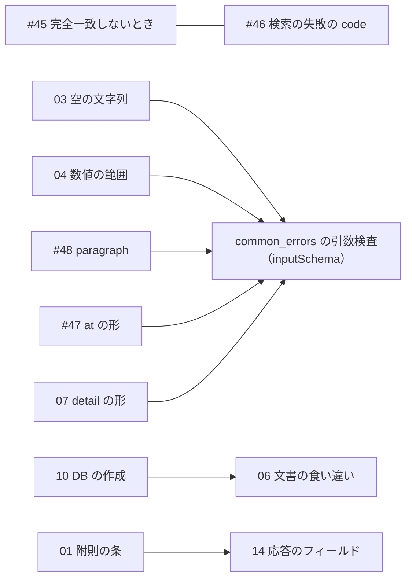

# houki-egov-mcp 初版仕様の「未決」の振り分け（2026-09-28）

houki-egov-mcp PR #50 で、外から見える 20 単位の `specs/current/<dir>/spec.md` を起こしました。そのとき「未決」に残った 198 件のうち、意図か不具合かの判断が要る 85 件を Issue にするための下書きです。進め方は houki-abbreviations の振り分け（`../issues-2026-09-27-abbr-undecided/`）と同じです。

## 振り分けの規則

各 `spec.md` の「未決」の書き方で、次の 2 種類に分けます。

- **テストを足す（113 件）:** 本文の末尾が「テストが無い。ID を振るのは受入テストを書いてから。」の項目です。今の振る舞いのまま「できること」にしてよく、欠けているのは受入テストと仕様 ID だけです。
- **Issue にする（85 件）:** 直す・残す・禁じるの判断が先に要る項目です。テストを先に書くと、決めていない振る舞いを固定してしまいます。

Issue にする 85 件のうち 26 件は、ツールをまたぐ 5 件（#45〜#49、`../issues-2026-09-28-egov-cross-tool/`）として起票済みです。ここでは残りの 59 件を、判断 1 つにつき Issue 1 件、計 17 件にまとめました。

## Issue にするもの（houki-egov-mcp に 17 件）

| # | 本文 | 題名 | 対象の未決 |
|---|---|---|---|
| 01 | `01-suppl-articles.md` | 条番号で条を探すとき本則と附則を区別せず、附則の条を本則の条として返す | get_law 15、verify_citations 1、get_article_references 14 |
| 02 | `02-abbreviation-matching.md` | 略称の全角・半角を吸収せず、通達の略称への応答がツールごとに違う | resolve_abbreviation 3・5、search_law 9 |
| 03 | `03-empty-string-args.md` | 必須の文字列の引数に空文字を渡したときの code がツールごとに違う | get_law 14、resolve_abbreviation 4、search_fulltext 1、get_attachment 2 |
| 04 | `04-numeric-and-format-args.md` | limit・latest・depth の上限・整数を約束しておらず、get_law が範囲表記の article を黙って受け付ける | search_law 2、get_law_revisions 3、get_toc 8、get_law 16 |
| 05 | `05-search-law-response.md` | search_law の domain が絞り込まず、total_count が総数でなく、0 件のときに次の手を返さない | search_law 1・3・10、search_fulltext 2 |
| 06 | `06-docs-mismatch.md` | README・CLI の使い方・tool description の記述が v0.15.1 の動きと合わない | common_errors 6・7・11、cli_entry 4・5、explain_law_type 7、get_toc 7 |
| 07 | `07-error-detail-shape.md` | 引数の検査の INVALID_ARGUMENT の detail が読み取りにくく、返さない code が語彙に残っている | common_errors 3・4・5・10 |
| 08 | `08-daily-sync-dates.md` | 日次差分の last_sync_date の決め方と差分の無い日の扱いで、取り込んでいない日を最新と扱う | cli_bulk_download 2・3・5、cli_sync 3 |
| 09 | `09-ingest-content.md` | 段落だけの本則を取り込まず、作れない公布日に 0001-01-01 を入れる | cli_bulk_download 4・6 |
| 10 | `10-db-lifecycle.md` | 新しい版の DB を古い版で開くと消え、MCP サーバーと --status が DB を作る | db_schema 3・4・5・10、cli_status 3 |
| 11 | `11-cli-args-and-status.md` | CLI が引数の打ち間違いを知らせず、--status の件数と警告の日数が表示と合わない | cli_entry 2、cli_status 4・5 |
| 12 | `12-explain-law-type-kinds.md` | explain_law_type が「通知」と一部の法令種別コードで期待どおりの解説を返さない | explain_law_type 1・2 |
| 13 | `13-name-based-inference.md` | 名前の形から関係法令・委任先を推定し、実在しない法令や違う法令を指す | get_related_laws 7、get_article_references 15・16 |
| 14 | `14-response-fields.md` | 目次の meta の at、補った項番号、続きの呼び出し例の max_chars が付かない | get_law 17・18、get_law_range 8 |
| 15 | `15-revisions-semantics.md` | get_law_revisions の状態の値が説明と違い、latest の「最新」の順が決まっていない | get_law_revisions 1・2・6 |
| 16 | `16-file-names.md` | 添付・本文ファイルの保存で、同名の添付を黙って選び、法令履歴 ID の欄に法令 ID が入る | get_attachment 3、get_law_file 1・11 |
| 17 | `17-fulltext-expansion.md` | search_fulltext の通称の展開が本文にも効き、2 文字の語の例が常に民法を添える | search_fulltext 3・4 |

矢印は「左を決めると右の決め方が変わる」関係です。03・04・#47・#48 は、inputSchema に `minLength`・`minimum`・`pattern` を書いて common_errors の引数検査で一律に止める、という共通の選択肢があります。その場合の `detail` の形は 07 で決めます。10 で MCP サーバーが DB を作らないと決めれば、06 の README の記述はそのまま正しくなります。

## 起票と、Issue 番号の反映

1. `scripts/create-issues-2026-09-28-egov.sh` で起票します（`DRY_RUN=1` で題名だけ表示）。本文の中の `#ISSUE-NN`（15 の本文にある 04 への参照）は、先に作った Issue の番号に置き換えてから起票します。作成した番号は `created.tsv` に残ります。
2. houki-egov-mcp のブランチ `spec/20260928-undecided-to-issues` を checkout した状態で、`scripts/apply-issue-numbers-2026-09-28-egov.sh` を実行します。`spec.md` と proposal.md の仮の番号 `#ISSUE-01`〜`#ISSUE-17` を、`created.tsv` の番号に置き換えます（コミットはしません）。
3. 置き換えを確かめてから `git commit -a --amend --no-edit` し、承認日を書いて署名し、push して仕様 PR を開きます（「実装の変更: 不要」）。

## テストを足す項目（113 件）

「未決」のうち本文の末尾が「ID を振るのは受入テストを書いてから」の項目です。単位ごとの件数は `../2026-09-28-egov-initial-specs.md` の表の「うちテスト無し」の列にあります。仕様 PR で ADDED の差分を `specs/changes/` に出し、実装 PR で Test Designer がテストを書き、Publisher が `specs/current/` に取り込みます。
