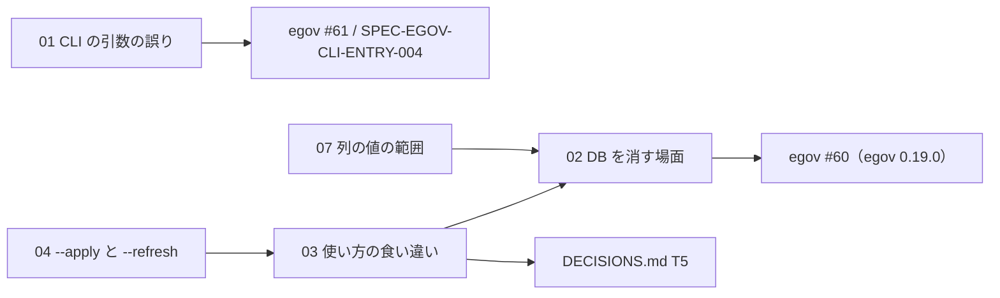

# houki-nta-mcp CLI・DB の初版仕様の「未決」の振り分け（2026-09-30）

houki-nta-mcp PR #103（Issue #75）で、`specs/current/{db_schema,cli_entry,cli_bulk_download,cli_refresh,cli_health_check}/spec.md` の 5 単位を起こしました。そのとき「未決」に残った 31 件のうち、意図か不具合かの判断が要る 13 件（cli_entry 2 と cli_refresh 4 は同じ内容なので、判断としては 12 件）を Issue にするための下書きです。進め方は houki-egov-mcp の振り分け（`../issues-2026-09-28-egov-undecided/`）と同じです。

## 振り分けの規則

各 `spec.md` の「未決」の書き方で、次の 2 種類に分けます。

- **テストを足す（18 件）:** 本文の末尾が「ID を振るのは受入テストを書いてから」の項目です。今の振る舞いのまま「できること」にしてよく、欠けているのは受入テストと仕様 ID だけです。
- **Issue にする（13 件）:** 「人が決める」で終わる項目です。直す・残す・禁じるの判断が先に要り、テストを先に書くと、決めていない振る舞いを固定してしまいます。

判断 12 件を、判断 1 つにつき Issue 1 件、計 7 件にまとめました。

## Issue にするもの（houki-nta-mcp に 7 件）

| # | 本文 | 題名 | 対象の未決 | 同じ問題の egov の Issue |
|---|---|---|---|---|
| 01 | `01-cli-argument-errors.md` | CLI が知らないフラグ・不正な日数・未対応の通達名を知らせずに MCP サーバーを起動するか例外で終わり、`--version` の文が houki-egov-mcp と違う | cli_entry 1・2、cli_refresh 4、cli_bulk_download 3 | #61（未知の引数）。SPEC-EGOV-CLI-ENTRY-003・004 に揃える |
| 02 | `02-db-version-and-clear.md` | 版が合わない DB を全テーブルを消して作り直し、全データを消す機能に CLI の入口が無く `HOUKI_NTA_REFRESH=1` の説明だけがある | db_schema 2・4 | #60。egov 0.19.0 と同じ規則にする |
| 03 | `03-docs-mismatch.md` | CLI の使い方の `--refresh` の説明・環境変数の欄・`--refresh-stale` の「N 日以上」が実際の動きと合わない | cli_refresh 2・6、cli_entry 5 | #56（nta #70 と同じ種類。T5） |
| 04 | `04-refresh-with-apply.md` | `--refresh-stale=<日数> --apply` は差分更新で、`--refresh` を組み合わせても全部取り直しにならない | cli_refresh 3 | — |
| 05 | `05-filtered-bulk-orphan-marks.md` | 税目を絞った投入では、その税目の索引をすべて取れていても、索引から消えた文書の印（`orphaned_at`）を付け直さない | cli_bulk_download 4 | — |
| 06 | `06-drift-check-targets.md` | `--check-baseline-drift` は menu.htm の下にない 4 件を常に `ok` にし、`<ok>/9 OK` に数える | cli_health_check 4 | — |
| 07 | `07-document-column-constraints.md` | `document.doc_type` と `taxonomy` に列の制約が無く、想定した 5 種別以外の値も入る | db_schema 6 | — |

まとめ方の理由:

- **01（3 つの未決を 1 件）:** cli_entry 2（知らないフラグ）、cli_refresh 4（数でない日数）、cli_bulk_download 3（未対応の通達名）は、どれも「引数の誤りを利用者に知らせない」で、直し方も `parseArgs` と `runCliIfRequested` の 1 か所に集まります。cli_entry 1（`--version` の文）も同じ関数で、houki-egov-mcp の SPEC-EGOV-CLI-ENTRY-003・004 に揃えるかを一度に決めるので同じ Issue にしました。
- **02（2 つの未決を 1 件）:** db_schema 2（版が合わない DB を消す）と 4（全データを消す機能の入口）は、どちらも「DB を消す場面の約束」で、houki-egov-mcp #60 の 2 つの項目に当たります。
- **03（3 つの未決を 1 件）:** cli_refresh 2、cli_entry 5、cli_refresh 6 は「使い方の文が実際と合わない」で、T5 の規則（行ごとに文書を直すか動きを直すか）で振り分けます。
- **04〜07:** 判断がそれぞれ独立していて、変える場所も別（`runRefreshStale`、bulk download の CLI ラッパー、`detectBaselineDrift`、`SCHEMA_SQL`）なので 1 件ずつにしました。07 を 02 と分けたのは、02 は消す場面の規則、07 は列の値の範囲で、決めることが違うためです。`CHECK` 制約を足すなら 02 と同じ版でスキーマの版を上げます（Issue の本文に書いてあります）。

矢印は「右を決めると左の書き方が決まる」関係です。02 で全データを消す入口を作ると、03 の `--refresh` の説明の直し方が変わります。04 で `--refresh` を `--apply` に効かせるなら、03 の `--refresh` の説明にその旨が入ります。07 で `CHECK` 制約を足すなら、02 のスキーマの版上げと同じ版にします。

## 計画書の段階への割り付け

`../2026-09-29-plan-spec-issues.md` の 2.2 節の表と 4 章の段階に、次のように足します。

| Issue | 種類 | テーマ | 段階 | 版 | 害 |
|---|---|---|---|---|---|
| 03 | B | T5 | 4 | nta 0.23.0（T4 + T5。#70 と同じ仕様 PR） | 低 |
| 01 | C | DB・CLI | 5 | nta 0.24.0 | 中（打ち間違えたまま MCP サーバーが起動して待ち続ける） |
| 02 | C | DB・CLI | 5 | nta 0.24.0 | 高（投入した中身が消える） |
| 04 | C | DB・CLI | 5 | nta 0.24.0 | 低 |
| 05 | C | DB・CLI | 5 | nta 0.24.0 | 中（索引から消えた文書の印が古いまま） |
| 06 | C | DB・CLI | 5 | nta 0.24.0 | 低 |
| 07 | C | DB・CLI | 5 | nta 0.24.0 | 低 |

段階 5 の nta 0.24.0 は計画書では「nta の検索規則」（#80・#81・#72）ですが、egov 0.19.0 の「DB と CLI」に当たるまとまりを nta にも置き、同じ 0.24.0 に入れるか 0.25.0 に分けるかは計画書を直すときに決めます。スキーマの版を上げるのは 02（版の扱い）と 07（`CHECK` 制約を足す場合）だけで、必ず同じ版に入れます。

## 起票と、Issue 番号の反映

1. `scripts/create-issues-2026-09-30-nta-cli-db.sh` で起票します（`DRY_RUN=1` で題名だけ表示）。本文の中の `#ISSUE-NN`（03・07 の本文にある 02 への参照）は、先に作った Issue の番号に置き換えてから起票します。作成した番号は `created.tsv` に残ります。
2. houki-nta-mcp のブランチ `spec/20260930-cli-db-undecided-to-issues` を checkout した状態で、`scripts/apply-issue-numbers-2026-09-30-nta-cli-db.sh` を実行します。`spec.md` と proposal.md の仮の番号 `#ISSUE-01`〜`#ISSUE-07` を、`created.tsv` の番号に置き換えます（コミットはしません）。
3. 置き換えを確かめてから `git commit -a --amend --no-edit` し、承認日を書いて署名し、push して仕様 PR を開きます（「実装の変更: 不要」）。

## テストを足す項目（18 件）

「未決」のうち本文の末尾が「ID を振るのは受入テストを書いてから」の項目で、spec.md にそのまま残します。db_schema 1・3・5・7・8、cli_entry 3・4・6、cli_bulk_download 1・2・5・6、cli_refresh 1・5、cli_health_check 1・2・3・5 です。cli_health_check 3（警告のしきい値）は末尾が「しきい値の値を仕様にするかは人が決める」ですが、しきい値は `src/services/health-thresholds.test.ts` にあるとおり動いていて、値を仕様に書くかどうかは CLI の受入テストを書くときに決めればよいので、Issue にせずここに残しました。cli_bulk_download 6 と cli_entry 6 は、それぞれ search_rules の未決 7 と db_schema の未決 1 と同じ項目です。
