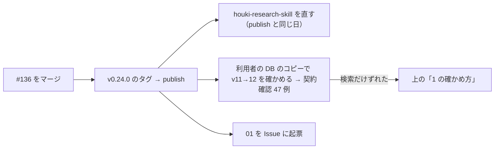

# 引き継ぎ: houki-nta-mcp 0.24.0（実装 PR #136）のレビューで残った点

作成: 2026-10-04（JST, +09:00）
前のチャットで終わったこと: houki-nta-mcp 0.24.0（段階 5）の実装 PR #136。起点 `2eab6e9`、ブランチ `feat/20261004-0.24.0`、HEAD `4cc1fc0`。レビューは「マージしてよい」、CI はすべて成功

このメモは、PR #136 のレビューが「止めるほどではない」とした 3 点と、マージの後に残っている作業を、次に作業する人が拾えるように書き残すためのものです。

## レビューで残った 3 点

| # | 内容 | 扱い |
|---|---|---|
| 1 | 版 11 → 12 の移行で落とした行が 0 件なら、`document_fts` を rebuild しない | Issue にしない。契約確認で検索だけがずれたときの最初の確認箇所として残す（下の「1 の確かめ方」） |
| 2 | `readStoredTaxAnswerIndex` が SQL の例外をすべて受け取って `null` を返す。壊れた表でも「索引が無い」と同じ動きになる | Issue にする。本文は [`01-tax-answer-index-read-errors.md`](01-tax-answer-index-read-errors.md) |
| 3 | README の新しい文は「〜します」「〜です」だが、古い節に体言止めが残っている | Issue にしない。README を整える別の機会に、節ごとに直す |

### 1 の確かめ方

移行（`migrateV11ToV12`、`src/db/schema.ts`）は、`document` を作り直すときに `id` を含む列をそのまま写します。`document_fts` は `content_rowid` で `document.id` を指すので、行を落とさなければ FTS を作り直さなくても引ける行は変わらない、という前提です。

契約確認（47 例）で、検索ツールの結果だけが移行の前と違ったら、DB のコピーで次を実行し、結果が戻るかを見てください。

```sh
sqlite3 copy.db "INSERT INTO document_fts(document_fts) VALUES('rebuild');"
```

戻るなら、移行で「落とした行が 0 件でも rebuild する」に変える Issue を立てます。

## マージの後に残っている作業



- **houki-research-skill**（publish と同じ日に直す前提）
  - `docs/ERROR-CODES.md`: `SOURCE_TIMEOUT`・`SOURCE_UNAVAILABLE`・`SOURCE_RATE_LIMITED`・`SOURCE_API_ERROR` の 4 つ。`SOURCE_API_ERROR` は 5xx と原因不明のネットワークの失敗が `retryable: true`、403・400 などの 4xx が `retryable: false`
  - `error-recovery-patterns.md` のシナリオ 4: code ごとの対応にし、429（`SOURCE_RATE_LIMITED`）はすぐに再試行しないと書く
  - `ERROR-HANDLING.md`: 再試行の説明を `retryable` の値に合わせる
- **契約確認で出る差分**（CHANGELOG 0.24.0 の「互換性」の表どおり）: `nta_search_qa` の `domain`、`nta_get_tax_answer` の 8xxx・0xxx と 113 件、429 と 403・400 の `code` と `retryable`、`--version` の文、引数の誤りの終了コード 2
- **Issue の起票**: `01-tax-answer-index-read-errors.md` を houki-nta-mcp に起票し、`created.tsv` に番号を書く

## 出典

- 実装 PR [#136](https://github.com/shuji-bonji/houki-nta-mcp/pull/136) とそのレビュー（2026-10-04）
- 仕様 PR #132〜#135、`specs/releases/v0.24.0/`
- [CHANGELOG 0.24.0](https://github.com/shuji-bonji/houki-nta-mcp/blob/main/CHANGELOG.md)
