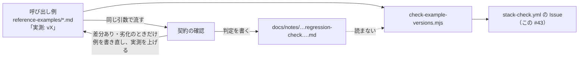

## 追記: 「古い版で測ったままの呼び出し例」20 件が、確かめないまま一緒に閉じた（2026-10-06 JST）

この Issue は `stack.json` と npm が一致したことで閉じましたが、本文に載っていた「古い版で測ったままの呼び出し例」20 件には何もしていません。20 件を取り直すべきかを決める情報が、今の仕組みではどこにも残らないためです。経緯と論点を記録します。

### 「古い」が指しているもの

`scripts/check-example-versions.mjs` は次の 2 つの版番号だけを比べ、1 が 2 より小さい例を「古い」（`stale`）と数えます。応答が変わったかどうかは見ていません。

1. 呼び出し例 `scripts/reference-examples/<server>/ja/*.md` の各例の冒頭の `- 実測: vX` の行（例を取った人が、ツールを呼んだときの版を手で書く）
2. `stack.json` の `repos[].published`（`generate-stack.mjs` が `npm view <pkg> version` で書く、npm の latest）

`generate-reference.mjs` や `site/` のビルドは `- 実測:` の行を変えないので、件数は変わりません。減るのは、例を取り直して `- 実測:` を書き換えたときだけです。

今回の 20 件は、どれも nta 0.25.0 で測ったタックスアンサー以外の例です。0.25.1（houki-nta-mcp #147、PR #151）で変わったのは `nta_get_tax_answer` の節の分け方と DB の本文だけなので、応答は 0.25.0 と同じはずです。取り直しが要ったタックスアンサーの 3 例は、`1bbd5da`・`0d691b9` で 0.25.1 の実測に書き換えました。

### 隙間: 契約の確認の結果が例に戻らない

公開のたびに、呼び出し例を e2e のテストケースとして使う「契約の確認」をしています（手順は `docs/notes/2026-09-21-regression-check.md`）。例の引数で現行版を呼び、例が述べている形と主張を比べて、一致・差分あり・劣化などに判定します。直近の回は `docs/notes/2026-10-05-regression-check-egov-0.20.0-nta-0.25.0.md` で、一致 27・差分あり 18・劣化 1 でした（劣化の 1 件が houki-nta-mcp #147）。

| 場面 | 今の扱い | 起きること |
| --- | --- | --- |
| 契約の確認で「一致」だった例 | 例は書き直さない | `- 実測:` は前の版のまま。「この版でも同じだった」は notes にしか残らない |
| `check-example-versions.mjs` | 例の `- 実測:` だけを読む | 一致と確かめた例も「古い」と数える |
| `stack-check.yml` の Issue | `stack.json` と npm の一致だけで閉じる | 「古い」例は、取り直しも確かめもされないまま一緒に閉じる |
| patch の公開（今回の 0.25.1） | 変えたツールの例だけを取り直す | 変えていないツールの例は、確かめられないまま「古い」に残る |

### 直し方の案

1. **確かめた結果を例に書き戻す**（計画書 `docs/notes/2026-10-04-plan-stage6-and-followups.md` の Q14 の案 B）。契約の確認で「一致」だった例に、`- 確かめた版: v0.25.1（2026-10-06、記録 docs/notes/<ファイル>）` のような行を足す。`check-example-versions.mjs` は、「実測」と「確かめた版」の新しいほうを npm の版と比べる
2. **表示の名前を変える**。「古い」は取り直しが要るように読めるので、「前の版で実測」など、版番号を比べただけだと分かる名前にする
3. **Issue の閉じ方を分ける**。`stack.json` のずれ（`generate-stack.mjs` で直る）と、確かめていない例（契約の確認で直る）は直し方が違う。前者だけで閉じるなら、後者は別の Issue にするか、本文に「この Issue では扱わない」と書く
4. **契約の確認をスクリプトにする**（大きい）。例の `**引数**` を読んで MCP を stdio で呼び、例の JSON と形と主張を比べる。DB の取得日時や score のように毎回変わる値を除く規則が要る。違いが出た例だけを人と LLM が見る

勧めるのは 1 と 2 と 3 です。4 は、houki-hub#5 ② と段階 4 の近くで検討します。

### 今回の 20 件の扱い（案）

1 が入るまでは、20 件を 0.25.1 で流して「一致」を確かめ、結果を notes に残すのが最小です。1 が入った後なら、同じ結果を `- 確かめた版:` の行として例に書き戻せます。
