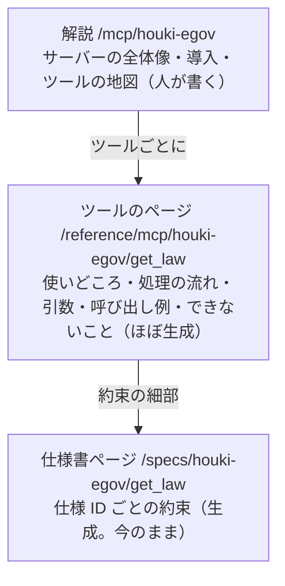

# リファレンスをツールごとのページに分け、人が読める形にする（#27 の続き）

houki-hub#27 で、各リポジトリの仕様書から仕様書ページ（`/specs/<site>/<機能>`）を生成して公開しました（PR #46・#47）。仕様書ページは spec.md を言い換えずに写しているので、契約とテストの索引としては使えます。一方で、人がツールを理解するための文書にはなっていません。この Issue では、人が「このツールは何をして、どう使い、何を返すか」を 1 か所で読めるようにします。

## 今の状態

今のサイトでは、ツールについての情報が 3 種類のページに分かれています。

| ページ | 読者の問い | 中身の出どころ | 人が読んで困ること |
| --- | --- | --- | --- |
| 解説 `/mcp/houki-egov` | これは何か。DB はどう作るか | 手書き | ツールは一覧表だけで、ツールごとの説明がありません |
| リファレンス `/reference/mcp/houki-egov#get-law` | 何を渡して、何が返るか | `tools/list` と実測の呼び出し例 | 14 ツールで 1 ページ（1,551 行）です。いつ使うか、どこで失敗するかが書かれていません。見出し「引数」が 14 個並びます |
| 仕様 `/specs/houki-egov/get_law` | どの約束がテストされているか | `specs/current/get_law/spec.md` | 見出しが仕様 ID です。本文に「v0.26.x では…」「#155」のような経緯が混ざります |

## 目指す形

仕様 ID は契約とテストの索引として残し、人が読む本文は仕様ページに寄せません。人が読む単位をリファレンスのツールごとのページにします。

| ページ | 読者 | 持つもの |
| --- | --- | --- |
| 解説 | 導入する人 | サーバーの全体像、導入、ローカル DB、ツールの地図。ツールごとの説明は持たない |
| ツールのページ | 使う人・組み込む開発者・LLM | 使いどころ（人が書く）、spec.md の「使う人と受け取るもの」「処理の流れ」「できないこと」の写し、`tools/list` の引数、実測の呼び出し例、約束の見出しの一覧（仕様書ページへのリンク） |
| 仕様書ページ | 実装する人・監査する人 | 今のまま。仕様 ID ごとの約束と承認の履歴 |

## やること

1. **解説ページのツール表を 3 列にする:** `/mcp/houki-egov`・`/mcp/houki-nta` のツール表を「一言・リファレンス・仕様」の 3 列にします。仕様 ID は出しません。
2. **リファレンスをツールごとのページに分ける:** `generate-reference.mjs` で `/reference/mcp/<server>/<tool>`（ライブラリは `/reference/lib/houki-abbreviations/<関数>`）を生成します。今の 1 ページはツールの一覧と共通の前置きだけにし、`#get-law` のような今の錨から新しいページへ移す仕組みを置きます。spec.md の節は `spec-pages.mjs` の読み込みと変換（`readSpecFeature`・`transformMarkdown`）を使って写します。
3. **仕様書ページの先頭を整える:** 先頭を spec.md の h1 の一言と、ツールのページへのリンクだけにします。本文の言い換えはしません。
4. **人が書く節の置き場所を決める:** 「使いどころ」は今の `scripts/spec-pages/<site>/<dir>.md` をツールのページでも使います。新しく書くのは主なツールから始め、全部をそろえることは求めません。

## 見本で分かったこと

`get_law` 1 つ分の見本を作りました（`docs/notes/issues-2026-10-09-hub27-tool-pages/sample-get_law.md`、作り方は同じフォルダーの `sample-build.py`）。VitePress で組み、ブラウザで確かめた結果は次のとおりです。

| 項目 | 結果 |
| --- | --- |
| 1 ページにまとまるか | まとまります。使いどころ・処理の流れ・引数・呼び出し例・できないこと・約束の一覧が 1 ページに並び、目次で見分けられます |
| 約束の一覧 | 43 件の見出しを表にして畳むと、索引として読めます。各行から仕様書ページの ID へ移れます |
| spec.md の処理の流れの図 | ページ（高さ約 6,000px）の 3 割ほど（約 1,800px）を占め、文字が小さくなります。人向けの最初の図には向きません |
| 写した文の重なり | 生成済みの仕様書ページから写すと、生成側が足した節の目的の一文が重なりました。実装では spec.md から直接写します |

このため、ツールのページの図は次の形を勧めます。

- 先頭に、ノード 10 個ほどまでの小さな図（呼び出しの往復のシーケンスか、分岐の要点だけのフロー）を置きます
- spec.md の処理の流れの図は `::: details` に畳みます。畳んだ中で Mermaid が正しく描けるか（幅が 0 で描かれないか）は、実装のときに確かめます

## コンテナと図の使い分け

全ページでカスタムコンテナと図を使うにあたり、種類ごとに意味を 1 つに決めます。増やしすぎると目立たなくなるためです。

| コンテナ | 意味 | 例 |
| --- | --- | --- |
| `tip` | 使いどころ・近道 | 番号が分からないときは先に `nta_search_tsutatsu` |
| `info` | 前提・版の条件 | v0.19.0 以上、ローカル DB が要る |
| `warning` | 間違えやすいこと・業法の線 | 通達は納税者を拘束しない。結論は返さない |
| `danger` | 取り消せない操作 | 0.18.x 以前で新しい DB を開くと全テーブルが消える |
| `details` | 長い例・経緯・spec.md の図 | 呼び出し例の応答 JSON |

| ページ | 図 | 示すこと |
| --- | --- | --- |
| `/guide/overview`・`/guide/architecture` | 構成図 | クライアント → Skill → MCP 群 → e-Gov API・国税庁サイト・ローカル DB |
| `/mcp/houki-egov`・`/mcp/houki-nta` | 構成図・フロー | 外の API とローカル DB のどちらを引くか。DB を作る・最新にする・作り直す流れ |
| `/guide/local-database` | フロー | 版をまたぐときの判断 |
| ツールのページ | シーケンス・フロー | 代表的な呼び出しの往復（LLM → ツール → 外部 → 応答と `next_actions`） |
| `/skills/houki-research` | シーケンス | workflow でツールを呼ぶ順 |

## 決めること

1. ツールのページを `/reference/` の下に置くか、`/mcp/` の下に置くか（勧める案: `/reference/`）
2. ツールのページに約束の見出しの一覧を載せるか、仕様書ページへのリンクだけにするか（勧める案: 畳んで載せる）
3. spec.md の経緯の文（「v0.26.x では…」）をツールのページに出すか（勧める案: 出す。言い換えないため。ただし経緯が多い節は畳む）

## この Issue の範囲の外

- 生成し直しを CI で行うこと（hub#5 ②）
- 仕様書ページの写し方の決まり（言い換えない）を変えること
- scope-by-audience のページの文
