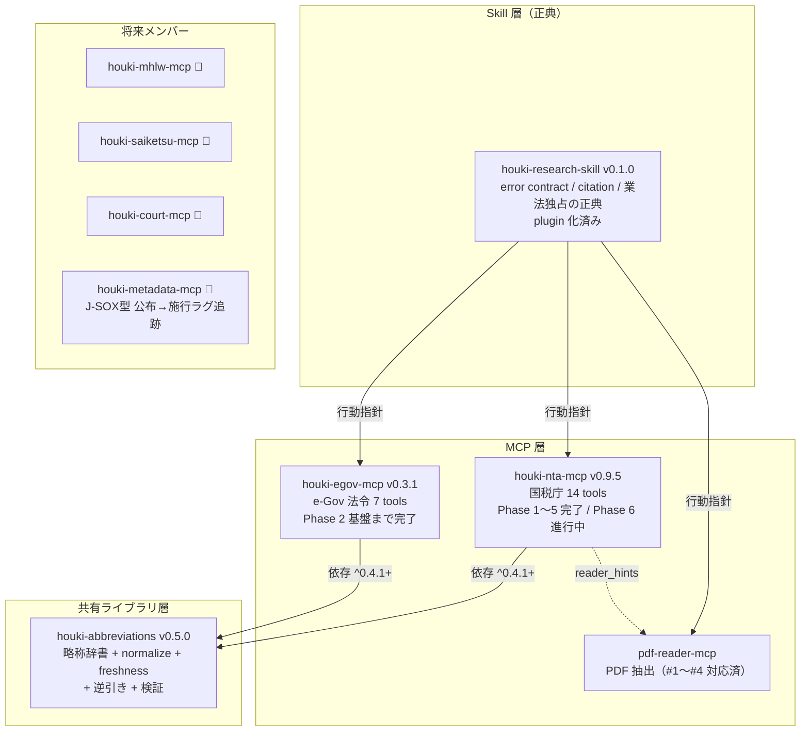

# 法規シリーズ 現状把握レポート（2026-07-19）

対象: houki-abbreviations v0.5.0 / houki-egov-mcp v0.3.1 / houki-nta-mcp v0.9.5 / houki-research-skill v0.1.0
（全リポジトリ working tree clean、未コミットなし）

## 全体像

## リポジトリ別の現状と残タスク

### houki-nta-mcp（v0.9.5）— 最も成熟、v1.0 目前

機能面は完成。v0.9.4 で国税庁 URL 変更（sozoku→sozoku2 等）追従 + soft-404 検知 + baseline drift 検知の二重防御、v0.9.5 で plugin manifest 追加。

残タスク = Phase 6 → v1.0.0:

- [x] ~~6-2 差分更新~~ → **訂正（同日コード監査）: v0.9.0 で実装・リリース済み**（schema v4 / conditional GET / 6 downloader 3-way 分岐 / テスト 24 ケース）。残りは CLI `--force-reload` 配線等の仕上げのみ → `docs/PHASE6-2-CLOSEOUT-PLAN.md`（v0.9.6 パッチ）
- [x] ~~legal_status issue #1/#2~~ → **訂正: v0.9.1 で対応済み**
- [ ] 6-1 relevance ranking: `relevance-scoring.ts` + re-rank は実装済み。残りは e2e 非破壊確認のみ
- [ ] 6-3 doc サイト + llms.txt 公開 → houki-hub-doc は廃止決定済みで mikuro.net 統合。PHASE6.md の記述が旧方針のまま（要更新）
- [ ] issue #3 synonym 展開（abbreviations v0.6.0 の `expandToFormalNames` と連動）
- [ ] v1.0 判定の残項目確認。完了後 1 ヶ月 soft 期間
- [x] ~~CHANGELOG v0.9.0/v0.9.1 欠落~~ → **訂正: 欠落なし**（L176-220 / L134-174 に記載、tag も存在）

### houki-egov-mcp（v0.3.1）— Phase 2 の折り返し地点

bulk DL → SQLite FTS5 の取り込みパイプライン（Phase 2-1〜2-6, 2-10）は完成、テスト 193 件。ただし DB は「作れるが検索から引けない」状態。

- [ ] **Phase 2-7: `search_fulltext` を FTS5 に接続**（現状は search_law フォールバック）← 最重要
- [ ] Phase 2-8: 差分同期（`file_section=3&update_date` 方式、日次ループ）
- [ ] Phase 2-13: API enrichment + `source: 'bulk'|'api'` 付与、2-14: 既存 tools の bulk 化
- [ ] Article タグなし小型法令（ImperialOrder 等）の FTS5 fallback
- [ ] 積み残し: 漢数字対応（「第三十条」→30）、大規模法令（民法・会社法）の部分取得
- [ ] PAIN-POINTS 7日ミニログは bootstrap 11 件のみで日次記録・振り返り未実施（2026-05-16 予定のまま）。spike で代替した形だが close 判断が必要

### houki-abbreviations（v0.5.0）— family のハブとして順調

v0.5.0 で逆引き（`lookupByLawId`/`lookupByLawNum`）+ 検証（`validateAllEntries`/`extractLawNames`）を統合リリース。

- [ ] `verify-law-ids.mjs` は雛形のみ → 月次 GitHub Actions workflow 化が未完
- [ ] `lookupByLawNum` の漢数字↔算用数字正規化（`normalizeLawNum`）
- [ ] `isValidLawId` の DF 系・M 省令系パターン対応（v0.6.x）
- [ ] Track 4 辞書増強の継続（nta Issue #3 の synonym 展開と連動）
- [ ] `getCoverageReport()` 未実装、Track 5 ルーティングは「3 つ目の MCP 着手時に再評価」で凍結中

### houki-research-skill（v0.1.0）— 正典として確立、コンテンツは税務のみ

plugin 化 + Release 自動化済み。error contract / citation / 業法独占の正典は整備完了。

- [ ] workflow は `tax-research.md` のみ。`revision-tracking.md` が MCP 完成を待たず作れる次の候補
- [ ] examples 追加（電帳法、相続税改正 等）
- [ ] `ARCHITECTURE.md` の配布形態セクションが plugin 化前の記述のまま（ドキュメント齟齬）
- 労務・民事・知財系は mhlw / court / saiketsu MCP の完成待ちで凍結

## 今後の展開（優先度順）

1. **nta Phase 6-2 本実装** — スパイク済みで着手コスト最小、v1.0 への最短経路
2. **egov Phase 2-7（FTS5 接続）** — パイプラインが揃っているのに検索から使えない。relevance scoring は nta 6-1 と同型なので、どちらかを先に完成させ port するのが効率的
3. **abbreviations の verify workflow 化 + 辞書増強** — nta #3 と egov の両方に効く
4. **mikuro.net での family ドキュメント + llms.txt** — nta 6-3 と egov を同時にカバー（起点 repo: houki-hub）
5. 新 MCP は **houki-metadata-mcp**（J-SOX 型公布→施行ラグ）を mhlw より優先する判断あり。着手すると abbreviations Track 5 の再評価トリガー「3 つ目の MCP」も発火
