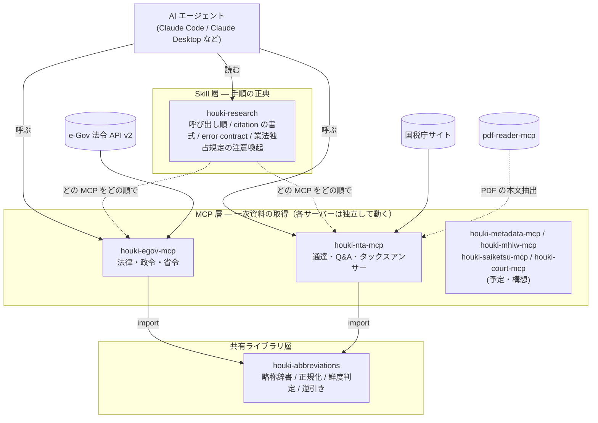

# 全体構成と責務

## 3 層の分担

### 共有ライブラリ層 — houki-abbreviations

全 MCP が import する辞書です。「消基通」を「消費税法基本通達」に、「法人税法」を法令 ID `340AC0000000034` に解決します。
どの MCP がそのエントリを扱うかを示す `source_mcp_hint` を持ち、
管轄外の略称を渡された MCP は、本文を取りに行かずに「houki-nta-mcp に聞いてください」という案内を返します。

全角・半角のゆらぎ（「第１条」と「第1条」）を吸収する正規化も、この層に一本化しています。
データベースへの取り込み時と検索時に同じ関数を通すので、片方だけ揃わないことがありません。

### MCP 層 — 一次資料を取りに行く

各 MCP サーバーは独立した npm パッケージで、単独で動きます。
houki-egov-mcp だけを入れて条文を引くこともできますし、houki-nta-mcp だけで通達を引くこともできます。

MCP 層が決めることと決めないことを分けています。

| 決めること | 決めないこと |
| --- | --- |
| 取得元 URL、法令番号、条・項・号、通達番号 | 質問者の事案にその条文が当てはまるか |
| 取得日時と鮮度（`freshness`） | 複数の法令のどれを優先するか |
| 通達の法的な位置づけ（`legal_status`） | 業法上の注意喚起をするかどうか |
| 引数の検証結果（`INVALID_ARGUMENT`） | |

### Skill 層 — houki-research

LLM が読む手順書です。次の 4 つの正典を持ちます。

- **横断の手順**: 「まず略称を解決し、法令本文は houki-egov-mcp、通達は houki-nta-mcp、両方引いたら法令を上位に置く」という順序
- **citation の書式**: 法令は「法令名（法令番号）第 N 条第 M 項」、通達は「通達名 N-M」、いずれも取得元 URL を添える
- **error contract**: 全 MCP が返すエラーコードの語彙（`UNKNOWN_TOOL` / `INVALID_ARGUMENT` / `INTERNAL_ERROR` / `ARTICLE_NOT_FOUND` など）と、それぞれで LLM が取るべき行動
- **業法独占規定**: 質問が「個別事案への当てはめ」に踏み込みそうなときの注意喚起文と、資格者への案内

## 法令と通達を区別する

houki-hub が一貫して守っている区別が 1 つあります。

| | 国民・裁判所を拘束するか | 取得元 | 応答での印 |
| --- | --- | --- | --- |
| 法律・政令・省令 | する | e-Gov 法令 API（houki-egov-mcp） | `law_type` |
| 通達・Q&A・タックスアンサー | しない（行政内部の解釈指針。最高裁昭和 43 年 12 月 24 日判決） | 国税庁サイト（houki-nta-mcp） | `legal_status` |

houki-nta-mcp は通達を返すたびに `legal_status` を付けます。LLM が「通達にこう書いてある」を「法律でこう決まっている」と言い換えないようにするためです。

この 2 つは「基準」の内部の階層です。1 つの層に潰すと、「通達に書いてあるから可」という判定が作れてしまいます。

この表は法令と通達の 2 行だけです。規則・条例・告示・行政の解説資料・裁決・判例を含めた 10 種類の説明と、国民・裁判所・行政機関の 3 列で示した拘束力の表は [文書の種類と拘束力](/guide/document-types) にあります。

## 判定はコードが、説明は LLM が

引数の検証、鮮度の判定、通達の位置づけの付与は、すべて MCP サーバーのコードが決定論的に行います。
LLM は結果を受け取り、出典を添えて説明する側に置きます。
この分担は [PDF Agent Stack](https://shuji-bonji.github.io/pdf-agent-stack/ja/guide/architecture) と同じです。

### 4 つ目の行き先 — 系の外に置く

判定の置き場所は「コード / 判定不能 / LLM」の 3 つではありません。houki-hub には 4 つ目があります。

| 行き先 | いつ選ぶか | 例 |
| --- | --- | --- |
| コード | 基準が事前に書ける | 引数の検証、鮮度の判定、`legal_status` の付与 |
| 判定不能として返す | 基準が書けない、または測れなかった | 一次情報を取得できなかったとき |
| LLM | 選びません | — |
| 系の外（人間の専門家） | 基準は書けるが、系が判定してはいけない | 当てはめ |

当てはめの基準は、条文と通達に書いてあります。書けないから外しているのではありません。外す理由は弁護士法 72 条・税理士法 52 条・社労士法 27 条です。基準が整備されれば将来は系が判定してよくなる、というものではありません。

何を返し、何を返さないかは [免責事項と利用範囲](/guide/disclaimer) にあります。

## 各部品の技術構成（2026-09-07 時点）

| | houki-egov-mcp | houki-nta-mcp | houki-abbreviations |
| --- | --- | --- | --- |
| MCP SDK | `@modelcontextprotocol/server` v2 | 同左 | — |
| Node | 22 以上 | 22 以上 | 20 以上 |
| ローカル DB | SQLite FTS5（bulk 取り込み後） | SQLite FTS5 | — |
| lint / format | Biome | Biome | ESLint + Prettier |
| エラー応答 | family contract（`isError: true` + `code`） | 同左 | — |
