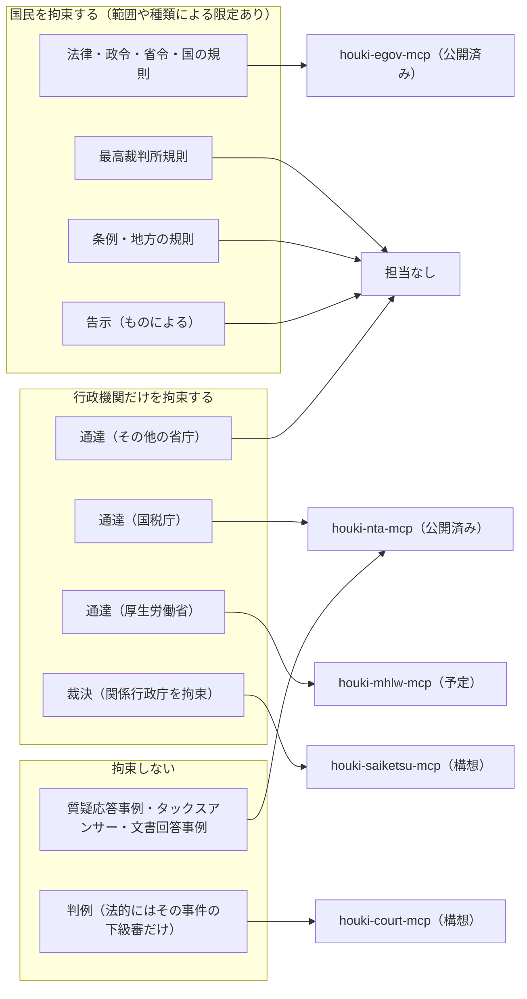

<!-- 正本の置き場所は未決（houki-hub#10 の「決めること」）。決まるまでは手書きで保守し、項目が固まったら正本から生成する。 -->

# 文書の種類と拘束力

このページは、houki-hub の MCP サーバーを使う人が「いま読んでいる文書は誰を拘束するのか」「その文書はどの MCP サーバーで引けるのか」を確かめるためのものです。

法律と通達はどちらも「ルール」に見えますが、国民を拘束するかどうかが違います。
LLM が「通達にこう書いてある」を「法律でこう決まっている」と言い換えると、利用者は誤った前提で判断することになります。
どの MCP サーバーを呼ぶかも、この区別で決まります。

このページは次の順に説明します。

1. 前提として、法令は誰でも読める状態に置かれること
2. 「法令」「法規」「law」という 3 つの語が指す範囲
3. 文書の種類ごとの説明（10 種類）
4. 拘束力のまとめ表
5. 現在の地図（どの種類をどの MCP サーバーが扱うか）

条文の引用は、2026-09-10（JST）に houki-egov-mcp で e-Gov 法令 API から取得して確かめています。

## 前提: 法令は誰でも読める状態に置かれる

国民を拘束する法令は、公布の手続を経て、誰でも内容を確かめられる状態に置かれます。

| 文書 | 公布の根拠 |
| --- | --- |
| 憲法改正・法律・政令・条約 | 天皇が公布します（憲法 7 条 1 号） |
| 法律・政令・省令など | 公布は官報で行います（官報の発行に関する法律 3 条 1 項）。同項の「法令」は、法律と法律に基づく命令、それに内閣府令で指定する規則（最高裁判所規則など）です |
| 処分の要件を定める告示など | 公示は官報で行います（官報の発行に関する法律 3 条 2 項） |
| 条例 | 自治体の長が、議会から送付を受けた日から 20 日以内に公布します（地方自治法 16 条 2 項）。自治体の規則にも準用されます（同条 5 項） |

一方、通達には公布の手続がありません。通達は行政機関の内部で上級機関が職員に出す命令だからです（国家行政組織法 14 条 2 項）。
国税庁などは通達を自らのサイトで公開していますが、これは公布ではありません。

また、著作権法 13 条は、次のものを著作権の対象から外しています。

- 憲法その他の法令（1 号）
- 国や自治体の機関などが発する告示・訓令・通達その他これらに類するもの（2 号）
- 裁判所の判決・決定・命令・審判と、行政庁の裁決・決定で裁判に準ずる手続によるもの（3 号）

houki-hub の MCP サーバーは、公布・公開されたこれらの文書を、LLM が扱える構造に整えて返します。新しい解釈を加えることはしません。
13 条に名前が挙がっていない文書（国税庁のタックスアンサーなど）の扱いは、取得元サイトの利用条件に従います。

## 3 つの語が指す範囲

### 法令

「法令」が何を含むかは、定義している法律ごとに違います。

| 定義している条文 | 「法令」に含まれるもの |
| --- | --- |
| 行政手続法 2 条 1 号 | 法律、法律に基づく命令（告示を含む）、条例、地方公共団体の執行機関の規則 |
| 官報の発行に関する法律 3 条 1 項 | 法律、法律に基づく命令（最高裁判所規則その他の規則で内閣府令で指定するものを含む） |

行政手続法の定義は条例と告示を含み、官報の発行に関する法律の定義は条例を含みません。
このサイトで「法令」と書くときは、法律・政令・省令・規則・条例を指し、どの法律の定義かが問題になる箇所ではその条文を示します。

### 法規

行政法の教科書で「法規」というときは、国民の権利や義務にかかわる一般的な定めを指します。この意味では、通達は法規に入りません。

houki-hub の「houki」はこれより広い意味で使っています。法令に、通達・行政の解説資料・裁決・判例を加えた、調べる対象の全体を指します。
名前は広く取っていますが、拘束力の区別は下の表のとおり文書の種類ごとに示します。

### law

英語の law は、法令・判例・慣習法まで含む広い語です。英語のページを作るときは、法令を laws and regulations、通達を administrative circulars のように、種類ごとに訳し分けます。

| 語 | 法律・政令・省令・規則 | 条例 | 通達・行政の解説資料 | 裁決 | 判例 |
| --- | --- | --- | --- | --- | --- |
| 法令（行政手続法 2 条 1 号） | 含む | 含む | 含まない | 含まない | 含まない |
| 法規（行政法の教科書の意味） | 含む | 含む | 含まない | 含まない | 含まない |
| houki（houki-hub の対象） | 含む | 含む | 含む | 含む | 含む |
| law（英語） | 含む | 含む | 文脈による | 文脈による | 含む |

## 文書の種類ごとの説明

どの種類も同じ 7 項目の表で説明します。「応答での印」は、MCP サーバーの応答のどのフィールドでその種類を見分けられるかです。

### 法律

| 項目 | 内容 |
| --- | --- |
| 誰が出すか | 国会 |
| 根拠 | 憲法 41 条（国会は唯一の立法機関）、59 条（法律案の議決） |
| 誰を拘束するか | 国民・裁判所・行政機関のすべてを拘束します。裁判官は「この憲法及び法律にのみ拘束される」とされています（憲法 76 条 3 項） |
| 公布されるか | されます（憲法 7 条 1 号、官報の発行に関する法律 3 条 1 項） |
| どこで読めるか | e-Gov 法令検索、官報 |
| 担当 MCP | [houki-egov-mcp](/mcp/houki-egov) |
| 応答での印 | `search_law` の結果の `law_type: "Act"` |

### 政令

| 項目 | 内容 |
| --- | --- |
| 誰が出すか | 内閣 |
| 根拠 | 憲法 73 条 6 号（憲法と法律の規定を実施するために政令を制定する。罰則は法律の委任がある場合に限る） |
| 誰を拘束するか | 国民・裁判所・行政機関を拘束します。ただし法律の委任の範囲内です |
| 公布されるか | されます（憲法 7 条 1 号、官報の発行に関する法律 3 条 1 項） |
| どこで読めるか | e-Gov 法令検索、官報。名前の多くは「○○法施行令」です |
| 担当 MCP | [houki-egov-mcp](/mcp/houki-egov) |
| 応答での印 | `law_type: "CabinetOrder"` |

### 省令

| 項目 | 内容 |
| --- | --- |
| 誰が出すか | 各省大臣。内閣府の場合は内閣総理大臣が内閣府令を出します |
| 根拠 | 国家行政組織法 12 条 1 項、内閣府設置法 7 条 3 項（法律・政令を施行するため、または法律・政令の特別の委任に基づいて出す） |
| 誰を拘束するか | 国民・裁判所・行政機関を拘束します。ただし法律・政令の委任の範囲内です。委任の範囲を超えた定めは、裁判所が無効と判断することがあります（医薬品のインターネット販売を一律に禁じた薬事法施行規則の規定について、最高裁平成 25 年 1 月 11 日判決） |
| 公布されるか | されます（官報の発行に関する法律 3 条 1 項） |
| どこで読めるか | e-Gov 法令検索、官報。名前の多くは「○○法施行規則」です。技術的な要件（電子帳簿保存法のスキャナ保存の要件など）はここに書かれていることが多くあります |
| 担当 MCP | [houki-egov-mcp](/mcp/houki-egov) |
| 応答での印 | `law_type: "MinisterialOrdinance"` |

### 規則

「規則」は、誰が定めるかで意味が変わります。3 つに分けて示します。

| 項目 | 国の規則（委員会・庁など） | 最高裁判所規則 | 地方の規則 |
| --- | --- | --- | --- |
| 誰が出すか | 各委員会・各庁の長官、人事院、会計検査院など | 最高裁判所 | 都道府県知事・市町村長、自治体の委員会 |
| 根拠 | 国家行政組織法 13 条 1 項（別に法律の定めるところにより、政令・省令以外の規則を出せる）など | 憲法 77 条 1 項（訴訟の手続、弁護士、裁判所の内部規律、司法事務の処理） | 地方自治法 15 条 1 項（長が規則を制定できる） |
| 誰を拘束するか | 国民・裁判所・行政機関を拘束します。法律の委任の範囲内です | 訴訟の手続にかかわる人を拘束します。検察官は従わなければなりません（憲法 77 条 2 項）。法律との優劣には学説の対立があります | その自治体の区域内で拘束します。違反に 5 万円以下の過料を定められます（地方自治法 15 条 2 項） |
| 公布されるか | 官報に掲載されます | 官報に掲載されます（官報の発行に関する法律 3 条 1 項の「内閣府令で指定する規則」） | されます（地方自治法 16 条 5 項で条例の公布の規定を準用） |
| どこで読めるか | e-Gov 法令検索（人事院規則・公正取引委員会規則など） | 裁判所のウェブサイト。e-Gov 法令 API には見当たりません（2026-09-10 に `search_law` で「民事訴訟規則」「刑事訴訟規則」を検索して 0 件） | 各自治体の例規集 |
| 担当 MCP | [houki-egov-mcp](/mcp/houki-egov) | なし | なし |
| 応答での印 | `law_type: "Rule"` | — | — |

### 条例

| 項目 | 内容 |
| --- | --- |
| 誰が出すか | 地方公共団体の議会が議決し、長が公布します |
| 根拠 | 憲法 94 条（法律の範囲内で条例を制定できる）、地方自治法 14 条 1 項 |
| 誰を拘束するか | その自治体の区域内で、国民・裁判所・行政機関を拘束します。義務を課し権利を制限するには、法令に特別の定めがある場合を除き条例によらなければなりません（地方自治法 14 条 2 項）。罰則は 2 年以下の拘禁刑・100 万円以下の罰金などまで定められます（同条 3 項） |
| 公布されるか | されます（地方自治法 16 条 2 項） |
| どこで読めるか | 各自治体の例規集。e-Gov には載っていません |
| 担当 MCP | なし（計画もありません） |
| 応答での印 | — |

### 告示

| 項目 | 内容 |
| --- | --- |
| 誰が出すか | 各省大臣・各委員会・各庁の長官 |
| 根拠 | 国家行政組織法 14 条 1 項（公示を必要とする場合に告示を出せる） |
| 誰を拘束するか | 告示ごとに違います。法令の委任を受けて内容を補う告示は、国民を拘束するものとして扱われることがあります。事実を知らせるだけの告示は拘束しません |
| 公布されるか | 公布ではなく公示です。処分の要件を定める告示などは、官報で公示しなければなりません（官報の発行に関する法律 3 条 2 項） |
| どこで読めるか | 官報、各省庁のサイト |
| 担当 MCP | なし。2026-09-10 に houki-egov-mcp の `search_law` で「告示」を検索したところ、返ったのは名前に「告示」を含む省令 1 件で、告示そのものは見つかりませんでした |
| 応答での印 | — |

### 通達

| 項目 | 内容 |
| --- | --- |
| 誰が出すか | 各省大臣・各委員会・各庁の長官（国税庁長官など） |
| 根拠 | 国家行政組織法 14 条 2 項（所管の機関と職員に対し、訓令または通達を出せる） |
| 誰を拘束するか | 行政機関の職員だけを拘束します。国民と裁判所は拘束しません（最高裁昭和 43 年 12 月 24 日判決） |
| 公布されるか | されません。行政内部の命令のためです |
| どこで読めるか | 各省庁のサイト（国税庁・厚生労働省など） |
| 担当 MCP | [houki-nta-mcp](/mcp/houki-nta)（国税庁の基本通達 4 種・改正通達・事務運営指針）。厚生労働省は houki-mhlw-mcp（予定）。そのほかの省庁はなし |
| 応答での印 | `legal_status` |

国民を拘束しないといっても、税務署や労働基準監督署は通達に沿って判断します。そのため実務では通達を踏まえて手続を進め、通達の内容を争うときは法律の条文に戻って主張することになります。

houki-nta-mcp は、通達を返すたびに次の `legal_status` を付けます（v0.10.4 の `src/constants.ts` の `TSUTATSU_LEGAL_STATUS`）。

```json
{
  "binds_citizens": false,
  "binds_courts": false,
  "binds_tax_office": true,
  "note": "通達は行政内部文書。納税者・裁判所には直接的拘束力なし。ただし税務署員は職務として守る義務あり（最高裁 昭和43.12.24）"
}
```

### 行政の解説資料（質疑応答事例・タックスアンサー・文書回答事例）

| 項目 | 内容 |
| --- | --- |
| 誰が出すか | 国税庁。文書回答事例は、事前照会に対して国税庁・国税局が回答したものです |
| 根拠 | 法律に根拠の規定はありません。国税庁が公表している資料です |
| 誰を拘束するか | 誰も拘束しません。文書回答事例は個別の事案への回答で、一般的な法的拘束力はありません |
| 公布されるか | されません |
| どこで読めるか | 国税庁のサイト |
| 担当 MCP | [houki-nta-mcp](/mcp/houki-nta) |
| 応答での印 | `legal_status`（`binds_citizens` / `binds_courts` / `binds_tax_office` がすべて `false`） |

### 裁決

| 項目 | 内容 |
| --- | --- |
| 誰が出すか | 審査請求を受けた審査庁。国税では国税不服審判所長です |
| 根拠 | 行政不服審査法 52 条 1 項、国税通則法 102 条 1 項（どちらも「裁決は、関係行政庁を拘束する」） |
| 誰を拘束するか | 関係行政庁を拘束します。裁判所は拘束しません。裁決に不服がある請求人は、取消訴訟で争えます。ほかの事案の当事者は拘束しません |
| 公布されるか | されません |
| どこで読めるか | 国税不服審判所のサイト（公表裁決事例）など |
| 担当 MCP | houki-saiketsu-mcp（構想。初版は国税不服審判所の裁決事例） |
| 応答での印 | — |

### 判例

| 項目 | 内容 |
| --- | --- |
| 誰が出すか | 裁判所 |
| 根拠 | 裁判所法 4 条（上級審の裁判所の判断は、その事件について下級審の裁判所を拘束する） |
| 誰を拘束するか | 法的に拘束されるのは、その事件の下級審だけです。ただし最高裁判所の判例と相反する判断は、上告受理の理由（民事訴訟法 318 条 1 項）や上告の理由（刑事訴訟法 405 条 2 号）になります。そのため下級審は、実際には最高裁判所の判例に沿って判断することが多くあります |
| 公布されるか | されません |
| どこで読めるか | 裁判所のウェブサイト（裁判例検索）、判例集 |
| 担当 MCP | houki-court-mcp（構想。初版は民事判決オープンデータ） |
| 応答での印 | — |

判決そのものは、その事件の当事者を拘束します。この節で扱っているのは、判決の中の判断が、ほかの事件で先例としてどう扱われるかです。

## 拘束力のまとめ表

拘束力は 1 本の強弱では表せません。「国民」「裁判所」「行政機関」のそれぞれを拘束するかで表します。houki-nta-mcp の `legal_status`（`binds_citizens` / `binds_courts` / `binds_tax_office`）と同じ考え方です。

| 種別 | 国民 | 裁判所 | 行政機関 | 根拠 | 担当 MCP | `legal_status` |
| --- | --- | --- | --- | --- | --- | --- |
| 法律 | ✓ | ✓ | ✓ | 憲法 41 条・76 条 3 項 | houki-egov | なし |
| 政令・省令 | ✓（委任の範囲内） | ✓ | ✓ | 憲法 73 条 6 号、国家行政組織法 12 条 1 項 | houki-egov | なし |
| 国の規則 | ✓（委任の範囲内） | ✓ | ✓ | 国家行政組織法 13 条 1 項 | houki-egov | なし |
| 最高裁判所規則 | △ | ✓ | △ | 憲法 77 条 | なし | — |
| 条例・地方の規則 | ✓（その自治体の区域内） | ✓ | ✓ | 憲法 94 条、地方自治法 14 条・15 条 | なし | — |
| 告示 | △ | △ | ✓ | 国家行政組織法 14 条 1 項 | なし | — |
| 通達 | ✗ | ✗ | ✓（職員） | 国家行政組織法 14 条 2 項、最高裁昭和 43 年 12 月 24 日判決 | houki-nta、houki-mhlw（予定） | あり |
| 行政の解説資料 | ✗ | ✗ | ✗ | 法律上の規定なし | houki-nta | あり |
| 裁決 | その事案だけ | ✗ | ✓（関係行政庁） | 行政不服審査法 52 条 1 項、国税通則法 102 条 1 項 | houki-saiketsu（構想） | — |
| 判例 | ✗ | △ | ✗ | 裁判所法 4 条 | houki-court（構想） | — |

✓ は拘束する、✗ は拘束しない、△ は種類や場面によって扱いが分かれることを示します。△ の中身は次のとおりです。

- **最高裁判所規則の国民・行政機関**: 訴訟の手続にかかわる人（当事者・弁護士など）と検察官を拘束します。それ以外の国民の日常の行為を定めるものではありません
- **告示の国民・裁判所**: 法令の委任を受けて内容を補う告示は拘束するものとして扱われることがあり、事実を知らせるだけの告示は拘束しません。どちらに当たるかは告示ごとに確かめる必要があります
- **判例の裁判所**: 法的に拘束されるのはその事件の下級審だけです。ほかの事件で最高裁判所の判例がどこまで尊重されるかは、上告の制度による事実上の影響で、学説にも議論があります

「行政機関」の列は、国の行政機関の職員が職務として従うかを示します。`legal_status` の `binds_tax_office` は、この列を国税の職員について表したものです。

## 現在の地図（2026-09-10 時点）

MCP サーバーが増えるたびに、この図を書き換えます。各サーバーの状態は [現状と予定](/guide/roadmap) と揃えています。



### 扱わない文書

次の文書は、担当する MCP サーバーがなく、計画にも入っていません。houki-hub の MCP サーバーからは取得できないので、必要なときは取得元を直接確認してください。

- 条例・地方の規則（各自治体の例規集）
- 告示（官報・各省庁のサイト）
- 最高裁判所規則（裁判所のウェブサイト）
- 国税庁・厚生労働省以外の省庁の通達（各省庁のサイト）

## LLM から同じ説明を引く

houki-egov-mcp の `explain_law_type` は、法令の種類ごとの制定主体・国民への拘束力・注意点を返します。
対象は 憲法・法律・政令・省令・規則・条例・告示・訓令・通達・通知 の 10 種類です。
裁決と判例は対象外で、`name: "裁決"` を渡すと `found: false` が返ります（v0.5.3、2026-09-10 に確認）。

## 関連するページ

- [全体構成と責務](/guide/architecture) — MCP 層が `legal_status` を付け、Skill 層が法令を通達より上位に置く分担
- [houki-egov-mcp](/mcp/houki-egov) — 法律・政令・省令・国の規則
- [houki-nta-mcp](/mcp/houki-nta) — 国税庁の通達と解説資料。基本通達と元の法律の対応表もあります
- [免責事項と利用範囲](/guide/disclaimer) — 個別の事案への当てはめをしない理由
