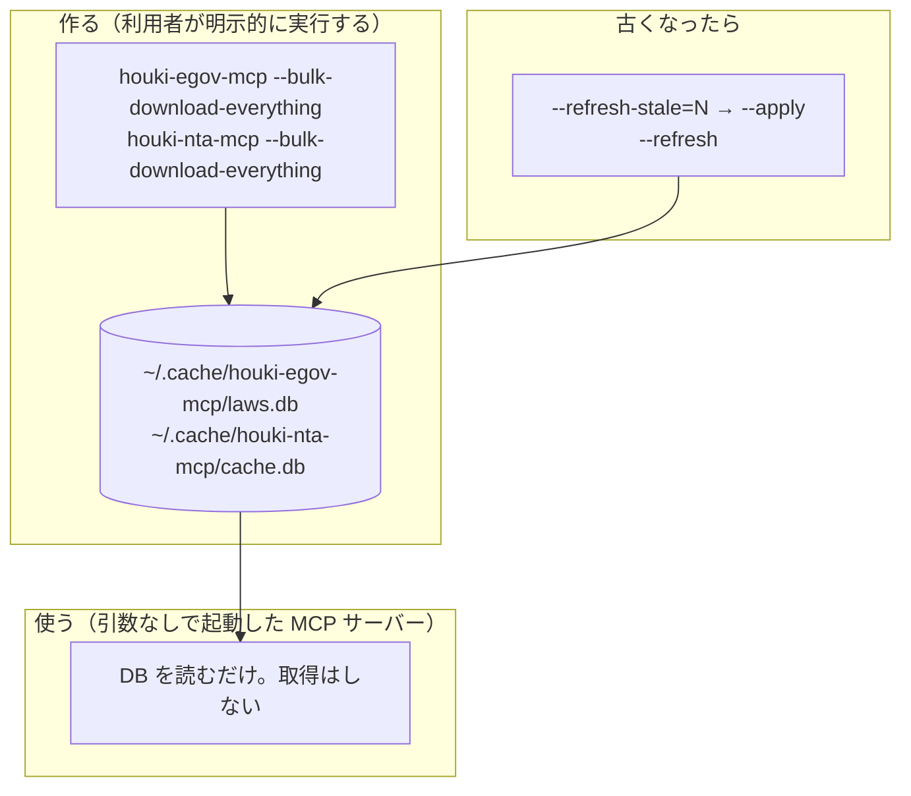

# ローカル DB（全文検索用）

houki-egov-mcp と houki-nta-mcp は、条文や通達の本文をキーワードで探すために、手元に SQLite のデータベースを作れます。法令や通達の全文をあらかじめ取り込んでおき、そこを検索する仕組みです。

**必須ではありません。** 作らなくても大半のツールは動きます。ただし全文検索は DB を引くので、作らないと結果が返らない、または別のツールで代替されます。このページは、何が要るのか・どう作るのか・古くなったらどうするのかをまとめています。

## 取得と検索は別のコマンドです

DB を作るのは、MCP サーバーとは別の起動です。サーバーが勝手にダウンロードを始めることはありません。



## DB が無くても使えるもの

DB を作っていない状態で、どのツールがどう振る舞うかの一覧です。

### houki-egov-mcp

法令の本文・目次・改正履歴は e-Gov 法令 API をその場で呼ぶので、DB は要りません。

| ツール | DB 無しのとき |
| --- | --- |
| `search_law` `get_law` `get_toc` `get_law_revisions` `resolve_abbreviation` `explain_law_type` | そのまま動きます |
| `search_fulltext` | `search_law`（法令名の一致）の結果を `source: "api-fallback"` として返し、`next_actions` で DB の作り方を案内します |

条文の本文をキーワードで横断検索したいときだけ DB が要る、という形です。

### houki-nta-mcp

検索ツールは DB を引きます。取得ツールは、現状ツールによって扱いが 3 通りに分かれています。

| ツール | DB 無しのとき |
| --- | --- |
| `nta_search_tsutatsu` `nta_search_qa` `nta_search_tax_answer` `nta_search_bunshokaitou` `nta_search_jimu_unei` `nta_search_kaisei_tsutatsu` | その種別が DB に 1 件も無ければ `DOC_NOT_FOUND` を返します |
| `nta_get_tsutatsu` | DB を先に引き、無ければ国税庁サイトから取得して DB に書き戻します。応答の `source` が `"db"` か `"live"` かで、どちらから返したか分かります |
| `nta_get_qa` `nta_get_tax_answer` | DB を引かず、毎回国税庁サイトから取得します |
| `nta_get_kaisei_tsutatsu` `nta_get_jimu_unei` `nta_get_bunshokaitou` | DB のみを引きます。無ければ `DOC_NOT_FOUND` を返し、投入するコマンドを案内します |
| `nta_inspect_pdf_meta` `resolve_abbreviation` | DB は使いません |

::: warning 取得ツールの扱いは今後揃えます
取得ツールの 3 通りの違いは、設計上そうしたのではなく、実装の順序が残ったものです。`nta_get_qa` と `nta_get_tax_answer` を `nta_get_tsutatsu` と同じ「DB を先に引き、無ければ取得して書き戻す」形に揃えることを検討しています。そのため、DB を作っても `nta_get_tax_answer` は現状 1 件あたり 0.7 秒ほどかかります。

経緯と検討中の案は [houki-nta-mcp #29](https://github.com/shuji-bonji/houki-nta-mcp/issues/29) にあります。
:::

## 作り方

それぞれのパッケージのコマンドを、引数付きで起動します。

### houki-egov-mcp

```sh
npx @shuji-bonji/houki-egov-mcp --bulk-download-everything
```

e-Gov の全法令 zip（約 290 MB）を取得して取り込みます。進み具合は標準エラー出力に出ます。

差分だけを取り込む手段は、まだ用意していません（`--bulk-download-by-date` はデバッグ用です）。最新にするときは、同じコマンドをもう一度実行します。

### houki-nta-mcp

```sh
npx @shuji-bonji/houki-nta-mcp --bulk-download-everything
```

6 種別（基本通達 4 種・改正通達・事務運営指針・文書回答事例・タックスアンサー・質疑応答事例）をまとめて取り込みます。**約 100 分**かかるので、必要な種別だけを先に入れることもできます。

| コマンド | 対象 | 目安 |
| --- | --- | --- |
| `--bulk-download-everything` | 6 種別すべて | 約 100 分 |
| `--bulk-download-all` | 基本通達 4 種（消基通・所基通・法基通・相基通） | — |
| `--bulk-download-tax-answer` | タックスアンサー 約 850 件 | 約 15 分 |
| `--bulk-download-qa` | 質疑応答事例 9 税目・2,000 件超 | — |
| `--bulk-download-bunshokaitou` | 文書回答事例 | 全税目で 30 分超 |
| `--bulk-download-kaisei` | 改正通達 | — |
| `--bulk-download-jimu-unei` | 事務運営指針 | — |

税目で絞れば短くなります。使える値は `--help` に出ます。一覧に無い値を渡したときは、何も投入せずに使える値を表示して終わります。

```sh
# 消費税と所得税の文書回答事例だけ
npx @shuji-bonji/houki-nta-mcp --bulk-download-bunshokaitou --bunsho-taxonomy=shohi,shotoku

# 消費税のタックスアンサーだけ
npx @shuji-bonji/houki-nta-mcp --bulk-download-tax-answer --tax-answer-taxonomy=shohi
```

## 置き場所

既定では、OS のキャッシュ領域に置きます。

| パッケージ | 既定のパス |
| --- | --- |
| houki-egov-mcp | `${XDG_CACHE_HOME:-~/.cache}/houki-egov-mcp/laws.db` |
| houki-nta-mcp | `${XDG_CACHE_HOME:-~/.cache}/houki-nta-mcp/cache.db` |

変えるときは、コマンドライン引数か環境変数を使います。

| パッケージ | 引数 | 環境変数 |
| --- | --- | --- |
| houki-egov-mcp | — | `HOUKI_EGOV_DB_PATH` |
| houki-nta-mcp | `--db-path=<path>` | `HOUKI_NTA_DB_PATH` |

houki-egov-mcp は `--status` で、DB の場所・法令数・条数・最後に同期した日を表示します。

```sh
npx @shuji-bonji/houki-egov-mcp --status
```

## 古くなったら

法令も通達も改正されるので、取り込んだ内容は時間とともに実物とずれます。

検索の応答には `freshness` が付いていて、最後に取得してからの経過日数と、それをもとにした判定が入ります。判定のしきい値は houki-hub family で共通です（[`@shuji-bonji/houki-abbreviations`](/lib/houki-abbreviations) の `STALENESS_THRESHOLDS`）。

| 判定 | 経過日数 | 意味 |
| --- | --- | --- |
| `fresh` | 7 日未満 | そのまま使えます |
| `stale` | 7 日以上 30 日未満 | 改正が入っている可能性があります |
| `outdated` | 30 日以上 | 取り直しを勧めます |

```jsonc
"freshness": {
  "oldest_fetched_at": "2026-09-07T21:01:50.511Z",
  "newest_fetched_at": "2026-09-07T21:15:57.646Z",
  "staleness": "fresh",
  "days_since_oldest": 4
}
```

houki-nta-mcp には、古いものだけを取り直す手段があります。まず対象を一覧で確かめ、それから実行します。

```sh
# 30 日以上古い節を一覧する（この時点では何も取得しません）
npx @shuji-bonji/houki-nta-mcp --refresh-stale=30

# 実際に取り直す
npx @shuji-bonji/houki-nta-mcp --refresh-stale=30 --apply
```

全部を入れ直すときは `--refresh` を付けます。既存のデータを消してから取り直すので、`--bulk-download-everything` と同じだけ時間がかかります。

```sh
npx @shuji-bonji/houki-nta-mcp --bulk-download-everything --refresh
```

## パッケージを更新したとき

DB は更新で消えません。スキーマや取り込み方が変わったときは、起動時に必要な移行が行われるか、取り直しが案内されます。

| 版 | 起きること |
| --- | --- |
| houki-nta-mcp v0.15.0 | v0.14.2 以前に作った DB は、最初の起動時に一度だけ文字列を入れ直します（全角英字の正規化。国税庁サイトへの再アクセスはありません） |
| houki-egov-mcp v0.5.0 / v0.5.1 | 取り込み方が変わったため、`--bulk-download-everything` の再実行が要ります |

各版で何が起きるかは、それぞれのリポジトリの CHANGELOG に書いています。
