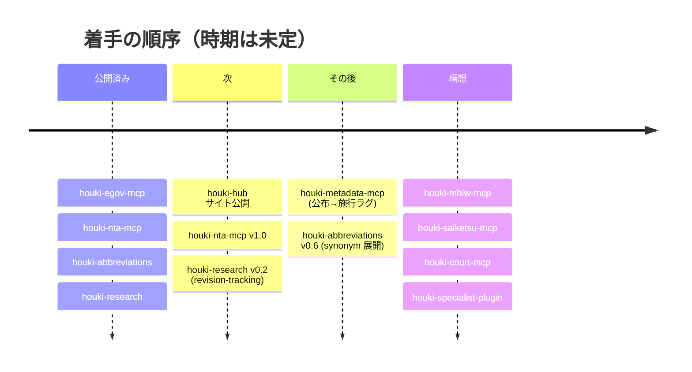

# 現状と予定

2026-09-07（JST）時点の状態です。版は npm の公開版です。
判断の経緯を含む詳しい記録はリポジトリの [docs/ROADMAP.md](https://github.com/shuji-bonji/houki-hub/blob/main/docs/ROADMAP.md) にあります。

## 公開済みの部品

| 部品 | 版 | いまできること |
| --- | --- | --- |
| [houki-egov-mcp](/mcp/houki-egov) | 0.5.3 | 法律・政令・省令の検索・本文取得・目次・改正履歴。ローカル DB を作れば条文本文の全文検索 |
| [houki-nta-mcp](/mcp/houki-nta) | 0.10.4 | 国税庁の基本通達 4 種（消基通・所基通・法基通・相基通）・改正通達・事務運営指針・文書回答事例・タックスアンサー・質疑応答事例の検索と取得 |
| [houki-abbreviations](/lib/houki-abbreviations) | 0.5.0 | 略称 174 エントリの解決、正規化、鮮度判定、法令 ID からの逆引き |
| [houki-research](/skills/houki-research) | 0.1.0 | 税務調査の手順（tax-research）、citation 書式、エラー契約、業法の注意喚起 |

## 予定している部品

| 部品 | 状態 | 束ねる単位と初版の範囲 |
| --- | --- | --- |
| houki-metadata-mcp | 予定 | 法令メタデータの時系列。公布日・施行日・改正予定を横断して引きます。J-SOX 対応のように「公布されたがまだ施行されていない期間」の追跡が主用途です |
| houki-mhlw-mcp | 予定 | 厚生労働省の通達・通知・指針。労働基準・社会保険の領域です |
| houki-saiketsu-mcp | 構想 | 裁決（行政不服審査）全般。初版は国税不服審判所の裁決事例のみです |
| houki-court-mcp | 構想 | 判例全般。初版は民事判決オープンデータ API のみです |
| houki-specialist-plugin | 構想 | MCP 群と houki-research を 1 つのサブエージェントに束ねる plugin。PDF Agent Stack の pdf-specialist-plugin と同型です |

## このサイトについて

2026 年 9 月に公開しました。今後足す予定のものは次のとおりです。

- 英語ページ（日本語を正として英訳します）
