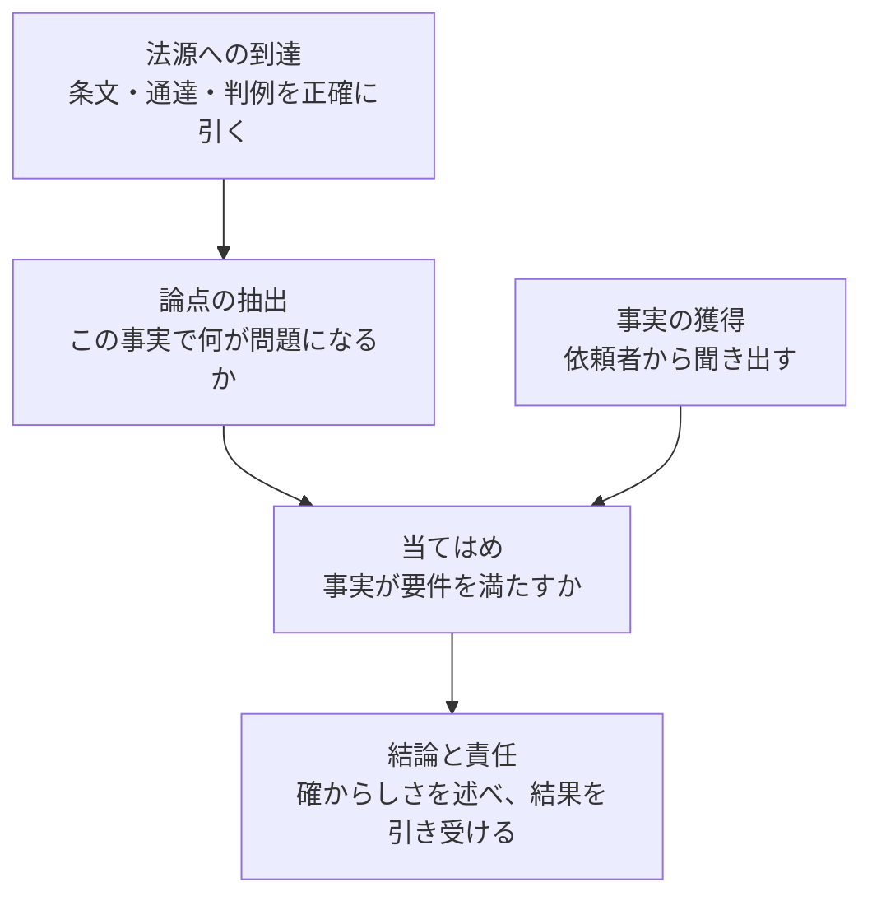
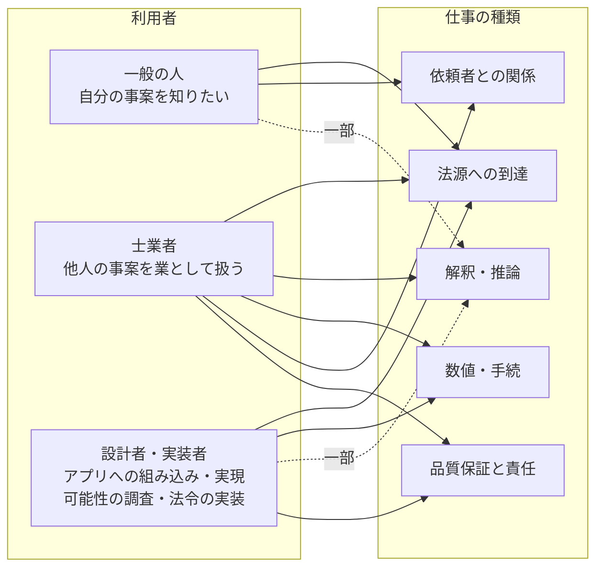
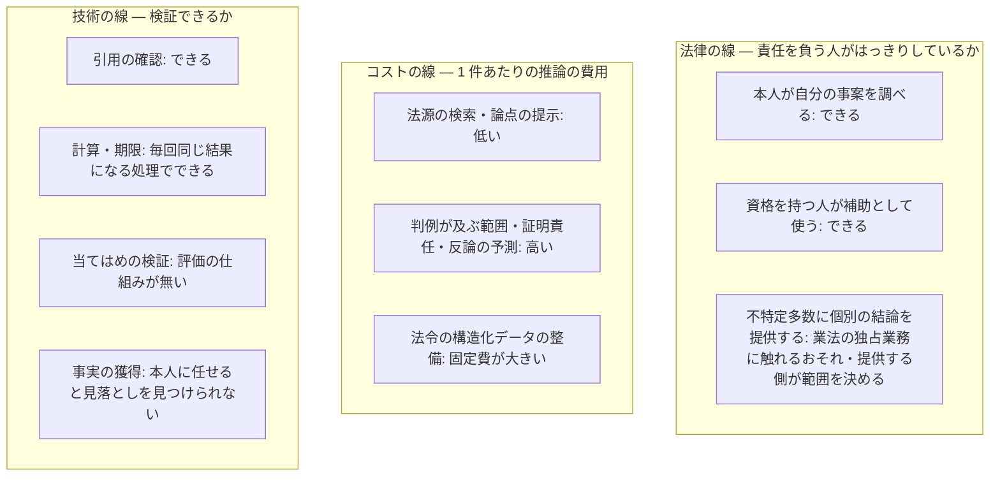

# 利用者ごとにできることとできないこと

このページは、法規シリーズ（houki-hub family）を使う人が、自分の立場で何に使えて何に使えないかを判断するためのものです。法律の専門家が事案を扱うときの仕事を層に分け、法規シリーズがどの層を担うかを示したうえで、利用者ごとの線を法律・コスト・技術の 3 つの観点から説明します。

[houki-hub とは](/guide/overview#しないこと) と [免責事項と利用範囲](/guide/disclaimer) は、何をしないかを業法の側から書いています。このページは同じ線を、専門家の仕事の工程の側から説明します。どちらから見ても、線の位置は同じです。

## 専門家の仕事の中での位置

この節は、法規シリーズが専門家の仕事のどの部分を担い、どの部分を人に残しているかを示します。

法律の専門家が事案を扱うときの仕事は、次の 5 つの層に分けられます。条文や通達を正確に引く層から始まり、論点を見つけ、事実を要件に当てはめ、結論を述べてその結果に責任を負う層で終わります。依頼者から事実を聞き出す層は、当てはめに使う事実をそろえる層です。

| 層 | 担い手 | 法規シリーズが担う範囲 |
| --- | --- | --- |
| 法源への到達 | MCP サーバー（houki-egov-mcp・houki-nta-mcp） | 担います。引用した法令が実在するかを確かめるツールと、次に読むべき法令を応答に添える仕組みで、この層を固めています |
| 論点の抽出 | LLM と houki-research Skill | 補助します。Skill が「法律本文 → 政令・省令 → 通達 → 改正履歴」の順に引くよう LLM に指示し、見落としを減らします |
| 当てはめ | LLM（一般論まで）、個別の事案は人 | 担いません。LLM が一般論として要件を示すことはありますが、個別の事実に当てはめた結論は返しません |
| 事実の獲得 | 人 | 担いません。「私の場合はどうなるか」という問いに、条文と論点までを返して結論を返さないのは、この層に踏み込まないためです |
| 結論と責任 | 資格を持つ人 | 担いません。独占業務での利用を想定しないという前提と同じです |

法源への到達は、正しい答えを出すために欠かせませんが、それだけで答えが出るわけではありません。法規シリーズが条文と論点までを返して結論を返さないのは、能力の限界を隠すためではなく、法規シリーズが担わない 3 つの層（当てはめ、事実の獲得、結論と責任）を人に残すためです。

### この位置を支えている仕様

この小節は、上の表で「担います」「補助します」と書いた部分が、どの仕様で実現されているかを示します。

| 層 | 仕様 |
| --- | --- |
| 法源への到達 | [search_fulltext](/specs/houki-egov/search_fulltext)（条文の本文をキーワードで横断して探す）、[resolveAbbreviation](/specs/houki-abbreviations/resolve_abbreviation)（略称から正式名を引く）、[verify_citations の SPEC-EGOV-VERIFY-CITATIONS-004](/specs/houki-egov/verify_citations#spec-egov-verify-citations-004)（引用 1 件ごとに条・項・号があるかを返す）、[common_errors の SPEC-EGOV-COMMON-ERRORS-032](/specs/houki-egov/common_errors#spec-egov-common-errors-032)（法令名が題名と一致しないときに、候補の正式名を next_actions に添える）、[get_related_laws の SPEC-EGOV-GET-RELATED-LAWS-008](/specs/houki-egov/get_related_laws#spec-egov-get-related-laws-008)（法律から、委任先の施行令・施行規則の目次へ進む案内）、[nta_get_tsutatsu の SPEC-NTA-GET-TSUTATSU-013](/specs/houki-nta/nta_get_tsutatsu#spec-nta-get-tsutatsu-013)（通達から、解釈の対象の法律の本文へ戻る案内） |
| 論点の抽出 | [tax-research](/specs/houki-research/tax-research)（法律 → 通達 → 改正 → 添付 PDF の順に引く手順）、[feasibility-check](/specs/houki-research/feasibility-check)（実装する前に、仕様が法令のどこに触れるかを条文で確かめる手順） |
| 当てはめ・事実の獲得・結論と責任（担わないこと） | [tax-research](/specs/houki-research/tax-research) の最初のステップ（問いが個別の事案や業としての利用に当たるかを、回答の前に判定する） |

## 利用者ごとの線

この節は、一般の人・士業者・設計者や実装者のそれぞれについて、使える範囲とその境界を示します。

利用者によって、必要になる仕事の種類が違います。ここでは仕事を次の 5 つにまとめて、利用者ごとにどれを使うかを図にしています。

| 仕事の種類 | 内容 |
| --- | --- |
| 法源への到達 | 条文・通達・判例・裁決などを引くこと |
| 解釈・推論 | 事案の法的な性質を決め、適用する時点や法源の優先順位、判例が及ぶ範囲を考えること |
| 数値・手続 | 税額などの計算、期限の管理、提出先と様式の確認、書面の作成 |
| 依頼者との関係 | 何を聞くべきかの組み立て、目的の把握、分野をまたぐ振り分け、守秘 |
| 品質保証と責任 | 推論の記録、反論を探す検証、評価の仕組み、資格を持つ人の確認と署名、改正への追随 |

下の 3 つの表の「できること」は、その立場の人がこうした部品に求めることです。今の法規シリーズが実際に提供している範囲は、この節の最後の「[法規シリーズが提供するもの](#法規シリーズが提供するもの)」にまとめています。

### 一般の人

自分の事案について知りたい人の場合です。

| 観点 | できること | できないこと・境界 |
| --- | --- | --- |
| 法律 | 自分の事案について条文・通達・判例を調べ、論点を整理できます。本人が自分の事件を扱うことは、独占業務の対象ではありません | 提供する側が、個別の事案の結論を出す機能を不特定多数に向けて提供すると、業法の独占業務（法律相談・税務相談）に触れるおそれがあります。どこまで提供するかは、提供する側が決めます |
| コスト | 無料か低い費用で使えることが前提です。法源の検索と論点の提示は推論の費用が小さいので、この前提で成り立ちます | 判例が及ぶ範囲や証明責任まで含む深い推論は、1 件あたりの費用が高く、無料の提供には向きません |
| 技術 | 何を聞くべきかの組み立てを自分向けに使い、専門家に伝えるべきことを整理して、相談に持ち込む資料を作れます | 事実を集めるのが本人だけなので、重要な事実の見落としを見つける手段がありません。結論の確からしさの評価は、信頼できる水準を保証できません |

一般の人に向けた範囲は、「知る・整理する・専門家に持ち込める形にする」までです。結論と、その確からしさは出しません。houki-research Skill の方針も同じです。

### 士業者

他人の事案を業として扱う人の場合です。

| 観点 | できること | できないこと・境界 |
| --- | --- | --- |
| 法律 | すべての層を補助として使えます。結論と責任は資格を持つ人が引き受けるので、独占規定の問題は生じません | 依頼者の情報を外部の LLM に送ることが守秘義務の上でどう扱われるかと、利益相反の確認が残ります。出力をそのまま依頼者に渡しても、説明義務を果たしたことにはなりません |
| コスト | 精度を上げるための、費用の高い推論を許容できます。事務所の過去の事案を検索して LLM に渡す仕組み（RAG）に投資しても回収できます | 事務所ごとに作る部分（過去の事案の検索の仕組み、書面のひな形）は共通化できません |
| 技術 | 論点の見落とし防止、時点ごとの法令、判例・裁決、計算、期限、書面の下書き、推論の記録、反論を探す検証に使えます | 当てはめが正しいかを機械で検証する手段がありません。評価の仕組みが無いと、補助の品質が上がったかを測れません |

士業者に向けた範囲は、全工程の補助と検証です。出力の形は、資格を持つ人が確認して署名することを前提にします。

### 設計者・実装者

アプリケーションに相談の機能を組み込む開発者、実現可能性の調査で法令上の制約を調べる開発者、法令を業務システムや計算の規則として実装する人（行政・自治体、給与計算や会計のソフトウェアの開発者）の場合です。

| 観点 | できること | できないこと・境界 |
| --- | --- | --- |
| 法律 | 仕様が法令のどこに触れるかを調べられます。計算・期限・様式を、毎回同じ結果になる処理として実装できます。改正による差分を追い続けられます | 個別の事案の結論を製品の機能として出すことは範囲の外です。組み込んだ相談の機能が結論を出すなら、提供する側が法律相談に当たるかという問題を引き受けることになります |
| コスト | バッチ処理やキャッシュ、毎回同じ結果になる部品で運用できます。推論の費用より、法令を構造化したデータを整える費用のほうが大きくなります | 時点ごとの版・経過措置・附則まで含めて法令を構造化し、自前で保ち続けるのは費用が高く、共有の基盤が無いと各社が同じものを別々に作ることになります |
| 技術 | 法令の構造化データ、施行日ごとの切り替え、計算、期限の起算の規則、テストできる実装に使えます | 条文のあいまいな部分（「正当な理由」「相当の期間」など）は規則として実装できず、人の判断か LLM の推論に残ります。規則にする部分と判断に残す部分の線引きが必要です |

設計者・実装者に向けた範囲は、法令の構造化データと、毎回同じ結果になる部品（計算・期限）です。今の法規シリーズが提供しているのは法令の構造化データで、部品は今後の対応です。LLM を使うのは、仕様と法令の対応付けと、規則にできない部分の補助に限ります。

### 3 つの線が引かれる場所

この小節は、法律・コスト・技術の線が、それぞれどこに引かれるかを並べて示します。

- 一般の人に向けた範囲は、「本人が自分の事案を調べる」と「法源の検索・論点の提示」が重なるところです。事実の獲得を本人に任せると見落としを見つけられないことが、結論を出さない理由です
- 士業者に向けた範囲は、資格を持つ人が補助として使うので法律の線がゆるく、費用の高い推論も許容できるため、最も広くなります。当てはめを検証する評価の仕組みが無いことが、品質を測る手段が無いこととして残ります
- 設計者・実装者に向けた範囲は、計算や期限を毎回同じ結果になる処理として実装できることが最も効くところです。法令の構造化データの整備に大きな固定費がかかることが、共有の基盤が要る理由です。不特定多数に個別の結論を提供することになるかは、組み込んだ機能が個別の事案に結論を出すかどうかで決まります

### 法規シリーズが提供するもの

この小節は、利用者ごとに法規シリーズが提供するものと、提供しないものをまとめます。

| 利用者 | 提供するもの | 提供しないもの |
| --- | --- | --- |
| 一般の人 | 法源への到達、論点の提示、専門家に相談するときの資料の整理 | 結論、結論の確からしさ |
| 士業者 | 上に加えて、時点ごとの法令・判例・裁決・計算・期限・推論の記録・反論を探す検証（いずれも今後の対応） | 結論の責任、事務所ごとの過去の事案の検索の仕組み |
| 設計者・実装者 | 法令の構造化データ、仕様と法令の対応付け（[feasibility-check](/specs/houki-research/feasibility-check)）。改正による差分と、毎回同じ結果になる部品（計算・期限）は今後の対応 | 個別の事案の結論を出す機能 |

3 つの立場に共通して提供するのは、法源への到達と、品質を保つための基盤（引用の確認と、改正への追随）です。これが、共有の基盤として法規シリーズが担う中心です。利用者ごとに違うのは、その上にどの層を積むかと、責任を誰が引き受けるかです。
