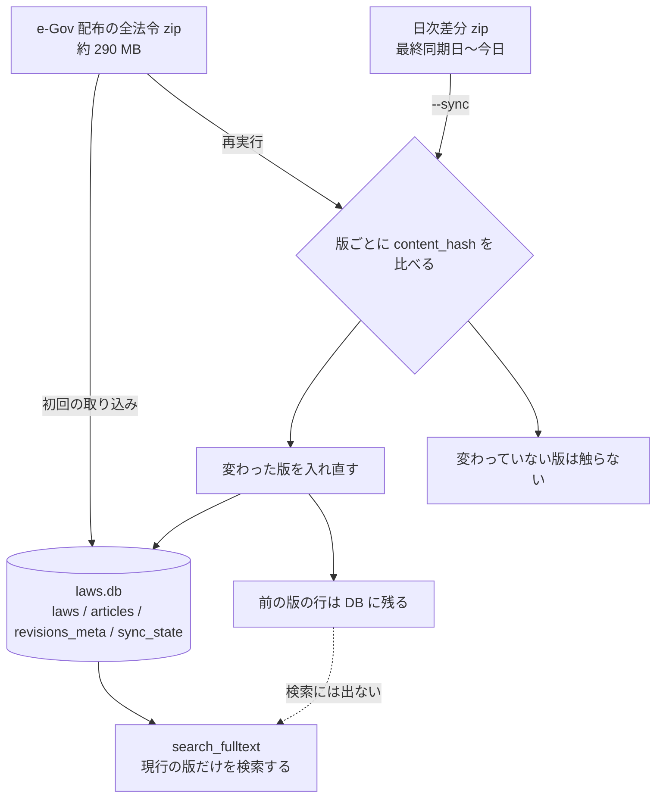

# houki-egov-mcp

日本の法令（憲法・法律・政令・省令・規則）を **e-Gov 法令 API v2** 経由で取得する MCP サーバーです。
条文をキーワード・略称・分野で検索し、特定の条・項・号を Markdown または JSON で取り出し、改正履歴を引けます。

- npm: [`@shuji-bonji/houki-egov-mcp`](https://www.npmjs.com/package/@shuji-bonji/houki-egov-mcp)（0.14.1）
- リポジトリ: [shuji-bonji/houki-egov-mcp](https://github.com/shuji-bonji/houki-egov-mcp)
- 動作環境: Node.js 22 以上

## ツール

引数の詳細と実測の呼び出し例は[ツールリファレンス](/reference/mcp/houki-egov)にあります。

| ツール | 用途 |
| --- | --- |
| `search_law` | 法令名でキーワード検索します。略称（「法人税法」「個情法」）は正式名に解決してから検索します |
| `get_law` | 条・項・号の単位で本文を取得します。Markdown / JSON / 目次のみ、を選べます。枝番号の号は `item: "8の2"` のように文字列で指定します（v0.6.0 から） |
| `get_toc` | 目次だけを取得します。長い法令で本文を読む前に構造を掴むためのものです |
| `get_law_revisions` | 改正履歴（公布日・施行日・状態）を取得します |
| `search_fulltext` | 条文本文を横断して全文検索します。ローカル DB が必要で、無いときは `search_law` の結果を `source: "api-fallback"` として返します |
| `resolve_abbreviation` | 略称が正式名と法令 ID にどう解決されるかを診断します |
| `explain_law_type` | 法令の種別（憲法・法律・政令・省令・通達など）と、それぞれの拘束力を説明します |
| `get_related_laws` | 法令名から施行令・施行規則（施行令からは親の法律）を、e-Gov に実在するものだけ `law_id` 付きで返します。名前の末尾に「施行令」「施行規則」を付けた候補だけを試します（v0.10.0 から） |
| `get_article_references` | 条文本文が引いている他法令の条（`law_id` 付き）、同一法令内の条・項・号、「政令で定める」の委任先を取り出し、`get_law` の引数を `next_actions` に付けます。「前項」「同法」は解決しません（v0.10.0 から） |

## 全文検索のためのローカル DB

`search_fulltext` は、e-Gov が配布する全法令の一括データを手元の SQLite（FTS5）に取り込み、そこを検索します。
この DB は、公式の配布データの写しと、その全文検索の索引です。原本は e-Gov 側にあります。

### 早見表

| 項目 | 内容 |
| --- | --- |
| 取得元 | e-Gov が配布する全法令の一括データ（zip 約 290 MB）を 1 本。ほかの 6 ツールは e-Gov 法令 API v2 をその場で呼びます |
| DB ファイル | `${XDG_CACHE_HOME:-~/.cache}/houki-egov-mcp/laws.db`（`HOUKI_EGOV_DB_PATH` で変えられます。コマンドライン引数での指定はありません） |
| テーブル | `laws` `articles` `revisions_meta` `sync_state`。全文検索の索引は `laws_fts` `articles_fts`（FTS5 trigram） |
| 鮮度の持ち方 | DB 全体で 1 つ（`sync_state` は 1 行）。`--status` で確かめられます |
| 更新の粒度 | 日ごとの差分（`--sync`、v0.8.0+）。最終同期日から今日までの日次差分 zip を順に取り込みます。全件の再実行でも版ごとに `content_hash` を比べ、変わった版だけ入れ直します |
| DB が要るツール | 7 のうち 1（`search_fulltext`）。DB が無いと法令名の一致で返り、`source: "api-fallback"` が付きます |
| 版が上がったとき | v0.5.1 より前に作った DB は `--bulk-download-everything` の実行し直しが要ります（編を持つ法令の本則が入っていません） |

各項目の詳細は以下の各節にあります。

### ローカル DB を作っていないとき

`search_fulltext` は呼べて、応答も返ります。ただし、返ってくるものが条文の全文検索の結果ではなくなります。

| ローカル DB | `search_fulltext` が返すもの |
| --- | --- |
| ある | 条文の本文を横断した全文検索の結果。ヒットごとに条番号・snippet・score・`freshness` が付きます |
| 無い | `search_law` と同じ**法令名の一致**の結果。`source: "api-fallback"` が付き、`next_actions` に DB の作り方が入ります |

ほかの 8 ツール（`search_law`・`get_law`・`get_toc`・`get_law_revisions`・`resolve_abbreviation`・`explain_law_type`・`get_related_laws`・`get_article_references`）は
e-Gov 法令 API をその場で呼ぶので、DB の有無に関係なく同じように動きます。

### 作り方

```sh
npx -y @shuji-bonji/houki-egov-mcp --bulk-download-everything
```

全法令の zip（約 290 MB）を 1 本取得して取り込みます。進み具合は標準エラー出力に出ます。
書き込むのはこの CLI だけで、MCP サーバーは読むだけなので、取り込み中に検索しても壊れません。

### 最新にする

```sh
npx -y @shuji-bonji/houki-egov-mcp --sync
```

`sync_state` の最終同期日から今日までの日次差分 zip（1 日分は数十 KB〜30 MB）を日付順に取り込みます（v0.8.0+）。
実測では、12 日ぶんの差分（341 件）を 2 分 50 秒で取り込めました（2026-09-19、全件取り込み後の DB に対して）。
差分が無い日（土日など）は飛ばし、途中で失敗しても成功した日までを記録するので、再実行すると続きから同期します。
最終同期から 90 日を超えて空いているときは、e-Gov の日次差分の公開範囲を超えるため、何もせずに `--bulk-download-everything` を促します。
`--status` の `days_since_sync` が 0 でないときに実行してください。

### 元データが変わったときに何が起きるか

法令が改正されると、e-Gov の配布データにその法令の新しい**版**が入ります。
`--sync` はその日の差分 zip から新しい版を取り込み、同じ法令の施行日が前の版を `PreviousEnforced` にします。
`--bulk-download-everything` を実行し直す場合も、版ごとに `content_hash` を比べて、変わった版だけを入れ直します。



古い版の行は DB に残りますが、検索には出ません。
`search_fulltext` は `current_revision_status = 'CurrentEnforced' OR remain_in_force = 1` で現行の版に絞るためです。
過去の版を見たいときは、`get_law_revisions` で改正履歴を引いてください。

### 同期の状態を見る

```sh
npx -y @shuji-bonji/houki-egov-mcp --status
```

DB のパス、`laws` と `articles` の件数、最後に同期した日付、経過日数、`fresh` / `stale` / `outdated` の判定を表示します。
まだ取り込んでいなければ、その旨と実行するコマンドが出ます。
鮮度は DB 全体で 1 つです（`sync_state` は 1 行しかありません）。しきい値は houki-hub family で共通で、[ローカル DB（全文検索用）](/guide/local-database)にまとめています。

### 置き場所

既定は `${XDG_CACHE_HOME:-~/.cache}/houki-egov-mcp/laws.db` です。
環境変数 `HOUKI_EGOV_DB_PATH` で変えられます。コマンドライン引数での指定はありません。

MCP サーバーと CLI で `HOUKI_EGOV_DB_PATH` や `XDG_CACHE_HOME` が違うと、別々のファイルを指すことになります。
取り込んだはずなのに `search_fulltext` の応答に `source: "api-fallback"` が付くときは、まずここを確かめてください。

### パッケージを更新したとき

DB はパッケージの更新で消えません。取り込み方が変わったときだけ、取り直しが要ります。

| 版 | すること |
| --- | --- |
| v0.5.0 / v0.5.1 | `--bulk-download-everything` を実行し直します。v0.5.1 より前に作った DB には、編（Part）を持つ法令（民法・会社法など）の本則が入っていません |
| v0.8.0 | 取り直しは不要です。`--sync` で最終同期日からの差分を取り込めます |

各版で何が変わったかは、リポジトリの [CHANGELOG](https://github.com/shuji-bonji/houki-egov-mcp/blob/main/CHANGELOG.md) にあります。

### 検索の書き方

- 「民法 不法行為」のように法令名と語を並べると、法令名で絞り込んでから本文を検索します
- 「民法 第709条」「消費税法 第57条の2」のように法令名と条番号だけなら、検索せずにその条を直接返します
- 2 文字の語（「株主」「責任」）は trigram の索引に乗らないため、ヒットした本文に含まれるかで補完します

## 知っておくとよいこと

- 引数は `tools/list` の inputSchema どおりに渡してください。v0.6.0 から、inputSchema に無い引数は `INVALID_ARGUMENT` になり、`detail.issues[].path` にその引数名が入ります
- 項が 1 つだけの条（「消費税法施行令第14条の3第1号」のように第1項を書かない条）は、`paragraph` を省いて `item` だけで号を引けます。項が複数ある条で `paragraph` を省くと `INVALID_ARGUMENT` です（v0.6.0 から。v0.5.4 までは `item` を黙って無視して条全体を返していました）
- `get_toc` は附則の条を編・章の外に平坦に並べます（既知の課題）
- 民法・消費税法のような大きな法令は応答が長くなります。`get_toc` で位置を確かめてから `get_law` で条を指定してください

## デジタル庁公式の MCP との関係

本サーバーは e-Gov 法令 API v2 のクライアントで、デジタル庁公式の MCP ではありません。
デジタル庁は 2025 年 12 月〜2026 年 3 月の「法令 × デジタル」ハッカソンで法令 API と MCP の試作を参加者向けに試行提供しました。
法令本文を返す公式 MCP が一般提供された場合は、本サーバーのコアをそちらに委譲する方針です。

詳しい設計と Phase ごとの進捗は、リポジトリの `docs/` にあります。利用範囲は[免責事項と利用範囲](/guide/disclaimer)と、リポジトリの [DISCLAIMER.md](https://github.com/shuji-bonji/houki-egov-mcp/blob/main/DISCLAIMER.md) を参照してください。
