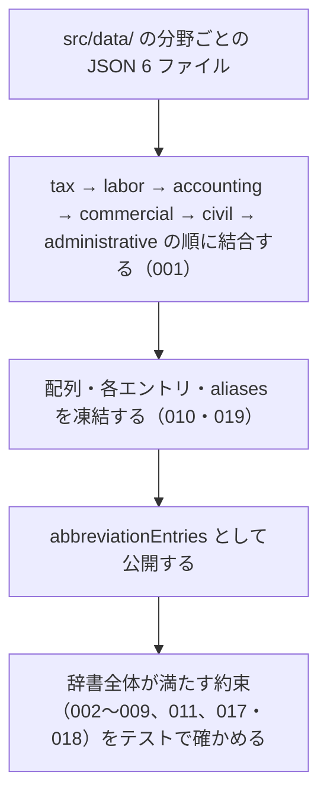

# abbreviationEntries

<!-- GENERATED FILE — 手で編集しない。シグネチャと説明は dist/index.d.ts、使用状況は mcp/*/src の import、利用者と得られる結果・扱わないこと・処理の流れ・仕様項目の一覧は specs/current/abbreviation_entries/spec.md、使いどころは scripts/spec-pages/houki-abbreviations/abbreviation_entries.md から。 -->

::: info
houki-abbreviations **v0.7.1** の `dist/index.d.ts` と `specs/current/abbreviation_entries/spec.md` から自動生成しました（仕様 ID 19 件・2026-10-10）。手で編集しないでください。再生成は `node scripts/generate-reference.mjs` です。
:::

*定数 ・ v0.1.0 で追加 ・ family では未使用*

全分野を結合した辞書

配列・各エントリ・`aliases` は凍結されている（各エントリと `aliases` は v0.7.0 から）。
`resolveAbbreviation` / `lookupByLawId` / `listByDomain` / `searchByName` などが返す
エントリはこの配列の要素そのもの（同じオブジェクト）で、書き換えると `TypeError` になる。
書き換えたいときは `structuredClone(entry)` や `{ ...entry }` で自分のコピーを作る。

## 利用者と得られる結果

この値の利用者と、利用者が渡すもの・得られる結果を示します。

- houki-hub family の MCP サーバー（houki-egov-mcp、houki-nta-mcp など）。`abbreviationEntries` を import し、辞書の全エントリを走査して自分の管轄のエントリを取り出したり、独自の索引を作ったりする
- このパッケージの他の公開関数（`resolveAbbreviation`・`listByDomain`・`searchByName`・`lookupByLawId`・`validateAllEntries` など）。どれもこの配列を対象に動く
- 辞書にエントリを足す人。`src/data/<domain>.json` を編集し、テストでこの配列が約束を満たすことを確かめる

## シグネチャ

import して呼ぶときの形です。パッケージの型定義（`dist/index.d.ts`）から写しています。

```ts
const abbreviationEntries: readonly AbbreviationEntry[];
```

**関係する型**: [`AbbreviationEntry`](/reference/lib/houki-abbreviations/types#abbreviationentry)

## 扱わないこと

この値が意図して扱わないことです。

- 名前からエントリを 1 件引くこと（`resolveAbbreviation`）
- 分野・カテゴリ・管轄で絞った一覧を返すこと（`listByDomain` / `listByCategory` / `listBySourceMcpHint`）
- 件数を集計すること（`getAbbreviationStats`）
- 部分一致・あいまい一致で探すこと（`searchByName` / `findSimilar` / `suggestCorrection`）
- `law_id` や法令番号から引くこと（`lookupByLawId` / `lookupByLawNum`）
- 辞書の整合性を検査した結果を返すこと（`validateAllEntries`）
- 実行中にエントリを足す・消す・差し替えること、エントリのフィールドを書き換えること（配列・各エントリ・`aliases` は凍結されている。エントリは `src/data/<domain>.json` を編集して次の版で出す）
- `law_id` が e-Gov に実在し、`formal` / `law_num` が e-Gov の値と一致することを保証すること。`scripts/verify-law-ids.mjs` が月次で e-Gov と突き合わせるが、開発用のスクリプトで、パッケージには含まれない（`package.json` の `files` は `dist` だけ）。`scripts/migrate.mjs`（houki-hub-mcp からの取り込み）と `scripts/copy-assets.mjs`（ビルド時に JSON を `dist/data/` へ写す）も同じく公開 API ではない
- 分野ごとの JSON ファイルを個別に import させること（`package.json` の `exports` は `.` だけ）
- 取得日時などの鮮度の情報を持つこと（各 MCP のローカル DB が持ち、判定は `judgeStaleness`）
- 通達・法令の本文を持つこと（本文は `source_mcp_hint` が示す MCP から取る）

## 処理の流れ

仕様書の「処理の流れ」の節を、図も含めてそのまま写しています。図が大きいので畳んでいます。

::: details 処理の流れの図（仕様書の写し）
パッケージを読み込んだときに、この配列ができるまでを示します。図の中の番号は「できること」の仕様 ID の末尾 3 桁です。


:::

## 仕様項目の一覧

この値の仕様項目 19 件の見出しです。仕様項目は受入テストと 1 対 1 で対応していて、条件と例は[仕様書ページ](/specs/houki-abbreviations/abbreviation_entries)で読めます。

::: details 仕様項目の見出し（19 件）
| 仕様 ID | 仕様項目 |
|---|---|
| [001](/specs/houki-abbreviations/abbreviation_entries#spec-abbr-abbreviation-entries-001) | 6 分野すべてのエントリを 1 つの配列に持つ |
| [002](/specs/houki-abbreviations/abbreviation_entries#spec-abbr-abbreviation-entries-002) | 全エントリが必須フィールドを持ち、値は定義された一覧の中にある |
| [003](/specs/houki-abbreviations/abbreviation_entries#spec-abbr-abbreviation-entries-003) | law_id が入っているときは e-Gov の法令 ID の形をしている |
| [004](/specs/houki-abbreviations/abbreviation_entries#spec-abbr-abbreviation-entries-004) | law_type が入っているときは e-Gov の法令種別のどれかである |
| [005](/specs/houki-abbreviations/abbreviation_entries#spec-abbr-abbreviation-entries-005) | abbr は全分野を通して重複しない |
| [006](/specs/houki-abbreviations/abbreviation_entries#spec-abbr-abbreviation-entries-006) | law_type と category が対応している |
| [007](/specs/houki-abbreviations/abbreviation_entries#spec-abbr-abbreviation-entries-007) | 日本国憲法のエントリを持つ |
| [008](/specs/houki-abbreviations/abbreviation_entries#spec-abbr-abbreviation-entries-008) | houki-egov 管轄のエントリが houki-nta 管轄より多く、100 件を超える |
| [009](/specs/houki-abbreviations/abbreviation_entries#spec-abbr-abbreviation-entries-009) | houki-nta 管轄のエントリは通達・告示系のカテゴリだけである |
| [010](/specs/houki-abbreviations/abbreviation_entries#spec-abbr-abbreviation-entries-010) | 配列は凍結されていて要素を足せない |
| [011](/specs/houki-abbreviations/abbreviation_entries#spec-abbr-abbreviation-entries-011) | よく使われる通称・制度名を別名に持つ |
| [012](/specs/houki-abbreviations/abbreviation_entries#spec-abbr-abbreviation-entries-012) | 分野の JSON ファイルの順に結合し、ファイルの中の順を保って並ぶ |
| [013](/specs/houki-abbreviations/abbreviation_entries#spec-abbr-abbreviation-entries-013) | 全エントリが law_id のキーを持ち、値は文字列か null である |
| [014](/specs/houki-abbreviations/abbreviation_entries#spec-abbr-abbreviation-entries-014) | 各エントリの domain は、そのエントリが書かれた JSON ファイルの名前と同じである |
| [015](/specs/houki-abbreviations/abbreviation_entries#spec-abbr-abbreviation-entries-015) | houki-nta 管轄のエントリは law_id が null である |
| [016](/specs/houki-abbreviations/abbreviation_entries#spec-abbr-abbreviation-entries-016) | houki-egov 管轄のエントリは法令系のカテゴリだけである |
| [017](/specs/houki-abbreviations/abbreviation_entries#spec-abbr-abbreviation-entries-017) | 名前は別のエントリの間で重ならない |
| [018](/specs/houki-abbreviations/abbreviation_entries#spec-abbr-abbreviation-entries-018) | aliases に自分の abbr・formal と同じ値を入れない |
| [019](/specs/houki-abbreviations/abbreviation_entries#spec-abbr-abbreviation-entries-019) | 各エントリと aliases は凍結されていて、代入は TypeError になる |
:::

## 関連ページ

このページの元になった文書と、あわせて読むページです。

- [houki-abbreviations の解説](/lib/houki-abbreviations)
- [houki-abbreviations の API の一覧](/reference/lib/houki-abbreviations/)
- [abbreviationEntries の仕様書ページ](/specs/houki-abbreviations/abbreviation_entries)
- [元の仕様書（GitHub、v0.7.1）](https://github.com/shuji-bonji/houki-abbreviations/blob/v0.7.1/specs/current/abbreviation_entries/spec.md)
