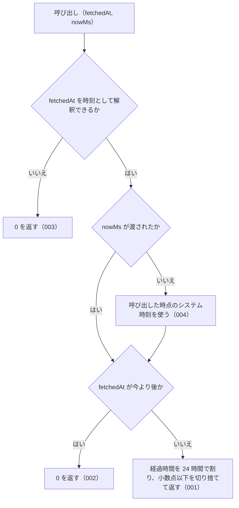

# computeDaysSince

<!-- GENERATED FILE — 手で編集しない。シグネチャと説明は dist/index.d.ts、使用状況は mcp/*/src の import、利用者と得られる結果・扱わないこと・処理の流れ・仕様項目の一覧は specs/current/compute_days_since/spec.md、使いどころは scripts/spec-pages/houki-abbreviations/compute_days_since.md から。 -->

::: info
houki-abbreviations **v0.7.1** の `dist/index.d.ts` と `specs/current/compute_days_since/spec.md` から自動生成しました（仕様 ID 10 件・2026-10-10）。手で編集しないでください。再生成は `node scripts/generate-reference.mjs` です。
:::

*関数 ・ v0.4.1 で追加 ・ houki-egov-mcp / houki-nta-mcp が使用*

`fetched_at` (ISO 8601) と現在時刻から経過日数を計算する純関数。

- 小数なし、日数の `floor`
- 未来時刻 (now < fetched) は 0 に丸める（時計のずれで起きるので、壊れた値とは扱わない）
- `fetchedAt` は ISO 8601 の 3 つの形だけを受け付ける: 日付だけ `YYYY-MM-DD`（UTC の
  0 時として扱う）、UTC `YYYY-MM-DDTHH:mm:ss(.sss)Z`、時差付き
  `YYYY-MM-DDTHH:mm:ss(.sss)±hh:mm`。それ以外の書き方（`2026/05/07`、`May 7, 2026`）、
  時差の無い時刻、暦に無い日付は `RangeError`、文字列でない値は `TypeError` を投げる
  （v0.7.0 から。v0.6.1 までは `Date.parse` が読めないものに `0` を返し、壊れた
  取得時刻が `fresh` になっていた）
- `nowMs` は有限の数。`NaN` / `±Infinity` は `RangeError`、数でない値は `TypeError`

## 利用者と得られる結果

この関数の利用者と、利用者が渡すもの・得られる結果を示します。

- houki-hub family の MCP サーバー（houki-nta-mcp など）。自分のローカル DB やキャッシュに持っている取得時刻 `fetched_at` を渡して経過日数を受け取り、`judgeStaleness` に渡して鮮度を判定する

## シグネチャ

import して呼ぶときの形です。パッケージの型定義（`dist/index.d.ts`）から写しています。

```ts
function computeDaysSince(fetchedAt: string, nowMs?: number): number;
```

| 引数 | 説明 |
|---|---|
| `fetchedAt` | ISO 8601 形式の取得時刻 (例: "2026-04-01T00:00:00Z") |
| `nowMs` | Date.now() 相当 (テスト時に固定値を渡せる) |

## 扱わないこと

この関数が意図して扱わないことです。

- 経過日数から鮮度（`fresh` / `stale` / `outdated`）を判定すること（`judgeStaleness`）
- `fetched_at` を DB やキャッシュから読むこと（各 MCP サーバーが持つ）
- 今より後の時刻を、呼び出し側に別の値やエラーで知らせること（`0` になる。時計のずれで起きるので、壊れた値とは扱わない）
- 時・分の単位で経過時間を返すこと

## 処理の流れ

仕様書の「処理の流れ」の節を、図も含めてそのまま写しています。図が大きいので畳んでいます。

::: details 処理の流れの図（仕様書の写し）
図の中の番号は「できること」の仕様 ID の末尾 3 桁です。


:::

## 仕様項目の一覧

この関数の仕様項目 10 件の見出しです。仕様項目は受入テストと 1 対 1 で対応していて、条件と例は[仕様書ページ](/specs/houki-abbreviations/compute_days_since)で読めます。

::: details 仕様項目の見出し（10 件）
| 仕様 ID | 仕様項目 |
|---|---|
| [001](/specs/houki-abbreviations/compute_days_since#spec-abbr-compute-days-since-001) | 経過日数を 1 日未満切り捨ての整数で返す |
| [002](/specs/houki-abbreviations/compute_days_since#spec-abbr-compute-days-since-002) | 今より後の取得時刻には 0 を返す |
| [003](/specs/houki-abbreviations/compute_days_since#spec-abbr-compute-days-since-003) | 時刻として解釈できない文字列には RangeError を投げる |
| [004](/specs/houki-abbreviations/compute_days_since#spec-abbr-compute-days-since-004) | nowMs を省略すると呼び出した時点のシステム時刻を使う |
| [005](/specs/houki-abbreviations/compute_days_since#spec-abbr-compute-days-since-005) | 日付だけ・UTC・時差付きの 3 つの形を受け付ける |
| [006](/specs/houki-abbreviations/compute_days_since#spec-abbr-compute-days-since-006) | ISO 8601 以外の書き方には RangeError を投げる |
| [007](/specs/houki-abbreviations/compute_days_since#spec-abbr-compute-days-since-007) | 時差の無い時刻には RangeError を投げる |
| [008](/specs/houki-abbreviations/compute_days_since#spec-abbr-compute-days-since-008) | 存在しない日付には RangeError を投げる |
| [009](/specs/houki-abbreviations/compute_days_since#spec-abbr-compute-days-since-009) | 有限でない nowMs には例外を投げる |
| [010](/specs/houki-abbreviations/compute_days_since#spec-abbr-compute-days-since-010) | 文字列でない fetchedAt には TypeError を投げる |
:::

## 関連ページ

このページの元になった文書と、あわせて読むページです。

- [houki-abbreviations の解説](/lib/houki-abbreviations)
- [houki-abbreviations の API の一覧](/reference/lib/houki-abbreviations/)
- [computeDaysSince の仕様書ページ](/specs/houki-abbreviations/compute_days_since)
- [元の仕様書（GitHub、v0.7.1）](https://github.com/shuji-bonji/houki-abbreviations/blob/v0.7.1/specs/current/compute_days_since/spec.md)
