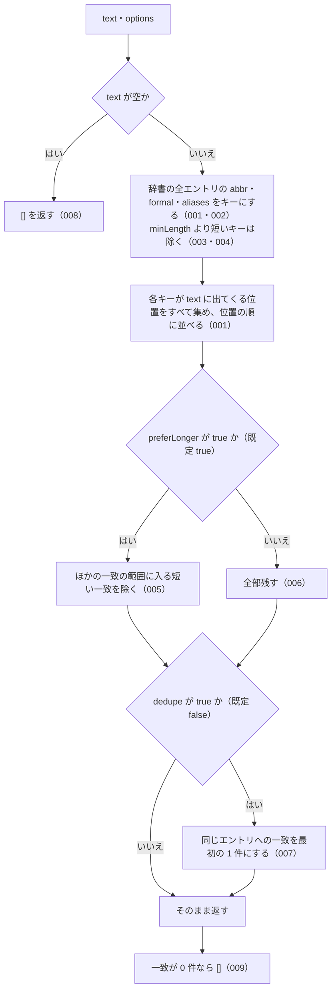

# extractLawNames

<!-- GENERATED FILE — 手で編集しない。シグネチャと説明は dist/index.d.ts、使用状況は mcp/*/src の import、利用者と得られる結果・扱わないこと・処理の流れ・仕様項目の一覧は specs/current/extract_law_names/spec.md、使いどころは scripts/spec-pages/houki-abbreviations/extract_law_names.md から。 -->

::: info
houki-abbreviations **v0.7.0** の `dist/index.d.ts` と `specs/current/extract_law_names/spec.md` から自動生成しました（仕様 ID 19 件・2026-10-10）。手で編集しないでください。再生成は `node scripts/generate-reference.mjs` です。
:::

*関数 ・ v0.5.0 で追加 ・ family では未使用*

入力テキスト中の **法令名らしき文字列** を辞書マッチで抽出する。

## 利用者と得られる結果

この関数の利用者と、利用者が渡すもの・得られる結果を示します。

- houki-abbreviations を import する側（MCP サーバー、LLM の出力を確かめるアプリ）。LLM が書いた文章などを渡して、その中に同梱の辞書にある法令名がどこにいくつ出てくるかを受け取る。受け取ったエントリの `source_mcp_hint` から、本文を取りに行く MCP を決めるのに使う

## シグネチャ

import して呼ぶときの形です。パッケージの型定義（`dist/index.d.ts`）から写しています。

```ts
function extractLawNames(text: string, options?: _ExtractOptions): _LawNameMatch[];
```

## 例

型定義の JSDoc に書かれている例です。

::: details 例
```ts
import { extractLawNames } from '@shuji-bonji/houki-abbreviations';

extractLawNames('消費税法と法人税法の改正について。インボイス制度も対象。');
// → [
//   { entry: <消法>, matchedKey: '消費税法', position: 0, length: 4 },
//   { entry: <法法>, matchedKey: '法人税法', position: 5, length: 4 },
//   { entry: <消法>, matchedKey: 'インボイス制度', position: 17, length: 7 },
// ]
```
:::

## 扱わないこと

この関数が意図して扱わないことです。

- 文脈を見て法令名かどうかを判断すること（`民法人の認可` の中の `民法` も一致として返す）
- 語の区切りを見ること（キーが別の語の一部でも一致にする）
- 辞書に無い法令名を見つけること（`○○法` の形から推し量ることはしない）
- 条番号（`第30条` など）を抜き出すこと
- 利用者が用意したエントリの配列で探すこと（公開する `extractLawNames` は同梱の辞書だけを使う）
- 抜き出した法令名が引用として正しいかを確かめること

## 処理の流れ

仕様書の「処理の流れ」の節を、図も含めてそのまま写しています。図が大きいので畳んでいます。

::: details 処理の流れの図（仕様書の写し）
図の中の番号は「できること」の仕様 ID の末尾 3 桁です。


:::

## 仕様項目の一覧

この関数の仕様項目 19 件の見出しです。仕様項目は受入テストと 1 対 1 で対応していて、条件と例は[仕様書ページ](/specs/houki-abbreviations/extract_law_names)で読めます。

::: details 仕様項目の見出し（19 件）
| 仕様 ID | 仕様項目 |
|---|---|
| [001](/specs/houki-abbreviations/extract_law_names#spec-abbr-extract-law-names-001) | テキスト中の法令名を位置の順に返す |
| [002](/specs/houki-abbreviations/extract_law_names#spec-abbr-extract-law-names-002) | 別名でも抜き出す |
| [003](/specs/houki-abbreviations/extract_law_names#spec-abbr-extract-law-names-003) | 既定では 1 文字のキーを探さない |
| [004](/specs/houki-abbreviations/extract_law_names#spec-abbr-extract-law-names-004) | minLength: 1 なら 1 文字のキーも探す |
| [005](/specs/houki-abbreviations/extract_law_names#spec-abbr-extract-law-names-005) | preferLonger: true なら長い一致と重なる短い一致を除く |
| [006](/specs/houki-abbreviations/extract_law_names#spec-abbr-extract-law-names-006) | preferLonger: false なら重なる一致も全部返す |
| [007](/specs/houki-abbreviations/extract_law_names#spec-abbr-extract-law-names-007) | dedupe: true なら同じエントリへの一致を 1 件にする |
| [008](/specs/houki-abbreviations/extract_law_names#spec-abbr-extract-law-names-008) | 空のテキストには空の配列を返す |
| [009](/specs/houki-abbreviations/extract_law_names#spec-abbr-extract-law-names-009) | 辞書の名前が出てこなければ空の配列を返す |
| [010](/specs/houki-abbreviations/extract_law_names#spec-abbr-extract-law-names-010) | preferLonger を指定しなければ true として扱う |
| [011](/specs/houki-abbreviations/extract_law_names#spec-abbr-extract-law-names-011) | minLength が 1 未満なら 1 として扱う |
| [012](/specs/houki-abbreviations/extract_law_names#spec-abbr-extract-law-names-012) | 同じ位置・同じ長さで別のエントリに一致したら両方を返す |
| [013](/specs/houki-abbreviations/extract_law_names#spec-abbr-extract-law-names-013) | dedupe: true では並べた順で最初の一致を残す |
| [014](/specs/houki-abbreviations/extract_law_names#spec-abbr-extract-law-names-014) | text が null か undefined なら空の配列を返す |
| [015](/specs/houki-abbreviations/extract_law_names#spec-abbr-extract-law-names-015) | preferLonger: true でも長さが同じ一致は重なっていても両方返す |
| [016](/specs/houki-abbreviations/extract_law_names#spec-abbr-extract-law-names-016) | normalize: true では全角英数字・ダッシュ類を半角にしてから探す |
| [017](/specs/houki-abbreviations/extract_law_names#spec-abbr-extract-law-names-017) | normalize: true でも position と length は元の text の位置と長さで返す |
| [018](/specs/houki-abbreviations/extract_law_names#spec-abbr-extract-law-names-018) | normalize を省くか false にすると全角と半角を別の文字として探す |
| [019](/specs/houki-abbreviations/extract_law_names#spec-abbr-extract-law-names-019) | 同じエントリの同じ位置・同じ長さの一致は 1 件にする |
:::

## 関連ページ

このページの元になった文書と、あわせて読むページです。

- [houki-abbreviations の解説](/lib/houki-abbreviations)
- [houki-abbreviations の API の一覧](/reference/lib/houki-abbreviations/)
- [extractLawNames の仕様書ページ](/specs/houki-abbreviations/extract_law_names)
- [元の仕様書（GitHub、v0.7.0）](https://github.com/shuji-bonji/houki-abbreviations/blob/v0.7.0/specs/current/extract_law_names/spec.md)
