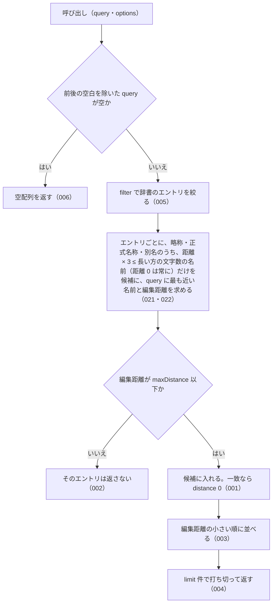

# findSimilar

<!-- GENERATED FILE — 手で編集しない。シグネチャと説明は dist/index.d.ts、使用状況は mcp/*/src の import、使う人と受け取るもの・できないこと・処理の流れ・約束の一覧は specs/current/find_similar/spec.md、使いどころは scripts/spec-pages/houki-abbreviations/find_similar.md から。 -->

::: info
houki-abbreviations **v0.7.0** の `dist/index.d.ts` と `specs/current/find_similar/spec.md` から自動生成しました（仕様 ID 22 件・2026-10-10）。手で編集しないでください。再生成は `node scripts/generate-reference.mjs` です。
:::

*関数 ・ v0.4.0 で追加 ・ family では未使用*

あいまい一致 (Levenshtein 距離ベース)。「うろ覚え」入力で類似エントリを
探すときに使う。

編集距離で近い名前を返す関数で、名前の一部から一覧を得る関数ではない。
`民法` のような短い名前を渡しても、`民` で始まる法令の一覧にはならない。
一覧が欲しいときは `searchByName` を使う。編集距離の比（距離 ÷ 長い方の文字数）が
1/3 を超える名前は `maxDistance` 以下でも返さない（v0.7.0 から。距離 0 は文字数によらず返す）。

## 使う人と受け取るもの

この関数を誰が呼び、何を渡して何を受け取るかを示します。

- houki-abbreviations を import する利用者（houki-nta-mcp・houki-egov-mcp などの MCP サーバー、または独自のコード）。`労働基準法施行例` のように 1〜2 文字誤った名前を渡して、近い名前を持つ辞書のエントリと、その近さ（編集距離）を受け取る
- この関数は編集距離で近い名前を返す関数で、名前の一部から一覧を得る関数ではない。`民法` のような短い名前を渡しても、`民` で始まる法令の一覧にはならない。一覧が欲しいときは `searchByName` を使う（README と JSDoc にも同じ文を書く）

## シグネチャ

import して呼ぶときの形です。パッケージの型定義（`dist/index.d.ts`）から写しています。

```ts
function findSimilar(query: string, options?: _FuzzyOptions): _FuzzyMatch[];
```

## 例

型定義の JSDoc に書かれている例です。

::: details 例
```ts
import { findSimilar } from '@shuji-bonji/houki-abbreviations';

findSimilar('労働基準法施行例');
// → [{ entry: 労基則, matchedKey: '労働基準法施行規則', distance: 2 }]
findSimilar('民法');
// → 民（民法、0）・民訴（民訴法、1）・民執（民執法、1）・民保（民保法、1）
```
:::

## できないこと

この関数が引き受けないことです。

- 名前の一部で探すこと（`searchByName`。`findSimilar` は名前全体どうしの編集距離を比べる）
- 略称と正式名称のように編集距離が大きい組を結び付けること（辞書の `aliases` に登録して `resolveAbbreviation` で引く）
- 英字の大文字・小文字の違いを同じとみなすこと（`findSimilar('pl法')` は `製造物責任法` を返さない）
- 正式名称だけを文字列で返すこと（`suggestCorrection`）

## 処理の流れ

仕様書の「処理の流れ」の節を、図も含めてそのまま写しています。図が大きいので畳んでいます。

::: details 処理の流れの図（仕様書の写し）
呼び出しを受けてから配列を返すまでに、何をどの順で確かめるかを示します。図の中の番号は「できること」の仕様 ID の末尾 3 桁です。


:::

## 約束の一覧

この関数が守る約束 22 件の見出しです。約束は受入テストと 1 対 1 で対応していて、条件と例は[仕様書ページ](/specs/houki-abbreviations/find_similar)で読めます。

::: details 約束の見出し（22 件）
| 仕様 ID | 約束 |
|---|---|
| [001](/specs/houki-abbreviations/find_similar#spec-abbr-find-similar-001) | 名前が一致するエントリは distance 0 で先頭に返す |
| [002](/specs/houki-abbreviations/find_similar#spec-abbr-find-similar-002) | 編集距離が maxDistance 以下のエントリだけを返す |
| [003](/specs/houki-abbreviations/find_similar#spec-abbr-find-similar-003) | 既定では編集距離の小さい順に並べる |
| [004](/specs/houki-abbreviations/find_similar#spec-abbr-find-similar-004) | limit の件数で打ち切る |
| [005](/specs/houki-abbreviations/find_similar#spec-abbr-find-similar-005) | filter で候補のエントリを絞る |
| [006](/specs/houki-abbreviations/find_similar#spec-abbr-find-similar-006) | 空の query には空配列を返す |
| [007](/specs/houki-abbreviations/find_similar#spec-abbr-find-similar-007) | 既定では全角英数字を半角にしてから比べる |
| [008](/specs/houki-abbreviations/find_similar#spec-abbr-find-similar-008) | normalize が false のときは全角英数字をそのまま比べる |
| [009](/specs/houki-abbreviations/find_similar#spec-abbr-find-similar-009) | 全角で引いても matchedKey は辞書の表記のまま返す |
| [010](/specs/houki-abbreviations/find_similar#spec-abbr-find-similar-010) | sortByScore が false のときは辞書の並びのまま limit 件で打ち切る |
| [011](/specs/houki-abbreviations/find_similar#spec-abbr-find-similar-011) | distance が同じエントリは辞書の並びのまま並べる |
| [012](/specs/houki-abbreviations/find_similar#spec-abbr-find-similar-012) | limit を省くと 5 件で打ち切る |
| [013](/specs/houki-abbreviations/find_similar#spec-abbr-find-similar-013) | 1 未満の limit には RangeError を投げる |
| [014](/specs/houki-abbreviations/find_similar#spec-abbr-find-similar-014) | maxDistance を省くと 2 として扱う |
| [015](/specs/houki-abbreviations/find_similar#spec-abbr-find-similar-015) | maxDistance が 0 のときは名前が一致するエントリだけを返す |
| [016](/specs/houki-abbreviations/find_similar#spec-abbr-find-similar-016) | maxDistance が負の値のときは空配列を返す |
| [017](/specs/houki-abbreviations/find_similar#spec-abbr-find-similar-017) | 1 つのエントリで距離が同じ名前が複数あるときは、略称・正式名称・別名の順で先の名前を matchedKey にする |
| [018](/specs/houki-abbreviations/find_similar#spec-abbr-find-similar-018) | 小数の limit には RangeError を投げる |
| [019](/specs/houki-abbreviations/find_similar#spec-abbr-find-similar-019) | NaN・Infinity・数でない limit には例外を投げる |
| [020](/specs/houki-abbreviations/find_similar#spec-abbr-find-similar-020) | 500 を超える limit には RangeError を投げる |
| [021](/specs/houki-abbreviations/find_similar#spec-abbr-find-similar-021) | 編集距離の比が 1/3 を超える名前は返さない |
| [022](/specs/houki-abbreviations/find_similar#spec-abbr-find-similar-022) | 距離 0 の一致は文字数によらず返す |
:::

## 関連ページ

このページの元になった文書と、あわせて読むページです。

- [houki-abbreviations の解説](/lib/houki-abbreviations)
- [houki-abbreviations の API の一覧](/reference/lib/houki-abbreviations/)
- [findSimilar の仕様書ページ](/specs/houki-abbreviations/find_similar)
- [元の仕様書（GitHub、v0.7.0）](https://github.com/shuji-bonji/houki-abbreviations/blob/v0.7.0/specs/current/find_similar/spec.md)
