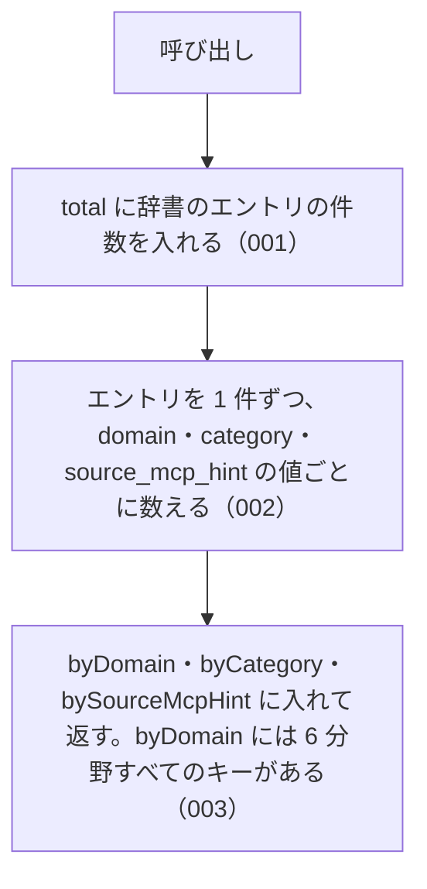

# getAbbreviationStats

<!-- GENERATED FILE — 手で編集しない。シグネチャと説明は dist/index.d.ts、使用状況は mcp/*/src の import、利用者と得られる結果・扱わないこと・処理の流れ・仕様項目の一覧は specs/current/get_abbreviation_stats/spec.md、使いどころは scripts/spec-pages/houki-abbreviations/get_abbreviation_stats.md から。 -->

::: info
houki-abbreviations **v0.7.0** の `dist/index.d.ts` と `specs/current/get_abbreviation_stats/spec.md` から自動生成しました（仕様 ID 6 件・2026-10-10）。手で編集しないでください。再生成は `node scripts/generate-reference.mjs` です。
:::

*関数 ・ v0.1.0 で追加 ・ family では未使用*

辞書全体の統計を返す。

## 利用者と得られる結果

この関数の利用者と、利用者が渡すもの・得られる結果を示します。

- houki-hub family の MCP サーバーと、このパッケージを import する利用者のコード。起動時のログや診断で、取り込んだ辞書の件数を確かめるために呼ぶ

## シグネチャ

import して呼ぶときの形です。パッケージの型定義（`dist/index.d.ts`）から写しています。

```ts
function getAbbreviationStats(): AbbreviationStats;
```

**戻り値**: 全件数、ドメイン別件数、カテゴリ別件数、管轄 MCP 別件数（定数の全値がキーで、無い値は 0）

**関係する型**: [`AbbreviationStats`](/reference/lib/houki-abbreviations/types#abbreviationstats)

## 扱わないこと

この関数が意図して扱わないことです。

- 分野などで絞り込んだ件数を返すこと（引数は無い。絞り込んだ一覧は `listByDomain` / `listByCategory` / `listBySourceMcpHint`）
- 辞書の版や更新日を返すこと
- 別名の件数や、名前（略称・正式名称・別名）の総数を返すこと
- 辞書の整合性を検査すること（`validateAllEntries`）

## 処理の流れ

仕様書の「処理の流れ」の節を、図も含めてそのまま写しています。図が大きいので畳んでいます。

::: details 処理の流れの図（仕様書の写し）
図の中の番号は「できること」の仕様 ID の末尾 3 桁です。


:::

## 仕様項目の一覧

この関数の仕様項目 6 件の見出しです。仕様項目は受入テストと 1 対 1 で対応していて、条件と例は[仕様書ページ](/specs/houki-abbreviations/get_abbreviation_stats)で読めます。

::: details 仕様項目の見出し（6 件）
| 仕様 ID | 仕様項目 |
|---|---|
| [001](/specs/houki-abbreviations/get_abbreviation_stats#spec-abbr-get-abbreviation-stats-001) | total は辞書のエントリの件数 |
| [002](/specs/houki-abbreviations/get_abbreviation_stats#spec-abbr-get-abbreviation-stats-002) | 分野別・種別別・MCP 別の件数の合計は total と等しい |
| [003](/specs/houki-abbreviations/get_abbreviation_stats#spec-abbr-get-abbreviation-stats-003) | byDomain には 6 分野すべてが 1 件以上で入る |
| [004](/specs/houki-abbreviations/get_abbreviation_stats#spec-abbr-get-abbreviation-stats-004) | 呼ぶたびに新しいオブジェクトを返す |
| [005](/specs/houki-abbreviations/get_abbreviation_stats#spec-abbr-get-abbreviation-stats-005) | byDomain・byCategory・bySourceMcpHint は定数の全値をキーに、定数の順で持つ |
| [006](/specs/houki-abbreviations/get_abbreviation_stats#spec-abbr-get-abbreviation-stats-006) | 辞書にエントリの無い値は 0 を返す |
:::

## 関連ページ

このページの元になった文書と、あわせて読むページです。

- [houki-abbreviations の解説](/lib/houki-abbreviations)
- [houki-abbreviations の API の一覧](/reference/lib/houki-abbreviations/)
- [getAbbreviationStats の仕様書ページ](/specs/houki-abbreviations/get_abbreviation_stats)
- [元の仕様書（GitHub、v0.7.0）](https://github.com/shuji-bonji/houki-abbreviations/blob/v0.7.0/specs/current/get_abbreviation_stats/spec.md)
