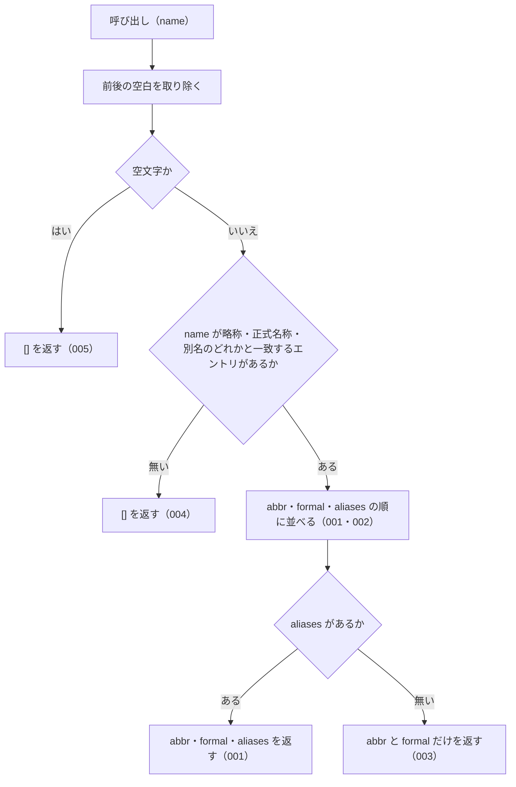

# getAllNames

<!-- GENERATED FILE — 手で編集しない。シグネチャと説明は dist/index.d.ts、使用状況は mcp/*/src の import、使う人と受け取るもの・できないこと・処理の流れ・約束の一覧は specs/current/get_all_names/spec.md、使いどころは scripts/spec-pages/houki-abbreviations/get_all_names.md から。 -->

::: info
houki-abbreviations **v0.7.0** の `dist/index.d.ts` と `specs/current/get_all_names/spec.md` から自動生成しました（仕様 ID 10 件・2026-10-10）。手で編集しないでください。再生成は `node scripts/generate-reference.mjs` です。
:::

*関数 ・ v0.5.0 で追加 ・ family では未使用*

`abbr` / `formal` / `aliases` のいずれかから、そのエントリの
**全別表記** を文字列配列で返す。

順序は `[abbr, formal, ...aliases]`、重複は除去済み。
`options.normalize` が `true` のとき、全角英数字・ダッシュ類・全角チルダ・全角スペースを
半角にしてから比べる（v0.7.0 から）。返す名前は辞書の表記のまま。既定は `false`。

## 使う人と受け取るもの

この関数を誰が呼び、何を渡して何を受け取るかを示します。

- houki-abbreviations を import する利用者（houki-egov-mcp・houki-nta-mcp などの MCP サーバー、またはアプリケーション）。法令・通達の名前を 1 つ渡して、同じ法令・通達を指す名前（略称・正式名称・別名）の一覧を受け取る。LLM のプロンプトに「この法令はこれらの名前でも呼ばれる」と書くときに使う

## シグネチャ

import して呼ぶときの形です。パッケージの型定義（`dist/index.d.ts`）から写しています。

```ts
function getAllNames(name: string, options?: GetAllNamesOptions): string[];
```

| 引数 | 説明 |
|---|---|
| `name` | 略称・正式名・別名のいずれか |
| `options` | 照合オプション（省略可） |

**関係する型**: [`GetAllNamesOptions`](/reference/lib/houki-abbreviations/types#getallnamesoptions)

## 例

型定義の JSDoc に書かれている例です。

::: details 例
```ts
import { getAllNames } from '@shuji-bonji/houki-abbreviations';

getAllNames('消法');
// → ['消法', '消費税法', '消費税', 'インボイス', 'インボイス制度', ...]

getAllNames('ＰＬ法', { normalize: true });
// → ['製造物責任法', 'PL法']（v0.7.0 から。normalize なしなら []）

getAllNames('存在しない');
// → []
```
:::

## できないこと

この関数が引き受けないことです。

- 部分一致やあいまい一致で探すこと（完全一致だけ。部分一致は `searchByName`、似た名前の候補は `findSimilar` / `suggestCorrection`）
- エントリそのもの（`law_id`・`domain` など）を返すこと（`resolveAbbreviation`）
- e-Gov の法令 ID や法令番号から名前を引くこと（`lookupByLawId` / `lookupByLawNum` でエントリを引いてから、その `abbr` を渡す）
- 1 回の呼び出しで複数の名前を引くこと

## 処理の流れ

仕様書の「処理の流れ」の節を、図も含めてそのまま写しています。図が大きいので畳んでいます。

::: details 処理の流れの図（仕様書の写し）
図の中の番号は「できること」の仕様 ID の末尾 3 桁です。


:::

## 約束の一覧

この関数が守る約束 10 件の見出しです。約束は受入テストと 1 対 1 で対応していて、条件と例は[仕様書ページ](/specs/houki-abbreviations/get_all_names)で読めます。

::: details 約束の見出し（10 件）
| 仕様 ID | 約束 |
|---|---|
| [001](/specs/houki-abbreviations/get_all_names#spec-abbr-get-all-names-001) | 略称からそのエントリの名前を abbr・formal・aliases の順ですべて返す |
| [002](/specs/houki-abbreviations/get_all_names#spec-abbr-get-all-names-002) | 正式名称や別名から引いても略称から引いたときと同じ配列を返す |
| [003](/specs/houki-abbreviations/get_all_names#spec-abbr-get-all-names-003) | 別名の無いエントリには abbr と formal だけを返す |
| [004](/specs/houki-abbreviations/get_all_names#spec-abbr-get-all-names-004) | 一致するエントリが無ければ空配列を返す |
| [005](/specs/houki-abbreviations/get_all_names#spec-abbr-get-all-names-005) | 空文字・空白だけの name には空配列を返す |
| [006](/specs/houki-abbreviations/get_all_names#spec-abbr-get-all-names-006) | 同じ文字列の名前は最初の 1 つだけを返す |
| [007](/specs/houki-abbreviations/get_all_names#spec-abbr-get-all-names-007) | name の前後の空白を除いてから引く |
| [008](/specs/houki-abbreviations/get_all_names#spec-abbr-get-all-names-008) | 呼ぶたびに新しい配列を返す |
| [009](/specs/houki-abbreviations/get_all_names#spec-abbr-get-all-names-009) | normalize: true では全角英数字・ダッシュ類を半角にしてから引く |
| [010](/specs/houki-abbreviations/get_all_names#spec-abbr-get-all-names-010) | normalize を省くか false にすると全角と半角を別の文字として引く |
:::

## 関連ページ

このページの元になった文書と、あわせて読むページです。

- [houki-abbreviations の解説](/lib/houki-abbreviations)
- [houki-abbreviations の API の一覧](/reference/lib/houki-abbreviations/)
- [getAllNames の仕様書ページ](/specs/houki-abbreviations/get_all_names)
- [元の仕様書（GitHub、v0.7.0）](https://github.com/shuji-bonji/houki-abbreviations/blob/v0.7.0/specs/current/get_all_names/spec.md)
