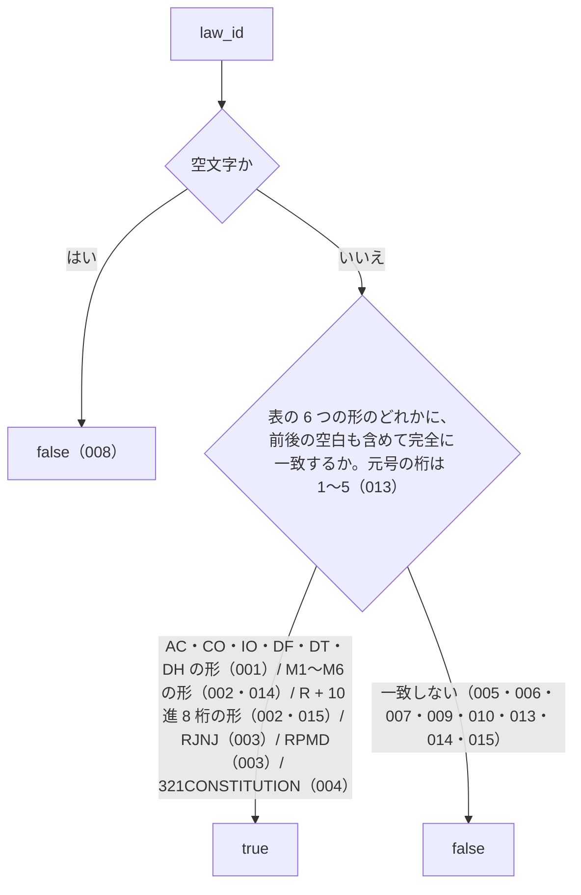

# isValidLawId

<!-- GENERATED FILE — 手で編集しない。シグネチャと説明は dist/index.d.ts、使用状況は mcp/*/src の import、使う人と受け取るもの・できないこと・処理の流れ・約束の一覧は specs/current/is_valid_law_id/spec.md、使いどころは scripts/spec-pages/houki-abbreviations/is_valid_law_id.md から。 -->

::: info
houki-abbreviations **v0.7.0** の `dist/index.d.ts` と `specs/current/is_valid_law_id/spec.md` から自動生成しました（仕様 ID 15 件・2026-10-10）。手で編集しないでください。再生成は `node scripts/generate-reference.mjs` です。
:::

*関数 ・ v0.5.0 で追加 ・ family では未使用*

e-Gov の `law_id` 形式が妥当かを判定する純粋関数。

外部 API は叩かないので「e-Gov 上で実際に存在するか」は確認しない
（それは CI スクリプト `scripts/verify-law-ids.mjs` の責務）。

##### 認識する種別

e-Gov の公式仕様（法令データ ドキュメンテーション「法令種別と法令ID」
https://laws.e-gov.go.jp/docs/law-data-basic/607318a-lawtypes-and-lawid/ ）に合わせた
次の 6 つの形だけを受け付ける（v0.7.0、Issue #23）。長さはどれも 15 文字、英字は大文字だけ。
元号の 1 桁は `1`〜`5`。件数は 2026-09-30 に e-Gov 法令 API v2 `GET /api/2/laws` で
取得した全 9,570 件の内訳で、6 つの形で全件が `true` になる。

| 形 | 件数 | 例 |
|---|---|---|
| 元号 + 年 + `AC` / `CO` / `IO` / `DF` / `DT` / `DH` + 10 桁 | 4,677 | `363AC0000000108`（消費税法） |
| 元号 + 年 + `M` + `1`〜`6` + 16 進 7 文字 + 3 桁 | 4,687 | `340M50000040011`（所得税法施行規則） |
| 元号 + 年 + `R` + 10 進 8 桁 + 3 桁 | 49 | `322R00000001001`（会計検査院規則） |
| 元号 + 年 + `RJNJ` + 8 桁 | 142 | `324RJNJ01001000`（人事院規則一―一） |
| 元号 + 年 + `RPMD` + 8 桁 | 14 | `351RPMD12230000`（内閣総理大臣決定） |
| `321CONSTITUTION` | 1 | 日本国憲法 |

v0.6.1 までは元号の桁・`M` の次の桁・`R` の機関番号・`CONSTITUTION` の先頭を確かめて
いなかった（`000AC0000000000` `340M70000040011` `322R0000000A001` `363CONSTITUTION` も
`true`）。v0.5.x が受け付けていた `MO` / `RU` は e-Gov の実データに 1 件も無かったため
v0.6.0 で外した（省令は `M`、規則は `M` か `R` で始まる）。

## 使う人と受け取るもの

この関数を誰が呼び、何を渡して何を受け取るかを示します。

- houki-abbreviations を import する側（houki-egov-mcp・houki-nta-mcp などの MCP サーバー、辞書を検査する `validateAllEntries`、辞書のテスト）。`law_id` を渡して、e-Gov の法令 ID として形が正しいかを `true` / `false` で受け取る

## シグネチャ

import して呼ぶときの形です。パッケージの型定義（`dist/index.d.ts`）から写しています。

```ts
function isValidLawId(law_id: string): boolean;
```

| 引数 | 説明 |
|---|---|
| `law_id` | 判定対象の文字列 |

**戻り値**: 形式が妥当なら `true`、そうでなければ `false`

## 例

型定義の JSDoc に書かれている例です。

::: details 例
```ts
isValidLawId('363AC0000000108');  // true（消費税法）
isValidLawId('340M50000040011');  // true（所得税法施行規則。v0.6.0 から）
isValidLawId('105DF0000000337');  // true（太政官布告。v0.6.0 から）
isValidLawId('321CONSTITUTION');  // true（日本国憲法）
isValidLawId('106DH0000000016');  // true（太政官布達。v0.7.0 から）
isValidLawId('363CONSTITUTION');  // false（v0.7.0 から。v0.6.1 では true だった）
isValidLawId('699AC0000000001');  // false（元号の桁は 1〜5。v0.7.0 から）
isValidLawId('505MO0000000020');  // false（e-Gov に無い形。v0.5.x では true だった）
isValidLawId('AAA');              // false
isValidLawId('');                 // false
isValidLawId(' 363AC0000000108'); // false（前後空白は呼び出し側で trim）
```
:::

## できないこと

この関数が引き受けないことです。

- その `law_id` の法令が e-Gov に実在するかを確かめること（形だけを見る。実在の確認は e-Gov API を呼ぶ `scripts/verify-law-ids.mjs` で、パッケージには含まれない）
- `law_id` から法令名やエントリを引くこと（`lookupByLawId`）
- 前後の空白・全角文字・小文字を直して判定すること（直さずに `false` を返す）
- 法令番号（`昭和六十三年法律第百八号` の形）を判定すること（`law_num` は対象外。表記を揃えるのは `normalizeLawNum`）

## 処理の流れ

仕様書の「処理の流れ」の節を、図も含めてそのまま写しています。図が大きいので畳んでいます。

::: details 処理の流れの図（仕様書の写し）
図の中の番号は「できること」の仕様 ID の末尾 3 桁です。


:::

## 約束の一覧

この関数が守る約束 15 件の見出しです。約束は受入テストと 1 対 1 で対応していて、条件と例は[仕様書ページ](/specs/houki-abbreviations/is_valid_law_id)で読めます。

::: details 約束の見出し（15 件）
| 仕様 ID | 約束 |
|---|---|
| [001](/specs/houki-abbreviations/is_valid_law_id#spec-abbr-is-valid-law-id-001) | 法律・政令・勅令・太政官布告・太政官達・太政官布達の形を受け付ける |
| [002](/specs/houki-abbreviations/is_valid_law_id#spec-abbr-is-valid-law-id-002) | 府省令の M の形と、機関の規則の R の形を受け付ける |
| [003](/specs/houki-abbreviations/is_valid_law_id#spec-abbr-is-valid-law-id-003) | 人事院規則と内閣総理大臣決定の形を受け付ける |
| [004](/specs/houki-abbreviations/is_valid_law_id#spec-abbr-is-valid-law-id-004) | 憲法の形を受け付ける |
| [005](/specs/houki-abbreviations/is_valid_law_id#spec-abbr-is-valid-law-id-005) | e-Gov に無い MO・RU の形は受け付けない |
| [006](/specs/houki-abbreviations/is_valid_law_id#spec-abbr-is-valid-law-id-006) | 知らない種別コードは受け付けない |
| [007](/specs/houki-abbreviations/is_valid_law_id#spec-abbr-is-valid-law-id-007) | 15 文字でなければ受け付けない |
| [008](/specs/houki-abbreviations/is_valid_law_id#spec-abbr-is-valid-law-id-008) | 空文字は受け付けない |
| [009](/specs/houki-abbreviations/is_valid_law_id#spec-abbr-is-valid-law-id-009) | 前後の空白を取り除かない |
| [010](/specs/houki-abbreviations/is_valid_law_id#spec-abbr-is-valid-law-id-010) | 小文字の英字は受け付けない |
| [011](/specs/houki-abbreviations/is_valid_law_id#spec-abbr-is-valid-law-id-011) | 文字列でない値は受け付けない |
| [012](/specs/houki-abbreviations/is_valid_law_id#spec-abbr-is-valid-law-id-012) | 全角の英数字は受け付けない |
| [013](/specs/houki-abbreviations/is_valid_law_id#spec-abbr-is-valid-law-id-013) | 元号の桁が 1〜5 以外なら受け付けない |
| [014](/specs/houki-abbreviations/is_valid_law_id#spec-abbr-is-valid-law-id-014) | M の次の 1 桁が 1〜6 以外なら受け付けない |
| [015](/specs/houki-abbreviations/is_valid_law_id#spec-abbr-is-valid-law-id-015) | R の機関番号に英字があれば受け付けない |
:::

## 関連ページ

このページの元になった文書と、あわせて読むページです。

- [houki-abbreviations の解説](/lib/houki-abbreviations)
- [houki-abbreviations の API の一覧](/reference/lib/houki-abbreviations/)
- [isValidLawId の仕様書ページ](/specs/houki-abbreviations/is_valid_law_id)
- [元の仕様書（GitHub、v0.7.0）](https://github.com/shuji-bonji/houki-abbreviations/blob/v0.7.0/specs/current/is_valid_law_id/spec.md)
