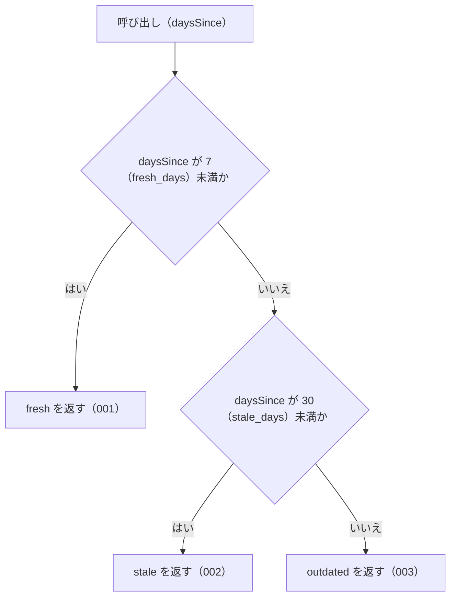

# judgeStaleness

<!-- GENERATED FILE — 手で編集しない。シグネチャと説明は dist/index.d.ts、使用状況は mcp/*/src の import、利用者と得られる結果・扱わないこと・処理の流れ・仕様項目の一覧は specs/current/judge_staleness/spec.md、使いどころは scripts/spec-pages/houki-abbreviations/judge_staleness.md から。 -->

::: info
houki-abbreviations **v0.7.0** の `dist/index.d.ts` と `specs/current/judge_staleness/spec.md` から自動生成しました（仕様 ID 6 件・2026-10-10）。手で編集しないでください。再生成は `node scripts/generate-reference.mjs` です。
:::

*関数 ・ v0.4.1 で追加 ・ houki-egov-mcp / houki-nta-mcp が使用*

経過日数から staleness レベルを判定する純関数。

通常は `computeDaysSince` の戻り値をそのまま渡す。`STALENESS_THRESHOLDS`
（`fresh_days` / `stale_days`）に従って `'fresh' | 'stale' | 'outdated'`
を返す。

`daysSince` は 0 以上の有限の数（小数でもよい）。負の値・`NaN`・`±Infinity` は
`RangeError`、数でない値は `TypeError` を投げる（v0.7.0 から。v0.6.1 までは
負の値を `'fresh'`、`NaN` を `'outdated'` にしていた）。

## 利用者と得られる結果

この関数の利用者と、利用者が渡すもの・得られる結果を示します。

- houki-hub family の MCP サーバー（houki-nta-mcp など）。`computeDaysSince` で得た経過日数を渡して鮮度の段階を受け取り、自分の応答（取得した文書がどれだけ古いか）に載せる。family のどの MCP サーバーも同じ境界で判定するためにこの関数を使う

## シグネチャ

import して呼ぶときの形です。パッケージの型定義（`dist/index.d.ts`）から写しています。

```ts
function judgeStaleness(daysSince: number): StalenessLevel;
```

| 引数 | 説明 |
|---|---|
| `daysSince` | 経過日数（0 以上の有限の数） |

**戻り値**: `'fresh'` | `'stale'` | `'outdated'`

**関係する型**: [`StalenessLevel`](/reference/lib/houki-abbreviations/types#stalenesslevel)

## 例

型定義の JSDoc に書かれている例です。

::: details 例
```ts
judgeStaleness(0);   // 'fresh'
judgeStaleness(7);   // 'stale'  (境界: fresh_days はちょうどで stale)
judgeStaleness(29);  // 'stale'
judgeStaleness(30);  // 'outdated' (境界: stale_days はちょうどで outdated)
```
:::

## 扱わないこと

この関数が意図して扱わないことです。

- 取得時刻から経過日数を数えること（`computeDaysSince`）
- MCP サーバーごとに違う境界で判定すること（境界は `STALENESS_THRESHOLDS` の値に固定。違う境界が要る MCP サーバーは、この関数を使わずに自分の判定関数を書く）
- 警告の文言や再取得の手順を返すこと（各 MCP サーバーが持つ）

## 処理の流れ

仕様書の「処理の流れ」の節を、図も含めてそのまま写しています。図が大きいので畳んでいます。

::: details 処理の流れの図（仕様書の写し）
図の中の番号は「できること」の仕様 ID の末尾 3 桁です。


:::

## 仕様項目の一覧

この関数の仕様項目 6 件の見出しです。仕様項目は受入テストと 1 対 1 で対応していて、条件と例は[仕様書ページ](/specs/houki-abbreviations/judge_staleness)で読めます。

::: details 仕様項目の見出し（6 件）
| 仕様 ID | 仕様項目 |
|---|---|
| [001](/specs/houki-abbreviations/judge_staleness#spec-abbr-judge-staleness-001) | 7 日未満なら fresh を返す |
| [002](/specs/houki-abbreviations/judge_staleness#spec-abbr-judge-staleness-002) | 7 日以上 30 日未満なら stale を返す |
| [003](/specs/houki-abbreviations/judge_staleness#spec-abbr-judge-staleness-003) | 30 日以上なら outdated を返す |
| [004](/specs/houki-abbreviations/judge_staleness#spec-abbr-judge-staleness-004) | 小数の日数も境界の値と「未満」で比べて判定する |
| [005](/specs/houki-abbreviations/judge_staleness#spec-abbr-judge-staleness-005) | 負の値には RangeError を投げる |
| [006](/specs/houki-abbreviations/judge_staleness#spec-abbr-judge-staleness-006) | NaN・Infinity・数でない値には例外を投げる |
:::

## 関連ページ

このページの元になった文書と、あわせて読むページです。

- [houki-abbreviations の解説](/lib/houki-abbreviations)
- [houki-abbreviations の API の一覧](/reference/lib/houki-abbreviations/)
- [judgeStaleness の仕様書ページ](/specs/houki-abbreviations/judge_staleness)
- [元の仕様書（GitHub、v0.7.0）](https://github.com/shuji-bonji/houki-abbreviations/blob/v0.7.0/specs/current/judge_staleness/spec.md)
