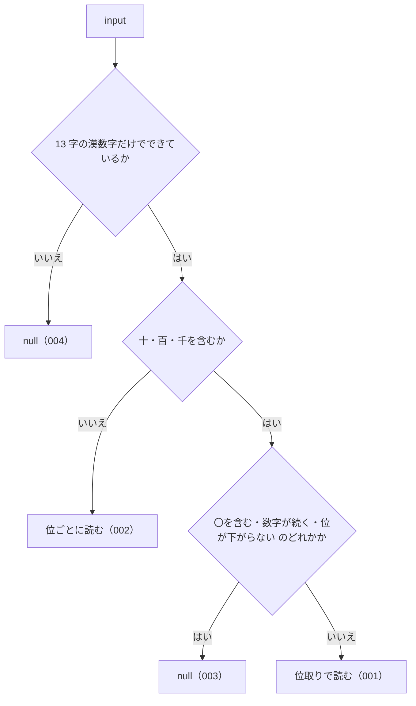

# kanjiToNumber

<!-- GENERATED FILE — 手で編集しない。シグネチャと説明は dist/index.d.ts、使用状況は mcp/*/src の import、利用者と得られる結果・扱わないこと・処理の流れ・仕様項目の一覧は specs/current/kanji_to_number/spec.md、使いどころは scripts/spec-pages/houki-abbreviations/kanji_to_number.md から。 -->

::: info
houki-abbreviations **v0.7.0** の `dist/index.d.ts` と `specs/current/kanji_to_number/spec.md` から自動生成しました（仕様 ID 9 件・2026-10-10）。手で編集しないでください。再生成は `node scripts/generate-reference.mjs` です。
:::

*関数 ・ v0.6.0 で追加 ・ family では未使用*

漢数字を数値にする。

次の 2 つの書き方を受け付ける。どちらとも読めない並びは `null`。

- **位取り**（単位 十・百・千 を使う書き方）: `三十` → 30、`百八` → 108、
  `千五十` → 1050、`一千` → 1000。千の位までを扱い、万以上は対象にしない。
  `三三`（数字が続く）や `十十`（位が下がらない）は `null`。
- **位ごと**（算用数字と同じく 1 桁ずつ並べる書き方。単位を含まず、`〇` を使える）:
  `二五` → 25、`一三七` → 137、`三〇` → 30。人事院規則の番号（`一四―五`）や
  判例の引用（`昭二五・一〇・二五`）がこの書き方。

2 つの書き方が混ざった並び（`二〇十`）は `null`。1 文字（`五`）はどちらの
読み方でも同じ値になる。位ごとの書き方は 15 文字まで読み、16 文字以上は値を
正確に表せないので丸めずに `null` を返す（v0.7.0 から）。

houki-egov-mcp v0.7.0 の `kanjiToNumber`（条番号用。位取りのみ）と同じ名前で、
位取りの読み方はそちらと同じ結果を返す。位ごとの書き方を受け付ける点だけが違う。

## 利用者と得られる結果

この関数の利用者と、利用者が渡すもの・得られる結果を示します。

- このパッケージを import するコード（houki-hub family の MCP サーバーなど）。条番号・法令番号から切り出した漢数字の並びを渡して、数値を受け取る
- このパッケージの中では `normalizeLawNum` が、漢数字の並びごとにこの関数を使う

## シグネチャ

import して呼ぶときの形です。パッケージの型定義（`dist/index.d.ts`）から写しています。

```ts
function kanjiToNumber(input: string): number | null;
```

| 引数 | 説明 |
|---|---|
| `input` | 漢数字だけの文字列 |

**戻り値**: 数値。漢数字として読めなければ `null`

## 例

型定義の JSDoc に書かれている例です。

::: details 例
```ts
kanjiToNumber('二十五');   // 25
kanjiToNumber('百三十七'); // 137
kanjiToNumber('二五');     // 25（位ごと）
kanjiToNumber('一三七');   // 137（位ごと）
kanjiToNumber('元');       // null（「元年」は normalizeLawNum が扱う）
kanjiToNumber('25');       // null（算用数字は対象外）
```
:::

## 扱わないこと

この関数が意図して扱わないことです。

- 万以上の単位（`万` `億`）を読むこと
- 大字（`壱` `弐` `拾`）や `零` を読むこと
- 算用数字や全角数字を読むこと（算用数字の入った法令番号は `normalizeLawNum`）
- 文字列の中から漢数字の部分を探して変換すること（渡すのは漢数字だけの文字列。法令番号の中の漢数字を変換するのは `normalizeLawNum`）
- `元年` の `元` を 1 と読むこと（`normalizeLawNum` が扱う）

## 処理の流れ

仕様書の「処理の流れ」の節を、図も含めてそのまま写しています。図が大きいので畳んでいます。

::: details 処理の流れの図（仕様書の写し）
図の中の番号は「できること」の仕様 ID の末尾 3 桁です。


:::

## 仕様項目の一覧

この関数の仕様項目 9 件の見出しです。仕様項目は受入テストと 1 対 1 で対応していて、条件と例は[仕様書ページ](/specs/houki-abbreviations/kanji_to_number)で読めます。

::: details 仕様項目の見出し（9 件）
| 仕様 ID | 仕様項目 |
|---|---|
| [001](/specs/houki-abbreviations/kanji_to_number#spec-abbr-kanji-to-number-001) | 位取りの漢数字を読む |
| [002](/specs/houki-abbreviations/kanji_to_number#spec-abbr-kanji-to-number-002) | 位ごとの漢数字を読む |
| [003](/specs/houki-abbreviations/kanji_to_number#spec-abbr-kanji-to-number-003) | 位取りとして成り立たない並びは null を返す |
| [004](/specs/houki-abbreviations/kanji_to_number#spec-abbr-kanji-to-number-004) | 13 字以外の文字を含む入力は null を返す |
| [005](/specs/houki-abbreviations/kanji_to_number#spec-abbr-kanji-to-number-005) | 位ごとの並びの先頭の〇は数に入れない |
| [006](/specs/houki-abbreviations/kanji_to_number#spec-abbr-kanji-to-number-006) | 文字列でない値には null を返す |
| [007](/specs/houki-abbreviations/kanji_to_number#spec-abbr-kanji-to-number-007) | 空白を含む入力には null を返す |
| [008](/specs/houki-abbreviations/kanji_to_number#spec-abbr-kanji-to-number-008) | 単位の前の一は十・百でも 1 として読む |
| [009](/specs/houki-abbreviations/kanji_to_number#spec-abbr-kanji-to-number-009) | 位ごとの並びが 16 文字以上なら null を返す |
:::

## 関連ページ

このページの元になった文書と、あわせて読むページです。

- [houki-abbreviations の解説](/lib/houki-abbreviations)
- [houki-abbreviations の API の一覧](/reference/lib/houki-abbreviations/)
- [kanjiToNumber の仕様書ページ](/specs/houki-abbreviations/kanji_to_number)
- [元の仕様書（GitHub、v0.7.0）](https://github.com/shuji-bonji/houki-abbreviations/blob/v0.7.0/specs/current/kanji_to_number/spec.md)
