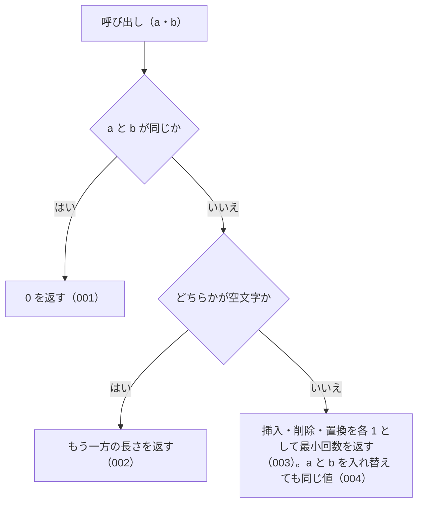

# levenshtein

<!-- GENERATED FILE — 手で編集しない。シグネチャと説明は dist/index.d.ts、使用状況は mcp/*/src の import、利用者と得られる結果・扱わないこと・処理の流れ・仕様項目の一覧は specs/current/levenshtein/spec.md、使いどころは scripts/spec-pages/houki-abbreviations/levenshtein.md から。 -->

::: info
houki-abbreviations **v0.7.1** の `dist/index.d.ts` と `specs/current/levenshtein/spec.md` から自動生成しました（仕様 ID 5 件・2026-10-10）。手で編集しないでください。再生成は `node scripts/generate-reference.mjs` です。
:::

*関数 ・ v0.4.0 で追加 ・ family では未使用*

Levenshtein 距離 (動的計画法、O(m*n) 時間 / O(min(m,n)) 空間)。
文字単位の挿入 / 削除 / 置換コストはすべて 1。

文字はコードポイント単位で数える（v0.7.0 から）。サロゲートペアで表す文字
（`𠮷` U+20BB7 など）は 1 文字で、`levenshtein('𠮷', '吉')` は 1
（v0.6.1 までは UTF-16 の単位で数えて 2 だった）。

自前実装にした理由は外部依存を増やさないため (本パッケージは
軽量データライブラリの方針なので、`fast-levenshtein` 等は引き込まない)。

## 利用者と得られる結果

この関数の利用者と、利用者が渡すもの・得られる結果を示します。

- houki-abbreviations を import する利用者（独自の検索を組むコードやテスト）。2 つの文字列を渡して編集距離を受け取る。`findSimilar` と `suggestCorrection` もこの値で近さを決める

## シグネチャ

import して呼ぶときの形です。パッケージの型定義（`dist/index.d.ts`）から写しています。

```ts
function levenshtein(a: string, b: string): number;
```

## 扱わないこと

この関数が意図して扱わないことです。

- 全角と半角を同じ文字とみなすこと（`levenshtein('ＰＬ', 'PL')` は 2。`findSimilar` は比べる前に半角にそろえる）
- 英字の大文字・小文字を同じ文字とみなすこと（`levenshtein('A', 'a')` は 1）
- 隣り合う 2 文字の入れ替えを 1 回と数えること（入れ替えは置換 2 回として数える）
- 文字の種類ごとに操作の重みを変えること

## 処理の流れ

仕様書の「処理の流れ」の節を、図も含めてそのまま写しています。図が大きいので畳んでいます。

::: details 処理の流れの図（仕様書の写し）
図の中の番号は「できること」の仕様 ID の末尾 3 桁です。


:::

## 仕様項目の一覧

この関数の仕様項目 5 件の見出しです。仕様項目は受入テストと 1 対 1 で対応していて、条件と例は[仕様書ページ](/specs/houki-abbreviations/levenshtein)で読めます。

::: details 仕様項目の見出し（5 件）
| 仕様 ID | 仕様項目 |
|---|---|
| [001](/specs/houki-abbreviations/levenshtein#spec-abbr-levenshtein-001) | 同じ文字列には 0 を返す |
| [002](/specs/houki-abbreviations/levenshtein#spec-abbr-levenshtein-002) | 片方が空文字ならもう一方の文字数を返す |
| [003](/specs/houki-abbreviations/levenshtein#spec-abbr-levenshtein-003) | 挿入・削除・置換を 1 回 1 として最小回数を返す |
| [004](/specs/houki-abbreviations/levenshtein#spec-abbr-levenshtein-004) | 引数の順を入れ替えても同じ値を返す |
| [005](/specs/houki-abbreviations/levenshtein#spec-abbr-levenshtein-005) | BMP の外の文字を 1 文字として数える |
:::

## 関連ページ

このページの元になった文書と、あわせて読むページです。

- [houki-abbreviations の解説](/lib/houki-abbreviations)
- [houki-abbreviations の API の一覧](/reference/lib/houki-abbreviations/)
- [levenshtein の仕様書ページ](/specs/houki-abbreviations/levenshtein)
- [元の仕様書（GitHub、v0.7.1）](https://github.com/shuji-bonji/houki-abbreviations/blob/v0.7.1/specs/current/levenshtein/spec.md)
