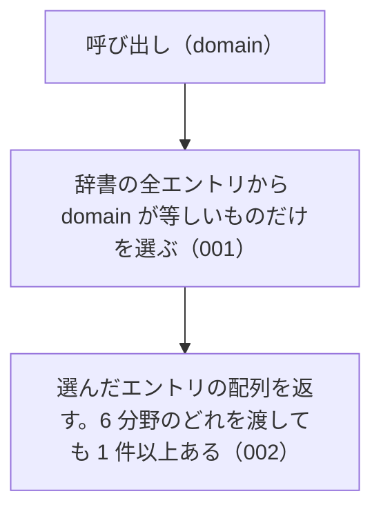

# listByDomain

<!-- GENERATED FILE — 手で編集しない。シグネチャと説明は dist/index.d.ts、使用状況は mcp/*/src の import、利用者と得られる結果・扱わないこと・処理の流れ・仕様項目の一覧は specs/current/list_by_domain/spec.md、使いどころは scripts/spec-pages/houki-abbreviations/list_by_domain.md から。 -->

::: info
houki-abbreviations **v0.7.0** の `dist/index.d.ts` と `specs/current/list_by_domain/spec.md` から自動生成しました（仕様 ID 5 件・2026-10-10）。手で編集しないでください。再生成は `node scripts/generate-reference.mjs` です。
:::

*関数 ・ v0.1.0 で追加 ・ family では未使用*

指定ドメインのエントリ一覧を返す。

## 利用者と得られる結果

この関数の利用者と、利用者が渡すもの・得られる結果を示します。

- houki-hub family の MCP サーバーと、このパッケージを import する利用者のコード。分野を渡して、その分野に属する辞書のエントリの一覧を受け取る

## シグネチャ

import して呼ぶときの形です。パッケージの型定義（`dist/index.d.ts`）から写しています。

```ts
function listByDomain(domain: Domain): AbbreviationEntry[];
```

**関係する型**: [`AbbreviationEntry`](/reference/lib/houki-abbreviations/types#abbreviationentry)・[`Domain`](/reference/lib/houki-abbreviations/types#domain)

## 例

型定義の JSDoc に書かれている例です。

::: details 例
```ts
listByDomain('tax')  // → 35 件の税法系エントリ
```
:::

## 扱わないこと

この関数が意図して扱わないことです。

- 複数の分野をまとめて絞り込むこと（`searchByName` の `filter.domain` は配列を受け付ける）
- 種別で絞り込むこと（`listByCategory`）
- 本文を持つ MCP で絞り込むこと（`listBySourceMcpHint`）
- 件数だけを返すこと（`getAbbreviationStats` の `byDomain`）

## 処理の流れ

仕様書の「処理の流れ」の節を、図も含めてそのまま写しています。図が大きいので畳んでいます。

::: details 処理の流れの図（仕様書の写し）
図の中の番号は「できること」の仕様 ID の末尾 3 桁です。


:::

## 仕様項目の一覧

この関数の仕様項目 5 件の見出しです。仕様項目は受入テストと 1 対 1 で対応していて、条件と例は[仕様書ページ](/specs/houki-abbreviations/list_by_domain)で読めます。

::: details 仕様項目の見出し（5 件）
| 仕様 ID | 仕様項目 |
|---|---|
| [001](/specs/houki-abbreviations/list_by_domain#spec-abbr-list-by-domain-001) | 指定した分野のエントリだけを返す |
| [002](/specs/houki-abbreviations/list_by_domain#spec-abbr-list-by-domain-002) | 6 分野のどれを渡しても 1 件以上を返す |
| [003](/specs/houki-abbreviations/list_by_domain#spec-abbr-list-by-domain-003) | 辞書の並びのまま返す |
| [004](/specs/houki-abbreviations/list_by_domain#spec-abbr-list-by-domain-004) | 呼ぶたびに新しい配列を返す |
| [005](/specs/houki-abbreviations/list_by_domain#spec-abbr-list-by-domain-005) | DOMAINS に無い値には空配列を返す |
:::

## 関連ページ

このページの元になった文書と、あわせて読むページです。

- [houki-abbreviations の解説](/lib/houki-abbreviations)
- [houki-abbreviations の API の一覧](/reference/lib/houki-abbreviations/)
- [listByDomain の仕様書ページ](/specs/houki-abbreviations/list_by_domain)
- [元の仕様書（GitHub、v0.7.0）](https://github.com/shuji-bonji/houki-abbreviations/blob/v0.7.0/specs/current/list_by_domain/spec.md)
