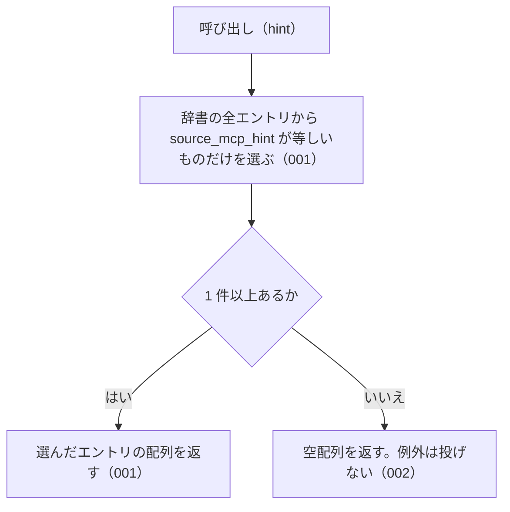

# listBySourceMcpHint

<!-- GENERATED FILE — 手で編集しない。シグネチャと説明は dist/index.d.ts、使用状況は mcp/*/src の import、使う人と受け取るもの・できないこと・処理の流れ・約束の一覧は specs/current/list_by_source_mcp_hint/spec.md、使いどころは scripts/spec-pages/houki-abbreviations/list_by_source_mcp_hint.md から。 -->

::: info
houki-abbreviations **v0.7.0** の `dist/index.d.ts` と `specs/current/list_by_source_mcp_hint/spec.md` から自動生成しました（仕様 ID 5 件・2026-10-10）。手で編集しないでください。再生成は `node scripts/generate-reference.mjs` です。
:::

*関数 ・ v0.1.0 で追加 ・ houki-egov-mcp が使用*

指定 MCP が管轄するエントリ一覧を返す。

各 MCP が起動時に「自分の管轄エントリだけ」を抽出してインデックス化する
ことで、管轄外の問い合わせを早期に「正しい MCP に誘導するエラー」として
返せるようになる。

## 使う人と受け取るもの

この関数を誰が呼び、何を渡して何を受け取るかを示します。

- houki-hub family の MCP サーバー。起動時に自分の名前（例: `houki-nta`）を渡して、自分が本文を返せるエントリだけの一覧を受け取る。それ以外のエントリを問い合わせられたときに、本文を持つ MCP の名前を案内するために使う

## シグネチャ

import して呼ぶときの形です。パッケージの型定義（`dist/index.d.ts`）から写しています。

```ts
function listBySourceMcpHint(hint: SourceMcpHint): AbbreviationEntry[];
```

**関係する型**: [`AbbreviationEntry`](/reference/lib/houki-abbreviations/types#abbreviationentry)・[`SourceMcpHint`](/reference/lib/houki-abbreviations/types#sourcemcphint)

## 例

型定義の JSDoc に書かれている例です。

::: details 例
```ts
listBySourceMcpHint('houki-egov')  // → e-Gov 管轄 165 件
listBySourceMcpHint('houki-nta')   // → 国税庁管轄 9 件
```
:::

## できないこと

この関数が引き受けないことです。

- 複数の MCP をまとめて絞り込むこと（`searchByName` の `filter.source_mcp_hint` は配列を受け付ける）
- 分野で絞り込むこと（`listByDomain`）
- 種別で絞り込むこと（`listByCategory`）
- 1 つの名前が、渡した MCP の担当かどうかを判定すること（`resolveAbbreviation` で引いたエントリの `source_mcp_hint` を利用者が比べる）
- 件数だけを返すこと（`getAbbreviationStats` の `bySourceMcpHint`）

## 処理の流れ

仕様書の「処理の流れ」の節を、図も含めてそのまま写しています。図が大きいので畳んでいます。

::: details 処理の流れの図（仕様書の写し）
図の中の番号は「できること」の仕様 ID の末尾 3 桁です。


:::

## 約束の一覧

この関数が守る約束 5 件の見出しです。約束は受入テストと 1 対 1 で対応していて、条件と例は[仕様書ページ](/specs/houki-abbreviations/list_by_source_mcp_hint)で読めます。

::: details 約束の見出し（5 件）
| 仕様 ID | 約束 |
|---|---|
| [001](/specs/houki-abbreviations/list_by_source_mcp_hint#spec-abbr-list-by-source-mcp-hint-001) | 指定した MCP が本文を持つエントリだけを返す |
| [002](/specs/houki-abbreviations/list_by_source_mcp_hint#spec-abbr-list-by-source-mcp-hint-002) | エントリの無い MCP には空配列を返す |
| [003](/specs/houki-abbreviations/list_by_source_mcp_hint#spec-abbr-list-by-source-mcp-hint-003) | 辞書の並びのまま返す |
| [004](/specs/houki-abbreviations/list_by_source_mcp_hint#spec-abbr-list-by-source-mcp-hint-004) | 呼ぶたびに新しい配列を返す |
| [005](/specs/houki-abbreviations/list_by_source_mcp_hint#spec-abbr-list-by-source-mcp-hint-005) | SOURCE_MCP_HINTS に無い値には空配列を返す |
:::

## 関連ページ

このページの元になった文書と、あわせて読むページです。

- [houki-abbreviations の解説](/lib/houki-abbreviations)
- [houki-abbreviations の API の一覧](/reference/lib/houki-abbreviations/)
- [listBySourceMcpHint の仕様書ページ](/specs/houki-abbreviations/list_by_source_mcp_hint)
- [元の仕様書（GitHub、v0.7.0）](https://github.com/shuji-bonji/houki-abbreviations/blob/v0.7.0/specs/current/list_by_source_mcp_hint/spec.md)
