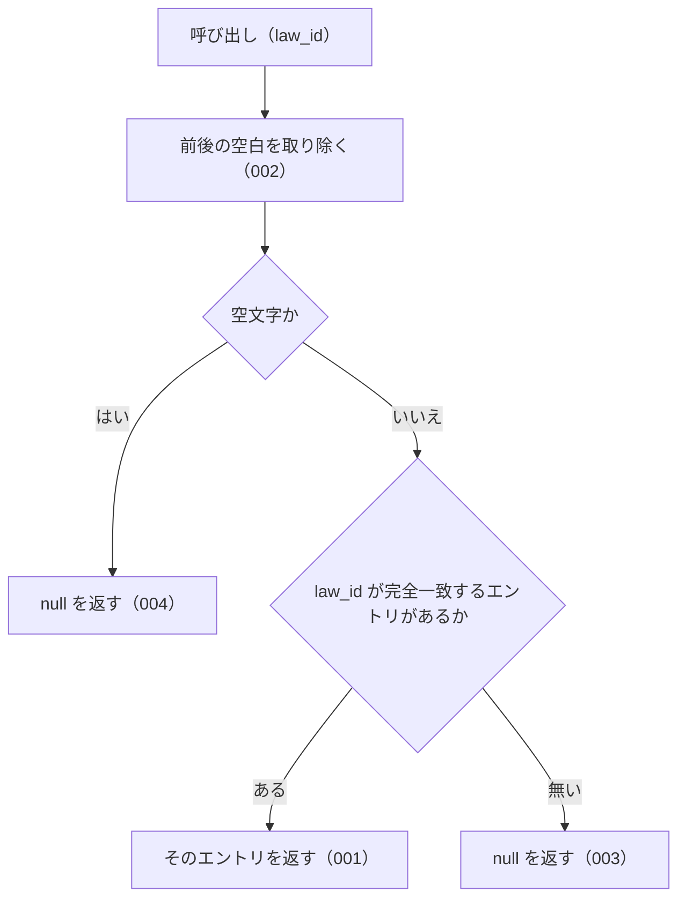

# lookupByLawId

<!-- GENERATED FILE — 手で編集しない。シグネチャと説明は dist/index.d.ts、使用状況は mcp/*/src の import、利用者と得られる結果・扱わないこと・処理の流れ・仕様項目の一覧は specs/current/lookup_by_law_id/spec.md、使いどころは scripts/spec-pages/houki-abbreviations/lookup_by_law_id.md から。 -->

::: info
houki-abbreviations **v0.7.0** の `dist/index.d.ts` と `specs/current/lookup_by_law_id/spec.md` から自動生成しました（仕様 ID 7 件・2026-10-10）。手で編集しないでください。再生成は `node scripts/generate-reference.mjs` です。
:::

*関数 ・ v0.5.0 で追加 ・ family では未使用*

e-Gov `law_id` から辞書エントリを引く。完全一致のみ。

`options.normalize` が `true` のとき、全角英数字を半角にしてから比べる（v0.7.0 から）。
小文字は大文字にしない。既定は `false` で、v0.6.1 までと同じ結果を返す。

## 利用者と得られる結果

この関数の利用者と、利用者が渡すもの・得られる結果を示します。

- houki-abbreviations を import する利用者（houki-egov-mcp・houki-nta-mcp などの MCP サーバー、またはアプリケーション）。e-Gov の法令 ID（`law_id`）を渡して、その法令の略称・正式名称などを持つ辞書のエントリを受け取る

## シグネチャ

import して呼ぶときの形です。パッケージの型定義（`dist/index.d.ts`）から写しています。

```ts
function lookupByLawId(law_id: string, options?: LookupByLawIdOptions): AbbreviationEntry | null;
```

| 引数 | 説明 |
|---|---|
| `law_id` | e-Gov の law_id |
| `options` | 照合オプション（省略可） |

**関係する型**: [`AbbreviationEntry`](/reference/lib/houki-abbreviations/types#abbreviationentry)・[`LookupByLawIdOptions`](/reference/lib/houki-abbreviations/types#lookupbylawidoptions)

## 例

型定義の JSDoc に書かれている例です。

::: details 例
```ts
import { lookupByLawId } from '@shuji-bonji/houki-abbreviations';

lookupByLawId('363AC0000000108')?.formal;  // '消費税法'
lookupByLawId('321CONSTITUTION')?.formal;  // '日本国憲法'
lookupByLawId('999XX0000000000');          // null
lookupByLawId('３６３AC0000000108', { normalize: true })?.formal; // '消費税法'（v0.7.0 から）
lookupByLawId('３６３AC0000000108');                              // null
```
:::

## 扱わないこと

この関数が意図して扱わないことです。

- 大文字・小文字の違いを吸収すること（`363ac0000000108` は `normalize: true` でも `null`）
- 通達など `law_id` が `null` のエントリ（v0.6.0 の辞書で 174 件中 165 件）を引くこと
- 法令番号から引くこと（`lookupByLawNum`）
- 略称・正式名称・別名から引くこと（`resolveAbbreviation`）
- `law_id` の形式が e-Gov の規則に合うかを確かめること（`isValidLawId`）
- 1 回の呼び出しで複数の `law_id` を引くこと

## 処理の流れ

仕様書の「処理の流れ」の節を、図も含めてそのまま写しています。図が大きいので畳んでいます。

::: details 処理の流れの図（仕様書の写し）
図の中の番号は「できること」の仕様 ID の末尾 3 桁です。


:::

## 仕様項目の一覧

この関数の仕様項目 7 件の見出しです。仕様項目は受入テストと 1 対 1 で対応していて、条件と例は[仕様書ページ](/specs/houki-abbreviations/lookup_by_law_id)で読めます。

::: details 仕様項目の見出し（7 件）
| 仕様 ID | 仕様項目 |
|---|---|
| [001](/specs/houki-abbreviations/lookup_by_law_id#spec-abbr-lookup-by-law-id-001) | law_id が完全一致するエントリを返す |
| [002](/specs/houki-abbreviations/lookup_by_law_id#spec-abbr-lookup-by-law-id-002) | 前後の空白を無視する |
| [003](/specs/houki-abbreviations/lookup_by_law_id#spec-abbr-lookup-by-law-id-003) | 一致するエントリが無ければ null を返す |
| [004](/specs/houki-abbreviations/lookup_by_law_id#spec-abbr-lookup-by-law-id-004) | 空文字・空白だけの law_id には null を返す |
| [005](/specs/houki-abbreviations/lookup_by_law_id#spec-abbr-lookup-by-law-id-005) | normalize: true では全角英数字を半角にしてから引く |
| [006](/specs/houki-abbreviations/lookup_by_law_id#spec-abbr-lookup-by-law-id-006) | normalize: true でも英字の小文字は大文字にしない |
| [007](/specs/houki-abbreviations/lookup_by_law_id#spec-abbr-lookup-by-law-id-007) | normalize を省くか false にすると全角と半角を別の文字として引く |
:::

## 関連ページ

このページの元になった文書と、あわせて読むページです。

- [houki-abbreviations の解説](/lib/houki-abbreviations)
- [houki-abbreviations の API の一覧](/reference/lib/houki-abbreviations/)
- [lookupByLawId の仕様書ページ](/specs/houki-abbreviations/lookup_by_law_id)
- [元の仕様書（GitHub、v0.7.0）](https://github.com/shuji-bonji/houki-abbreviations/blob/v0.7.0/specs/current/lookup_by_law_id/spec.md)
